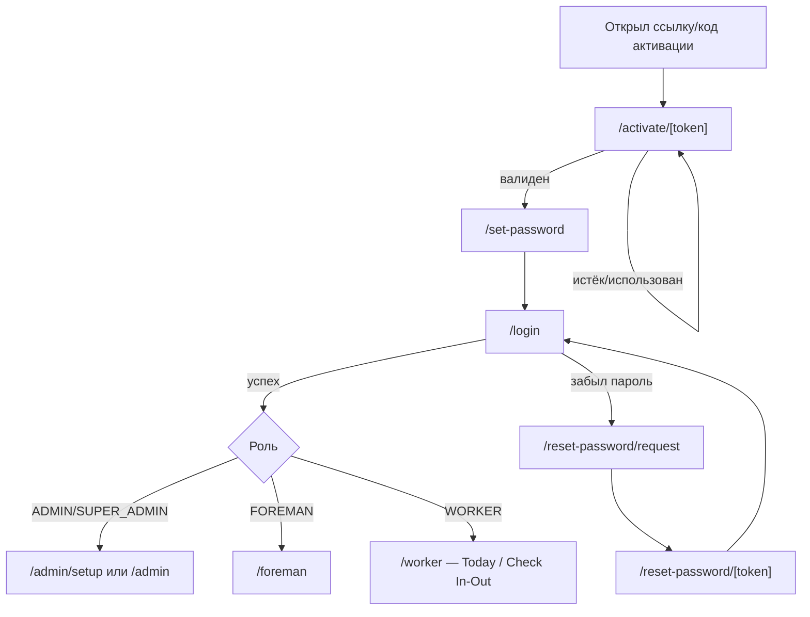
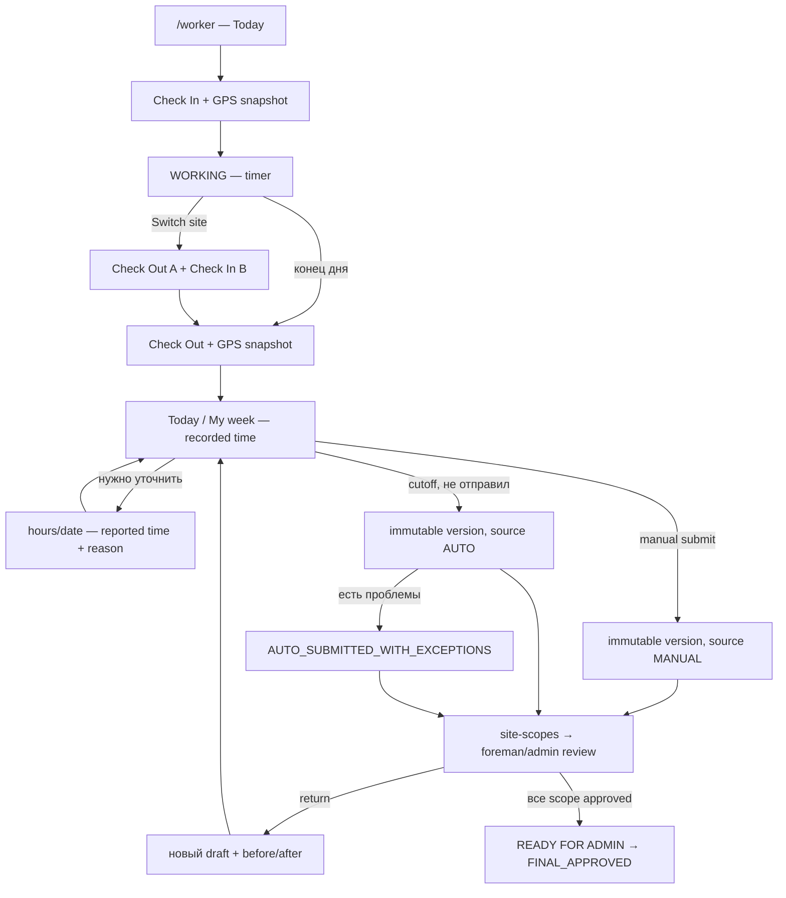
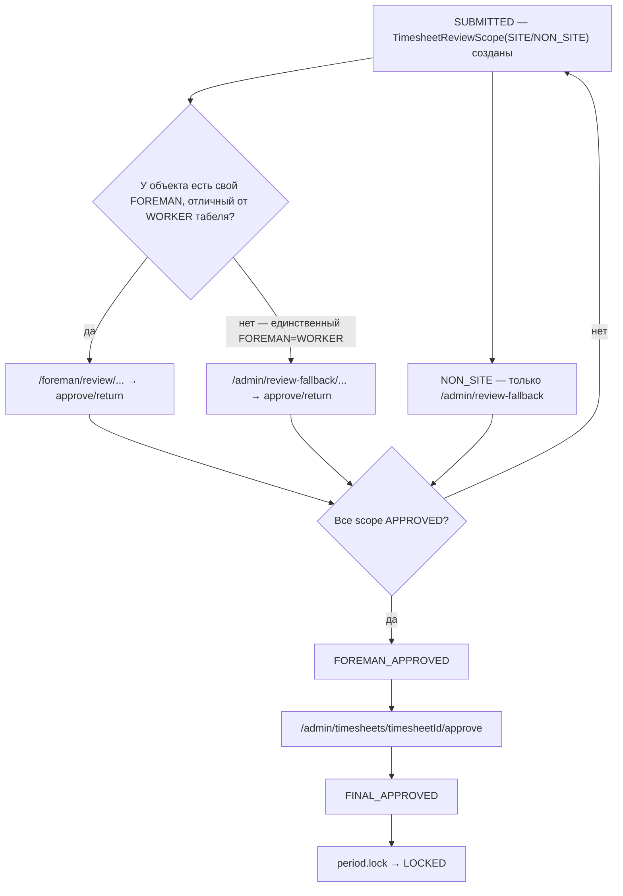

# Titanor Time — карта экранов

Версия: **5.5.0** (2026-08-06). Статус: **proposed architecture**. Источник истины для route-имён
(используются в `02_ROLE_PERMISSION_MATRIX.md` и `04_ADMIN_FIRST_API_CONTRACTS.md`). Документ
самодостаточен — каждый экран описан полностью.

Легенда приоритета: 🟢 = входит в первый вертикальный сценарий; ⚪ = спроектировано сейчас, строится
позже.

Домен: `app.titanorgroup.fi` (preview: `app-preview.titanorgroup.fi`). Все `/admin/*` — desktop-first
(min-width 1024px оптимизирован, работает от 768px), `/worker/*` — mobile-first (375px базовый,
touch target ≥ 48px), `/foreman/*` — desktop-first с поддержкой планшета в поле.

**Дуал-роль**: пользователь может одновременно иметь `FOREMAN` и `WORKER` (см.
`02_ROLE_PERMISSION_MATRIX.md`, §1) — прораб, который сам работает руками. Для такого пользователя
`/foreman/*` и `/worker/*` оба доступны; после логина он попадает на `/foreman`, а `/worker`
доступен из общей навигации для собственных Check In/Out и часов. Сервер не
даёт такому пользователю утвердить/вернуть/подтвердить собственный табель
(`403 SELF_APPROVAL_FORBIDDEN`) ни через `/foreman/*`, ни через административный fallback.

## 1. Общие экраны

#### `/login` 🟢
- Роли: все (неаутентифицированный)
- Приоритет: desktop + mobile, одинаковый layout
- Назначение: вход по `identifier` (username или email в одно поле) + паролю
- Данные: нет (форма)
- Действия: submit; переключатель языка (FI/EN/RU, без отдельного route — persist в `localStorage` +
  cookie `NEXT_LOCALE` до входа)
- Состояния: loading (submit disabled + spinner); error (`INVALID_CREDENTIALS` — одинаковое
  сообщение для «нет юзера» и «неверный пароль», защита от enumeration); нет empty/offline
- Откуда: прямой заход, редирект с любого защищённого route без сессии, logout
- Куда: зависит от ролей пользователя (`GET /api/auth/session` возвращает массив `roles`): есть
  `ADMIN`/`SUPER_ADMIN` → `/admin`; иначе есть `FOREMAN` → `/foreman`; только `WORKER` →
  `/worker` (домашний mobile-first clock; внутри показан текущий actionable период либо понятный
  empty state)
- API: `POST /api/auth/login`
- DoD: rate limit после 5 попыток/15мин на аккаунт + 50/15мин на IP; `INVALID_CREDENTIALS` не
  раскрывает, что именно неверно

#### `/activate` 🟢
- Роли: неаутентифицированный
- Приоритет: mobile-first
- Назначение: ручной ввод 10-символьного кода с бумаги, когда QR/ссылка недоступны
- Действия: нормализовать пробелы/дефисы/регистр → `/activate/[token]`
- Состояния: validation error для неверной длины/алфавита
- Откуда: `/login` либо прямая инструкция администратора
- Куда: `/activate/[token]`
- DoD: формат `XXXX-XXXX-XX` и негруппированный код приводят к одному token

#### `/activate/[token]` 🟢
- Роли: неаутентифицированный, только с валидным `ActivationToken`
- Приоритет: mobile-first (работники активируют с телефона)
- Назначение: подтвердить личность по коду активации перед установкой пароля
- Данные: имя работника (для подтверждения «это вы?»)
- Действия: continue → `/set-password`
- Состояния: loading; error (`TOKEN_EXPIRED`, `TOKEN_USED`, `TOKEN_INVALID` — три разных сообщения)
- Откуда: ссылка/код, который выдал `ADMIN` вне системы (бумага с QR)
- Куда: `/set-password`
- API: `GET /api/auth/activate?token=...`
- DoD: просроченный/использованный токен даёт понятную ошибку и не пускает дальше

#### `/set-password` 🟢
- Роли: неаутентифицированный, только с валидным `ActivationToken`
- Приоритет: mobile-first
- Назначение: установить первый пароль
- Данные: требования к паролю
- Действия: submit пароля дважды
- Состояния: loading; error (валидация пароля, `TOKEN_EXPIRED` если истёк между экранами)
- Откуда: `/activate/[token]`
- Куда: автологин → `/worker`; на самом экране показывается `username`/employee
  number с кнопкой копирования
- API: `POST /api/auth/set-initial-password`
- DoD: пароль установлен, токен переходит в `USED`, повторное использование токена невозможно

#### `/reset-password/request` ⚪
- Роли: все (неаутентифицированный)
- Приоритет: desktop + mobile
- Назначение: запросить восстановление доступа
- Действия: submit `identifier` (username или email)
- Состояния: loading; успех показывает одинаковое сообщение независимо от существования аккаунта
- Откуда: `/login`
- Куда: сообщение «если аккаунт существует, письмо/код отправлены»
- API: `POST /api/auth/password-reset/request`
- DoD: не раскрывает существование аккаунта; rate limited

#### `/reset-password/[token]` ⚪
- Роли: неаутентифицированный, валидный `PasswordResetToken`
- Приоритет: mobile-first
- Назначение: установить новый пароль (та же форма, что `/set-password`)
- Откуда: ссылка из `/reset-password/request`
- Куда: `/login`
- API: `POST /api/auth/password-reset/confirm`
- DoD: старый пароль перестаёт работать сразу после смены

#### `/profile` ⚪
- Роли: все аутентифицированные
- Приоритет: desktop + mobile
- Назначение: смена языка, смена пароля, просмотр своих данных (только для чтения)
- Данные: `User`/`Employee` (для `WORKER`) текущего пользователя
- Действия: сменить язык, сменить пароль, перейти к `/sessions`
- Состояния: loading; error при сохранении
- Откуда: header/nav на любом защищённом экране
- Куда: `/sessions`
- API: `GET /api/me`, `PATCH /api/me/locale`, `POST /api/me/change-password`
- DoD: смена языка применяется без перезагрузки всего приложения

#### `/sessions` ⚪
- Роли: все аутентифицированные
- Приоритет: desktop + mobile
- Назначение: список активных сессий, возможность отозвать
- Данные: `UserSession[]` текущего пользователя
- Действия: `session.revoke.own` на конкретной сессии, `session.revoke_all.own`
- Состояния: loading; empty (только текущая сессия); error
- Откуда: `/profile`
- API: `GET /api/me/sessions`, `DELETE /api/me/sessions/:id`, `POST /api/me/sessions/revoke-all`
- DoD: отзыв чужой сессии невозможен даже прямым запросом

#### `/403`, `/404`, `/500`, `/offline` 🟢
- Роли: все
- Приоритет: desktop + mobile
- Назначение: понятная ошибка вместо белого экрана
- Данные: `requestId` на `/500`
- Действия: вернуться на домашний экран своей роли, logout (на `/403`)
- Состояния: сами являются error-состояниями; `/offline` — глобальный баннер + fallback route
- Откуда: любой защищённый route при отказе авторизации/сети/сервера
- Куда: `/login` или домашний экран роли
- DoD: `403` ≠ `404` (роль видит «нет доступа», не «страница не существует»)

## 2. Администратор (`/admin/*`, desktop-first)

#### `/admin/setup` 🟢
- Роли: `ADMIN`, `SUPER_ADMIN`
- Приоритет: desktop
- Назначение: чек-лист первого вертикального сценария (город/объект → рабочая область → шаблон →
  работник → назначение → период), **не декоративный dashboard**
- Данные: статус каждого шага — есть ли хотя бы один `City`/`WorkSite`/`WorkArea`/
  `WorkScheduleTemplate`/`Employee`/`SiteAssignment`/открытый `PayrollPeriod`; `hasCity` —
  информационный, не блокирует
- Действия: переход к созданию недостающей сущности
- Состояния: loading; каждый шаг — «сделано»/«не сделано», без вымышленных чисел
- Откуда: первый вход `ADMIN`, когда чек-лист не завершён; далее из nav
- Куда: `/admin/sites/new`, `/admin/templates/new`, `/admin/workers/new`, `/admin/assignments/new`,
  `/admin/periods`
- API: `GET /api/admin/setup-status`
- DoD: точно отражает БД, не кэширует «выполнено» после деактивации сущности

#### `/admin` (обзор) ⚪
- Роли: `ADMIN`, `SUPER_ADMIN`
- Приоритет: desktop
- Назначение: сводка после setup — открытый период, число ожидающих подтверждения табелей,
  последние audit-события; реальные данные, без заглушечной статистики
- Данные: агрегаты по `PayrollPeriod`, `Timesheet.status`, последние `AuditEvent`
- Действия: переход к `/admin/timesheets`, `/admin/periods`, `/admin/audit`
- Состояния: loading; empty (нет открытого периода → баннер); error
- Откуда: логин `ADMIN`/`SUPER_ADMIN`, nav
- API: `GET /api/admin/overview`
- DoD: не показывает цифру, не посчитанную напрямую из БД в момент запроса

#### `/admin/workers` 🟢
- Роли: `ADMIN`, `SUPER_ADMIN`
- Приоритет: desktop (таблица), читаемо на планшете
- Назначение: список работников с поиском/фильтром/пагинацией
- Данные: `Employee` + `Employment.active` + `currentAssignments[]` (массив); индикатор отсутствия
  `isPrimary` среди активных назначений
- Действия: поиск по имени/employee number, фильтр по активности/объекту, сортировка, → создать,
  → карточка
- Состояния: loading (skeleton rows); empty (CTA «создать первого»); error
- Откуда: nav, `/admin/setup`
- Куда: `/admin/workers/new`, `/admin/workers/[employeeId]`
- API: `GET /api/admin/workers`
- DoD: работник с двумя активными назначениями показывает оба

#### `/admin/workers/new` 🟢
- Роли: `ADMIN`, `SUPER_ADMIN`
- Приоритет: desktop
- Назначение: регистрация работника — создаёт только `Employee`+`User(PENDING_ACTIVATION)`+
  `Employment`. **Не создаёт `ActivationToken` и не показывает код**
- Данные: форма (имя, фамилия, телефон, employee number — можно сгенерировать)
- Действия: submit
- Состояния: loading; error (валидация, дубликат employee number); нет empty
- Откуда: `/admin/workers`, `/admin/setup`
- Куда: `/admin/workers/[employeeId]` (профиль без кода — следующий шаг: назначить на объект)
- API: `POST /api/admin/workers`
- DoD: после создания работник виден в списке без какого-либо кода активации на экране

#### `/admin/workers/[employeeId]` 🟢
- Роли: `ADMIN`, `SUPER_ADMIN`
- Приоритет: desktop
- Назначение: карточка работника — профиль, текущие назначения, история табелей, действия
- Данные: `Employee`, `Employment`, `currentAssignments[]` (массив), последние `Timesheet`,
  `activationStatus`
- Действия: редактировать; деактивировать (с причиной — переводит в `OFFBOARDING` или
  `DEACTIVATED` по правилу отработанных периодов); назначить на объект
  (→ `/admin/assignments/new?employeeId=`); выдать код активации (доступно только при
  `readyForActivation`, иначе кнопка неактивна с подсказкой «сначала назначьте объект и откройте
  период»)
- Состояния: loading; error (404, если employeeId не существует); нет отдельного empty
- Откуда: `/admin/workers`
- Куда: `/admin/assignments/new`, `/admin/timesheets/[timesheetId]`
- API: `GET/PATCH /api/admin/workers/:employeeId`, `GET .../setup-preview`, `POST .../deactivate`,
  `POST .../activation`
- DoD: код активации показывается ровно один раз, сразу после вызова; не хранится и не показывается
  повторно

#### `/admin/absences` ⚪ (later phase — permission-контракт полный, route/API — следующая фаза)
- Роли: `ADMIN`, `SUPER_ADMIN`
- Приоритет: desktop
- Назначение: очередь `Absence(status=PENDING)`, создание отсутствия задним числом/по документу
- Данные: `Absence[]` + `Employee` (`absence.read.all`)
- Действия: одобрить (`absence.approve` — атомарная транзакция: `Absence → APPROVED` фиксируется
  всегда, безопасные дни получают overlay, конфликтные — в `overlayConflicts` ответа; **экран всегда
  получает `200`**, не `409`, — конфликты показываются как часть успешного результата, не как отказ
  операции), отклонить (`absence.reject`), создать сразу `APPROVED` (`absence.create.all`)
- Состояния: success с частичными конфликтами (`overlayConflicts[]` непуст) — UI явно показывает:
  «Отсутствие одобрено. N дней получили автоматическую отметку, M дней требуют ручного решения» со
  списком конфликтных дат и причин (`DRAFT_HAS_SEGMENTS`/`CONFIRMED_ZERO`/`EXPLICIT_DAY_TYPE`/
  `SUBMITTED_VERSION`); error — `409 ABSENCE_NOT_PENDING` только при `Absence.status=REJECTED`.
  Повторное нажатие «одобрить» над уже `APPROVED` записью **всегда `200`** (сохранённый результат
  первого одобрения, не ошибка)
- API: не спроектирован для UI в `04_...`; контракт эндпоинта одобрения зафиксирован в `04_...`, §13

#### `/admin/sites` 🟢
- Роли: `ADMIN`, `SUPER_ADMIN`
- Приоритет: desktop
- Назначение: список объектов
- Данные: `WorkSite` + `City` + счётчик активных `SiteAssignment`
- Действия: поиск, фильтр по городу/активности, → создать, → карточка
- Состояния: loading; empty (CTA «создать первый объект»); error
- Откуда: nav, `/admin/setup`
- Куда: `/admin/sites/new`, `/admin/sites/[siteId]`
- API: `GET /api/admin/sites`
- DoD: список работает и без единого созданного города (`cityId` nullable)

#### `/admin/sites/new` 🟢
- Роли: `ADMIN`, `SUPER_ADMIN`
- Приоритет: desktop
- Назначение: форма создания объекта
- Данные: форма (название, город — опционально, адрес, описание)
- Действия: submit
- Состояния: loading; error (`CITY_NOT_FOUND`, `VALIDATION_ERROR`)
- Откуда: `/admin/sites`, `/admin/setup`
- Куда: `/admin/sites/[siteId]` только что созданного объекта
- API: `POST /api/admin/sites`
- DoD: создание работает без единого города в системе

#### `/admin/sites/[siteId]` 🟢
- Роли: `ADMIN`, `SUPER_ADMIN`
- Приоритет: desktop
- Назначение: карточка объекта — данные, рабочие области, назначенные работники/прорабы
- Данные: `WorkSite`, `WorkArea[]`, `SiteAssignment[]`, `ForemanAssignment[]`
- Действия: редактировать, закрыть объект, добавить рабочую область
- Состояния: loading; empty на вкладке «рабочие области»; error
- Откуда: `/admin/sites`
- Куда: `/admin/sites/[siteId]/work-areas`, `/admin/assignments/new?siteId=`
- API: `GET/PATCH /api/admin/sites/:siteId`
- DoD: закрытие объекта не удаляет существующие назначения

#### `/admin/sites/[siteId]/work-areas` 🟢
- Роли: `ADMIN`, `SUPER_ADMIN`
- Приоритет: desktop
- Назначение: рабочие области конкретного объекта
- Данные: `WorkArea[]` объекта
- Действия: создать, редактировать, деактивировать
- Состояния: loading; empty (CTA создать); error
- Откуда: `/admin/sites/[siteId]`
- API: `GET/POST /api/admin/sites/:siteId/work-areas`, `PATCH .../work-areas/:workAreaId`
- DoD: имя рабочей области уникально в рамках объекта (проверка на сервере)

#### `/admin/assignments` 🟢
- Роли: `ADMIN`, `SUPER_ADMIN`
- Приоритет: desktop
- Назначение: список всех назначений работник↔объект
- Данные: `SiteAssignment` + `Employee` + `WorkSite` + `WorkArea` + `WorkScheduleTemplate`
- Действия: фильтр по объекту/работнику/активности, → создать, → завершить назначение
- Состояния: loading; empty; error
- Откуда: nav, карточка объекта/работника
- Куда: `/admin/assignments/new`
- API: `GET /api/admin/assignments`
- DoD: неактивные назначения видны в фильтре «история», не смешаны с активными

#### `/admin/assignments/new` 🟢
- Роли: `ADMIN`, `SUPER_ADMIN`
- Приоритет: desktop
- Назначение: назначить работника на объект/область/шаблон. Несколько активных назначений
  одновременно — легитимный сценарий (работа на двух объектах в разные часы одного дня)
- Данные: выбор `Employee`, `WorkSite`, `WorkArea` (опц.), `WorkScheduleTemplate`, `validFrom`,
  `isPrimary` (по умолчанию `true`, если первое назначение работника на пересекающийся диапазон дат)
- Действия: submit; предпросмотр конфликта перед submit
- Состояния: loading; error (`ASSIGNMENT_OVERLAP` — только для дубликата на тот же объект+область)
- Откуда: `/admin/assignments`, `/admin/workers/[employeeId]`, `/admin/sites/[siteId]`
- Куда: `/admin/assignments`
- API: `POST /api/admin/assignments/validate-overlap`, `POST /api/admin/assignments`
- DoD: назначение на второй объект в тот же диапазон дат проходит без ошибки

#### `/admin/assignments/[assignmentId]/split` ⚪
- Роли: `ADMIN`, `SUPER_ADMIN`
- Приоритет: desktop
- Назначение: сменить объект/область/шаблон у уже начавшегося назначения без потери исторического
  смысла прошлых дней — заменяет прямое редактирование
- Данные: текущее назначение (read-only часть), форма нового объекта/области/шаблона +
  `effectiveFrom`
- Действия: submit → атомарно закрывает старое (`validTo=effectiveFrom-1`), создаёт новое
- Состояния: loading; error (`ASSIGNMENT_OVERLAP`, `VALIDATION_ERROR`)
- Откуда: карточка назначения / `/admin/assignments`
- Куда: `/admin/assignments`
- API: `POST /api/admin/assignments/:assignmentId/split`
- DoD: обе строки видны в истории назначений; прошлые дни продолжают ссылаться на старую версию
  шаблона

#### `/admin/templates` 🟢
- Роли: `ADMIN`, `SUPER_ADMIN`
- Приоритет: desktop
- Назначение: список рабочих шаблонов
- Данные: `WorkScheduleTemplate` + краткое расписание по дням недели
- Действия: → создать, → карточка
- Состояния: loading; empty (CTA создать); error
- Откуда: nav, `/admin/setup`
- Куда: `/admin/templates/new`, `/admin/templates/[templateId]`
- API: `GET /api/admin/templates`

#### `/admin/templates/new` 🟢
- Роли: `ADMIN`, `SUPER_ADMIN`
- Приоритет: desktop
- Назначение: создание шаблона — 7 строк (пн–вс), рабочий/нерабочий день, время начала/конца,
  плановый перерыв
- Данные: форма `days[7]`
- Действия: submit
- Состояния: loading; error (валидация времени, неполные 7 дней)
- Откуда: `/admin/templates`, `/admin/setup`
- Куда: `/admin/templates/[templateId]`
- API: `POST /api/admin/templates`

#### `/admin/templates/[templateId]` 🟢
- Роли: `ADMIN`, `SUPER_ADMIN`
- Приоритет: desktop
- Назначение: редактирование шаблона — те же 7 строк; сохранение создаёт новую immutable версию, не
  переписывает текущую — UI выглядит как редактирование «одного шаблона», версионирование спрятано
  за API
- Данные: `days[7]` текущей версии
- Действия: сохранить (создаёт новую версию)
- Состояния: loading; error (та же валидация; `409 VERSION_CONFLICT`)
- Откуда: `/admin/templates`
- API: `GET/PATCH /api/admin/templates/:templateId`
- DoD: изменение шаблона не переписывает данные уже прошедших периодов — старые назначения
  продолжают ссылаться на прежнюю версию шаблона

#### `/admin/periods` 🟢
- Роли: `ADMIN`, `SUPER_ADMIN`
- Приоритет: desktop
- Назначение: список расчётных периодов, открытие нового
- Данные: `PayrollPeriod[]` со статусами
- Действия: → открыть новый период, → карточка периода
- Состояния: loading; empty (CTA открыть первый период); error (пересечение дат)
- Откуда: nav, `/admin/setup`
- Куда: `/admin/periods/[periodId]`
- API: `GET/POST /api/admin/periods`
- DoD: нельзя открыть период, пересекающийся по датам с существующим

#### `/admin/periods/[periodId]` 🟢 (просмотр открытого периода; закрытие/экспорт — фаза позже)
- Роли: `ADMIN`, `SUPER_ADMIN`
- Приоритет: desktop
- Назначение: карточка периода — статус, список табелей, действие закрытия
- Данные: `PayrollPeriod`, агрегат `Timesheet.status` по всем работникам периода
- Действия: закрыть период (`period.lock`), экспортировать (после `LOCKED`)
- Состояния: loading; error (`period.lock` с неутверждёнными табелями → список блокеров)
- Откуда: `/admin/periods`
- Куда: `/admin/timesheets?periodId=`, `/admin/export`
- API: `GET /api/admin/periods/:periodId`, `POST /api/admin/periods/:periodId/lock`
- DoD: попытка закрыть период с неутверждёнными табелями показывает точный список, что мешает

#### `/admin/review-fallback` ⚪

Административный аналог `/foreman/review` — реальный экран, обслуживает два случая: единственный
прораб объекта сам держит роль `WORKER` (не может проверить себя), и `NON_SITE`-scope
(отпуска/больничные/подтверждение пустого табеля — `FOREMAN` их не видит вовсе).

- Роли: `ADMIN`, `SUPER_ADMIN`
- Приоритет: desktop
- Назначение: очередь `TimesheetReviewScope(status=PENDING)`, доступных через `timesheet.
  scope_review.all`
- Данные: `TimesheetReviewScope[]` (`scopeType`, `scopePurpose`) + `Employee`/`WorkSite` (или
  `contextSiteId` для `NON_SITE`) + `hasException`
- Действия: фильтр по `scopeType`/`scopePurpose`/объекту/работнику, → карточка scope
- Состояния: loading; empty (обычный случай, если у всех объектов есть независимый прораб); error
- Откуда: nav
- Куда: `/admin/review-fallback/[reviewScopeId]`
- API: `GET /api/admin/review-scopes?status=PENDING`
- DoD: работник, совпадающий по `employeeId` с текущим `ADMIN`, никогда не появляется в списке для
  этого `ADMIN`

#### `/admin/review-fallback/[reviewScopeId]` ⚪
- Роли: `ADMIN`, `SUPER_ADMIN`
- Приоритет: desktop
- Назначение: карточка scope. Для `SITE`: дни/интервалы этого объекта, сравнение с плановым
  снимком. Для `NON_SITE(scopePurpose=DATA)`: дни отсутствия с типом (виден администратору, не
  прорабу) и причиной. Для `NON_SITE(scopePurpose=EMPTY_FALLBACK)`: **не показывается как
  «отсутствие»** — экран явно подписан «подтверждение пустого табеля» (весь табель не содержит ни
  рабочих часов, ни отсутствий — работник ничего не заполнил, требуется явное подтверждение, что это
  действительно так)
- Данные: `TimesheetReviewScope`+текущая `TimesheetVersion` (только относящиеся к этому scope дни)+
  `TimesheetReviewProposal[]` (только для `SITE`)
- Действия: подтвердить (кнопка неактивна, если `Timesheet.status != SUBMITTED` — подсказка «табель
  уже возвращён по другому объекту, обновите список»), вернуть (с причиной, опционально с
  предложениями — только для `SITE`; доступно и при `Timesheet.status = RETURNED`, см. ниже)
- Состояния: loading; error (`409 STALE_REVIEW_SCOPE` — версия уже переотправлена **или**
  `Timesheet.status != SUBMITTED` при попытке подтвердить; `403 SELF_APPROVAL_FORBIDDEN`)
- Откуда: `/admin/review-fallback`
- Куда: `/admin/review-fallback`
- API: `GET/POST /api/admin/review-scopes/:reviewScopeId`, `.../approve`, `.../return`
- DoD: подтверждение последнего `PENDING`-scope версии переводит `Timesheet.status` в
  `FOREMAN_APPROVED`; возврат одного `NON_SITE`/`SITE`-scope не блокируется тем, что другой scope той
  же версии уже вернули долями секунды раньше

#### `/admin/timesheets` ⚪
- Роли: `ADMIN`, `SUPER_ADMIN`
- Приоритет: desktop
- Назначение: полный операционный обзор всех работников и список табелей с фильтром по
  периоду/объекту/статусу
- Данные: `Timesheet` + `TimesheetVersion` (текущая) + `Employee`; после ЭТАП 7A — агрегаты
  `working now`, `finished`, `missing checkout`, `GPS/sync issue`, `draft`, `manual/auto submitted`,
  `awaiting foreman`, `returned`, `ready for final approval`, `correction`
- Действия: фильтр, сортировка, → карточка
- Состояния: loading; empty; error
- Откуда: nav, `/admin/periods/[periodId]`
- Куда: `/admin/timesheets/[timesheetId]`
- API: `GET /api/admin/timesheets`

#### `/admin/timesheets/[timesheetId]` ⚪
- Роли: `ADMIN`, `SUPER_ADMIN`
- Приоритет: desktop
- Назначение: карточка табеля — дни, интервалы, перерывы, история версий и решений
- Данные: текущая `TimesheetVersion` + `TimesheetDay`/`WorkSegment`/`BreakSegment`/
  `TimesheetPlannedShift` + `ApprovalAction[]`; после ЭТАП 7A — исходные Check In/Check Out,
  геостатус каждой точки, sync-state и clock-vs-reported diff с автором/timestamp/причиной правки
- Действия: перейти к сравнению версий, финально утвердить, вернуть с причиной
- Состояния: loading; error
- Откуда: `/admin/timesheets`
- Куда: `/admin/timesheets/[timesheetId]/versions`, `/admin/timesheets/[timesheetId]/approve`
- API: `GET /api/admin/timesheets/:timesheetId`

#### `/admin/timesheets/[timesheetId]/versions` ⚪
- Роли: `ADMIN`, `SUPER_ADMIN`
- Приоритет: desktop
- Назначение: сравнение версий табеля бок о бок — что изменилось между последовательными
  `TimesheetVersion`. Все версии — `source=WORKER` (отправки/переотправки) или `source=CORRECTION`
  (корректировки); прораб и администратор не авторы версий — прораб только предлагает через
  `TimesheetReviewProposal`, администратор на `final_approve` не меняет данные
- Данные: `TimesheetVersion[]` + diff по `TimesheetDay`/`WorkSegment`/плановому снимку +
  приложенные `TimesheetReviewProposal[]` для контекста
- Действия: нет мутирующих — только просмотр
- Состояния: loading; error
- Откуда: `/admin/timesheets/[timesheetId]`
- API: `GET /api/admin/timesheets/:timesheetId/versions`
- DoD: diff корректно показывает добавленные/удалённые/изменённые интервалы; после ЭТАП 7A рядом с
  каждой версией видны `MANUAL`/`AUTO`, cutoff, кому и когда она отправлена, site-scope статусы и
  исключения, блокирующие final approval

#### `/admin/timesheets/[timesheetId]/approve` ⚪
- Роли: `ADMIN`, `SUPER_ADMIN`
- Приоритет: desktop
- Назначение: финальное утверждение — только просмотр и подтверждение `FOREMAN_APPROVED`-версии,
  без редактирования. Если администратор не согласен с уже согласованными прорабом данными —
  возвращает весь табель целиком, не правит на месте
- Данные: текущая `FOREMAN_APPROVED`-версия, read-only
- Действия: `timesheet.final_approve` (чистый переход статуса) или `timesheet.return` (весь табель,
  требует причину)
- Состояния: loading; error (`INVALID_STATE_TRANSITION`, если табель не в `FOREMAN_APPROVED`)
- Откуда: `/admin/timesheets/[timesheetId]`
- Куда: `/admin/timesheets`
- API: `POST .../final-approve`, `POST .../return`
- DoD: на экране физически нет поля правки часов; сервер отклоняет любые данные об изменении часов
  в теле `final-approve`

#### `/admin/export` ⚪
- Роли: `ADMIN`, `SUPER_ADMIN`
- Приоритет: desktop
- Назначение: создать/скачать `ExportBatch` для `LOCKED`/`EXPORTED` периода
- Данные: `PayrollPeriod[]` со статусом `LOCKED`/`EXPORTED`, `ExportBatch[]`
- Действия: `export.create`, скачать существующий batch
- Состояния: loading; empty (нет `LOCKED` периодов); error
- Откуда: nav, `/admin/periods/[periodId]`
- API: `GET /api/admin/export-batches`, `POST /api/admin/periods/:periodId/export`
- DoD: повторный экспорт создаёт новый `ExportBatch`, не перезаписывает предыдущий; для уже
  `EXPORTED` периода с накопленными корректировками создаёт корректирующий batch

#### `/admin/audit` ⚪
- Роли: `ADMIN`, `SUPER_ADMIN`
- Приоритет: desktop
- Назначение: просмотр `AuditEvent` с фильтром по типу/actor/сущности
- Данные: `AuditEvent[]`
- Действия: фильтр, поиск по `entityId`
- Состояния: loading; empty; error
- Откуда: nav, `/admin`
- API: `GET /api/admin/audit`
- DoD: фильтрация по датам работает с UTC-хранением, отображение — в `Europe/Helsinki`

#### `/admin/users` ⚪
- Роли: `ADMIN` (без создания `ADMIN`/`SUPER_ADMIN`), `SUPER_ADMIN` (полный доступ)
- Приоритет: desktop
- Назначение: системные пользователи (не работники) — `ADMIN`/`SUPER_ADMIN`/`FOREMAN` учётки, роли
- Данные: `User` + `UserRole`
- Действия: создать `FOREMAN`, создать `ADMIN`/`SUPER_ADMIN` (только `SUPER_ADMIN`), `role.assign`
  (только `SUPER_ADMIN`), деактивировать
- Состояния: loading; empty; error
- Откуда: nav
- API: `GET/POST /api/admin/users`, `POST /api/admin/users/:id/role`
- DoD: `ADMIN` не может назначить роль `ADMIN`/`SUPER_ADMIN` даже прямым запросом к API

#### `/admin/settings` ⚪
- Роли: `ADMIN`, `SUPER_ADMIN`
- Приоритет: desktop
- Назначение: настройки приложения (2FA-политика, длительность сессии) — конкретный набор вне этого
  документа
- Откуда: nav

## 3. Работник (`/worker/*`, mobile-first)

Ежедневная домашняя страница `/worker` не требует от работника понимать период или табель. Экраны
кабинета параметризованы `periodId` (и внутри — `timesheetId`, резолвится сервером из
`periodId`+сессии). Работник может иметь несколько actionable периодов одновременно — навигация
между ними явная, но обычный Check In/Out всегда доступен с домашней страницы.

#### `/worker` 🟢 (после ЭТАП 7A — основной экран после логина)
- Роли: `WORKER`
- Приоритет: mobile-first, 375px, touch-target ≥48px, основное действие доступно одной рукой
- Назначение: максимально простой ежедневный clock без плотной таблицы и бухгалтерских терминов
- Данные: имя работника, локальная дата/день/время, активные назначения и основной объект, открытая
  clock-смена, GPS/sync-state, компактные интервалы `Today`, итог `This week`, ближайший cutoff
- Действия: доминирующая `Check In`; при активной смене — таймер и доминирующая `Check Out`;
  `Switch site` (атомарные Check Out старого + Check In нового); `Add break`; открыть меню
- Меню: `Today`, `My week`, `All hours`, `Corrections`, `Profile`, `Help`, `Logout`
- Состояния: `ready to check in`; `working`; `saved on device — waiting for sync`;
  `GPS_NOT_VERIFIED`; `outside geofence`; `no assignment`; `missing checkout`; error. Активная смена
  и несинхронизированное событие не теряются после закрытия/перезапуска PWA
- Откуда: логин `WORKER`, worker-nav
- Куда: `/worker/periods/[periodId]/hours`, `/worker/history`, `/worker/profile`
- API: после schema checkpoint — worker clock/context/sync endpoints; существующие context,
  assignments и timesheet endpoints переиспользуются для summary
- DoD: при одном назначении `Check In` не требует выбора объекта; при нескольких выбор понятен до
  старта; после нажатия пользователь сразу видит локально сохранённое состояние даже offline;
  `Switch site` создаёт два последовательных события без пересечения; ни один warning не скрыт
  только внутри меню

#### `/worker/periods` ⚪ (список actionable периодов, точка входа при нескольких)
- Роли: `WORKER`
- Приоритет: mobile
- Назначение: список actionable периодов работника — обычно один, но может быть несколько
- Данные: `PayrollPeriodParticipant`+`Timesheet.status` каждого actionable периода
- Действия: → открыть период
- Состояния: loading; empty («вам ещё не назначили объект»); error
- Откуда: логин `WORKER` (если периодов больше одного; иначе редирект сразу в единственный)
- Куда: `/worker/periods/[periodId]`
- API: `GET /api/worker/periods/actionable`
- DoD: два одновременных actionable периода видны и различимы, каждый ведёт на свой `timesheetId`

#### `/worker/periods/[periodId]` 🟢
- Роли: `WORKER`
- Приоритет: mobile (подробный кабинет периода из `/worker` или `My week`)
- Назначение: показать объект(ы), рабочую область, шаблон и статус табеля этого периода — финальная
  точка первого вертикального сценария; после ЭТАП 7A это подробный недельный кабинет, а не
  ежедневный clock-экран
- Данные: активные `SiteAssignment[]` (может быть несколько, `isPrimary` — основной), `PayrollPeriod`,
  `Timesheet.status`; после ЭТАП 7A — submission source/cutoff, site-scope route и exceptions
- Действия: перейти к вводу часов (если draft/returned/withdrawn), посмотреть immutable отправленную
  версию и её маршрут, вручную отправить; до начала review — явно `Withdraw` в **новый** draft;
  после возврата — исправить и переотправить; после final approval — открыть correction request
- Состояния: loading; **empty — критично**: нет ни одного активного назначения → «вам ещё не
  назначили объект»; offline — просмотр последнего кэша; `manual submitted`, `auto submitted`,
  `auto submitted with exceptions`, `awaiting foreman`, `returned`, `ready for admin`,
  `final approved`, `correction pending`
- Откуда: `/worker`, `/worker/periods`
- Куда: `/worker/periods/[periodId]/hours`
- API: `GET /api/worker/timesheets/:timesheetId`, `GET /api/worker/assignments/current`
- DoD: работник, назначенный пять минут назад, видит правильные данные без релогина; отправленная
  версия никогда не редактируется на месте, но экран всегда объясняет доступный путь исправления и
  показывает, кому/когда она отправлена и что ожидается дальше

#### `/worker/periods/[periodId]/hours` ⚪ (ввод часов — фаза 3 роадмапа)
- Роли: `WORKER`
- Приоритет: mobile
- Назначение: список дней периода. При `Timesheet.status IN (DRAFT, RETURNED)` — редактируется
  mutable `TimesheetDraft` этого `timesheetId`. При `SUBMITTED`/`FOREMAN_APPROVED` — read-only
  просмотр последней immutable версии (draft на этот момент физически пуст, экран сам определяет
  источник данных по статусу и обращается к соответствующему API)
- Данные: `TimesheetDraftDay[]` (редактируемо) либо `TimesheetDay[]` текущей версии (read-only)
- Действия: → редактировать день (только если редактируемо)
- Состояния: loading; empty (период открыт, дней ещё нет — показать шаблон как подсказку); error;
  offline (только просмотр последнего кэша)
- Откуда: `/worker/periods/[periodId]`
- Куда: `/worker/periods/[periodId]/hours/[date]`
- API: `GET /api/worker/timesheets/:timesheetId/draft` (редактируемое состояние),
  `GET /api/worker/timesheets/:timesheetId/current-version` (read-only состояние)
- DoD: попытка изменить immutable `SUBMITTED`-версию на месте отклоняется; UI вместо тупика
  предлагает разрешённый lifecycle-action: `Withdraw` до начала review, обработать `RETURNED`, либо
  correction request после final approval. Любое исправление создаёт новую версию, старую не меняет

#### `/worker/periods/[periodId]/hours/[date]` ⚪
- Роли: `WORKER`
- Приоритет: mobile, touch-target ≥48px
- Назначение: редактирование одного дня — интервалы, перерывы, второй объект в тот же день (в т.ч.
  два интервала одного объекта, но разных активных назначений — `sourceAssignmentId` резолвится
  сервером автоматически, экран его не запрашивает и не показывает). День либо полностью рабочий
  (`dayType=WORK`, может содержать интервалы, опционально `confirmedZero=true` при их отсутствии),
  либо полностью отсутствие (`dayType != WORK`, интервалы и `confirmedZero=true` недопустимы) —
  смешение запрещено
- Данные: `TimesheetDraftSegment[]`/`TimesheetDraftBreakSegment[]` дня; каждый интервал требует
  обязательные начало и конец (нет «открытых» интервалов без конца)
- Действия: добавить/удалить интервал — сохраняется в draft сразу (снимает `confirmedZero`, если он
  был установлен, — UI требует явно снять галочку «ноль часов» перед добавлением интервала, сервер
  отклоняет неявную комбинацию); **подтвердить ноль часов** (`confirmedZero=true`, доступно только
  для дня без сегментов) — единственное non-WORK-подобное действие, доступное прямо на этом экране.
  **Персональное отсутствие (`SICK_LEAVE`/`VACATION`/`UNPAID_LEAVE`/`OTHER`) нельзя выставить прямо
  здесь** — экран не предлагает выбор этих `dayType`, вместо этого показывает ссылку «отметить
  отсутствие» → `/worker/absences` (создаёт `Absence(PENDING)`, только после одобрения `ADMIN`
  overlay сам проставит `dayType`/`sourceAbsenceId` на этот день, `03_...`, §4.2); если день был
  предметом `OPEN`-предложения — **любое** сохранение (не только принятие предложения отдельным
  действием) резолвит его: `ACCEPTED`, если итоговое содержимое совпало с `proposedSegments`, иначе
  `REPLACED`; повторное редактирование того же дня заново пересчитывает статус (`ACCEPTED ↔
  REPLACED`) вплоть до отправки табеля, после чего решение становится окончательным
- Состояния: error (`WORK_SEGMENT_OVERLAP` — пересечение внутри этого draft; `SITE_NOT_ASSIGNED` —
  нет активного назначения на этот объект/область в эту дату; `DAY_TYPE_CONFLICT` — попытка добавить
  интервал на день-отсутствие или пометить день с интервалами как отсутствие; `DAY_STATE_CONFLICT` —
  попытка сохранить `confirmedZero=true` одновременно с интервалами, в том же запросе или поверх уже
  существующих; `403 DAY_TYPE_REQUIRES_ABSENCE` — гипотетическая прямая попытка выставить
  персональный non-WORK `dayType` в обход UI, отклонена сервером)
- Откуда: `/worker/periods/[periodId]/hours`
- Куда: `/worker/periods/[periodId]/hours`
- API: `PATCH /api/worker/timesheets/:timesheetId/days/:date` — отклик может включать
  `resolvedProposals[]`, если сохранение разрешило одно или несколько предложений прораба; UI
  показывает короткое подтверждение («предложение прораба принято»/«предложение прораба отклонено
  вашей правкой»), не молчаливо
- DoD: `07:00–11:00` A + `12:00–16:00` B в один день — без ошибки; `07:00–12:00` A + `11:00–16:00` B
  — отклонено; сохранение интервала без конца — отклонено на уровне формы (обязательное поле) и на
  сервере (`400 VALIDATION_ERROR`); ручное редактирование дня с ни разу не тронутым `OPEN`-
  предложением выводит его из `OPEN` без отдельного вызова «принять предложение»

#### `/worker/periods/[periodId]/submit` ⚪
- Роли: `WORKER`
- Приоритет: mobile
- Назначение: подтверждение отправки табеля
- Данные: сводка перед отправкой; если есть `OPEN`-предложения — список, submit недоступен;
  ближайший company cutoff и пояснение, что при отсутствии ручной отправки scheduler отправит
  текущий снимок на проверку, но не утвердит его
- Действия: `timesheet.submit`
- Состояния: loading; error (`409 UNRESOLVED_PROPOSALS` — список дней, требующих решения, ссылка на
  каждый; `409 INVALID_STATE_TRANSITION`)
- Откуда: `/worker/periods/[periodId]/hours`
- Куда: `/worker/periods/[periodId]` (статус «ожидает проверки»)
- API: `POST /api/worker/timesheets/:timesheetId/submit`
- DoD: попытка отправить с необработанным предложением — явный список, не общая ошибка; повторный
  ручной submit или scheduler для уже отправленной версии не создаёт дубль

#### `/worker/history` ⚪
- Роли: `WORKER`
- Приоритет: mobile
- Назначение: список всех периодов работника (не только actionable) и их статус
- Данные: `Timesheet[]` (все периоды работника) с `MANUAL`/`AUTO`, timestamp отправки и текущим
  review/correction status
- Действия: → детали периода
- Состояния: loading; empty; error
- Откуда: `/worker/periods/[periodId]`, nav
- Куда: `/worker/history/[timesheetId]`
- API: `GET /api/worker/timesheets`

#### `/worker/history/[timesheetId]` ⚪ (используется и как «возвращённый табель»)
- Роли: `WORKER`
- Приоритет: mobile
- Назначение: детали конкретного табеля (через `current-version`, read-only); если `RETURNED` — по
  каждому дню с предложением прораба, ещё не ставшим `RESOLVED`: заявлено N ч / предложено M ч /
  разница ±К ч + причина, с пометкой текущего статуса (`OPEN`/`ACCEPTED`/`REPLACED`)
- Данные: текущая версия (`current-version`), `ApprovalAction[]`, `TimesheetReviewProposal[]`
- Действия: на каждое предложение со `status IN (OPEN, ACCEPTED, REPLACED)` — три равнозначных
  варианта: «принять» (`timesheet.accept_proposal`, применяет `proposedSegments` **только к
  сегментам этого объекта в этот день**, оставляя интервалы других объектов того же дня нетронутыми);
  «оставить как есть» (`timesheet.reject_proposal` — новая, явная кнопка, **не** трогает данные дня,
  только фиксирует `status → REPLACED` для этого предложения; отдельна от «исправить самому», чтобы
  работник не был вынужден изображать бессмысленную правку ради того же результата); «исправить
  самому» (→ `/worker/periods/[periodId]/hours/[date]`, свободное редактирование **только сегментов
  этого объекта** — правка другого объекта того же дня не резолвит это предложение, см. DoD ниже).
  «Принять»/«исправить самому» **не отправляют** табель повторно — работник переходит к submit
  отдельным явным действием, когда разрешит все предложения. Статус пересчитывается при каждом
  последующем сохранении **того же объекта**, пока не станет `RESOLVED` при отправке табеля — после
  этого предложение показывается только как историческая запись, действия по нему недоступны
- Состояния: loading; error (`409 STALE_PROPOSAL` — предложение относится к версии, из которой draft
  уже не переинициализирован, UI подсказывает обновить экран; `409 PROPOSAL_ALREADY_RESOLVED` —
  предложение уже зафиксировано прошлой отправкой, показывается как read-only история)
- DoD: сразу после возврата табеля прорабом (до того как работник хоть что-то поменял) все свежие
  предложения показаны со `status=OPEN` — системное копирование содержимого версии в draft,
  выполненное сервером при подготовке этого экрана, не помечает их «уже отклонёнными» (`03_...`,
  §4.6, «Жизненный цикл `status`»); правка объекта A на `/worker/periods/[periodId]/hours/[date]` не
  меняет статус предложения объекта B той же даты, даже если оба показаны на этом экране одновременно
- Куда: `/worker/periods/[periodId]/hours/[date]`, `/worker/periods/[periodId]/submit`
- API: `GET /api/worker/timesheets/:timesheetId/current-version`, `POST /api/worker/
  review-proposals/:proposalId/accept`, `POST /api/worker/review-proposals/:proposalId/reject`
- DoD: причина возврата и структурированное original/proposed/delta всегда видны вместе

#### `/worker/profile` 🟢
- См. `/profile` выше.

#### `/worker/absences` ⚪ (later phase — permission-контракт полный, route/API — следующая фаза)
- Роли: `WORKER`
- Приоритет: mobile
- Назначение: **единственный** путь работника к персональному отсутствию
  (`SICK_LEAVE`/`VACATION`/`UNPAID_LEAVE`/`OTHER`) — запросить будущее отсутствие и посмотреть статус
  собственных `Absence`; прямая установка non-WORK `dayType` через `/worker/periods/[periodId]/
  hours/[date]` запрещена сервером (`403 DAY_TYPE_REQUIRES_ABSENCE`, `03_...`, §4.2)
- Данные: `Absence[]` работника (`absence.read.own`) — полный `type`/`note`
- Действия: создать запрос (`absence.create.own`, создаёт `PENDING`) — не входит в первый
  вертикальный срез
- API: не спроектирован в `04_...` — контракт `absence.approve` (одобрение, вне этого экрана)
  зафиксирован в `04_...`, §13, для консистентности будущей реализации

## 4. Прораб (`/foreman/*`, desktop-first, планшет в поле)

Единица работы прораба — `TimesheetReviewScope(scopeType=SITE)`, никогда `NON_SITE`. Если работник
сменил объект внутри периода, каждый прораб видит и решает только свой scope; `Timesheet.status →
FOREMAN_APPROVED` только когда все scope версии подтверждены (включая возможный `NON_SITE`,
проверяемый отдельно администратором). Собственные scope прораба (дуал-роль) исключены из его же
очереди.

#### `/foreman` ⚪
- Роли: `FOREMAN`
- Приоритет: desktop + планшет
- Назначение: обзор — сколько табелей ожидает проверки на его объектах, реальные числа
- Данные: агрегат `Timesheet.status` по назначенным объектам; после ЭТАП 7A отдельно manual/auto,
  GPS/sync/missing-checkout exceptions и ожидающие site-scopes
- Действия: → очередь проверки
- Состояния: loading; empty (нет ожидающих); error
- Откуда: логин `FOREMAN`
- Куда: `/foreman/review`
- API: `GET /api/foreman/overview`
- DoD: числа совпадают с реальным списком в `/foreman/review` в момент запроса

#### `/foreman/review` ⚪
- Роли: `FOREMAN`
- Приоритет: desktop + планшет
- Назначение: список `TimesheetReviewScope(scopeType=SITE, status=PENDING)` на объектах прораба,
  разделённый на стандартные/с отклонениями
- Данные: `TimesheetReviewScope` + родительский `Timesheet`/`Employee`, с флагом `hasException`
- Действия: → стандартные, → с отклонениями, → карточка табеля
- Состояния: loading; empty; error
- Откуда: `/foreman`
- Куда: `/foreman/review/standard`, `/foreman/review/exceptions`, `/foreman/review/[timesheetId]`
- API: `GET /api/foreman/review-scopes?status=PENDING`
- DoD: работник другого объекта никогда не появляется в этом списке; собственные scope прораба
  (если он же `WORKER`) исключены; после ЭТАП 7A видно, отправил ли работник сам или scheduler, но
  обе версии проходят одинаковую проверку

#### `/foreman/review/standard` ⚪
- Роли: `FOREMAN`
- Приоритет: desktop
- Назначение: scope без отклонений — кандидаты на массовое подтверждение
- Данные: подмножество `/foreman/review` где `hasException=false`
- Действия: выбрать группу → `/foreman/review/bulk-approve`
- API: `GET /api/foreman/review-scopes?status=PENDING&hasException=false`

#### `/foreman/review/exceptions` ⚪
- Роли: `FOREMAN`
- Приоритет: desktop
- Назначение: scope с отклонениями — требуют индивидуального просмотра, недоступны для массового
  подтверждения
- Данные: подмножество где `hasException=true`, включая `GPS_NOT_VERIFIED`, missing checkout,
  unresolved sync conflict и auto-submit неполных данных
- Действия: → карточка табеля
- API: `GET /api/foreman/review-scopes?status=PENDING&hasException=true`

#### `/foreman/review/[timesheetId]` ⚪
- Роли: `FOREMAN`
- Приоритет: desktop
- Назначение: карточка табеля — дни/интервалы только на объекте(ах) прораба, сравнение с плановым
  снимком; если табель покрывает несколько объектов, дни на чужих объектах видны свёрнутыми. После
  ЭТАП 7A показывает исходное clock-время, заявленное после ручной правки время и GPS-исключения
  только по собственным объектам прораба
- Данные: текущая `TimesheetVersion` + собственный `TimesheetReviewScope` прораба; после ЭТАП 7A —
  связанные clock-события и diff без раскрытия GPS чужих объектов
- Действия: → предложить исправление, → вернуть, → подтвердить (все — на уровне своего scope)
- Откуда: `/foreman/review/standard`, `/foreman/review/exceptions`
- Куда: `/foreman/review/[timesheetId]/propose-correction`, `.../return`, `.../approve`
- API: `GET /api/foreman/timesheets/:timesheetId`

#### `/foreman/review/[timesheetId]/propose-correction` ⚪
- Роли: `FOREMAN`
- Приоритет: desktop
- Назначение: главный экран расхождения план/факт — прораб видит заявленное работником время дня
  (например 10 ч) и вводит структурированную замену (интервалы, из которых сервер сам вычисляет
  итоговые минуты) — например 8 ч. Это создаёт `TimesheetReviewProposal`, **не** меняет
  `TimesheetVersion` напрямую. **Каждое предложение всегда структурировано** — пустой набор
  интервалов означает «предлагаю обнулить часы этого объекта за этот день», минутная сводка без
  интервалов не существует как отдельный путь
- Данные: `TimesheetDay`+`WorkSegment` конкретного дня (заявленные минуты считаются отсюда), форма
  замены интервалов (может быть пустой), обязательное `reason`
- Действия: submit → создаёт один или несколько `TimesheetReviewProposal` и переводит scope в
  `RETURNED`
- Состояния: error (`403 SELF_APPROVAL_FORBIDDEN`; `400 VALIDATION_ERROR`, если интервалы
  пересекаются или выходят за правила рабочего дня)
- Откуда: карточка табеля
- Куда: `/foreman/review`
- API: `POST /api/foreman/review-scopes/:reviewScopeId/return` (с телом `proposals: [{
  timesheetDayId, proposedSegments, reason }]`)
- DoD: работник и `ADMIN` видят заявленные/предложенные минуты и разницу рядом с причиной, не
  только текст возврата

#### `/foreman/review/[timesheetId]/return` ⚪
- Роли: `FOREMAN`
- Приоритет: desktop
- Назначение: вернуть свой `TimesheetReviewScope` работнику без структурированного предложения.
  Разрешено, даже если `Timesheet.status` уже сменился на `RETURNED` из-за почти одновременного
  возврата другого объекта той же версии (второй прораб не теряет право зафиксировать своё
  несогласие) — в отличие от подтверждения (см. `approve` ниже)
- Данные: обязательное поле причины
- Действия: `timesheet.return` (на уровне scope)
- Состояния: loading; error (причина пуста → 400 на сервере; `403 SELF_APPROVAL_FORBIDDEN`; `409
  STALE_REVIEW_SCOPE` — устаревшая версия)
- API: `POST /api/foreman/review-scopes/:reviewScopeId/return`
- DoD: возврат хотя бы одного scope переводит весь `Timesheet.status` в `RETURNED`, работник видит
  объединённые причины со всех объектов; второй почти одновременный возврат другого объекта той же
  версии проходит успешно, не теряется

#### `/foreman/review/[timesheetId]/approve` ⚪
- Роли: `FOREMAN`
- Приоритет: desktop
- Назначение: подтвердить свой `TimesheetReviewScope`. Доступно **только пока `Timesheet.status =
  SUBMITTED`** — если табель уже переведён в `RETURNED` возвратом другого объекта той же версии
  (даже долями секунды раньше), подтвердить нельзя: draft уже переоткрыт для правки, содержимое
  могло начать меняться
- Действия: `timesheet.foreman_review` approve
- Состояния: loading; error (`403 SELF_APPROVAL_FORBIDDEN`; `409 STALE_REVIEW_SCOPE` — устаревшая
  версия **или** `Timesheet.status != SUBMITTED`, UI в обоих случаях подсказывает обновить список,
  не разграничивая причину визуально)
- API: `POST /api/foreman/review-scopes/:reviewScopeId/approve`
- DoD: `Timesheet.status` переходит в `FOREMAN_APPROVED` только когда подтверждены все scope этой
  версии, не только scope текущего прораба; попытка подтвердить scope сразу после того, как другой
  прораб вернул свой, — отклоняется

#### `/foreman/review/bulk-approve` ⚪
- Роли: `FOREMAN`
- Приоритет: desktop
- Назначение: подтвердить выбранную группу стандартных `TimesheetReviewScope` одним действием
- Данные: список выбранных `reviewScopeId`
- Действия: `timesheet.bulk_approve`
- Состояния: loading; error (если в выборку попал scope с отклонением, собственный scope прораба, или
  scope, чей `Timesheet.status` уже не `SUBMITTED` — сервер отклоняет весь запрос с точным списком
  проблемных id)
- API: `POST /api/foreman/review-scopes/bulk-approve`
- DoD: массовое подтверждение атомарно — либо весь пакет проходит, либо ни один; версия
  `AUTO_SUBMITTED_WITH_EXCEPTIONS` не может попасть в bulk approve до разрешения исключений

#### `/foreman/workers` ⚪
- Роли: `FOREMAN`
- Приоритет: desktop
- Назначение: работники на объектах прораба
- Данные: `Employee` через активный `SiteAssignment` на объектах прораба
- API: `GET /api/foreman/workers`

#### `/foreman/history` ⚪
- Роли: `FOREMAN`
- Приоритет: desktop
- Назначение: история решений прораба (подтверждённые/возвращённые)
- Данные: `ApprovalAction[]` где `reviewerUserId = текущий`
- Действия: фильтр по периоду/работнику
- API: `GET /api/foreman/history`

## 5. Диаграммы потоков

### 5.1 Вход, активация, восстановление

### 5.2 Первый вертикальный сценарий (admin → worker видит назначение)

```mermaid
flowchart LR
    S1["/admin/sites/new"] --> S2["/admin/sites/siteId/work-areas"]
    S2 --> S3["/admin/templates/new"]
    S3 --> S4["/admin/workers/new"]
    S4 --> S5["/admin/assignments/new"]
    S5 --> S6["/admin/periods"]
    S6 --> S7["код активации выдан"]
    S7 --> S8["/activate/token → /set-password"]
    S8 --> S9["/login"]
    S9 --> S10["/worker — видит объект и готов к Check In"]
```

### 5.3 Ежедневный цикл работника

### 5.4 Проверка → финальное утверждение (включая административный fallback)

