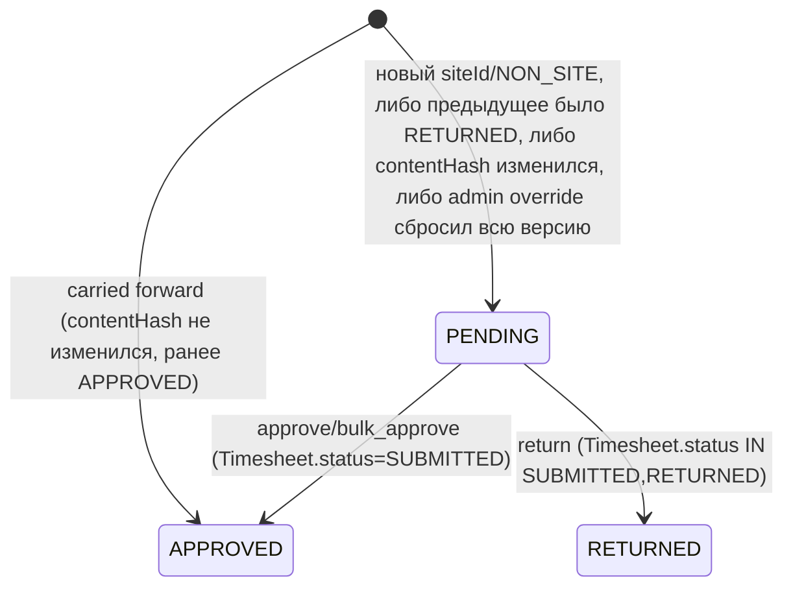
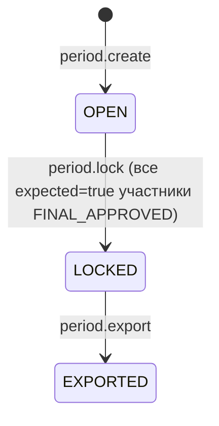
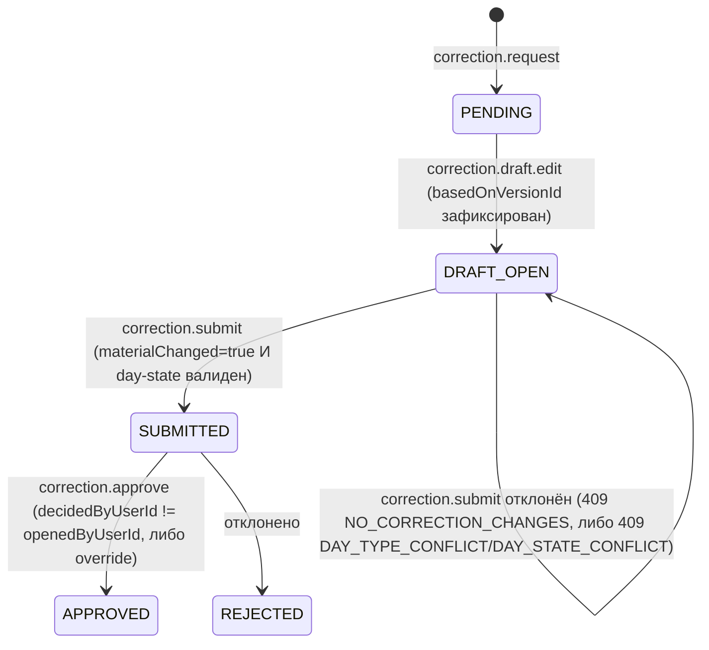
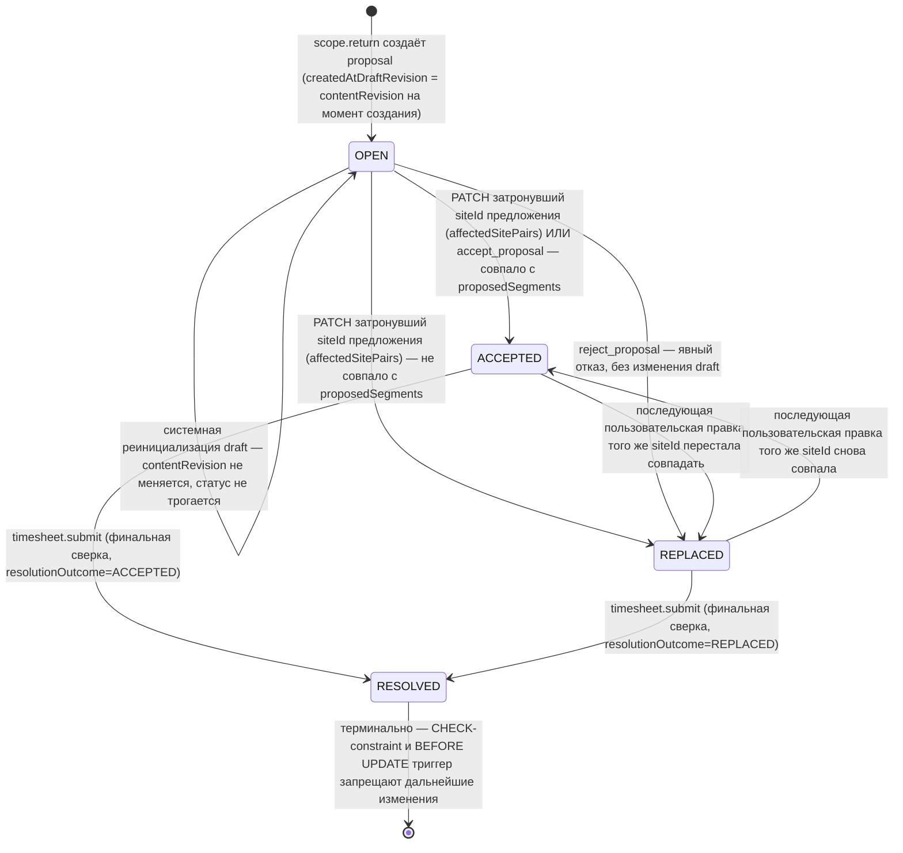

# Titanor Time — модель данных

Версия: **5.5.0** (2026-08-24, +§4.2a Квалификации и допуски, +§4.8a Admin Notification Center).
Статус: **proposed architecture** (общая пометка "ничего не реализовано" в этой версии устарела —
многое, включая обе новые секции, уже реализовано и промигрировано; см. `01_SCREEN_MAP.md`/
`IMPLEMENTATION_STATUS.md` за фактическим статусом). Источник истины для имён сущностей, полей,
статусов и ограничений для
`01_SCREEN_MAP.md`, `02_ROLE_PERMISSION_MATRIX.md` и `04_ADMIN_FIRST_API_CONTRACTS.md`. Документ
самодостаточен: полные поля всех сущностей приведены ниже, читатель не обязан открывать более
ранние версии этого документа.

Предполагаемый стек: **PostgreSQL 16 + Prisma** — отдельная база, отдельный контейнер, отдельный
volume, не публикуется наружу, не пересекается с базой `collab-studio-postgres-1` на том же VPS.

## 1. Глобальные конвенции

- PK: `id uuid default gen_random_uuid()` везде, если не указано иное.
- `createdAt timestamptz not null default now()` на всех таблицах. `updatedAt` — только на mutable
  таблицах (помечено явно в каждом разделе).
- Все временные метки хранятся как `timestamptz` в **UTC**. Часовой пояс — не только про
  отображение: в `Europe/Helsinki` вычисляется календарный день, принадлежность периоду, категории
  времени (Sunday/night/overtime), `crossesMidnight`, поведение вокруг перехода на летнее/зимнее
  время — это часть сервисного слоя, не только форматирования при выводе.
- Календарные даты (`PayrollPeriod.startDate/endDate`, `WorkScheduleTemplateVersionDay`,
  `SiteAssignment.validFrom/validTo`, `ForemanAssignment.validFrom/validTo`,
  `Employment.startDate/endDate`, `Absence.startDate/endDate`, `TimesheetDraftDay.date`/
  `TimesheetDay.date`) хранятся как `date`, уже в терминах календаря Хельсинки.
- **Границы дат — обе включительно.** `daterange(x, y + 1, '[)')` — конвенция для любого exclusion
  constraint на верхнюю дату-границу.
- Мягкое удаление: нигде нет `deletedAt`, кроме явных `active`/`status`-полей.
- **Production gate для MFA**: `REQUIRE_MFA_FOR_ADMIN=true` в `.env.production`, `false` допустимо
  только в preview/dev. См. `README.md`, «MFA production gate».
- **Composite FK на `WorkArea` — единый порядок колонок.** `WorkArea` объявляет
  `UNIQUE (siteId, id)`. Любая ссылающаяся таблица объявляет
  `FOREIGN KEY (siteId, workAreaId) REFERENCES WorkArea (siteId, id) MATCH SIMPLE` — порядок колонок
  идентичен в обоих местах. `MATCH SIMPLE` означает: если `workAreaId IS NULL`, ограничение не
  проверяется вовсе (работа без указания конкретной рабочей области — валидный случай). Это правило
  применяется одинаково к `SiteAssignment`, `WorkSegment`, `TimesheetDraftSegment`,
  `CorrectionDraftSegment`, и к сервисной валидации `proposedSegments` (jsonb, где FK физически
  невозможен — сервис проверяет то же условие явным запросом).
- **Единственное место, где проверяется пересечение рабочего времени** — `TimesheetDraftSegment`/
  `CorrectionDraftSegment`, scoped по конкретному `draftId` (не по одному `employeeId` — см. §4.6).
- **Нет открытых интервалов.** Ни один сегмент рабочего времени (черновой или immutable) не может
  существовать без `endAt`. Live-режим «отметился на входе, отметился на выходе» — отдельный будущий
  механизм, не часть этой модели; он не резервируется nullable-полями здесь, чтобы не ослаблять
  текущие payroll-ограничения.
- **Composite FK для referential consistency `reviewScope`↔`timesheetDay`↔`proposal`.**
  `TimesheetReviewScope` и `TimesheetDay` объявляют `UNIQUE (id, timesheetVersionId)`.
  `TimesheetReviewProposal` хранит денормализованный `timesheetVersionId` и ссылается на обе таблицы
  составными FK `(reviewScopeId, timesheetVersionId)`/`(timesheetDayId, timesheetVersionId)` — физически
  невозможно создать предложение, чей `reviewScopeId` и `timesheetDayId` принадлежат разным версиям
  табеля (§4.6).
- **Каждый фактический/черновой рабочий сегмент хранит явный `sourceAssignmentId` и явный
  денормализованный `employeeId`.** Composite FK может ссылаться только на реальные локальные
  колонки таблицы — не на значение, полученное join'ом через другую таблицу. Поэтому
  `WorkSegment`/`TimesheetPlannedShift`/`TimesheetDraftPlannedShift` хранят собственный `employeeId`
  (денормализованный, immutable), а не «резолвят» его через `timesheetDayId`/`draftId`. Полная схема
  — §4.6, «`sourceAssignmentId` — реальная DB-целостность».
- **`confirmedZero` и наличие сегментов — взаимоисключающие состояния одного дня**, проверяется как
  единое целое состояние строки при любой мутации, не по отдельным переданным полям — правило
  применяется одинаково к `TimesheetDraftDay`/`TimesheetDraftSegment` (mutable), `TimesheetDay`/
  `WorkSegment` (immutable) и `CorrectionDraftDay`/`CorrectionDraftSegment` (mutable) (§4.6, «Правило
  состояния дня»).
- **Системная мутация draft (реинициализация из версии) — не решение работника.** `TimesheetDraft.
  contentRevision bigint NOT NULL default 0` увеличивается **только** явной пользовательской правкой
  (`PATCH .../days/:date`, `accept_proposal`) — реинициализация при `RETURNED` (копирование
  `TimesheetVersion` обратно в draft) `contentRevision` не трогает. `TimesheetReviewProposal.
  createdAtDraftRevision bigint NOT NULL` — снимок `contentRevision` на момент создания предложения;
  используется, чтобы отличить «работник что-то поменял после появления предложения» от «система
  просто скопировала версию обратно» (§4.6, «Жизненный цикл `status`»).

## 2. ER-диаграмма (отношения; полные списки полей — в §4)

```mermaid
erDiagram
    User ||--o{ UserRole : has
    Role ||--o{ UserRole : "granted via"
    Role ||--o{ RolePermission : has
    Permission ||--o{ RolePermission : "granted via"
    User ||--o{ UserSession : has
    User ||--o| Employee : "may be linked to (any role)"
    Employee ||--o{ Employment : has
    Employee ||--o{ ActivationToken : "issued for"
    User ||--o{ UserActivationToken : "issued for"
    User ||--o{ PasswordResetToken : "issued for"
    User ||--o{ IdempotencyKey : owns

    City ||--o{ WorkSite : contains
    WorkSite ||--o{ WorkArea : contains
    WorkSite ||--o{ SiteAssignment : receives
    WorkSite ||--o{ ForemanAssignment : receives
    Employee ||--o{ SiteAssignment : has
    User ||--o{ ForemanAssignment : "is foreman for"
    WorkScheduleTemplate ||--o{ WorkScheduleTemplateVersion : has
    WorkScheduleTemplateVersion ||--o{ WorkScheduleTemplateVersionDay : has
    WorkScheduleTemplateVersion ||--o{ SiteAssignment : "assigned via"
    SiteAssignment ||--o{ TimesheetDraftPlannedShift : "planned snapshot source"
    SiteAssignment ||--o{ TimesheetPlannedShift : "planned snapshot source"
    SiteAssignment ||--o{ TimesheetDraftSegment : "actual segment source"
    SiteAssignment ||--o{ WorkSegment : "actual segment source"
    SiteAssignment ||--o{ CorrectionDraftSegment : "actual segment source"

    PayrollPeriod ||--o{ PayrollPeriodParticipant : rosters
    Employee ||--o{ PayrollPeriodParticipant : has
    Employee ||--o{ Absence : has
    Absence ||--o{ TimesheetDay : "may source"

    PayrollPeriod ||--o{ Timesheet : contains
    Employee ||--o{ Timesheet : has
    Timesheet ||--o| TimesheetDraft : "has mutable"
    TimesheetDraft ||--o{ TimesheetDraftDay : contains
    TimesheetDraft ||--o{ TimesheetDraftPlannedShift : contains
    TimesheetDraftDay ||--o{ TimesheetDraftSegment : contains
    TimesheetDraftSegment ||--o{ TimesheetDraftBreakSegment : contains
    Timesheet ||--o{ TimesheetVersion : has
    TimesheetVersion ||--o{ TimesheetDay : contains
    TimesheetVersion ||--o{ TimesheetPlannedShift : contains
    TimesheetVersion ||--o{ TimesheetReviewScope : "split into SITE + NON_SITE"
    TimesheetReviewScope |o--o| TimesheetReviewScope : "carried from (self)"
    WorkSite ||--o{ TimesheetReviewScope : "reviewed for (SITE only)"
    TimesheetReviewScope ||--o{ TimesheetReviewProposal : has
    TimesheetDay ||--o{ TimesheetReviewProposal : "disputes"
    TimesheetVersion ||--o{ TimesheetReviewProposal : "denormalized version (referential consistency)"
    Timesheet ||--o{ TimesheetReviewProposal : "denormalized timesheetId (resolvedInVersionId FK target)"
    TimesheetDay ||--o{ WorkSegment : contains
    WorkSegment ||--o{ BreakSegment : contains

    TimesheetVersion ||--o{ ApprovalAction : "reviewed via"
    TimesheetReviewScope ||--o{ ApprovalAction : "reviewed via (reviewScopeId)"
    Timesheet ||--o{ CorrectionRequest : has
    CorrectionRequest ||--o| CorrectionDraft : has
    CorrectionDraft ||--o{ CorrectionDraftDay : contains
    CorrectionDraftDay ||--o{ CorrectionDraftSegment : contains
    CorrectionDraftSegment ||--o{ CorrectionDraftBreakSegment : contains
    CorrectionRequest }o--|| TimesheetVersion : "results in"

    User ||--o{ AuditEvent : performs

    PayrollPeriod ||--o{ ExportBatch : "exported as"
    ExportBatch |o--o{ ExportBatch : "corrects (self)"
    ExportBatch ||--o{ ExportItem : contains
    TimesheetVersion ||--o{ ExportItem : "snapshot of"
    Employee ||--o{ ExportItem : has
    ExportBatch |o--o{ CorrectionRequest : "covers (T8.4B)"
```



## 3. Сквозные механизмы

| Механизм | Решение |
|---|---|
| **Optimistic locking** | `WorkSite`, `WorkArea`, `SiteAssignment`, `Employee`, `PayrollPeriod` имеют `version int`. `WorkScheduleTemplate` версионируется отдельно (§4.5). |
| **Idempotency** | `IdempotencyKey`, unique `(actorUserId, httpMethod, routeTemplate, idempotencyKey)` — без path-параметров в ключе поиска; `requestHash` их учитывает. Повтор ключа для другой цели → `409 IDEMPOTENCY_KEY_REUSED`. |
| **Защита от повторной отправки** | `Timesheet.status` — конечный автомат (§6). `timesheet.submit` заблокирован, пока есть `OPEN` `TimesheetReviewProposal`. |
| **Транзакционные границы** | Действие + `AuditEvent` — одна транзакция. |
| **Soft delete против деактивации** | `active`/`status`-поля, не физическое удаление. |
| **Конкурентное изменение табеля** | `SELECT ... FOR UPDATE` на `Timesheet`; ревью-действия на scope проверяются по `scope.status` независимо от родительского `Timesheet.status` (§4.7). |
| **Immutable snapshots** | `TimesheetVersion`, `TimesheetPlannedShift`, `WorkScheduleTemplateVersion` — immutable. `TimesheetDraft`/`CorrectionDraft` и их дочерние таблицы — mutable рабочие области. |
| **Запрет самоподтверждения** | `reviewer.employeeId != Timesheet.employeeId` при любом решении, включая `TimesheetReviewProposal.proposedByUserId` и `timesheet.scope_review.all`. |
| **Проверка пересечения рабочего времени** | `EXCLUDE` на `TimesheetDraftSegment`/`CorrectionDraftSegment`, scoped по `draftId` (§4.6). |
| **Consistency `siteId`/`workAreaId`** | `FOREIGN KEY (siteId, workAreaId) REFERENCES WorkArea (siteId, id) MATCH SIMPLE` — см. §1. |
| **Consistency `draftId`/`employeeId`** | Composite FK на дочерние таблицы `TimesheetDraft`/`CorrectionDraft` (§4.6/§4.7). |
| **Работа и отсутствие в один день** | `dayType=WORK` — единственный тип дня, допускающий `WorkSegment`/`TimesheetDraftSegment`; любой другой тип и наличие сегмента — взаимоисключающи (§4.6, «Правило состояния дня»); нарушение → `409 DAY_TYPE_CONFLICT`. |
| **`confirmedZero` и сегменты — взаимоисключающие состояния** | `confirmedZero=true` допустим только при `dayType=WORK` и только при отсутствии дочерних сегментов; нарушение → `409 DAY_STATE_CONFLICT` (§4.6, «Правило состояния дня»). |
| **Пустая/незаполненная строка дня не путается с payroll-данными** | `confirmedZero`-флаг отличает «работник ещё не заполнил день» от «работник подтвердил ноль часов» — используется и в формировании review-scope (§4.6), и в проверке `period.participant.exclude` (§4.5). |
| **Referential consistency `reviewScope`↔`timesheetDay`↔`proposal`** | Composite FK на денормализованный `TimesheetReviewProposal.timesheetVersionId` (§1, §4.6) — предложение физически не может ссылаться на scope и день разных версий. |
| **`OPEN`-предложение разрешается только решением работника, не системным копированием, и только для затронутого `siteId`** | Пересчёт `status`/`lastEvaluatedAt` запускается **только** пользовательской мутацией (`PATCH .../days/:date` — ограничено `affectedSitePairs` запроса, `accept_proposal`, `reject_proposal`) с `TimesheetDraft.contentRevision > proposal.createdAtDraftRevision`; идемпотентная реинициализация draft при `RETURNED` `contentRevision` не увеличивает и пересчёт не запускает; правка объекта A не резолвит предложение объекта B, правка `note`/non-site состояния не резолвит ни одно `SITE`-предложение (§4.6). |
| **Завершённое предложение — терминально, обеспечено CHECK-constraint'ом** | `CHECK` на `TimesheetReviewProposal` физически не допускает `status=RESOLVED` без одновременного `resolutionOutcome`/`resolvedAt`/`resolvedInVersionId`, и наоборот; `BEFORE UPDATE` триггер запрещает любое изменение строки после `RESOLVED` (§4.6). |
| **Факт сопоставляется с планом по назначению, не только по объекту** | `WorkSegment`/`TimesheetDraftSegment`/`CorrectionDraftSegment` хранят явный `sourceAssignmentId` **и** денормализованный `employeeId`; `hasException` и `contentHash` группируются по `(date, sourceAssignmentId)`, не по `(date, siteId)`; `SITE`-projection учитывает плановые снимки на каждую дату назначения отдельно (§4.6). |
| **Материальное отличие корректировки — отдельная проекция, не переиспользование `contentHash` scope** | `canonicalCorrectionProjection()` — весь табель целиком (все дни/сегменты/перерывы), не подмножество полей одного `SITE`/`NON_SITE`-scope; используется только для `correction submit` gate/аудита/UI, никогда для `HAS_PAYROLL_DATA` (§4.5). |
| **Отсутствие — реальный overlay, атомарный и state-идемпотентный** | `absence.approve` ветвится по `Absence.status`, прочитанному под блокировкой: `PENDING` → approval+overlay, безопасные дни получают overlay, конфликтные — в `overlayConflicts`, ответ `200`; `APPROVED` → overlay не повторяется, возвращается ранее сохранённый результат, ответ `200`; `REJECTED` → `409 ABSENCE_NOT_PENDING` (единственный случай отказа) (§4.2). |

## 4. Сущности

### 4.1 Идентичность и доступ

**User** (mutable)

| Поле | Тип | Null | Примечание |
|---|---|---|---|
| `id` | uuid | нет | PK |
| `username` | varchar(64) | нет | unique |
| `email` | varchar(255) | да | unique если не null |
| `passwordHash` | varchar | да | argon2id |
| `status` | enum | нет | `PENDING_ACTIVATION` \| `ACTIVE` \| `OFFBOARDING` \| `DEACTIVATED` |
| `locale` | enum | нет | `FI` \| `EN` \| `RU` |
| `twoFactorEnabled` | boolean | нет | default `false` |
| `twoFactorSecret` | varchar | да | зашифровано на уровне приложения |
| `employeeId` | uuid FK → Employee | да | любая роль может иметь связанный `Employee`; unique partial |
| `lastLoginAt` | timestamptz | да | |
| `createdAt`, `updatedAt` | timestamptz | нет | |

**`User.username` для Worker — независим от `Employee.employeeNumber`.** До этой задачи
`username` при создании Worker'а совпадал с `employeeNumber` (неудобный числовой логин,
например `1000`) — эта схема **superseded**, см. отметку в `IMPLEMENTATION_STATUS.md`.
Начиная с `feat(time): generate friendly worker usernames`, `POST /api/admin/workers` генерирует
дружелюбный логин через `lib/worker-usernames.ts`:

- **База**: `lastName` (полностью транслитерированный) + первая буква транслитерированного
  `firstName`, канонически lowercase. Пример (владелец подтвердил): `Anton Evtushenko →
  evtushenkoa` (регистр логина не важен при входе — `Evtushenkoa` тоже работает, см.
  `app/api/auth/login/route.ts`, identifier нормализуется в lowercase перед поиском).
- **Нормализация**: Unicode NFKD-декомпозиция → удаление диакритики (блок U+0300–U+036F) →
  lowercase → каждый символ: кириллица — по таблице транслитерации ниже; `a-z0-9` — как есть;
  всё остальное (пробелы, дефисы, апострофы, неподдерживаемые скрипты) — **отбрасывается**, не
  заменяется разделителем. Примеры: `Änne Mäkinen → makinena`; `Антон Евтушенко → evtushenkoa`;
  `John O'Connor → oconnorj`.
- **Таблица транслитерации кириллицы** (практическая, не ISO-9 — короче и привычнее для логина):
  `а=a б=b в=v г=g д=d е=e ё=e ж=zh з=z и=i й=i к=k л=l м=m н=n о=o п=p р=r с=s т=t у=u ф=f х=kh
  ц=ts ч=ch ш=sh щ=shch ъ=(отброшена) ы=y ь=(отброшена) э=e ю=yu я=ya`.
- **Пустой результат не допускается**: если имя не транслитерируется в непустую строку (только
  пунктуация/неподдерживаемый скрипт), база — литерал `worker` (не `employeeNumber` — это
  разные, несвязанные поля), далее по обычной коллизионной политике (`worker`, `worker2`, ...).
- **Максимум 64 символа** (`User.username varchar(64)`), суффикс коллизии учитывается в лимите
  (база усекается при необходимости).
- **Коллизии**: первый занявший базу получает её без суффикса, далее `base2`, `base3`, ... —
  никогда случайное значение, никогда UUID. Проверяется по **всем** `User.username`, не только
  `WORKER` (например, самостоятельно созданный `FOREMAN` с логином `evtushenkoa` вытесняет
  Worker'а с тем же именем на `evtushenkoa2`). Race-safety — `pg_advisory_xact_lock` по базе
  (не случайно совпадающая с проектной конвенцией в `lib/periods.ts`/`lib/review-scopes.ts`/
  `lib/activation.ts`), DB UNIQUE-constraint остаётся последней линией защиты.
- **Смена логина у уже созданного Worker'а — только явным действием администратора**
  (`POST /api/admin/workers/:employeeId/regenerate-username`, §4.2/`04_ADMIN_FIRST_API_CONTRACTS.md`
  §5), никогда автоматически при исправлении имени (`PATCH`) и никогда миграцией — уже активные
  Worker'ы **не переименовываются** пакетно, чтобы никто не потерял привычный логин.

**Role**, **Permission**, **RolePermission** (seed) — коды перечислены полностью в
`02_ROLE_PERMISSION_MATRIX.md`.

**UserRole** (mutable) — несколько одновременно активных ролей на одном `User` (например
`FOREMAN`+`WORKER`, прораб, ведущий собственные часы). `userId FK`, `roleId FK`, `validFrom
timestamptz`, `validTo timestamptz` (null = активна). Unique: `(userId, roleId) WHERE validTo IS
NULL`.

**UserSession** (mutable) — `id` (не секрет, для отображения в UI), `userId FK`, `tokenHash`
(`SHA-256(opaque token ≥32 байт)`, сам токен только в cookie), `authLevel enum (PASSWORD |
MFA_VERIFIED)`, `mfaVerifiedAt`, `expiresAt`, `lastSeenAt`, `ipAddress`, `userAgent`, `revokedAt`.

**ActivationToken** (mutable) — `id`, `employeeId FK`, `tokenHash` (`UNIQUE`, HMAC-SHA256 с отдельным
32-byte secret вне БД; не голый SHA-256), `status enum (PENDING | USED | EXPIRED | REVOKED)`,
`expiresAt` (72ч), `createdByUserId FK`, `usedAt`, `createdAt`. Сырой код — 10 символов Crockford
Base32 без I/L/O/U, отображение `XXXX-XXXX-XX`; пробелы/дефисы/регистр нормализуются до HMAC.
Partial unique: один `PENDING` на `employeeId`; повторный выпуск атомарно переводит прежний PENDING
в REVOKED. `USED` требует `usedAt BETWEEN createdAt AND expiresAt`, остальные статусы требуют
`usedAt IS NULL`; `expiresAt > createdAt`. Выпуск требует `User.status=PENDING_ACTIVATION` и
активный Employment. SiteAssignment/PayrollPeriodParticipant не являются условиями установления
владения аккаунтом; их отсутствие после входа отображается как operational empty state.

**UserActivationToken** (mutable) — owner-confirmed schema checkpoint для первого пароля
системного пользователя (`FOREMAN`, создаваемого напрямую через будущий `/admin/users`, без
`Employee`). Отдельная от `ActivationToken` таблица — не общий nullable-FK, чтобы не трогать уже
задеплоенный worker activation flow. `id`, `userId FK → User` (целевой пользователь, `ON DELETE
RESTRICT`, `ON UPDATE CASCADE`), `tokenHash` (`UNIQUE`, тот же формат HMAC-SHA256 и тот же секрет
`ACTIVATION_TOKEN_HMAC_KEY`, что у `ActivationToken` — новый секрet не заводится), `status`
(реюз `enum ActivationTokenStatus`, тот же, что у `ActivationToken` — новый enum не заводится),
`expiresAt` (72ч), `createdByUserId FK → User` (выпустивший, `ON DELETE RESTRICT`, `ON UPDATE
CASCADE`) — два разных FK на `User` с разными relation-именами (`UserActivationTokenTarget`,
`UserActivationTokenCreatedBy`), `usedAt`, `createdAt`. Ограничения — та же форма, что
`ActivationToken`: `expiresAt > createdAt`; `status = USED` требует `usedAt` не `NULL` и в
диапазоне `[createdAt, expiresAt]`, любой другой статус требует `usedAt IS NULL`; partial unique
`("userId") WHERE status='PENDING'` — не более одного живого кода на пользователя. Индексы:
`(userId, status)`, `(expiresAt)`. Сырой код в БД не хранится, только HMAC. Физического удаления
и retention-джобы пока нет (см. §9). **Выпуск/проверка/UI не реализованы этой миграцией** —
только схема.

**Важно про dual-role** (владелец поправил предыдущий checkpoint): `employeeId` **не** является
способом создать второго `User` для одного `Employee` — `User.employeeId` уже `UNIQUE`. Работник,
зарегистрированный через `POST /api/admin/workers`, уже имеет свой `User`. Будущий сценарий
«сделать этого работника ещё и прорабом» — это добавление роли `FOREMAN` **существующему**
`User` (новая строка `UserRole`, не новая строка `User`): если этот `User` ещё
`PENDING_ACTIVATION`, он получает доступ через уже существующий worker `ActivationToken`-flow, не
через `UserActivationToken`; если уже `ACTIVE` — новый токен ему не нужен вовсе.
`UserActivationToken` — только для **standalone** `FOREMAN` без `Employee`.

**PasswordResetToken** (mutable) — аналогично `ActivationToken`, `userId FK → User`.

**IdempotencyKey** (mutable, `PROCESSING`→`COMPLETED`)

| Поле | Тип | Null | Примечание |
|---|---|---|---|
| `id` | uuid | нет | |
| `actorUserId` | uuid FK → User | нет | |
| `httpMethod` | varchar | нет | |
| `routeTemplate` | varchar | нет | например `/api/admin/workers/:employeeId/activation` |
| `idempotencyKey` | varchar | нет | UUID, присланный клиентом |
| `requestHash` | varchar | нет | `SHA-256(canonical path params + relevant query + canonical body)` |
| `status` | enum | нет | `PROCESSING` \| `COMPLETED` |
| `encryptedResponseBody` | bytea | да | AES-256-GCM, ключ вне БД |
| `statusCode` | int | да | |
| `expiresAt` | timestamptz | нет | 24 часа |

Unique: `(actorUserId, httpMethod, routeTemplate, idempotencyKey)` — **без path-параметров в
ключе**. Path-параметры участвуют только в `requestHash`. Причина: если бы путь входил в уникальный
ключ, повтор одного `Idempotency-Key` для другого `employeeId` создавал бы отдельную,
несвязанную запись — то есть тихо исполнялся бы как новый запрос, хотя почти наверняка означает
ошибку клиента (не сгенерировал новый UUID). Поведение:

- **Точный повтор** (тот же ключ, тот же `requestHash`) — расшифровать и вернуть закешированный
  ответ, не выполнять действие повторно.
- **Тот же ключ, другой `requestHash`** (другая цель/тело) — `409 IDEMPOTENCY_KEY_REUSED`.
- **Гонка** (тот же ключ, параллельный запрос, первый ещё `PROCESSING`) — `409
  IDEMPOTENCY_KEY_IN_PROGRESS`.

### 4.2 Работники

**Employee** (mutable) — `id`, `employeeNumber` (unique), `firstName`, `lastName`, `phone`,
`version int`, `createdAt`, `updatedAt`. `employeeNumber` — отдельный HR-идентификатор, **не
связан** с `User.username` (см. §4.1 выше) — правка `firstName`/`lastName` через `PATCH` не
меняет логин.

**Employment** (mutable)

| Поле | Тип | Null | Примечание |
|---|---|---|---|
| `id` | uuid | нет | |
| `employeeId` | uuid FK → Employee | нет | |
| `active` | boolean | нет | |
| `startDate` | date | нет | |
| `endDate` | date | да | |
| `deactivationReason` | text | да | обязателен при `active=false` |

CHECK: `endDate IS NULL OR endDate >= startDate`.

**Offboarding.** `worker.deactivate` всегда ставит `Employment.active=false`+`endDate`+
`deactivationReason`. Сервис проверяет, есть ли `PayrollPeriodParticipant(expected=true)` с
`Timesheet.status != FINAL_APPROVED` в `OPEN`-периоде, пересекающемся датами `<= endDate`:

- **Нет** → `User.status=DEACTIVATED` немедленно, все `UserSession` отозваны.
- **Да** → `User.status=OFFBOARDING`, сессии **не** отзываются. Доступ к `/worker/*` ограничен:
  только существующие незавершённые `Timesheet` для периодов `<= endDate`; никаких новых
  `SiteAssignment` (`assignment.create` для `active=false` → `409 EMPLOYEE_NOT_ACTIVE`); никаких
  интервалов позже `endDate` (`403 EMPLOYMENT_ENDED`).

После каждого `timesheet.final_approve`/`period.participant.exclude` — проверка: если условие выше
больше не выполняется, автопереход `OFFBOARDING → DEACTIVATED`, отзыв сессий,
`AuditEvent(OFFBOARDING_COMPLETED)`.

**Absence** (mutable)

| Поле | Тип | Null | Примечание |
|---|---|---|---|
| `id` | uuid | нет | |
| `employeeId` | uuid FK → Employee | нет | |
| `startDate`, `endDate` | date | нет | обе включительно |
| `type` | enum | нет | `SICK_LEAVE` \| `VACATION` \| `UNPAID_LEAVE` \| `OTHER` — 1:1 подмножество `TimesheetDraftDay.dayType`/`TimesheetDay.dayType` (см. ниже); `PUBLIC_HOLIDAY` туда не входит — это не персональное отсутствие |
| `status` | enum | нет | `PENDING` \| `APPROVED` \| `REJECTED` |
| `note` | text | да | не для диагноза/медицинских деталей — UI явно предупреждает; `FOREMAN` не видит `type` (см. `02_...`) |
| `createdByUserId` | uuid FK → User | нет | сам `WORKER` (планирование заранее) или `ADMIN` |
| `approvedByUserId` | uuid FK → User | да | |
| `approvedAt` | timestamptz | да | |
| `overlayAppliedDates` | jsonb | да | `NULL`, пока `status != APPROVED`; записывается **один раз**, в той же транзакции, что переводит `status → APPROVED` — массив дат, см. «`absence.approve` — состояние-идемпотентная транзакция» ниже |
| `overlayConflicts` | jsonb | да | `NULL`, пока `status != APPROVED`; записывается **один раз**, вместе с `overlayAppliedDates` — массив `{timesheetId?, date, reason}`; оба поля вместе — зафиксированный результат overlay, источник ответа для любого последующего вызова `absence.approve` над уже `APPROVED` записью (не пересчитывается) |
| `createdAt`, `updatedAt` | timestamptz | нет | |

CHECK: `endDate >= startDate`. Exclusion constraint:

```text
EXCLUDE USING gist (
  employeeId WITH =,
  daterange(startDate, endDate + 1, '[)') WITH &&
) WHERE (status IN ('PENDING', 'APPROVED'))
```

— не более одного **действующего** (`PENDING`/`APPROVED`) периода отсутствия на пересекающиеся даты.
`WHERE`-условие обязателен: без него `REJECTED Absence` навсегда занимал бы свой диапазон дат и
блокировал бы любой новый запрос на те же числа — работник, которому отказали, не может подать заявку
повторно на тот же период. `REJECTED`/новый `PENDING` на пересекающиеся с `REJECTED` даты — разрешено.

**Унификация `dayType`.** `TimesheetDraftDay.dayType`/`TimesheetDay.dayType`/
`CorrectionDraftDay.dayType` — единый enum `WORK | SICK_LEAVE | VACATION | UNPAID_LEAVE |
PUBLIC_HOLIDAY | OTHER`. Обобщённого значения `ABSENCE` не существует — каждый непустой тип отсутствия
называется явно и однозначно соответствует одному из четырёх значений `Absence.type`, кроме
`PUBLIC_HOLIDAY` (см. ниже).

**Единый контракт: `Absence` — единственный путь к персональному non-WORK `dayType`.** `WORKER` не
может напрямую установить `dayType IN (SICK_LEAVE, VACATION, UNPAID_LEAVE, OTHER)` через `PATCH
.../days/:date` — этот эндпоинт (`04_...`, §9) принимает от работника **только** `dayType=WORK`
(с сегментами или `confirmedZero=true`) на дни без `sourceAbsenceId`; попытка передать персональный
non-WORK `dayType` без соответствующей `APPROVED Absence` → `403 DAY_TYPE_REQUIRES_ABSENCE`. Единый
путь: `WORKER` создаёт `Absence(PENDING)` через `absence.create.own` → `ADMIN`/`SUPER_ADMIN`
одобряет (`absence.approve`) → **только** `APPROVED Absence` через overlay-механизм ниже
устанавливает `dayType=Absence.type`, `sourceAbsenceId=Absence.id`, `confirmedZero=false`, без
сегментов. `ADMIN` не правит персональное отсутствие произвольным `PATCH dayType` в обход этого
потока — только через `absence`/`correction`-flow (симметрично `WORKER`). `PUBLIC_HOLIDAY` —
единственное исключение: не персональный признак, не источникуется из `Absence`, устанавливается
отдельным системным/admin-механизмом при генерации draft-дней из шаблона (текущая фаза) либо, в
будущей фазе, из отдельного календаря праздников; к нему применяются те же правила состояния дня, что
и к персональным отсутствиям, но без `sourceAbsenceId`.

**Валидация `sourceAbsenceId`** (сервис, при любой записи `sourceAbsenceId` на
`TimesheetDraftDay`/`TimesheetDay`/`CorrectionDraftDay`): `Absence.employeeId` совпадает с
`employeeId` строки; `date` строки входит в `[Absence.startDate, Absence.endDate]`;
`Absence.status = APPROVED`; `dayType` строки равен `Absence.type`. Нарушение любого пункта → `409
ABSENCE_MISMATCH` (defense-in-depth; при штатном overlay-потоке ниже это невозможно по построению).

**`absence.create.all` не создаёт `APPROVED Absence` в обход overlay-транзакции.** У `ADMIN`/
`SUPER_ADMIN` нет отдельного «быстрого» пути, вставляющего строку `Absence(status=APPROVED)` напрямую
— `absence.create.all` внутри себя вызывает **ту же** транзакционную функцию overlay, что и
`absence.approve` (см. ниже), с шагом 1 «создать `Absence`» вместо «найти существующий `PENDING`»:
результат идентичен — `Absence` создаётся сразу `APPROVED`, overlay применяется/конфликтует по тем
же правилам, ответ `200` с тем же телом `overlayAppliedDates`/`overlayConflicts` (`04_...`, §13).
Не существует комбинации вызовов, создающей `APPROVED Absence` без хотя бы одного прохода
overlay-логики.

**Единый стабильный lock, разделяемый `absence.approve` и созданием draft — `Employee` строка, не
строка дня.** Блокировки строки `TimesheetDraftDay` (§4.6, «Concurrency-safe реализация») недостаточно
для гонки между overlay-транзакцией и **созданием** draft, потому что на момент, когда `period.create`/
`assignment.create` ещё не закоммитились, самой строки `TimesheetDraftDay` физически не существует —
блокировать нечего. Поэтому первым действием (до любого чтения `Absence`/`TimesheetDraftDay`) все
операции ниже берут:

```sql
SELECT id FROM "Employee" WHERE id = :employeeId FOR UPDATE;
```

- `absence.approve` / `absence.create.all(status=APPROVED)` — блокируют `Employee` этого `Absence`
  перед чтением её `status`;
- `period.create` — при генерации `TimesheetDraft`/`TimesheetDraftDay` для **каждого** сотрудника
  роcтера блокирует его `Employee`-строку перед проверкой пересекающегося `APPROVED Absence` (§4.6,
  шаг 1); при пакетном создании периода для многих сотрудников — блокировки берутся **в возрастающем
  порядке `employeeId`** (стабильный, детерминированный порядок), чтобы не создавать deadlock между
  параллельными `period.create`/`absence.approve` на разных сотрудников;
- `assignment.create` — при создании draft для уже открытого пересекающегося периода блокирует
  `Employee` того же сотрудника тем же способом.

Поскольку обе стороны — overlay-транзакция и создание draft — обязаны получить блокировку одной и той
же строки `Employee` **до** первого чтения `Absence`/`TimesheetDraftDay`, они полностью
сериализуются: какая бы транзакция ни захватила блокировку первой, вторая видит её закоммиченный
результат при последующем чтении внутри себя же (после разблокировки), а не устаревший снимок.
Недостижимая после исправления комбинация — `Absence.status=APPROVED` при этом
`TimesheetDraftDay.dayType=WORK` (`confirmedZero=false`, без сегментов) на пересекающуюся дату:
- если `period.create` держит блокировку первой — она либо ещё не видит `APPROVED` (тогда создаёт
  обычный WORK-дефолт, но `absence.approve`, разблокировавшись следом, находит уже существующий
  «нетронутый дефолт» и накладывает overlay штатно), либо (при последовательном порядке) уже видит
  `APPROVED`, наложенный раньше, и создаёт день сразу с overlay;
- если `absence.approve` держит блокировку первой — `period.create`, разблокировавшись следом, уже
  видит `Absence.status=APPROVED` на шаге 1 своей генерации (§4.6) и сразу создаёт день с overlay, а
  не WORK-дефолтом.
В обоих порядках финальное состояние согласовано: WORK-дефолт без overlay возможен только если на
момент коммита обеих транзакций `Absence` действительно не была `APPROVED` ни разу.

**`absence.approve` — атомарная, state-идемпотентная транзакция overlay (не «одобрить, затем
частично провалиться», и не «после `APPROVED` — `409` при любом новом вызове»).** Одна транзакция:

0. `SELECT Employee ... FOR UPDATE` (см. выше), затем `SELECT Absence WHERE id=:absenceId FOR UPDATE`.
1. **Ветвление по `Absence.status`, прочитанному под блокировкой:**
   - **`REJECTED`** → транзакция откатывается, `Absence` не трогается → `409 ABSENCE_NOT_PENDING`.
   - **`APPROVED`** (уже одобрена — этим же вызовом раньше под **другим корректным**
     `Idempotency-Key`, либо гонка, разрешившаяся в пользу другого запроса) → overlay **не**
     выполняется повторно; транзакция коммитится как no-op; ответ строится из уже сохранённых
     `Absence.overlayAppliedDates`/`overlayConflicts` — **тот же `200`**, что при первом успешном
     вызове. Это состояние-уровневая идемпотентность — независимая от конкретного значения
     `Idempotency-Key` (но не от его наличия, см. ниже) и работающая даже при другом, ранее не
     виденном, корректном ключе.
   - **`PENDING`** → выполняется overlay (шаги 2–3 ниже).
2. `Absence.status: PENDING → APPROVED`, `approvedByUserId`/`approvedAt` — фиксируется.
3. Для каждого пересекающегося `TimesheetDraftDay` этого `employeeId` — **два разных lock'а решают
   две разные гонки, используются вместе, ни один не заменяет другой**: `Employee`-блокировка шага 0
   сериализует эту транзакцию только с **созданием** draft (`period.create`/`assignment.create`,
   §4.6 «Единый стабильный lock...») — она ничего не говорит о конкурентном `PATCH .../days/:date`
   над уже существующей строкой дня. Для уже существующих строк сервис дополнительно:
   - выбирает пересекающиеся `TimesheetDraftDay` в **стабильном порядке `(date, id)`** (детерминированный
     порядок обхода, не зависящий от порядка возврата БД);
   - берёт `SELECT ... FOR UPDATE` на каждой строке по очереди в этом порядке — та же дисциплина, что
     день-триггеры (§4.6, «Concurrency-safe реализация») — конкурентный `PATCH .../days/:date`,
     вставляющий сегмент на ту же дату, либо ждёт эту блокировку, либо (если успел первым) сам её
     удерживает, и тогда overlay-транзакция ждёт его;
   - **только после получения этой блокировки** читает `dayType`/`confirmedZero`/сегменты и
     классифицирует день как overlay/conflict (ниже) — не раньше.
   - **нетронутый дефолт** (`dayType=WORK`, `confirmedZero=false`, без единого
     `TimesheetDraftSegment` — случай (C) из алгоритма scope, §4.6) — overlay применяется: `dayType =
     Absence.type`, `sourceAbsenceId = Absence.id`; дата добавляется в `overlayAppliedDates`;
   - **уже содержит данные** (реальные сегменты, `confirmedZero=true`, либо другой явный `dayType`) —
     overlay **не** применяется, `TimesheetDraftDay` не трогается; дата+причина
     (`DRAFT_HAS_SEGMENTS`/`CONFIRMED_ZERO`/`EXPLICIT_DAY_TYPE`) добавляется в `overlayConflicts`;
   - табель уже имеет `TimesheetVersion` для дат в диапазоне — `TimesheetDay` этой версии не
     трогается (immutable, см. ниже); дата+причина `SUBMITTED_VERSION` добавляется в
     `overlayConflicts`.
4. `Absence.overlayAppliedDates`/`overlayConflicts` записываются **этим же вызовом**, единожды —
   финальный снимок результата. Транзакция коммитится целиком.

**Нет сценария, где мутация зафиксирована, а ответ — `409`.** Успешный вызов (обработавший `PENDING`,
либо повторивший `APPROVED`) всегда возвращает `200 OK` с `overlayAppliedDates`/`overlayConflicts`
(точный контракт — `04_...`, §13): наличие конфликтных дней — не ошибка операции одобрения, а часть
её результата, требующая отдельного ручного решения (правка дня работником/`ADMIN`, либо
`correction.request`, если день уже в отправленной версии). **`409 ABSENCE_NOT_PENDING`**
используется исключительно для `REJECTED` — единственного состояния, в котором операция
действительно не может быть выполнена ни сейчас, ни раньше. **`Idempotency-Key` для этого эндпоинта
обязателен** (`04_...`, §13) — запрос без заголовка отклоняется общей проверкой обязательных
заголовков **до** обращения к бизнес-логике вовсе (не специфично для `absence.approve`, тот же
механизм, что для любого другого endpoint с обязательным `Idempotency-Key`, §1 `04_...`). При
наличии корректного ключа — два независимых, дополняющих друг друга уровня идемпотентности: (а) точно
тот же ключ → закешированный HTTP-ответ без похода в бизнес-логику; (б) **другой**, ранее не
виденный, корректный ключ, но `Absence` уже `APPROVED` → бизнес-логика выполняется, но ветвление по
`Absence.status` (шаг 1 выше) возвращает сохранённый результат без повторного overlay — тот же `200`,
не `409`.

**`TimesheetDay` (immutable, любой версии) — снимок, не меняется без correction flow.** Последующее
изменение/отзыв `Absence` не переписывает уже замороженные `TimesheetDay` автоматически ни при каких
обстоятельствах — расхождение исправляется исключительно через `CorrectionDraft`
(`CorrectionDraftDay.sourceAbsenceId` фиксирует источник, та же валидация `sourceAbsenceId` выше).
Payroll-семантика (какие типы отсутствия оплачиваются и как) не зашита в схему — конфигурация сервиса
расчёта на этапе `ExportItem`.

### 4.2a Квалификации и допуски — **`[2026-08-24] реализовано`, Qualifications Matrix**

Дополняет `worker.profile.*` permission-строки из `02_ROLE_PERMISSION_MATRIX.md` §2.2, которые
раньше не имели ни одной задокументированной сущности — `EmployeeQualification` теперь
задокументирован здесь впервые (существовал с worker-profile-слайса `[2026-08-24]`), с additive
upgrade этой задачи поверх.

**QualificationDefinition** (mutable, централизованный каталог) — `id`, `code varchar(64) unique`
(стабильный, seed-идемпотентный ключ, никогда не переиспользуется для другого значения), `category
varchar(64)`, `scope enum (EMPLOYEE, COMPANY_REFERENCE)`, `nameEn`/`nameRu varchar(160)`,
`descriptionEn`/`descriptionRu text?`, `expiryMode enum (REQUIRED, OPTIONAL, NONE)`, `isActive
boolean default true`, `sortOrder int`, `createdAt`, `updatedAt`. `scope=COMPANY_REFERENCE` (EN ISO
3834, EN 1090, EN 15085, PED 2014/68/EU) — никогда не предлагается как personal employee
certificate в selector'е, только `EMPLOYEE`-scope. FI перевод каталога не существует — UI обязан
fallback на `nameEn`/`descriptionEn` для locale `FI`, не выдумывать перевод. Seed —
`prisma/migrations/20260824221000_seed_qualification_catalog_and_notification_permissions`
(idempotent, `ON CONFLICT ("code") DO NOTHING`).

**EmployeeQualification** (mutable) — `id`, `employeeId FK` (CASCADE), `definitionId FK →
QualificationDefinition?` (RESTRICT, nullable — null = legacy/custom "Other" запись, сохраняет
обратную совместимость с worker-profile-слайсом), `name varchar(120)` (обязателен всегда — либо
custom-название, либо snapshot `definition.nameEn`, чтобы существующий код, читающий `.name`,
продолжал работать без изменений), `certificateNumber varchar(80)?`, `issuer varchar(160)?`,
`issuedOn date?`, `expiresOn date?`, `photoPath?`, `verificationState enum (SELF_REPORTED,
VERIFIED) default SELF_REPORTED`, `verifiedAt timestamptz?`, `verifiedByUserId FK → User?`
(SET NULL), `createdAt`, `updatedAt`. Создание работником → всегда `SELF_REPORTED`; создание
ADMIN'ом → сразу `VERIFIED` (акт создания администратором сам по себе — подтверждение). Верифицирует/
снимает верификацию только ADMIN/SUPER_ADMIN (`worker.profile.update.all`) — worker никогда не
может выставить себе `VERIFIED`.

**Единый expiry-status helper** — `lib/qualification-expiry.ts`'s `computeQualificationExpiryStatus`
(чистая функция, без Prisma/I-O), реализует ровно табличную границу владельца:
`> today+60` → `VALID`/green; `15–60 дней` → `EXPIRING_SOON`/yellow; `1–14 дней` → `CRITICAL`/orange;
`= today` → `CRITICAL`/red (`isExpiringToday`); `<= yesterday` → `EXPIRED`/red;
`expiryMode=NONE` без даты → `VALID`; `expiryMode=REQUIRED` без даты → `MISSING_EXPIRY`/red. Все UI
поверхности (worker profile, admin worker profile, `/admin/qualifications` matrix, notification
generation) обязаны вызывать эту функцию — ни одна не считает цвета независимо.

### 4.3 Локации

**City** (mutable) — `id`, `name` (unique), `createdAt`, `updatedAt`. Полностью опциональна:
`WorkSite.cityId` nullable, отсутствие городов не блокирует ни один сценарий.

**WorkSite** (mutable) — `id`, `name`, `cityId FK` (да), `address`, `description`, `active`
(default `true`), `defaultForemanUserId FK` (да, информационное поле, не источник авторизации),
`version int`, `createdAt`, `updatedAt`.

**WorkArea** (mutable) — `id`, `siteId FK` (`ON DELETE RESTRICT`), `name`, `active` (default
`true`), `version int`, `createdAt`, `updatedAt`. Unique: `(siteId, name)`. **`UNIQUE (siteId, id)`**
— порядок колонок зафиксирован (§1), используется как цель composite FK всех потребителей.

### 4.4 Назначения

**SiteAssignment** (mutable)

| Поле | Тип | Null | Примечание |
|---|---|---|---|
| `id` | uuid | нет | |
| `employeeId` | uuid FK → Employee | нет | |
| `siteId` | uuid FK → WorkSite | нет | |
| `workAreaId` | uuid FK → WorkArea | да | `FOREIGN KEY (siteId, workAreaId) REFERENCES WorkArea (siteId, id) MATCH SIMPLE` |
| `templateVersionId` | uuid FK → WorkScheduleTemplateVersion | да | |
| `isPrimary` | boolean | нет | не более одного среди пересекающихся по датам назначений работника (не «ровно один» — ноль валиден, см. ниже); не имеет исторического/payroll-значения, мутируется свободно в любой момент |
| `validFrom` | date | нет | включительно |
| `validTo` | date | да | включительно; null = бессрочно |
| `assignedByUserId` | uuid FK → User | нет | |
| `endedReason` | text | да | |
| `version` | int | нет | |
| `createdAt`, `updatedAt` | timestamptz | нет | |

CHECK: `validTo IS NULL OR validTo >= validFrom`. Exclusion constraint: `(employeeId, siteId,
COALESCE(workAreaId, '00000000-0000-0000-0000-000000000000'), daterange(validFrom, validTo + 1,
'[)'))` — запрещает только дубликат на тот же объект+область; разные объекты в один день —
легитимны, конфликт времени проверяется на `WorkSegment`-уровне (§4.6). **`UNIQUE (id, employeeId,
siteId)`** — цель composite FK `sourceAssignmentId` на `TimesheetDraftSegment`/`WorkSegment`/
`CorrectionDraftSegment` (§4.6): гарантирует на уровне БД, что фактический сегмент не может
ссылаться на назначение другого работника или другого объекта.

**`isPrimary`**: обеспечивается Postgres advisory lock на `hashtext(employeeId::text)` в
транзакциях, затрагивающих `isPrimary`, + демоушен прежнего primary при создании нового. Ноль
primary среди активных назначений работника — валидное явное состояние («основной объект не
выбран»), UI помечает как требующее внимания, не как ошибку данных. `assignment.promote` явно
переводит `isPrimary=true` на выбранном назначении.

**Изменение объекта/области/шаблона уже начавшегося назначения — атомарный `assignment.split`.**
Обычный `UPDATE`/`PATCH` не может менять `siteId`/`workAreaId`/`templateVersionId`, если
`validFrom <= today` (`400 ASSIGNMENT_ALREADY_STARTED`) — исторический смысл прошлых дней назначения
не должен переписываться на месте. `assignment.split` выполняет замену одной транзакцией:

```text
assignment.split(assignmentId, effectiveFrom, newSiteId, newWorkAreaId, newTemplateId, newIsPrimary)
→ UPDATE SiteAssignment SET validTo = effectiveFrom - 1 day WHERE id = assignmentId
→ INSERT SiteAssignment (employeeId, newSiteId, newWorkAreaId, newTemplateId, validFrom=effectiveFrom, ...)
→ одна транзакция, атомарно
```

**ForemanAssignment** (mutable)

| Поле | Тип | Null | Примечание |
|---|---|---|---|
| `id` | uuid | нет | |
| `foremanUserId` | uuid FK → User | нет | активная роль `FOREMAN`, проверяется в приложении |
| `siteId` | uuid FK → WorkSite | нет | |
| `isSubstitute` | boolean | нет | default `false` |
| `validFrom` | date | нет | включительно |
| `validTo` | date | да | включительно; null = бессрочно |
| `assignedByUserId` | uuid FK → User | нет | |
| `createdAt`, `updatedAt` | timestamptz | нет | |

CHECK: `validTo IS NULL OR validTo >= validFrom`. Индекс `(siteId, validFrom, validTo)`. Несколько
строк на объект допускаются (основной + заместитель).

### 4.5 Шаблоны и периоды

**WorkScheduleTemplate** (mutable) — `id`, `name`, `description`, `active`, `createdAt`, `updatedAt`.

**WorkScheduleTemplateVersion** (immutable) — `id`, `templateId FK`, `versionNumber`,
`createdByUserId FK`, `effectiveFrom timestamptz`, `createdAt`. Unique `(templateId,
versionNumber)`. Редактирование шаблона создаёт новую версию, не переписывает существующую.

**WorkScheduleTemplateVersionDay** (immutable) — `templateVersionId FK`, `weekday smallint (0=Mon..
6=Sun)`, `isWorkingDay boolean`, `plannedStartTime time`, `plannedEndTime time`,
`plannedBreakMinutes int`. Unique `(templateVersionId, weekday)`.

**PayrollPeriod** (mutable) — `id`, `startDate`, `endDate` (обе включительно), `status enum (OPEN |
LOCKED | EXPORTED)`, `openedByUserId FK`, `lockedAt`, `lockedByUserId FK` (да), `exportedAt` (да),
`version int`, `createdAt`, `updatedAt`. CHECK: `endDate >= startDate`. Exclusion constraint:
`daterange(startDate, endDate + 1, '[)')` — периоды не пересекаются по датам; **несколько периодов
могут быть `OPEN` одновременно** (constraint запрещает только пересечение дат, не параллельный
статус) — см. §8, «Actionable periods».

**PayrollPeriodParticipant** (mutable) — `id`, `periodId FK`, `employeeId FK`, `expected boolean`
(default `true`), `exclusionReason text` (обязателен при `expected=false`), `excludedByUserId FK`
(да), `excludedAt` (да), `createdAt`. Unique `(periodId, employeeId)`. Создаётся строго тройкой с
`Timesheet(DRAFT)`+`TimesheetDraft` при `period.create` (для всех активных назначений) и при
`assignment.create`, чьи даты пересекаются с любым числом уже `OPEN` периодов.

**Исключение участника — точный критерий `HAS_PAYROLL_DATA`.** `period.participant.exclude`
блокируется (`409 HAS_PAYROLL_DATA`), если для работника в этом периоде существует **хотя бы одно**
из:

- `TimesheetDraftSegment` (реально введённый рабочий интервал в черновике — не сама строка
  `TimesheetDraftDay`, а именно сегмент внутри неё) — reason `DRAFT_SEGMENTS`;
- `TimesheetDraftBreakSegment` (всегда подразумевает существующий `TimesheetDraftSegment`, отдельно
  не проверяется);
- `TimesheetDraftDay` с explicit payroll-relevant `dayType` (`SICK_LEAVE`/`VACATION`/
  `UNPAID_LEAVE`/`PUBLIC_HOLIDAY`/`OTHER`) — но **не** `dayType=WORK` сам по себе — reason
  `EXPLICIT_DAY_TYPE`;
- `TimesheetDraftDay` с `confirmedZero=true` (работник явно подтвердил «ноль часов в этот рабочий
  день», а не просто не заполнил строку) — reason `CONFIRMED_ZERO`;
- **`Timesheet.currentVersionId IS NOT NULL`, либо существует хотя бы одна строка `TimesheetVersion`
  для этого `timesheetId`** — безусловно, независимо от содержимого этой версии. Табель, который
  хотя бы раз был отправлен, — payroll-факт сам по себе: даже полностью пустая версия (единственный
  `NON_SITE(EMPTY_FALLBACK)` scope) представляет собой зафиксированное «работник подтвердил, что
  часов не было» и подлежит финальному утверждению, а не тихому исключению из периода — reason
  `SUBMITTED_VERSION`. Прежнее условие «с реальным содержимым» убрано: оно ошибочно пропускало
  полностью пустые, но уже отправленные версии;
- `Absence(status IN (PENDING, APPROVED))`, пересекающаяся датами периода — reason `ABSENCE`.

**`CorrectionDraft`/`CorrectionRequest` не входят в этот список отдельным условием — логически
избыточны.** `correction.request` может быть создан только для табеля, уже прошедшего через
`FINAL_APPROVED` минимум один раз (`04_...`, §7 «Поток»); `CorrectionDraft.basedOnVersionId FK →
TimesheetVersion` (обязательное поле, §4.7) сам по себе доказывает существование хотя бы одной
`TimesheetVersion` этого табеля. Поэтому **любой** табель с открытым `CorrectionRequest`/
`CorrectionDraft` уже блокируется условием `SUBMITTED_VERSION` выше — независимо от того, дословно ли
скопирован черновик или содержит реальные правки. Утверждение v5.2 «дословно скопированный
`CorrectionDraft` может позволить `participant.exclude` вернуть `200 OK`» было логически
противоречиво и удалено (было заявлено в сценарии AB — исправлено, см. `README.md`).

**Автоматически предзаполненная пустая строка `TimesheetDraftDay`** (`dayType=WORK`,
`confirmedZero=false`, без единого `TimesheetDraftSegment` — типичный результат генерации черновика
из шаблона при открытии периода) **сама по себе не блокирует исключение** — она не входит ни в один
из пунктов выше. Это остаётся единственным легитимным случаем, когда `period.participant.exclude`
проходит: работник без единой отправленной версии, без `Absence` и без реально введённых часов —
что по построению исключает и наличие `CorrectionDraft` (см. выше).

**`canonicalCorrectionProjection()` — отдельная функция, не переиспользование `contentHash` scope.**
`TimesheetReviewScope.contentHash` (§4.6) намеренно **разделён** по `SITE`/`NON_SITE` и исключает
часть полей (например, проекция `NON_SITE(DATA)` не включает `confirmedZero`/`sourceAbsenceId`,
которые при этом являются материальными для сравнения корректировки). Использовать её для material
comparison корректировки было бы неверно. `canonicalCorrectionProjection(versionOrDraft)` — отдельная
функция, представляющая **весь табель целиком** (не один scope): отсортированный по `date` массив
дней, для каждого дня — `{date, dayType, confirmedZero, sourceAbsenceId, note}` плюс вложенный
отсортированный по `startAt`/`endAt` массив сегментов `{startAt, endAt, siteId, workAreaId,
sourceAssignmentId}`, каждый — с вложенным отсортированным по `startAt`/`endAt` массивом перерывов
`{startAt, endAt, paid}`; дни, отсутствующие в одной из сторон сравнения (добавленные/удалённые),
учитываются как отличие. Технические `id` любого уровня, `createdAt`, `updatedAt` исключены.
`materialHash = SHA-256(canonicalCorrectionProjection(...), канонический JSON, отсортированные
ключи)`.

`materialChanged = (materialHash(CorrectionDraft) != materialHash(basedOnVersionId))` вычисляется по
требованию, не хранится как колонка, и используется **только** для:

- отображения работнику/`ADMIN`, изменился ли черновик корректировки («dirty»/«unchanged») в UI;
- **запрета `correction.submit` без материальных изменений** — `409 NO_CORRECTION_CHANGES`, если
  `materialChanged = false` (см. §4.7, «Поток»);
- аудита (diff между базовой версией и итоговой корректировкой при `correction.approve`);
- диагностики, действительно ли открытый `CorrectionDraft` содержит реальное исправление.

`canonicalCorrectionProjection()` **никогда** не участвует в `period.participant.exclude` —
см. выше, это условие логически избыточно, поскольку сам факт существования `CorrectionDraft`
подразумевает существующую `TimesheetVersion`.

`period.lock` не имеет скрытого override: требует `FINAL_APPROVED` у **каждого**
`PayrollPeriodParticipant(expected=true)`.

### 4.6 Табели

**Timesheet** (mutable) — `id`, `employeeId FK`, `periodId FK`, `status enum (DRAFT | SUBMITTED |
RETURNED | FOREMAN_APPROVED | FINAL_APPROVED)`, `currentVersionId FK` (да), `createdAt`,
`updatedAt`. Unique `(employeeId, periodId)`. **`UNIQUE (id, employeeId)`** — цель composite FK
`TimesheetDraft`/`TimesheetVersion` ниже (замыкает всю цепочку `employeeId`-владения на настоящем
корне — `Timesheet`, не на денормализованных копиях). Создаётся строго тройкой:
`PayrollPeriodParticipant`+`Timesheet(DRAFT)`+`TimesheetDraft`.

**TimesheetDraft** (mutable) — `id`, `timesheetId FK` (unique — ровно один draft-контейнер на
табель), `employeeId` (денормализовано из `Timesheet.employeeId` на момент создания, immutable
снимок, нужен для composite FK ниже), `basedOnVersionId FK → TimesheetVersion` (да),
`contentRevision bigint NOT NULL default 0` (см. ниже, «Пользовательская vs системная мутация
draft»), `createdAt`, `updatedAt`. **`UNIQUE (id, employeeId)`** — для composite FK дочерних таблиц.
**`FOREIGN KEY (timesheetId, employeeId) REFERENCES Timesheet (id, employeeId)`** — привязывает
денормализованный `employeeId` черновика к настоящему владельцу, не только к «снимку на момент
создания» текстом; БД физически не позволяет `TimesheetDraft.employeeId` разойтись с
`Timesheet.employeeId`.

**Пользовательская vs системная мутация draft — `contentRevision`.** `contentRevision` увеличивается
на `1` **только** явной пользовательской правкой: `PATCH .../days/:date` (§9 `04_...`) и
`timesheet.accept_proposal`. Идемпотентная реинициализация draft при переходе в `RETURNED` (шаг 5
ниже — копирование `TimesheetVersion` обратно в mutable-таблицы) **не** увеличивает
`contentRevision` — это системное действие, а не решение работника. `TimesheetReviewProposal.
createdAtDraftRevision` — снимок `contentRevision` в момент создания предложения; используется
исключительно для проверки в жизненном цикле `status` (см. ниже), не имеет самостоятельного
payroll-смысла.

**Жизненный цикл draft — единый контракт.** `TimesheetDraft` (сам контейнер) существует всегда,
пока существует `Timesheet`. Его дочерние таблицы (`TimesheetDraftDay`/`Segment`/`BreakSegment`/
`PlannedShift`) **мутируются и очищаются** по следующим правилам:

1. При создании `Timesheet(DRAFT)` — сервис сначала берёт `SELECT Employee ... FOR UPDATE` (§4.2,
   «Единый стабильный lock...»; при пакетном `period.create` для многих сотрудников — в возрастающем
   порядке `employeeId`), затем `TimesheetDraft` предзаполняется плановыми днями текущего
   `WorkScheduleTemplateVersion` активного назначения и соответствующими `TimesheetDraftPlannedShift`.
   **Для каждой календарной даты периода сервис проверяет наличие пересекающейся `Absence
   (status=APPROVED)` этого `employeeId` (уже под блокировкой `Employee`) — overlay применяется до
   генерации WORK-дефолта, не после**: если такой `Absence` есть — `TimesheetDraftDay` создаётся
   сразу с `dayType = Absence.type`, `sourceAbsenceId = Absence.id`, `confirmedZero=false`, без
   сегментов; иначе — обычный дефолт `dayType=WORK`, `confirmedZero=false`, без сегментов. Это тот же
   overlay-механизм, что в `absence.approve` (§4.2), примененный к ещё не существовавшим на момент
   одобрения датам — не отдельная, дублирующая логика. Блокировка `Employee` устраняет гонку с
   конкурентным `absence.approve` того же сотрудника (§4.2, доказательство обоих порядков).
2. Работник свободно редактирует `TimesheetDraftDay`/`Segment`/`BreakSegment`, пока
   `Timesheet.status IN (DRAFT, RETURNED)`.
3. `timesheet.submit` (permission, см. `02_...`) — **precondition: нет `TimesheetReviewProposal
   (status=OPEN)`** среди scope текущей версии (`409 UNRESOLVED_PROPOSALS` иначе — тело содержит
   только предложения, ни разу не тронутые с момента возврата, см. §4.6 «Жизненный цикл `status`» у
   `TimesheetReviewProposal`). Атомарно: `INSERT INTO TimesheetVersion ... SELECT` из текущего
   состояния draft (включая `TimesheetDraftPlannedShift → TimesheetPlannedShift`), вычисляет
   `TimesheetReviewScope` (алгоритм ниже), **финально резолвит** каждое затронутое предложение со
   `status != OPEN` в `RESOLVED` (`resolutionOutcome`/`resolvedAt`/`resolvedInVersionId` — см.
   `TimesheetReviewProposal` ниже), затем **удаляет** содержимое
   `TimesheetDraftDay`/`Segment`/`BreakSegment`/`PlannedShift` (контейнер `TimesheetDraft` остаётся,
   его дочерние строки — нет).
4. Пока `Timesheet.status IN (SUBMITTED, FOREMAN_APPROVED)` — draft **пуст** (не «непуст, но
   недоступен для правки» — он физически очищен шагом 3). Работник в этом состоянии читает
   содержимое через отдельный read-only путь к **текущей immutable версии**
   (`GET /api/worker/timesheets/:timesheetId/current-version`, см. `04_...`), не через draft-эндпоинт.
5. При переходе `SUBMITTED/FOREMAN_APPROVED → RETURNED` — draft **переинициализируется**: копия
   текущей `TimesheetVersion` (day/segment/break/plannedShift) вставляется обратно в mutable
   draft-таблицы, `basedOnVersionId` фиксирует источник. Операция идемпотентна: выполняется только
   если `TimesheetDraft.basedOnVersionId != Timesheet.currentVersionId` — второй почти одновременный
   возврат (от другого прораба) не запускает повторное копирование и не затирает то, что работник,
   возможно, уже начал исправлять (см. §4.7, «Гонка одновременных возвратов»). **Реинициализация —
   системное действие: она не увеличивает `TimesheetDraft.contentRevision` и не запускает пересчёт
   `status`/`lastEvaluatedAt` ни одного `TimesheetReviewProposal`.** Копирование содержимого версии
   обратно в draft — не решение работника, и не должно тихо разрешать предложение до того, как
   работник его увидел и как-либо отреагировал (см. «Жизненный цикл `status`» ниже — исправлено
   против v5.2, где реинициализация ошибочно запускала тот же пересчёт, что обычная правка, позволяя
   системному копированию перевести `OPEN → REPLACED` без единого действия работника).
   **Блокировка**: реинициализация выполняется под `SELECT ... FOR UPDATE` на строке `Timesheet` и на
   строке `TimesheetDraft` (тот же захват, что используется всей транзакцией `scope.return`, см.
   §4.7, «Транзакция scope return — порядок операций») — конкурентные `PATCH`/`return`/`accept` на
   тот же `timesheetId` сериализуются этой блокировкой, не гонкой в прикладном коде.
6. `timesheet.accept_proposal` применяется к draft (только сегменты соответствующего `siteId` за
   конкретный день, не весь день, см. ниже) — не сабмитит. `timesheet.reject_proposal` — тот же
   precondition-набор, но не трогает содержимое draft, только `status`/`lastEvaluatedAt` предложения
   (см. §4.6, «Жизненный цикл `status`», отдельный пункт про `reject_proposal`). Precondition для
   обоих действий (все обязательны, `04_...` §9 — точные коды ошибок):
   - `proposal.status IN (OPEN, ACCEPTED, REPLACED)` (не `RESOLVED`);
   - `proposal.resolvedInVersionId IS NULL`;
   - `proposal.reviewScope.timesheetVersionId = Timesheet.currentVersionId` (иначе `409
     STALE_PROPOSAL` — версия успела перезафиксироваться);
   - `Timesheet.status = RETURNED` (draft редактируем и содержит контекст, из которого предложение
     возникло);
   - `TimesheetDraft.basedOnVersionId = proposal.reviewScope.timesheetVersionId` (draft
     переинициализирован именно из той версии, к которой относится предложение — не из более
     поздней);
   - `proposal` принадлежит `Timesheet` вызывающего работника (`403 FORBIDDEN` иначе).
   Нарушение любого условия, кроме первого/второго → `409 STALE_PROPOSAL`; нарушение первого/второго
   (уже `RESOLVED`) → `409 PROPOSAL_ALREADY_RESOLVED`.
7. Повторный `timesheet.submit` создаёт `Version N+1` из текущего состояния draft, возвращаясь к
   шагу 3.

**TimesheetDraftDay** (mutable) — `id`, `draftId FK`, `date`, `dayType enum (WORK | SICK_LEAVE |
VACATION | UNPAID_LEAVE | PUBLIC_HOLIDAY | OTHER)` (единый enum, см. §4.2, «Унификация `dayType`» —
обобщённого `ABSENCE` не существует), `confirmedZero boolean` (default `false` — явное подтверждение
работником «ноль часов в этот рабочий день», отличает сознательный ноль от незаполненной строки),
`sourceAbsenceId FK → Absence` (да), `note`, `createdAt`, `updatedAt`. Unique `(draftId, date)`.
**`UNIQUE (id, draftId)`** и **`UNIQUE (id, date)`** — для composite FK дочерних таблиц ниже
(включая `TimesheetDraftSegment.date`, §4.6, «`sourceAssignmentId`/`date` — реальная
DB-целостность»).

**Правило состояния дня.** Итоговое состояние строки `(dayType, confirmedZero, наличие дочерних
`TimesheetDraftSegment`)` обязано быть одной из трёх допустимых комбинаций:

| `dayType` | `confirmedZero` | сегменты | Допустимо? |
|---|---|---|---|
| `WORK` | `false` | 0 или больше | да — обычный рабочий день (пустой = ещё не заполнен) |
| `WORK` | `true` | 0 (обязательно) | да — явное подтверждение нуля часов |
| не `WORK` | `false` (обязательно) | 0 (обязательно) | да — день отсутствия |
| не `WORK` | `true` | любое | **нет** |
| любой | любое | сегменты + (`confirmedZero=true` или `dayType != WORK`) | **нет** |

Сервис при любом `PATCH` вычисляет **итоговое** состояние строки (текущее состояние, поверх которого
применены только переданные в запросе поля), а не проверяет только явно переданные в этом запросе
поля — если результат не входит в таблицу выше, весь запрос отклоняется целиком, ни одно поле не
сохраняется:

- нарушение по оси `dayType`↔сегменты (сегмент на дне `dayType != WORK`, либо смена `dayType` на не-
  `WORK` при существующих сегментах) → `409 DAY_TYPE_CONFLICT`;
- нарушение по оси `confirmedZero`↔сегменты или `confirmedZero`↔`dayType` (`confirmedZero=true` при
  наличии сегментов, либо `confirmedZero=true` при `dayType != WORK`) → `409 DAY_STATE_CONFLICT`.

**Concurrency-safe реализация — единый порядок блокировок.** Оба нарушения обеспечиваются парой
`BEFORE ROW` триггеров — один на дочерней таблице сегментов, один на самой таблице дня — на всех трёх
парах (`TimesheetDraftDay`/`TimesheetDraftSegment`, `TimesheetDay`/`WorkSegment`,
`CorrectionDraftDay`/`CorrectionDraftSegment`, последняя — под именем `trg_correction_day_state_check`
по аналогии). **Правило одно и то же для всех трёх пар: прежде чем принять решение о валидности,
триггер обязан удерживать эксклюзивную блокировку строки дня.**

- **Триггер на дочерней таблице сегментов** (`BEFORE INSERT OR UPDATE OF ... ON
  TimesheetDraftSegment/WorkSegment/CorrectionDraftSegment`) — первым действием выполняет `SELECT
  "dayType", "confirmedZero" FROM <DayTable> WHERE id = NEW."draftDayId"/"timesheetDayId" FOR UPDATE`,
  и только после получения блокировки читает `dayType`/`confirmedZero` и принимает решение
  (`409 DAY_TYPE_CONFLICT`/`409 DAY_STATE_CONFLICT`).
- **Триггер на самой таблице дня** (`BEFORE UPDATE OF "dayType", "confirmedZero" ON
  TimesheetDraftDay/TimesheetDay/CorrectionDraftDay`) — блокировка строки уже получена неявно самим
  `UPDATE` (Postgres блокирует целевую строку до вызова `BEFORE ROW` триггера); триггер читает
  количество дочерних сегментов (`SELECT count(*) FROM <SegmentTable> WHERE draftDayId/timesheetDayId
  = OLD.id`) **после** того, как эта блокировка уже удерживается.

Поскольку **обе** стороны — вставка сегмента и правка `confirmedZero`/`dayType` — обязаны сначала
получить эксклюзивную блокировку одной и той же строки дня (явную `SELECT ... FOR UPDATE` со стороны
сегмента, неявную блокировку `UPDATE` со стороны дня) прежде чем читать состояние и принимать
решение, никакая третья блокировка/порядок не нужны: вся конкурентность сводится к одной точке
синхронизации — строке дня.

**Доказательство: конкурентные `INSERT segment` и `UPDATE confirmedZero=true` не могут обе
закоммититься.** Пусть T1 = `INSERT` сегмента на день D (требует `dayType=WORK,
confirmedZero=false`), T2 = `UPDATE TimesheetDraftDay SET confirmedZero=true WHERE id=D` (требует
отсутствия сегментов). Два порядка:

1. **T1 успевает первой получить блокировку** (`SELECT ... FOR UPDATE` в триггере `INSERT`). T2,
   выполняя `UPDATE`, пытается взять блокировку той же строки D — блокируется СУБД до коммита/отката
   T1. T1 видит `confirmedZero=false` (текущее committed-значение), проверка проходит, сегмент
   вставлен, T1 коммитится, блокировка снимается. T2 разблокируется, её `BEFORE UPDATE` триггер
   теперь видит (в рамках уже собственной блокировки) как минимум один дочерний сегмент → `409
   DAY_STATE_CONFLICT`, `UPDATE` отклонён.
2. **T2 успевает первой** (блокировка захвачена автоматически при старте её `UPDATE`). T1, выполняя
   `SELECT ... FOR UPDATE` в своём триггере `INSERT`, блокируется до коммита/отката T2. T2 не видит
   дочерних сегментов (T1 ещё не смогла ничего вставить — она заблокирована на этапе проверки, до
   вставки), проверка проходит, `confirmedZero=true` применяется, T2 коммитится. T1 разблокируется,
   перечитывает день (теперь `confirmedZero=true`) — проверка не проходит → `409 DAY_STATE_CONFLICT`,
   `INSERT` отклонён.

В обоих порядках ровно одна из двух транзакций коммитится, другая отклоняется данными, которые она
сама наблюдает **после** получения блокировки, — не устаревшим снимком. Это исключает потерянное
обновление (lost update) и гонку, при которой обе операции проходят свою проверку по устаревшим
данным и обе коммитятся, создавая невалидную комбинацию `confirmedZero=true` + сегмент (недостижимое
до v5.4 состояние, если бы триггер `INSERT` не блокировал строку дня явно).

Дублируется сервисной валидацией в API-обработчике **до** обращения к БД (чтобы вернуть единый
структурированный `400`/`409`, а не полагаться только на ошибку constraint'а/блокировку — сервисная
проверка не заменяет DB-блокировку, а сокращает число случаев, доходящих до конфликта блокировок).
Partial-day отсутствия (часть дня — работа, часть — больничный) не поддерживаются в этой модели — то
же исключение целиком занимает календарный день.

**Правило состояния дня распространяется на `CorrectionDraftDay`/`CorrectionDraftSegment` тем же
механизмом и той же дисциплиной блокировок (в v5.2 покрывало только draft/immutable-табель, не
корректировки).** Идентичная таблица допустимых состояний, идентичные коды ошибок,
`trg_correction_day_state_check` следует тому же порядку блокировок, что описан выше:

- сервисная валидация в обработчике `correction.draft.edit` дублирует проверку **до** обращения к
  БД, тем же способом, что и для обычного draft;
- **`correction.submit` не может отправить черновик, чей итоговый набор дней нарушает таблицу
  допустимых состояний** — финальная проверка перед переводом `CorrectionRequest.status →
  SUBMITTED` (§4.7, «Поток»); нарушение → тот же `409 DAY_TYPE_CONFLICT`/`409 DAY_STATE_CONFLICT`,
  отправка не проходит;
- **`correction.approve` не может заморозить `TimesheetVersion(source=CORRECTION)` с невалидной
  комбинацией** — заморозка копирует уже прошедший `correction.submit`-проверку черновик, но тот же
  триггер (уже применяемый к `TimesheetDay`/`WorkSegment` выше) отклоняет прямую вставку в обход
  этого потока.

**TimesheetDraftPlannedShift** (mutable) — снимок планового графика для конкретного назначения на
конкретный день, обновляется при каждом пересчёте draft (не хранит историю сам по себе — это
рабочая, не финальная копия).

| Поле | Тип | Null | Примечание |
|---|---|---|---|
| `id` | uuid | нет | |
| `draftId` | uuid FK → TimesheetDraft | нет | |
| `employeeId` | uuid | **нет** | денормализовано из `TimesheetDraft.employeeId` на момент создания; локальная колонка, не join — цель composite FK ниже |
| `date` | date | нет | |
| `siteId` | uuid FK → WorkSite | нет | |
| `sourceAssignmentId` | uuid FK → SiteAssignment | нет | какое назначение породило этот план |
| `templateVersionDayId` | uuid FK → WorkScheduleTemplateVersionDay | да | null, если назначение в этот день не рабочее по шаблону |
| `plannedStartAt`, `plannedEndAt` | timestamptz (UTC) | да/да | резолвится из `templateVersionDayId`+`date` в `Europe/Helsinki`; null, если день нерабочий по плану |
| `plannedBreakMinutes` | int | нет | default 0 |

Unique: `(draftId, date, sourceAssignmentId)` — при двух объектах в один день (два разных
`sourceAssignmentId`) существуют два независимых плановых снимка.

**Composite FK — реальная целостность, не join** (цели — `UNIQUE (id, employeeId)` на
`TimesheetDraft`, §4.6, и `UNIQUE (id, employeeId, siteId)` на `SiteAssignment`, §4.4):

- `(draftId, employeeId) REFERENCES TimesheetDraft (id, employeeId)` — плановый снимок принадлежит
  тому же работнику, что и родительский draft.
- `(sourceAssignmentId, employeeId, siteId) REFERENCES SiteAssignment (id, employeeId, siteId)` —
  назначение принадлежит тому же работнику и тому же объекту, что и сам снимок (§4.4).

**TimesheetDraftSegment** (mutable)

| Поле | Тип | Null | Примечание |
|---|---|---|---|
| `id` | uuid | нет | |
| `draftDayId` | uuid FK | нет | часть composite FK ниже |
| `draftId` | uuid | нет | денормализовано; целостность — composite FK `(draftDayId, draftId) REFERENCES TimesheetDraftDay(id, draftId)` |
| `employeeId` | uuid | нет | денормализовано; целостность — composite FK `(draftId, employeeId) REFERENCES TimesheetDraft(id, employeeId)` |
| `date` | date | **нет** | денормализовано из родительского `TimesheetDraftDay.date`; `CHECK (date = (startAt AT TIME ZONE 'Europe/Helsinki')::date)` — привязывает локальную календарную дату сегмента к его же `startAt`; композитные FK на эту колонку — §4.6, «`sourceAssignmentId`/`date` — реальная DB-целостность» |
| `startAt` | timestamptz (UTC) | нет | |
| `endAt` | timestamptz (UTC) | **нет** | обязательное поле — открытых интервалов в этой модели нет (см. §1) |
| `siteId` | uuid FK → WorkSite | нет | |
| `workAreaId` | uuid FK → WorkArea | да | `FOREIGN KEY (siteId, workAreaId) REFERENCES WorkArea (siteId, id) MATCH SIMPLE` |
| `sourceAssignmentId` | uuid FK → SiteAssignment | **нет** | назначение, к которому относится этот факт — сервер резолвит его при создании сегмента (уникально определяется активным `SiteAssignment` этого `employeeId`+`siteId`+`workAreaId`, действующим на календарную дату родительского дня — `SiteAssignment`-exclusion constraint §4.4 гарантирует отсутствие неоднозначности); необходим, чтобы сравнение факт/план (`hasException`, ниже) не путало два одновременных назначения одного `employeeId` на один `siteId` с разными `workAreaId`/шаблонами |
| `createdAt`, `updatedAt` | timestamptz | нет | |

CHECK: `endAt > startAt`.

**Composite FK — защита от «чужого» draft/employee**: `(draftDayId, draftId) REFERENCES
TimesheetDraftDay (id, draftId)` и `(draftId, employeeId) REFERENCES TimesheetDraft (id,
employeeId)` — вместе гарантируют, что нельзя вставить сегмент, привязанный к `draftDayId` одного
черновика, но с `draftId`/`employeeId` от другого.

**Composite FK — защита от «чужого» назначения**: `(sourceAssignmentId, employeeId, siteId)
REFERENCES SiteAssignment (id, employeeId, siteId)` (цель — `UNIQUE (id, employeeId, siteId)` на
`SiteAssignment`, §4.4) — гарантирует на уровне БД, что `sourceAssignmentId` принадлежит тому же
работнику и тому же объекту, что и сам сегмент.

**`workAreaId`-match и диапазон дат — обычный `BEFORE ROW` триггер, не `CONSTRAINT TRIGGER`** (не
выразимо чистым FK: `workAreaId` nullable, диапазон дат требует сравнения, а не равенства).
**Терминологическая правка против v5.3**: PostgreSQL не допускает `BEFORE`-триггер, объявленный
через `CREATE CONSTRAINT TRIGGER`, — constraint trigger обязан быть `AFTER ROW` (опционально
`DEFERRABLE INITIALLY DEFERRED`, чтобы проверка откладывалась до конца транзакции/`SET CONSTRAINTS
... DEFERRED`). Здесь выбран обычный `BEFORE ROW` триггер (не constraint trigger) — проверка нужна
**до** физической записи строки, чтобы отклонить `INSERT`/`UPDATE` немедленно, а не отложенно в
конце транзакции; откладывать эту проверку не требуется, потому что `NEW.sourceAssignmentId` уже
зафиксирован в самой вставляемой строке (в отличие от отложенных constraint trigger'ов, которые
нужны, когда порядок вставок в разные таблицы внутри одной транзакции не гарантирован).

Исполнимый контракт:

```sql
CREATE OR REPLACE FUNCTION fn_segment_assignment_scope_check() RETURNS trigger AS $$
DECLARE
  v_workAreaId uuid;
  v_validFrom date;
  v_validTo date;
BEGIN
  SELECT "workAreaId", "validFrom", "validTo"
    INTO v_workAreaId, v_validFrom, v_validTo
    FROM "SiteAssignment"
    WHERE id = NEW."sourceAssignmentId"
    FOR SHARE;                          -- блокирует SiteAssignment на время транзакции сегмента,
                                         -- см. §4.6 «Порядок блокировок» — не даёт assignment.split
                                         -- сдвинуть validTo под уже начатой вставкой сегмента
  IF v_workAreaId IS NOT DISTINCT FROM NEW."workAreaId" IS FALSE THEN
    RAISE EXCEPTION 'assignment_scope_mismatch: workAreaId' USING ERRCODE = 'P0001';
  END IF;
  IF NOT (v_validFrom <= NEW."date" AND NEW."date" <= COALESCE(v_validTo, 'infinity'::date)) THEN
    RAISE EXCEPTION 'assignment_scope_mismatch: date_outside_validity' USING ERRCODE = 'P0001';
  END IF;
  RETURN NEW;
END;
$$ LANGUAGE plpgsql;

CREATE TRIGGER trg_segment_assignment_scope_check
  BEFORE INSERT OR UPDATE OF "sourceAssignmentId", "workAreaId", "date"
  ON "TimesheetDraftSegment"           -- три идентичных объявления: TimesheetDraftSegment,
  FOR EACH ROW                         -- WorkSegment, CorrectionDraftSegment
  EXECUTE FUNCTION fn_segment_assignment_scope_check();
```

- **Тип**: обычный `BEFORE ROW` триггер (не `CONSTRAINT TRIGGER`).
- **Таблицы**: `TimesheetDraftSegment`, `WorkSegment`, `CorrectionDraftSegment` (три идентичных
  экземпляра — одна функция, три `CREATE TRIGGER`).
- **События**: `INSERT`, `UPDATE OF sourceAssignmentId, workAreaId, date` (проверка привязана к
  денормализованной колонке `date`, добавленной в §4.6 ниже, «`sourceAssignmentId`/`date` — реальная
  DB-целостность» — не к `startAt` напрямую, см. там же).
- **Проверяемые поля**: `NEW.sourceAssignmentId` (существование и локальный `workAreaId`/диапазон
  дат referenced-строки `SiteAssignment`), `NEW.workAreaId`, `NEW.date`.
- **Locking**: `SELECT ... FOR SHARE` на найденной строке `SiteAssignment` — держит её заблокированной
  от конкурентного `assignment.split`/`assignment.update` до конца транзакции сегмента, чтобы
  диапазон `validFrom..validTo`, проверенный триггером, не изменился между проверкой и коммитом.
- **Ошибка**: `RAISE EXCEPTION ... USING ERRCODE = 'P0001'` (`assignment_scope_mismatch: workAreaId`
  либо `assignment_scope_mismatch: date_outside_validity`).
- **Service validation, дублирующая правило**: сервис выполняет тот же запрос **до** `INSERT`, чтобы
  вернуть структурированный `404 SITE_NOT_ASSIGNED` (`04_...`, §0) вместо непойманного исключения БД
  — триггер здесь defense-in-depth против прямой записи в обход сервисного слоя, не основной путь
  ошибки.

**`sourceAssignmentId`/`date` — реальная DB-целостность, не «service проверяет, если snapshot
существует».** В v5.3 соответствие фактического сегмента плановому снимку было сформулировано как
необязательная сервисная проверка («дополнительно сервис проверяет ... если такой существует»). В
v5.4 это выражено настоящими composite FK, использующими денормализованную колонку `date`
(добавлена на `TimesheetDraftSegment`/`WorkSegment`/`CorrectionDraftSegment` выше):

- **Локальная дата совпадает с датой родительского дня.** `CHECK (date = (startAt AT TIME ZONE
  'Europe/Helsinki')::date)` на самой таблице сегмента (привязывает `date` к собственному `startAt`)
  **плюс** composite FK на родительский день, использующий ту же колонку:
  - `TimesheetDraftSegment`: `(draftDayId, date) REFERENCES TimesheetDraftDay (id, date)`;
  - `WorkSegment`: `(timesheetDayId, date) REFERENCES TimesheetDay (id, date)`;
  - `CorrectionDraftSegment`: `(draftDayId, date) REFERENCES CorrectionDraftDay (id, date)`.
  Вместе эти два constraint'а физически исключают рассинхронизацию: `date` не может ни отличаться от
  `localDate(startAt)`, ни отличаться от даты родительской строки дня — обе стороны проверены БД, не
  только сервисом.
- **Соответствующий плановый снимок существует** — реальный composite FK, не проверка
  существования:
  - `TimesheetDraftSegment`: `(draftId, date, sourceAssignmentId) REFERENCES
    TimesheetDraftPlannedShift (draftId, date, sourceAssignmentId)`;
  - `WorkSegment`: `(timesheetVersionId, date, sourceAssignmentId) REFERENCES TimesheetPlannedShift
    (timesheetVersionId, date, sourceAssignmentId)`.
  Поскольку `plannedShifts` **всегда** генерируются на каждую дату пересечения периода и
  действующего назначения, включая нерабочие по шаблону дни (см. ниже, «Каноническая проекция...» и
  правило генерации), целевая строка для этого FK гарантированно существует раньше, чем сервис
  разрешит создать сам сегмент — FK работает как настоящий rubеж, не «проверка, если она там есть».
  `CorrectionDraftSegment` не имеет такого FK — у корректировок нет собственной сущности планового
  снимка (см. выше).
- **Плановый снимок действует в пределах назначения.** Отдельный `BEFORE ROW` триггер
  `trg_planned_shift_validity_check` (та же структура, что `trg_segment_assignment_scope_check`
  выше) на `TimesheetDraftPlannedShift`/`TimesheetPlannedShift`:
  ```sql
  CREATE TRIGGER trg_planned_shift_validity_check
    BEFORE INSERT OR UPDATE OF "sourceAssignmentId", "date"
    ON "TimesheetDraftPlannedShift"      -- и одноимённый экземпляр на TimesheetPlannedShift
    FOR EACH ROW
    EXECUTE FUNCTION fn_planned_shift_validity_check();
  ```
  Функция резолвит `SiteAssignment` по `NEW.sourceAssignmentId` (`SELECT ... FOR SHARE`, та же
  дисциплина блокировки, что у `trg_segment_assignment_scope_check`) и требует `SiteAssignment.
  validFrom <= NEW.date <= COALESCE(SiteAssignment.validTo, 'infinity')` — иначе `RAISE EXCEPTION
  'planned_shift_outside_assignment_validity' USING ERRCODE = 'P0001'`. На `TimesheetPlannedShift`
  (immutable, `INSERT`-only при заморозке) этот триггер — единственная защита, поскольку composite
  FK на `SiteAssignment` (см. выше, определение `TimesheetPlannedShift`) проверяет только
  принадлежность `employeeId`/`siteId`, не диапазон дат.
- **Плановый снимок принадлежит `employeeId` своего `draft`/`version`.** Уже обеспечено composite FK
  `(draftId, employeeId) REFERENCES TimesheetDraft (id, employeeId)` на
  `TimesheetDraftPlannedShift` и `(timesheetVersionId, employeeId) REFERENCES TimesheetVersion (id,
  employeeId)` на `TimesheetPlannedShift` (см. определения этих таблиц выше) — не повторяется здесь,
  указано для полноты цепочки.

**Exclusion constraint (единственный в системе для рабочего времени), scoped по `draftId`:**

```text
EXCLUDE USING gist (
  draftId WITH =,
  employeeId WITH =,
  tstzrange(startAt, endAt) WITH &&
)
```

**Почему scoping по `draftId`, не только `employeeId`.** У одного `employeeId` может существовать
несколько независимых mutable областей одновременно — несколько `TimesheetDraft` (по одному на
каждый actionable период, §8) и/или параллельно открытый `CorrectionDraft` (§4.7). Без `draftId` в
constraint'е второй черновик того же работника, скопировавший тот же исторический интервал, что и
первый, ловил бы ложное «пересечение» с чужими, не связанными по смыслу данными. `draftId` в
constraint'е делает проверку строго локальной для конкретного черновика.

**TimesheetDraftBreakSegment** (mutable) — `id`, `draftSegmentId FK`, `startAt`, `endAt` (обе
`timestamptz`, **обе обязательны**), `paid boolean`, `createdAt`, `updatedAt`. См. §5,
«Break-инварианты».

**TimesheetVersion** (immutable) — `id`, `timesheetId FK`, `employeeId uuid` **NOT NULL** (денормали-
зовано из `Timesheet.employeeId` при `INSERT ... SELECT` в транзакции `submit`/`correction.approve` —
локальная колонка, не join; корень цепочки `employeeId`-владения для всех immutable-таблиц ниже по
дереву), `versionNumber int`, `source enum (WORKER | CORRECTION)`, `createdByUserId FK`, `note`,
`createdAt`. Unique `(timesheetId, versionNumber)`. **`UNIQUE (id, employeeId)`** — цель composite FK
`WorkSegment`/`TimesheetPlannedShift` ниже. **`FOREIGN KEY (timesheetId, employeeId) REFERENCES
Timesheet (id, employeeId)`** — БД физически не позволяет заморозить версию с `employeeId`,
отличным от владельца `Timesheet`, к которому она принадлежит. `FOREMAN`/`ADMIN` не создают версии
напрямую: прораб только предлагает (`TimesheetReviewProposal`), администратор на
`timesheet.final_approve` не меняет данные, корректировка после `LOCKED` идёт через `CorrectionDraft`
с `source=CORRECTION`.

**TimesheetDay** (immutable) — `id`, `timesheetVersionId FK`, `date`, `dayType enum (WORK |
SICK_LEAVE | VACATION | UNPAID_LEAVE | PUBLIC_HOLIDAY | OTHER)`, `confirmedZero boolean` (снимок
из `TimesheetDraftDay` на момент submit), `sourceAbsenceId FK → Absence` (да, снимок), `note`,
`createdAt`. Unique `(timesheetVersionId, date)`. **`UNIQUE (id, timesheetVersionId)`** — цель
composite FK `TimesheetReviewProposal.timesheetDayId` (см. §4.6, «Referential consistency»).
**`UNIQUE (id, date)`** — тривиально (id уже уникален сам по себе), но объявлено явно как цель
composite FK `WorkSegment.date` ниже (§4.6, «`sourceAssignmentId`/`date` — реальная
DB-целостность»). Тот же триггер «правило состояния дня» применяется к `WorkSegment` при заморозке
(по построению — заморозка копирует уже валидный draft, но constraint дублируется на immutable
стороне для защиты от прямых вставок в обход draft).

**TimesheetPlannedShift** (immutable) — заморожен из `TimesheetDraftPlannedShift` при
`timesheet.submit`, дальше никогда не меняется.

| Поле | Тип | Null | Примечание |
|---|---|---|---|
| `id` | uuid | нет | |
| `timesheetVersionId` | uuid FK → TimesheetVersion | нет | |
| `employeeId` | uuid | **нет** | денормализовано из `TimesheetVersion.timesheetId → Timesheet.employeeId` при заморозке — локальная колонка, не join; цель composite FK ниже |
| `date` | date | нет | |
| `siteId` | uuid FK → WorkSite | нет | |
| `sourceAssignmentId` | uuid FK → SiteAssignment | нет | |
| `templateVersionDayId` | uuid FK → WorkScheduleTemplateVersionDay | да | |
| `plannedStartAt`, `plannedEndAt` | timestamptz (UTC) | да/да | |
| `plannedBreakMinutes` | int | нет | |
| `createdAt` | timestamptz | нет | |

Unique: `(timesheetVersionId, date, sourceAssignmentId)`. **Composite FK**:

- **`(timesheetVersionId, employeeId) REFERENCES TimesheetVersion (id, employeeId)`** — та же
  цепочка владения, что у `WorkSegment` выше: плановый снимок физически обязан принадлежать тому же
  `employeeId`, что и версия, в которую он заморожен.
- `(sourceAssignmentId, employeeId, siteId) REFERENCES SiteAssignment (id, employeeId, siteId)` —
  тем же способом, что `WorkSegment` выше, физически реализуемо благодаря локальному `employeeId`.
  В сочетании с предыдущим пунктом — `sourceAssignmentId` обязан принадлежать тому же `employeeId`,
  что и `Timesheet`-владелец версии, не просто самосогласованно с собственным `employeeId` строки.

Триггер `trg_segment_assignment_scope_check` (см. выше) на immutable-таблицах не применяется
(`INSERT`-only, заморозка копирует уже валидные `TimesheetDraftPlannedShift`) — целостность здесь
гарантирована исключительно composite FK.

**WorkSegment** (immutable)

| Поле | Тип | Null | Примечание |
|---|---|---|---|
| `id` | uuid | нет | |
| `timesheetDayId` | uuid FK | нет | часть composite FK ниже |
| `timesheetVersionId` | uuid | **нет** | денормализовано из `timesheetDayId.timesheetVersionId` при заморозке (`INSERT ... SELECT` в транзакции `submit`, сервис подставляет явно) — локальная колонка, не join; цель/участник composite FK ниже |
| `employeeId` | uuid | **нет** | денормализовано из `TimesheetVersion.employeeId` при заморозке, тем же `INSERT ... SELECT` — локальная колонка, immutable; без неё composite FK на `sourceAssignmentId` физически невозможен (FK не может ссылаться на значение, полученное join'ом через другую таблицу) |
| `date` | date | **нет** | денормализовано из родительского `TimesheetDay.date` при заморозке; `CHECK (date = (startAt AT TIME ZONE 'Europe/Helsinki')::date)`; композитные FK на эту колонку — §4.6, «`sourceAssignmentId`/`date` — реальная DB-целостность» |
| `startAt` | timestamptz (UTC) | нет | |
| `endAt` | timestamptz (UTC) | **нет** | обязательное поле |
| `siteId` | uuid FK → WorkSite | нет | |
| `workAreaId` | uuid FK → WorkArea | да | `FOREIGN KEY (siteId, workAreaId) REFERENCES WorkArea (siteId, id) MATCH SIMPLE` |
| `sourceAssignmentId` | uuid FK → SiteAssignment | **нет** | заморожено из `TimesheetDraftSegment.sourceAssignmentId` при `submit` |
| `crossesMidnight` | boolean | нет | вычисляется в `Europe/Helsinki` |
| `createdAt` | timestamptz | нет | |

CHECK: `endAt > startAt`. Не имеет exclusion constraint (проверка пересечений — только на
draft-уровне).

**Composite FK — реальная целостность, не join** (цели — `UNIQUE (id, timesheetVersionId)` на
`TimesheetDay`, §4.6, `UNIQUE (id, employeeId)` на `TimesheetVersion`, §4.6, и `UNIQUE (id,
employeeId, siteId)` на `SiteAssignment`, §4.4):

- `(timesheetDayId, timesheetVersionId) REFERENCES TimesheetDay (id, timesheetVersionId)` —
  гарантирует, что денормализованный `timesheetVersionId` действительно совпадает с версией
  родительского дня (не рассинхронизируется relative к `timesheetDayId`).
- **`(timesheetVersionId, employeeId) REFERENCES TimesheetVersion (id, employeeId)`** — замыкает
  цепочку владения: `WorkSegment.employeeId` физически обязан совпадать с `employeeId` версии, к
  которой принадлежит сегмент (а `TimesheetVersion.employeeId`, в свою очередь, обязан совпадать с
  владельцем `Timesheet` — см. выше). В v5.3 этой связи не было: `WorkSegment.employeeId` был
  локальной колонкой, но ничем не привязан к владельцу самой версии/табеля — теоретически можно было
  вставить строку с `timesheetVersionId` табеля работника A, но `employeeId`/`sourceAssignmentId`
  работника B (см. сценарий AF в `README.md`).
- `(sourceAssignmentId, employeeId, siteId) REFERENCES SiteAssignment (id, employeeId, siteId)` —
  назначение принадлежит тому же работнику и тому же объекту, что и сам сегмент. Комбинация с
  предыдущим пунктом означает: `sourceAssignmentId` обязан принадлежать **тому же** `employeeId`,
  что и `Timesheet`, к которому в конечном счёте относится сегмент — не просто «какому-то валидному
  назначению».

**`hasException` для пары (назначение, день)** вычисляется (не хранится) сравнением
**агрегированного** набора `WorkSegment` этой пары `(date, sourceAssignmentId)` (суммарная
длительность, границы) с соответствующей строкой `TimesheetPlannedShift` того же `(timesheetVersionId,
date, sourceAssignmentId)` — **не** сравнением каждого отдельного `WorkSegment` с полной плановой
сменой и **не** группировкой по `siteId` (в v5.1 группировка по `siteId` не различала два разных
назначения одного работника на один объект с разными `workAreaId`/шаблонами — исправлено). Если
плановая смена `07:00–15:00` фактически разбита на `07:00–11:00`+`12:00–15:00` **одного и того же**
`sourceAssignmentId`, сравнение идёт по агрегату (суммарно отработано столько-то минут против
запланированных, с учётом `plannedBreakMinutes`), а не по каждому фрагменту отдельно.

**`hasException` для `SITE`-scope (пары `siteId`, день)**: `true`, если хотя бы у одного
`sourceAssignmentId` этого `siteId`/дня `hasException(date, sourceAssignmentId) = true`. Если у
работника в один день два назначения на один `siteId` (разные `workAreaId`/шаблоны) — каждая пара
(назначение, план) сравнивается полностью независимо, отклонение по одному назначению не влияет на
оценку другого (см. сценарий AC в `README.md`).

**BreakSegment** (immutable) — `id`, `workSegmentId FK`, `startAt`, `endAt` (обе `timestamptz`,
**обе обязательны**), `paid boolean`, `createdAt`. См. §5.

**TimesheetReviewScope** (mutable)

| Поле | Тип | Null | Примечание |
|---|---|---|---|
| `id` | uuid | нет | |
| `timesheetVersionId` | uuid FK → TimesheetVersion | нет | |
| `scopeType` | enum | нет | `SITE` \| `NON_SITE` |
| `scopePurpose` | enum | да | `NULL` при `scopeType=SITE`; `DATA` \| `EMPTY_FALLBACK` при `scopeType=NON_SITE` (см. алгоритм ниже) |
| `siteId` | uuid FK → WorkSite | да | обязателен при `scopeType=SITE`, всегда `NULL` при `NON_SITE` |
| `contextSiteId` | uuid FK → WorkSite | да | только для `NON_SITE`: снимок `siteId` основного (`isPrimary`) `SiteAssignment` работника на момент создания scope — **только для отображения группировки**, не используется в авторизации |
| `status` | enum | нет | `PENDING` \| `APPROVED` \| `RETURNED` |
| `contentHash` | varchar | нет | каноническая проекция, см. ниже |
| `carriedFromScopeId` | uuid FK → TimesheetReviewScope | да | self-FK |
| `reviewedByUserId` | uuid FK → User | да | |
| `reviewedAt` | timestamptz | да | |
| `returnReason` | text | да | обязателен при `RETURNED`, всегда |
| `createdAt`, `updatedAt` | timestamptz | нет | |

CHECK: `(scopeType = 'SITE' AND siteId IS NOT NULL AND scopePurpose IS NULL) OR (scopeType =
'NON_SITE' AND siteId IS NULL AND scopePurpose IN ('DATA', 'EMPTY_FALLBACK'))` — расширено против
v5.1: раньше проверялась только `siteId`, теперь и `scopePurpose` обязан быть согласован с
`scopeType` (нельзя создать `SITE`-scope с ненулевым `scopePurpose`, нельзя создать `NON_SITE`-scope
с `scopePurpose IS NULL`). Unique: `UNIQUE INDEX (timesheetVersionId, siteId) WHERE scopeType =
'SITE'`; `UNIQUE INDEX (timesheetVersionId) WHERE scopeType = 'NON_SITE'` — максимум одна
`SITE`-запись на объект и максимум одна `NON_SITE`-запись (вне зависимости от `scopePurpose`) на
версию. **`UNIQUE (id, timesheetVersionId)`** — цель composite FK `TimesheetReviewProposal.
reviewScopeId` (см. §4.6, «Referential consistency»).

**Алгоритм формирования набора scope при `timesheet.submit` — три чётко разделённых случая.**

Для новой версии сервис классифицирует каждый `TimesheetDay`:

- **(A) SITE data** — день, у которого есть хотя бы один `WorkSegment` с данным `siteId`. Такой
  день вносит вклад в `SITE`-scope этого `siteId` и **только в него**.
- **(B) Explicit NON_SITE data** — день с `dayType IN (SICK_LEAVE, VACATION, UNPAID_LEAVE,
  PUBLIC_HOLIDAY, OTHER)` (обобщённого `ABSENCE` не существует, см. §4.2, «Унификация `dayType`»),
  либо `dayType=WORK AND confirmedZero=true` без сегментов. Такой день вносит вклад в единственный
  `NON_SITE(scopePurpose=DATA)` scope версии.
- **(C) Empty/default row** — `dayType=WORK`, `confirmedZero=false`, без единого `WorkSegment`.
  **Не вносит вклад никуда** — ни в `SITE`, ни в `NON_SITE`. Это «работник ещё не заполнил день»,
  не payroll-данные.

Формально:

1. `S_new` = различные `siteId`, имеющие хотя бы один день типа (A) в новой версии.
2. `S_prev` = различные `siteId` среди `SITE`-scope **предыдущей** версии.
3. `NS_new` = true, если в новой версии есть хотя бы один день типа (B).
4. `NS_prev` = true, если у предыдущей версии был `NON_SITE(scopePurpose=DATA)` scope.
5. Для каждого `siteId ∈ (S_new ∪ S_prev)`: вычисляется `contentHash` (каноническая проекция —
   только дни/сегменты типа (A) этого `siteId`, включая связанный `TimesheetPlannedShift`, см.
   ниже):
   - предыдущий `APPROVED` **и** `contentHash` не изменился → новый scope `APPROVED`,
     `carriedFromScopeId` заполнен;
   - предыдущий `RETURNED` → новый scope **всегда** `PENDING`, безусловно;
   - `contentHash` изменился, либо scope новый → `PENDING`.
6. Если `NS_new OR NS_prev` — создаётся/переносится **один** `NON_SITE(scopePurpose=DATA)` scope по
   тому же алгоритму carry-forward, `contentHash` — только дни типа (B).
7. Иначе, если `(S_new ∪ S_prev)` пусто **и** `NOT (NS_new OR NS_prev)` (во всей версии нет ни
   SITE-данных, ни explicit non-site данных — полностью пустой табель) — создаётся **ровно один**
   scope `NON_SITE(scopePurpose=EMPTY_FALLBACK)`, `status=PENDING`, `contentHash =
   SHA-256('{"empty":true}')` (константа). Такой scope не создаётся, если есть хоть один
   `SITE`/`NON_SITE(DATA)` scope — появление реальных данных в следующей версии просто не
   активирует этот пункт, предыдущий `EMPTY_FALLBACK` не переносится и не мешает.
8. `Timesheet.status → FOREMAN_APPROVED` только если `len(scopes) > 0 AND all(status ==
   APPROVED)` — по построению всегда `≥1` scope (либо `SITE`, либо `NON_SITE(DATA)`, либо ровно
   один `NON_SITE(EMPTY_FALLBACK)`).

**Разделение SITE / NON_SITE / EMPTY_FALLBACK гарантирует независимость хешей по построению**:
каждый день вносит данные ровно в один scope или ни в один (случай C). Изменение объекта B не может
задеть `contentHash` объекта A; изменение отсутствия не может задеть `contentHash` ни одного
`SITE`-scope; пустые/незаполненные дни не влияют ни на что. `NON_SITE` (обеих разновидностей)
проверяется **только** через `timesheet.scope_review.all` (`ADMIN`/`SUPER_ADMIN`) — `FOREMAN`
никогда не видит `NON_SITE`.

**Каноническая проекция для `contentHash`.** Для `SITE`-scope `(timesheetVersionId, siteId)` —
отсортированный по `sourceAssignmentId` массив **assignment-групп**. Одно назначение имеет
**отдельный плановый снимок на каждую дату периода** (`TimesheetPlannedShift`, unique
`(timesheetVersionId, date, sourceAssignmentId)`, §4.6) — не один снимок на всё назначение, поэтому
проекция обязана перечислять план по датам, а не как единственный объект:

```text
[
  {
    sourceAssignmentId,
    plannedShifts: [                          // отсортировано по date
      { date, plannedStartAt, plannedEndAt, plannedBreakMinutes }
    ],
    actualDays: [                             // отсортировано по date
      {
        date,
        segments: [                           // отсортировано по startAt, затем endAt
          {
            startAt, endAt, workAreaId,
            breaks: [ { startAt, endAt, paid } ]   // отсортировано по startAt, затем endAt
          }
        ]
      }
    ]
  }
]                                              // группы отсортированы по sourceAssignmentId
```

Правила:

- `plannedShifts` включает даты **пересечения** `PayrollPeriod.[startDate,endDate]` и
  `SiteAssignment.[validFrom, COALESCE(validTo,'infinity')]` для этого `sourceAssignmentId` — не
  «все даты периода» безусловно (в v5.3 формулировка не учитывала, что назначение может начинаться/
  заканчиваться внутри периода; сам DB-constraint выше, `trg_planned_shift_validity_check`, физически
  не позволяет создать плановый снимок вне этого пересечения — правило генерации здесь описывает то
  же множество дат, что и DB-ограничение, не более широкое); включая нерабочие по шаблону дни внутри
  этого пересечения (снимок с `plannedStartAt=plannedEndAt=null`, `plannedBreakMinutes=0`) —
  нерабочий день представлен явной записью, не пропуском, иначе одинаковую проекцию давали бы «дата
  вне пересечения» и «дата внутри пересечения, но нерабочая», что недопустимо;
- `actualDays` включает только даты, где есть хотя бы один `WorkSegment` этого `sourceAssignmentId`
  (даты без фактических сегментов не создают пустой объект в массиве — их нет в проекции вовсе);
- план другой даты или другого `siteId`/`sourceAssignmentId` не попадает в эту проекцию — каждая
  assignment-группа полностью независима;
- **`templateVersionId` зафиксирован на `SiteAssignment` и не меняется задним числом уже
  начавшегося назначения** (`assignment.split` создаёт для этого **новый** `sourceAssignmentId` с
  новым `templateVersionId`, начиная с даты разделения — см. §4.4, «Изменение объекта/области/
  шаблона...», и сценарий AG в `README.md`); поэтому `plannedShifts` **одного** `sourceAssignmentId`
  внутри одной версии не может «измениться на одну дату» сам по себе — план каждой даты для
  конкретного назначения детерминирован его `templateVersionId` и не пересчитывается иначе, чем через
  `assignment.split` (создающий отдельную assignment-группу) или регенерацию `TimesheetDraftPlannedShift`
  из **того же** `templateVersionId` (даёт тот же результат, не другой);
- если все фактические сегменты объекта удалены (прежний `SITE`-scope стал пустым) — `actualDays: []`
  для каждой группы, притом группы (`sourceAssignmentId`+`plannedShifts`) остаются в проекции, пока
  назначение действует в периоде — это даёт **детерминированную** пустую проекцию для сравнения
  carry-forward (не отсутствие scope вовсе — см. сценарий B, где scope B создаётся заново с другим
  `contentHash`, а не исчезает).

Для `NON_SITE(DATA)`: отсортированный по `date` массив `{date, dayType, note}` для дней типа (B) —
никогда не включает `WorkSegment`/`BreakSegment`/план/`sourceAssignmentId`. Для
`NON_SITE(EMPTY_FALLBACK)`: константа `{"empty":true}`. Исключены технические поля (`id` любого
уровня, FK-идентификаторы кроме `sourceAssignmentId` самого как группирующего ключа, `createdAt`,
`crossesMidnight`). `contentHash = SHA-256(канонический JSON, отсортированные ключи)`.

Эта проекция — **отдельная** от `canonicalCorrectionProjection()` (§4.5): `contentHash` описывает
один `SITE`/`NON_SITE`-scope одной версии и группирует по назначению; `canonicalCorrectionProjection`
описывает весь табель целиком и группирует по дню. Они не переиспользуют друг друга.

**TimesheetReviewProposal** — почти immutable; `status`/`resolutionOutcome`/`lastEvaluatedAt`/
`resolvedAt`/`resolvedInVersionId` mutable **до** перехода в `RESOLVED`, после которого вся строка
становится фактически immutable (см. «Жизненный цикл `status`» ниже).

| Поле | Тип | Null | Immutable? | Примечание |
|---|---|---|---|---|
| `id` | uuid | нет | — | |
| `reviewScopeId` | uuid FK → TimesheetReviewScope | нет | immutable | обязан быть `scopeType=SITE` |
| `timesheetVersionId` | uuid FK → TimesheetVersion | **нет** | immutable | денормализовано из `reviewScopeId.timesheetVersionId` в момент создания — цель composite FK ниже, гарантирует, что `reviewScopeId` и `timesheetDayId` физически принадлежат одной версии |
| `timesheetId` | uuid FK → Timesheet | **нет** | immutable | денормализовано из `timesheetVersionId.timesheetId` в момент создания (локальная колонка, не join) — цель composite FK для `resolvedInVersionId` ниже, гарантирует принадлежность тому же табелю |
| `timesheetDayId` | uuid FK → TimesheetDay | нет | immutable | |
| `originalMinutes` | int | нет | immutable | net payable минуты по `siteId` родительского scope за этот день, на момент создания предложения |
| `proposedSegments` | jsonb | **нет** | immutable | `[{startAt, endAt, workAreaId, breaks:[{startAt,endAt,paid}]}]` — **обязательное поле, всегда структурировано**. Пустой массив `[]` означает «предлагается удалить все часы этого объекта за этот день» (валидное предложение, не ошибка). `siteId` в элементах массива отсутствует — всегда наследуется из `reviewScopeId` |
| `proposedMinutes` | int | нет | immutable | вычисляется сервисом из `proposedSegments` (net payable); хранится как денормализованный snapshot для быстрого отображения, не принимается от клиента отдельно |
| `reason` | text | нет | immutable | |
| `proposedByUserId` | uuid FK → User | нет | immutable | требуется `User(id=proposedByUserId).employeeId != Timesheet.employeeId` — сравнение выполняется через связанный `Employee` (`User.employeeId`), а не прямым сопоставлением `proposedByUserId` (идентификатор `User`) с `Timesheet.employeeId` (идентификатор `Employee`) — это разные сущности |
| `createdAtDraftRevision` | bigint | **нет** | immutable | снимок `TimesheetDraft.contentRevision` на момент создания предложения (§4.6, «Пользовательская vs системная мутация draft») — используется исключительно для проверки в жизненном цикле `status` ниже |
| `status` | enum | нет | mutable до `RESOLVED` | `OPEN` \| `ACCEPTED` \| `REPLACED` \| `RESOLVED` — `RESOLVED` терминален (см. ниже), обеспечено CHECK-constraint'ом ниже |
| `resolutionOutcome` | enum | да | mutable до `RESOLVED` | `NULL`, пока `status != RESOLVED`; `ACCEPTED` \| `REPLACED` — итоговый результат, фиксируется **одновременно** с переходом `status → RESOLVED` в транзакции `timesheet.submit` |
| `lastEvaluatedAt` | timestamptz | да | mutable до `RESOLVED` | `NULL`, пока `status = OPEN`; обновляется на `now()` при **каждом** промежуточном пересчёте, вызванном пользовательской мутацией (ручная правка, `accept_proposal`) — реинициализация draft этого поля не трогает (§4.6, шаг 5) |
| `resolvedAt` | timestamptz | да | устанавливается один раз | `NULL`, пока `status != RESOLVED`; **устанавливается только в транзакции `timesheet.submit`** |
| `resolvedInVersionId` | uuid FK → TimesheetVersion | да | устанавливается один раз | `NULL`, пока `status != RESOLVED`; **устанавливается только в транзакции `timesheet.submit`**, вместе с `resolvedAt`/`resolutionOutcome` |
| `createdAt` | timestamptz | нет | — | |

**Composite FK — referential consistency с версией**: `(reviewScopeId, timesheetVersionId)
REFERENCES TimesheetReviewScope (id, timesheetVersionId)` и `(timesheetDayId, timesheetVersionId)
REFERENCES TimesheetDay (id, timesheetVersionId)` — вместе физически исключают ситуацию, когда
`reviewScopeId` и `timesheetDayId` предложения принадлежат разным `TimesheetVersion` (в v5.1 это не
проверялось никаким constraint'ом).

**Composite FK — `resolvedInVersionId` обязан относиться к тому же `Timesheet`.** `TimesheetVersion`
объявляет `UNIQUE (id, timesheetId)` (тривиально, поскольку `versionNumber` уже уникален в рамках
`timesheetId`, но объявлено явно как цель FK). `TimesheetReviewProposal` объявляет `FOREIGN KEY
(resolvedInVersionId, timesheetId) REFERENCES TimesheetVersion (id, timesheetId) MATCH SIMPLE` — при
`resolvedInVersionId IS NULL` (до `submit`) constraint не проверяется (`MATCH SIMPLE`); как только
`resolvedInVersionId` заполняется, БД физически не позволяет ему указывать на версию другого табеля.
Это настоящий FK, не «резолвится через join» — оба столбца композитного ключа (`resolvedInVersionId`,
`timesheetId`) реальны и локальны на `TimesheetReviewProposal`.

**CHECK — терминальность `status` обеспечена constraint'ом, не только текстом.**

```sql
CHECK (
  (
    status = 'RESOLVED'
    AND resolutionOutcome IN ('ACCEPTED', 'REPLACED')
    AND resolvedAt IS NOT NULL
    AND resolvedInVersionId IS NOT NULL
    AND lastEvaluatedAt IS NOT NULL
  )
  OR (
    status IN ('ACCEPTED', 'REPLACED')
    AND resolutionOutcome IS NULL
    AND resolvedAt IS NULL
    AND resolvedInVersionId IS NULL
    AND lastEvaluatedAt IS NOT NULL
  )
  OR (
    status = 'OPEN'
    AND resolutionOutcome IS NULL
    AND resolvedAt IS NULL
    AND resolvedInVersionId IS NULL
    AND lastEvaluatedAt IS NULL
  )
)
```

Уточнение против буквального CHECK из запроса на этот проход: `OPEN`/`ACCEPTED`/`REPLACED`
дополнительно различены по `lastEvaluatedAt` (`NULL` только для `OPEN` — предложение, ни разу не
тронутое пользователем; `NOT NULL` для `ACCEPTED`/`REPLACED` — предложение, хотя бы раз пересчитанное
пользовательской мутацией). Это делает `lastEvaluatedAt IS NULL` эквивалентным «предложение всё ещё
`OPEN`» на уровне данных, не только по значению `status`.

**`BEFORE UPDATE` триггер `trg_proposal_resolved_immutable`** — момент выполнения: перед любым
`UPDATE` строки `TimesheetReviewProposal`; проверяемое поле: `OLD.status`; правило: если
`OLD.status = 'RESOLVED'`, `RAISE EXCEPTION 'proposal_resolved_immutable'` (SQLSTATE `P0001`) —
никакой `UPDATE`, включая попытку изменить `proposedSegments`/`reason` (immutable-поля и без того не
должны меняться сервисом, но триггер — defense-in-depth против прямого обхода). Сервисная валидация
дублирует то же условие **до** запроса к БД (`04_...`, §9: `409 PROPOSAL_ALREADY_RESOLVED`).

**`timesheet.submit` пересчитывает финальный `resolutionOutcome` из фактического draft, не доверяет
накопленному `status`.** Даже если промежуточные пересчёты (§4.6, «Жизненный цикл `status`») уже
несколько раз поменяли `status` между `ACCEPTED`/`REPLACED`, транзакция `submit` выполняет **ещё
одну**, финальную сверку `proposedSegments` с содержимым draft непосредственно перед заморозкой — то
есть источник истины для `resolutionOutcome` всегда фактическое состояние draft на момент `submit`,
а не последнее сохранённое значение `status`.

**Unique partial**: `(reviewScopeId, timesheetDayId) WHERE status = 'OPEN'` — не более одного
`OPEN`-предложения на пару (scope, день) **в рамках одной версии** (denormalized `timesheetVersionId`
делает `reviewScopeId` уже версионно-уникальным, так что это ограничение не позволяет случайно
завести второй параллельный `OPEN` даже в рамках одного цикла `RETURNED`). Если прораб хочет вернуть
табель без конкретного предложения по цифрам — он не создаёт `TimesheetReviewProposal` вовсе,
передаёт только `returnReason` на уровне scope.

**Валидация до сохранения предложения (сервисный слой; `proposedSegments` — jsonb, FK
невозможен).** Перед вставкой сервер проверяет:

- `reviewScope.scopeType = SITE` — предложения для `NON_SITE` (обеих разновидностей) не существуют;
- `TimesheetDay`, на который указывает `timesheetDayId`, принадлежит той же `timesheetVersionId`, что
  и `reviewScopeId` (структурно гарантируется тем, что оба значения `timesheetVersionId` сервер берёт
  из одного и того же `reviewScope`, но проверяется явно перед вставкой как defense-in-depth);
  интервалы не пересекаются между собой; каждый интервал имеет `endAt > startAt` (оба поля
  обязательны); `workAreaId` (если задан) принадлежит `siteId` родительского scope (`reviewScope.
  siteId`, куда предложение всегда направлено — элементы `proposedSegments` не несут собственного
  `siteId`); перерывы — внутри своего интервала, не пересекаются между собой;
- **интервалы `proposedSegments[].startAt/endAt` соответствуют календарной дате `TimesheetDay.date`**
  в `Europe/Helsinki` — нельзя предложить интервал, фактически относящийся к другому календарному
  дню (кроме легитимного `crossesMidnight`, где конец может уходить в следующие сутки UTC, но
  календарная привязка — по началу интервала);
- `proposedByUser.employeeId != Timesheet.employeeId` — через `User.employeeId`, не напрямую (см.
  таблицу выше);
- `proposedMinutes`, вычисленный сервисом из `proposedSegments`, — то, что сохраняется (клиент не
  присылает `proposedMinutes` отдельно).

Нарушение любого из правил → `400 VALIDATION_ERROR` при создании предложения.

**Жизненный цикл `status` — покидает `OPEN` только по решению работника, затем непрерывный пересчёт
вплоть до `submit`, затем терминальная фиксация.**

- Изначально `OPEN` при создании, `createdAtDraftRevision = TimesheetDraft.contentRevision` на этот
  момент (прикреплено к транзакции `scope.return`, см. §4.7, «Транзакция `scope.return`»).
- **Только пользовательская мутация покидает `OPEN`.** Ровно три действия могут перевести предложение
  из `OPEN`: (а) явный `timesheet.accept_proposal` (применяет `proposedSegments` дословно, затрагивает
  ровно `(reviewScope.siteId, timesheetDayId)` своего же предложения — по построению не может задеть
  предложение другого `siteId`); (б) явный `timesheet.reject_proposal` (см. ниже — не меняет
  содержимое дня, только фиксирует решение «оставить как есть» для одного конкретного предложения);
  (в) ручная правка соответствующего дня работником через `PATCH .../days/:date`, **которая
  увеличивает `TimesheetDraft.contentRevision`**.
- **Точная семантика `PATCH .../days/:date` — `segments`, когда присутствует в теле запроса, есть
  полный итоговый набор сегментов дня по всем объектам, не дельта одного объекта.** День как ресурс
  описывается тремя полями верхнего уровня — `dayType`, `confirmedZero`, `segments`, `note` — каждое
  из них **опционально** и, если передано, заменяет текущее значение целиком; поле, отсутствующее в
  теле запроса, не трогается. Для `segments` «заменяет целиком» означает: если поле передано, оно
  обязано перечислять **все** сегменты дня, которые должны существовать после применения запроса, по
  **всем** `siteId`, не только по тому объекту, который клиент хочет изменить — сегмент существующего
  объекта, отсутствующий в переданном массиве, считается удалённым этим запросом. Клиент, желающий
  изменить только сегменты объекта A, обязан включить в `segments` неизменённые сегменты объекта B
  дословно (иначе B будет удалён). Поле `segments`, отсутствующее в теле запроса вовсе, оставляет все
  существующие сегменты дня нетронутыми (в отличие от `segments: []`, которое удаляет их все).
  Альтернативная site-scoped семантика (частичный `PATCH` по конкретному `siteId`) в этой модели не
  используется — не смешивается с полной заменой, чтобы избежать двусмысленности между «объект не
  упомянут» и «объект обнулён».
- **`PATCH .../days/:date` пересчитывает только предложения затронутых `(siteId, date)`-пар, не всего
  дня целиком.** Сервис вычисляет `affectedSitePairs` запроса — множество `siteId`, чей набор
  сегментов **реально отличается** между состоянием дня до запроса и его полным итоговым состоянием
  после запроса (сравнение старого и нового набора сегментов **по каждому `siteId`**, где `siteId ∈
  (старые ∪ новые)` — включая случай «объект был, стал отсутствовать» как отличие для этого
  `siteId`). Пересчитываются только предложения, чей `reviewScope.siteId ∈ affectedSitePairs`:
  - изменение сегментов объекта A, при передаче неизменённых сегментов объекта B дословно в том же
    запросе, **не входит** в `affectedSitePairs` объекта B — правка A не может разрешить
    `OPEN`-предложение B на ту же дату, даже если оба относятся к одному дню (см. сценарий AK,
    `README.md`); если же клиент **не передал** сегменты B (при полной замене это равносильно их
    удалению) — `B ∈ affectedSitePairs`, и предложение B корректно пересчитывается, поскольку данные
    объекта B в этот момент действительно изменились (удалены);
  - `PATCH`, передающий только `note` и/или `dayType`/`confirmedZero` без поля `segments` вовсе (день
    был и остаётся non-WORK/пустым, набор сегментов не менялся) — даёт `affectedSitePairs = ∅` — не
    запускает пересчёт ни одного `SITE`-предложения (предложения существуют только для `SITE`-scope,
    §4.6, «Валидация до сохранения предложения» — `NON_SITE` не имеет предложений вовсе, поэтому
    правка non-site состояния дня в принципе не может разрешить `SITE`-предложение).
  Для найденных предложений (`reviewScopeId, timesheetDayId) ∈ affectedSitePairs × {этот день}`)
  запускается пересчёт **всех**, чей `status != RESOLVED` **и** чей `createdAtDraftRevision <
  TimesheetDraft.contentRevision` **после** применения текущей мутации — второе условие защищает от
  повторного триггера самим же кодом, который мог бы по ошибке вызвать пересчёт без реальной
  пользовательской правки: если `contentRevision` не продвинулся дальше `createdAtDraftRevision`
  предложения, пересчёт для него — no-op.
  - **Идемпотентная реинициализация draft при `RETURNED` (§4.6, шаг 5) — НЕ пользовательская
    мутация: `contentRevision` не увеличивается, пересчёт не запускается вовсе**, ни для одного
    предложения, включая только что созданные тем же возвратом. Системное копирование содержимого
    версии в draft — не решение работника и не должно тихо переводить `OPEN → REPLACED`/`ACCEPTED`
    до того, как работник хоть как-то отреагировал (исправлено против v5.2, где реинициализация
    ошибочно вызывала тот же пересчёт, что обычная правка — см. сценарий AE в `README.md`).
  - Каноническое содержимое текущего `TimesheetDraftDay` для `siteId` scope сравнивается с
    `proposedSegments` — совпадает → `ACCEPTED`, не совпадает → `REPLACED`; `lastEvaluatedAt =
    now()` при каждом таком пересчёте (не при реинициализации — см. выше).
  - Первое такое сравнение переводит `OPEN → ACCEPTED` (совпало) или `OPEN → REPLACED` (работник
    выбрал собственное решение, не совпадающее с предложением) — **не требует отдельного вызова
    `accept_proposal`**: обычная ручная правка дня выводит предложение из `OPEN` точно так же, при
    условии, что это реальная пользовательская мутация (см. выше про `contentRevision`).
  - До `timesheet.submit` переходы `ACCEPTED ↔ REPLACED` разрешены сколько угодно раз при
    последующих пользовательских правках — `ACCEPTED` не означает «редактирование запрещено», только
    «на данный момент совпадает».
  - **`timesheet.reject_proposal`** — явное действие «оставить мои данные без изменений», отдельное
    от «отредактировать произвольным no-op `PATCH`». Не трогает `TimesheetDraftSegment`/`Day` вовсе (
    `contentRevision` не увеличивается — это не изменение содержимого draft), но напрямую
    устанавливает `status = REPLACED` (работник осознанно не принимает предложение — по определению
    расходится с ним, вне зависимости от того, что технически показало бы сравнение содержимого) и
    `lastEvaluatedAt = now()` для конкретно этого `proposalId`, тем же precondition-набором, что
    `accept_proposal` (§4.6, шаг 6 ниже). Не заменяет собой обычный пересчёт: если после этого
    работник всё же отредактирует день, обычная пользовательская мутация пересчитает `status` заново
    по фактическому содержимому, как обычно.
- `resolvedAt`/`resolvedInVersionId`/финальный `resolutionOutcome` остаются `NULL` до фактического
  `timesheet.submit`. В транзакции `submit` сервер **повторно** сверяет финальное состояние draft с
  `proposedSegments` каждого предложения, относящегося к сабмиттящейся версии (последняя проверка
  перед заморозкой), и переводит **каждое** предложение, чей `status != OPEN` (то есть уже было хотя
  бы раз тронуто), в терминальное состояние: `status = RESOLVED`, `resolutionOutcome` = последнее
  вычисленное `ACCEPTED`/`REPLACED`, `resolvedAt = now()`, `resolvedInVersionId = newVersionId`.
- **`RESOLVED` — терминальное состояние.** Предложение со `status = RESOLVED` (эквивалентно —
  `resolvedInVersionId IS NOT NULL`) никогда больше не меняется и не применяется: `timesheet.
  accept_proposal` отклоняет такой вызов (`409 PROPOSAL_ALREADY_RESOLVED`), пересчёт при мутации
  draft его не затрагивает.
- `timesheet.submit` **блокируется** (`409 UNRESOLVED_PROPOSALS`), если среди scope текущей версии
  есть хотя бы одно предложение всё ещё в статусе `OPEN` — то есть **ни разу не тронутое** ни ручной
  правкой соответствующего дня, ни `accept_proposal`, с момента возврата табеля.

### 4.7 Утверждение и корректировки

**ApprovalAction** (immutable, append-only) — `id`, `timesheetVersionId FK`, `reviewScopeId FK`
(да), `action enum (SUBMITTED | RETURNED | FOREMAN_APPROVED | FINAL_APPROVED | BULK_APPROVED)`,
`reviewerUserId FK` (`ON DELETE RESTRICT`), `reason` (да, обязателен для `RETURNED`), `createdAt`.

**Preconditions для ревью-действий на scope — разделены по типу действия.** В v5.1 один общий набор
прекондишенов не проверял `Timesheet.status` вовсе, что позволяло теоретически подтвердить scope уже
после того, как draft был открыт для правки другим возвратом. v5.2 разделяет три группы:

**Approve / bulk approve** (`timesheet.foreman_review`, `timesheet.scope_review.all` при подтверждении,
`timesheet.bulk_approve`):

```text
scope.status = PENDING
AND scope.timesheetVersionId = Timesheet.currentVersionId   -- не устаревшая версия
AND Timesheet.status = SUBMITTED                            -- draft ещё не переоткрыт для правки
AND reviewer.employeeId != Timesheet.employeeId              -- запрет самоподтверждения
```

Если `Timesheet.status != SUBMITTED` (например, уже переведён в `RETURNED` возвратом другого scope
той же версии) → `409 STALE_REVIEW_SCOPE` — подтверждать содержимое, которое уже могло начать
меняться, нельзя, даже если конкретный этот scope формально всё ещё `PENDING`.

**Scope return** (`timesheet.foreman_review`/`timesheet.scope_review.all` при возврате,
`timesheet.return` на уровне scope):

```text
scope.status = PENDING
AND scope.timesheetVersionId = Timesheet.currentVersionId   -- не устаревшая версия
AND Timesheet.status IN (SUBMITTED, RETURNED)                -- см. «Гонка одновременных возвратов»
AND reviewer.employeeId != Timesheet.employeeId              -- запрет самоподтверждения
```

`Timesheet.status = RETURNED` разрешён здесь намеренно (в отличие от approve) — это тот самый случай
второго почти одновременного возврата другого `SITE`-scope той же `currentVersionId` (см. ниже):
несогласие прораба B с содержимым по-прежнему нужно зафиксировать, даже если прораб A уже успел
вернуть свой scope и перевести `Timesheet.status` в `RETURNED` долями секунды раньше.

Если `scope.timesheetVersionId != Timesheet.currentVersionId` → `409 STALE_REVIEW_SCOPE` (обе
группы).

**Транзакция `scope.return` — точный порядок операций (важен для корректности `OPEN`-предложений,
см. §4.6, «Жизненный цикл `status`»).** Один вызов `timesheet.return` на уровне scope (с
`proposals[]` или без) выполняется одной транзакцией в следующем порядке:

1. `SELECT ... FOR UPDATE` на строке `Timesheet`, затем на строке `TimesheetDraft` — блокирует обе
   строки на время транзакции; конкурентные `PATCH .../days/:date`, другой `scope.return`, или
   `accept_proposal` на тот же `timesheetId` ждут снятия блокировки (не гонка в прикладном коде, а
   сериализация на уровне БД).
2. Precondition «scope return» проверяется **после** захвата блокировки (не до) — исключает TOCTOU
   между проверкой и записью.
3. Если `TimesheetDraft.basedOnVersionId != Timesheet.currentVersionId` — draft реинициализируется
   (§4.6, шаг 5); `contentRevision` **не** изменяется этим шагом.
4. `TimesheetReviewScope.status → RETURNED`.
5. **Только после шагов 1–4** создаются новые `TimesheetReviewProposal` из `proposals[]` тела запроса
   (если заданы): каждое — `status = OPEN`, `createdAtDraftRevision = TimesheetDraft.contentRevision`
   (значение уже после возможной реинициализации на шаге 3, но реинициализация его не меняла — так
   что это то же значение, что было до вызова).
6. Транзакция коммитится, блокировка снимается.

Поскольку создание предложений (шаг 5) происходит строго после блокировки и реинициализации, и
поскольку блокировка на шаге 1 сериализует эту транзакцию относительно любого конкурентного `PATCH`
на тот же `timesheetId` — `PATCH`, зафиксированный **до** этой транзакции, не может задним числом
разрешить предложение, которого ещё не существовало на момент его выполнения (не существовавшая
строка не может быть найдена и пересчитана); `PATCH`, выполненный **после** (уже видит новое
`OPEN`-предложение и корректно участвует в его пересчёте по общему правилу §4.6).

**Admin override-возврат всего табеля из `FOREMAN_APPROVED` — явно ломает carry-forward.**

```text
Timesheet.status = FOREMAN_APPROVED
```

Когда `ADMIN`/`SUPER_ADMIN` вызывает `timesheet.return` на уровне всего табеля (не через конкретный
`reviewScopeId`), **все** scope текущей версии — включая уже `APPROVED` — принудительно переводятся
в `RETURNED`. Это осознанно отличается от точечного возврата одним прорабом (переводит в `RETURNED`
только свой scope, остальные участвуют в carry-forward на следующей версии по обычному алгоритму).

**Гонка одновременных возвратов.** Два прораба (объект A и объект B) вызывают `timesheet.return` на
свои scope почти одновременно:

1. Возврат A проверяется по precondition «scope return» выше (`Timesheet.status = SUBMITTED` в
   момент его вызова) — успевает выполниться, `Timesheet.status → RETURNED`.
2. Возврат B, пришедший чуть позже, проверяется по тому же precondition — `Timesheet.status IN
   (SUBMITTED, RETURNED)` **пропускает** его, несмотря на то что `Timesheet.status` уже сменился на
   `RETURNED` возвратом A. Если бы прораб B вместо возврата попытался **подтвердить** свой scope в
   этот момент — precondition «approve» (`Timesheet.status = SUBMITTED`) отклонил бы это как `409
   STALE_REVIEW_SCOPE`, что и является целью разделения.
3. Реинициализация `TimesheetDraft` — идемпотентна (шаг 5 в §4.6): второй возврат не запускает
   повторное копирование и не затирает уже начатые исправления работника; в любом случае она не
   создаёт и не резолвит ни одного `TimesheetReviewProposal` (см. выше).
4. Оба `returnReason`/`TimesheetReviewProposal[]` от обоих прорабов сохраняются и видны работнику
   одновременно; предложения от обоих scope создаются `status=OPEN` (шаг 5 транзакции выше) и
   остаются `OPEN`, пока работник не отреагирует на каждое по отдельности — реинициализация,
   вызванная вторым возвратом, не резолвит предложения, созданные первым (см. сценарий AE в
   `README.md`).

**CorrectionRequest** (mutable) — `id`, `timesheetId FK`, `requestedByUserId FK`, `reason text`,
`status enum (PENDING | DRAFT_OPEN | SUBMITTED | APPROVED | REJECTED)`, `draftId FK →
CorrectionDraft` (да), `decidedByUserId FK` (да), `decidedAt` (да), `resultingVersionId FK →
TimesheetVersion` (да), `approvalOverride boolean` (default `false`), `overrideReason text`
(обязателен при override), `pendingExport boolean` (default `false`).

**`[2026-08-19]` T8.4B — `coveredByExportBatchId FK → ExportBatch` (да, `ON DELETE RESTRICT`).**
Additive migration `20260819180000_add_correction_covered_by_export_batch` (`docs/titanor-time/
T8_REPORTS_DESIGN.md` Addendum "T8.4B" §BE, `05_RAW_SQL_REGISTER.md` §13). Закрывает пробел, который
`pendingExport=false` само по себе не решало: какой именно `ExportBatch` покрыл эту correction.
Установлен ровно один раз (`ck_correction_request_covered_shape` + `trg_correction_request_covered_
batch_check` — cross-table проверка, что покрывший batch имеет `kind=CORRECTION` и тот же `periodId`,
что `Timesheet` этой correction, плюс immutability самого поля после установки), синхронизирован с
`pendingExport` двумя CHECK (`ck_correction_request_pending_export_shape`/`ck_correction_request_
covered_shape`): `pendingExport=true` возможно только при `coveredByExportBatchId IS NULL`, и
наоборот. **`[2026-08-19]` T8.4B FOLLOW-UP** — тот же `trg_correction_request_covered_batch_check`
расширен ещё одной cross-table проверкой: `NEW.pendingExport=true` теперь также требует
`PayrollPeriod.status=EXPORTED` **и** `PayrollPeriodParticipant.expected=true` (через `Timesheet`)
— см. ниже "Отложенный корректирующий экспорт" и `05_RAW_SQL_REGISTER.md` §13.

`correction.approve` требует `decidedByUserId != CorrectionDraft.openedByUserId` (четыре глаза),
кроме `approvalOverride=true` (только `SUPER_ADMIN`, с `overrideReason`,
`AuditEvent(CORRECTION_SELF_APPROVED_OVERRIDE)`).

**`[T7A locking slice B]` Clock provenance — `T7A_1_ATTENDANCE_CLOCK_DESIGN.md` §15 пп.7–9.**
`correction.draft.edit` (open) копирует `WorkSegment.originClockShiftFragmentId` в новый
`CorrectionDraftSegment` — provenance виден в `correction detail`/day-response и переживает обычный
`PATCH .../days/:date` correction-draft'а. Тот `PATCH` (§15 п.9) принимает то же опциональное
`segment.originClockShiftFragmentId`, что worker-версия, с той же membership-проверкой (origin
обязан уже быть live на этом draft/дне → `403 FORBIDDEN`, единый код для чужого и никогда не
существовавшего id, без oracle); `ClockShiftAdjustment` на этой стадии не пишется — корректировка
ещё не approved. `correction.approve` (§15 п.7) сохраняет `originClockShiftFragmentId` в
замораживаемом `WorkSegment` и пишет `ClockShiftAdjustment(EDITED|REMOVED|RESTORED_TO_RECORDED)`
для реально изменившихся origins той же транзакцией — `changedByUserId =
CorrectionRequest.decidedByUserId` (реальный approver, не `SYSTEM`), `reason =
CorrectionRequest.reason`. `REJECTED` не создаёт ни `WorkSegment`, ни `ClockShiftAdjustment`.

**CorrectionDraft** (mutable) — `id`, `correctionRequestId FK` (unique), `employeeId`
(денормализовано из `CorrectionRequest.timesheetId → Timesheet.employeeId` на момент открытия,
immutable снимок), `basedOnVersionId FK → TimesheetVersion` (immutable снимок версии-источника на
момент открытия — обычно текущая `FINAL_APPROVED`-версия, см. «Поток» ниже; нужен для canonical
material-comparison при `period.participant.exclude`, §4.5), `openedByUserId FK`, `createdAt`,
`submittedAt` (да). **`UNIQUE (id, employeeId)`** — для composite FK ниже.

**CorrectionDraftDay** (mutable) — `id`, `draftId FK`, `date`, `dayType`, `confirmedZero`,
`sourceAbsenceId FK → Absence` (да, тот же смысл снимка, что у `TimesheetDraftDay`/`TimesheetDay`,
§4.2), `note`. **`UNIQUE (id, draftId)`** и **`UNIQUE (id, date)`** — для composite FK
`CorrectionDraftSegment.date` (§4.6, «`sourceAssignmentId`/`date` — реальная DB-целостность»).

**CorrectionDraftSegment** (mutable) — `id`, `draftDayId FK`, `draftId` (денормализовано, composite
FK `(draftDayId, draftId) REFERENCES CorrectionDraftDay(id, draftId)`), `employeeId`
(денормализовано, composite FK `(draftId, employeeId) REFERENCES CorrectionDraft(id, employeeId)`),
`date` (денормализовано из родительского `CorrectionDraftDay.date`; `CHECK (date = (startAt AT TIME
ZONE 'Europe/Helsinki')::date)`; composite FK `(draftDayId, date) REFERENCES CorrectionDraftDay (id,
date)` — та же, что у `TimesheetDraftSegment` ниже, §4.6), `startAt`, `endAt` (**обе обязательны**,
CHECK `endAt > startAt`), `siteId`, `workAreaId` (`FOREIGN KEY (siteId, workAreaId) REFERENCES
WorkArea (siteId, id) MATCH SIMPLE`), `sourceAssignmentId` (uuid FK → SiteAssignment, **нет**).
Composite FK `(sourceAssignmentId, employeeId, siteId) REFERENCES SiteAssignment (id, employeeId,
siteId)` — та же реально объявленная целостность, что у `WorkSegment`/`TimesheetDraftSegment` выше,
используя тот же локальный `employeeId`, что уже был на `CorrectionDraftSegment` в v5.2. Триггер
`trg_segment_assignment_scope_check` (см. выше) применяется к этой таблице как третьему экземпляру.
**Нет composite FK на планового снимка** — у `CorrectionDraft` нет собственной сущности «плановая
смена» (корректировки не сравниваются с планом, только с базовой `TimesheetVersion`, §4.5).

**Exclusion constraint, scoped по `draftId` (тот же паттерн, что `TimesheetDraftSegment`):**

```text
EXCLUDE USING gist (
  draftId WITH =,
  employeeId WITH =,
  tstzrange(startAt, endAt) WITH &&
)
```

Второй `CorrectionDraft` того же работника, скопировавший тот же исторический интервал, что и
первый (уже утверждённый, его строки в `CorrectionDraftSegment` не удаляются — остаются архивной
записью), не конфликтует: разные `draftId` → разные партиции constraint'а. Пересечение **внутри**
одного черновика по-прежнему отклоняется.

**CorrectionDraftBreakSegment** (mutable) — `id`, `draftSegmentId FK`, `startAt`, `endAt` (обе
обязательны), `paid`. См. §5.

**Поток**: `correction.request` → `correction.draft.edit` (устанавливает `basedOnVersionId =`
текущая `FINAL_APPROVED`-версия и копирует её содержимое как отправную точку) → правка → **submit**
(precondition: `materialChanged = true`, т.е. `canonicalCorrectionProjection(draft) !=
canonicalCorrectionProjection(basedOnVersionId)`, §4.5 — иначе `409 NO_CORRECTION_CHANGES`, черновик,
дословно повторяющий базу, нельзя отправить как корректировку; **и** финальная проверка правила
состояния дня, см. выше — иначе `409 DAY_TYPE_CONFLICT`/`409 DAY_STATE_CONFLICT`) →
`correction.approve` (другой исполнитель) → `TimesheetVersion (source=CORRECTION)`,
`Timesheet.status` остаётся `FINAL_APPROVED`.

**Отложенный корректирующий экспорт.** Повторный `export.create` для уже `EXPORTED` периода создаёт
`ExportBatch(correctsBatchId=предыдущий)`, покрывающий все накопленные `pendingExport=true` записи
разом. **`[2026-08-19]` Реализовано T8.4B** (`lib/csv-export.ts`) — покрытые записи получают
`coveredByExportBatchId = <новый batch>` в той же транзакции, что вставляет batch; scoped к
`expected=true` участникам периода (`T8_REPORTS_DESIGN.md` Addendum "T8.4B" §BC).

**`[2026-08-19]` T8.4B FOLLOW-UP — исправлена формула `pendingExport`.** Изначально
`correction.approve` ставил `CorrectionRequest.pendingExport = true` при одном единственном условии
`PayrollPeriod.status = EXPORTED`, без учёта `PayrollPeriodParticipant.expected` — это создавало
недостижимый вечный state для excluded-участника: `pendingExport=true`, которое НИКОГДА не могло
быть очищено ни одним export'ом, потому что excluded участник структурно никогда не входит ни в
одну export population (§BA design doc). Исправленная формула:

```
pendingExport =
  period.status === 'EXPORTED'
  AND PayrollPeriodParticipant.expected === true
```

Excluded-участник + `EXPORTED` → `pendingExport=false` сразу, `coveredByExportBatchId` остаётся
`null` навсегда (никогда не становится "pending", поэтому никогда не нуждается в покрытии — не
"забытая", а корректно исключённая запись, тот же смысл, что `expected=false` несёт везде в
T8.1–T8.3). `LOCKED`/`OPEN` — по-прежнему `pendingExport=false`. Additive migration
`20260819190000_fix_correction_pending_export_excluded_participant` расширяет DB-enforcement — см.
§4.8 ниже и `05_RAW_SQL_REGISTER.md` §13 (FN-26, расширенная запись).

### 4.8 Аудит и экспорт

**AuditEvent** (immutable, append-only) — `id`, `actorUserId FK` (да), `eventType varchar`,
`entityType`, `entityId`, `beforeValue jsonb`, `afterValue jsonb` (без GPS/паролей/токенов),
`reason`, `requestId uuid`, `createdAt`.

**`[2026-08-19]` T8.4A implemented — real schema differs from the proposed shape below.** Source of
truth for `ExportBatch`/`ExportItem` is now `docs/titanor-time/T8_REPORTS_DESIGN.md` Addendum
"T8.4A" plus `05_RAW_SQL_REGISTER.md` §12, not the two paragraphs immediately below (kept only as
the original 5.4.1 "proposed architecture" record — the design that was actually built diverged
from it in two load-bearing ways):

- **CSV_V1 turned out to be a worked-time report, not a payroll export.** The category fields shown
  below (`regularMinutes`/`additionalMinutes`/`dailyOvertime50Minutes`/`dailyOvertime100Minutes`/
  `weeklyOvertimeMinutes`/`sundayMinutes`/`nightMinutes`/`holidayMinutes`/`travelMinutes`) were
  **never implemented** — T8.4A's actual `ExportItem` has no money/rate/TES columns at all. That
  category work is explicitly deferred to a separately-approved payroll/TES stage; T8.4A's own
  `ExportItem` instead mirrors T8.1–T8.3's canonical `(employeeId, siteId, date)` bucket:
  `siteId FK`, `date`, snapshot columns (`employeeNumberSnapshot`/`employeeNameSnapshot`/
  `siteNameSnapshot`), and `grossMinutes`/`paidBreakMinutes`/`unpaidBreakMinutes`/`workedMinutes`/
  `segmentCount` (all `int`) instead.
- **`ExportBatch` grew a `kind` axis (`FULL`/`CORRECTION`) and stores the exact generated bytes.**
  Actual columns: `id`, `periodId FK` (RESTRICT), `format enum (CSV_V1)`, `kind enum (FULL,
  CORRECTION)`, `createdByUserId FK` (RESTRICT), `correctsBatchId FK → ExportBatch` (self, nullable,
  required exactly when `kind = CORRECTION`), `fileName varchar(255)`, `fileHash varchar(64)`
  (lowercase SHA-256 hex), `fileSizeBytes int` (`= octet_length(content)`, CHECK-enforced),
  `rowCount int`, `content bytea` (the exact generated CSV bytes — a later download never depends on
  reconstructing them from names/data that may have since changed), `createdAt`. At most one `FULL`
  batch per period (partial unique index); both tables are immutable (`UPDATE`/`DELETE` unconditionally
  rejected by trigger) exactly as originally proposed.

**`[2026-08-19]` FOLLOW-UP correction**: `ExportItem.workedMinutes` originally required
`GREATEST(0, grossMinutes - paidBreakMinutes - unpaidBreakMinutes)` via `ck_export_item_worked_
minutes_formula` (CK-43) — that was a specification error (it subtracted paid breaks, and was not
even expressible as a valid CHECK once you account for each minute column being independently
rounded from its own millisecond value at the bucket level). The additive corrective migration
`20260819170000_fix_export_item_worked_minutes_bounds` removed CK-43 and added CK-44
(`ck_export_item_minute_bounds`: `workedMinutes/paidBreakMinutes/unpaidBreakMinutes <= grossMinutes`,
a bound that holds regardless of rounding). `ExportItem.workedMinutes` now uses the **same** canonical
semantics as `lib/reporting/worked-time.ts` (`grossMs - unpaidBreakMs`, paid breaks stay inside
worked time) and T8.1–T8.3 — no separate formula for T8.4B to reproduce. See `T8_REPORTS_DESIGN.md`
Addendum "T8.4A FOLLOW-UP" and `05_RAW_SQL_REGISTER.md` §12 (CK-43 marked REMOVED, CK-44 added) for
the full writeup.

### 4.8a Admin Notification Center — **`[2026-08-24] реализовано`**

**AdminNotification** (mutable — только `resolvedAt` меняется после создания) — `id`, `type enum
(QUALIFICATION_EXPIRING_SOON, QUALIFICATION_CRITICAL, QUALIFICATION_EXPIRED,
QUALIFICATION_MISSING_EXPIRY)` (плоский enum, специально не завязан на qualification-домен в
названии структуры — будущие типы вроде `SYSTEM_WARNING`/`ATTENDANCE_ERROR` добавляются в этот же
enum без redesign таблицы), `severity enum (WARNING, CRITICAL)`, `employeeId FK → Employee?`
(RESTRICT, nullable), `employeeQualificationId FK → EmployeeQualification?` (CASCADE, nullable),
`threshold int?` (60/14/0 для трёх qualification-типов; `NULL` для `MISSING_EXPIRY`), `createdAt`,
`resolvedAt timestamptz?` (`NULL` = активно; условие устранено system-side, напр. срок продлён за
threshold — не путать с per-admin dismissal ниже).

Дедупликация: ровно одна активная (`resolvedAt IS NULL`) запись на
`(employeeQualificationId, type, threshold)` — raw-SQL partial unique index
(`ux_admin_notification_active_dedup`, `COALESCE(threshold, -1)` чтобы `MISSING_EXPIRY`'s `NULL`
threshold тоже дедуплицировался; Prisma schema DSL не выражает `WHERE`-индекс, добавлен вручную в
`prisma/migrations/20260824220000_add_qualification_catalog_and_admin_notifications`, тот же
паттерн ручных raw-SQL constraint'ов, что и в остальной схеме). Генерация —
`ensureQualificationNotifications()` (`lib/qualification-notifications.ts`): idempotent,
transaction-safe, вызывается перед каждым чтением notification center (не на cron в этом слайсе;
опциональный `scripts/qualification-notifications-tick.ts` — тот же вызов, для будущего
scheduler'а). Если срок продлён за все threshold'ы — активная запись resolves (сохраняется для
истории, не удаляется); повторный заход в threshold позже создаёт новый цикл.

**AdminNotificationDismissal** — `id`, `notificationId FK` (CASCADE), `userId FK` (CASCADE),
`dismissedAt`, unique `(notificationId, userId)`. Нормализовано отдельно от `AdminNotification`
специально, чтобы dismiss одним админом никогда не скрывал уведомление для другого — `userId`
всегда из session, никогда из request body.

### 4.9 Attendance Clock (T7A) — schema, geofence admin, online clock and materialization implemented

Source of truth for this area is a separate, owner-approved design document —
`T7A_1_ATTENDANCE_CLOCK_DESIGN.md` — not this file's own 5.4.1 "proposed architecture" track. This
subsection is a compact index only; full field lists, immutability contracts, trigger SQL, GPS/
geofence algorithm, offline-sync protocol, and materialization algorithm live in that document.
Schema implemented by `prisma/migrations/20260812000000_add_attendance_clock_schema_foundation`;
geofence admin, online Check In/Out/Switch and the materialization service are now built on top of
it without further schema changes. See `docs/titanor-time/IMPLEMENTATION_STATUS.md` for the exact
slice boundaries.

Thirteen new tables, raw device facts flowing down to payroll-period-scoped projections:

- **`WorkSiteGeofenceVersion`** (immutable) — one versioned lat/lon/radius circle per `WorkSite`;
  editing a geofence creates a new version, never rewrites the old one. `WorkSite.
  currentGeofenceVersionId` points at the active one (composite FK ties it to the same site).
  `latitude`/`longitude` are DB-bound-checked (`-90..90`/`-180..180`).
- **`WorkerDeviceInstallation`** (mutable, advisory) — client-generated `id`, one row per installed
  PWA instance, `lastProcessedSequence` is the FIFO high-water mark for that device (§9.11 in the
  design doc).
- **`ClockEvent`** (immutable, append-only) — the only raw fact table; client-generated `id` is the
  idempotency key. Carries GPS verification state but never raw coordinates.
- **`ClockEventLocation`** (immutable until 90-day retention delete) — the *only* other table holding
  raw `latitude`/`longitude` (same DB bound-check as `WorkSiteGeofenceVersion`); 1:1 with `ClockEvent`,
  created only when a real GPS reading exists.
- **`EmployeeOpenShift`** (mutable, 0-or-1 row per `Employee`, PK = `employeeId`) — the live "currently
  clocked in" pointer; source of truth for site/area/assignment at Check Out time.
- **`ClockShift`** (immutable — `id`/`createdAt` included — with two narrow named exceptions —
  `materializationState`, `sourceAssignmentId`) — one row per Check-In/Check-Out pair (or
  `FORCE_CLOSE_OPEN_SHIFT`, which leaves `checkOutEventId` NULL forever for that row).
- **`ClockShiftFragment`** (immutable — `id`/`createdAt` included — one narrow exception —
  `sourceAssignmentId`) — a shift split into its payroll-period-scoped pieces (`fragmentIndex` 0..N-1,
  DB-enforced contiguous coverage); `reportedProjectionState` tracks PENDING→SETTLED per fragment,
  independent of shift-wide `materializationState`.
- **`ClockShiftAdjustment`** (truly immutable, append-only) — edit history for a fragment's reported
  interval (`EDITED`/`REMOVED`/`RESTORED_TO_RECORDED`), always carries a `reason`.
- **`AttendanceException`** (mutable — `status`/`resolved*`) — one row per payroll period per
  occurrence; 14 types (§3 of the design doc), including `OVERLAPPING_SHIFT` with a
  canonical-at-insert `(clockShiftId, relatedClockShiftId)` pair.
- **`ClockEventIdConflict`** (append-only, sanitized) — forensic log for reused client event ids /
  device sequence numbers; `sanitizedConflictingPayload` is DB-guaranteed never to contain GPS
  coordinates.
- **`CompanyAttendancePolicy`** (mutable, singleton) — one row, seeded by the migration
  (`maxShiftDurationHours=16`, `systemReopenDebounceMinutes=30`, `timezone` frozen to
  `Europe/Helsinki`).
- **`AutoSubmissionAttempt`** (append-only) — one row per `(timesheetId, systemReopenGeneration)`
  auto-submit attempt at cutoff.
- **`DeviceEventReceipt`** (immutable, append-only) — the FIFO ledger for one device's
  `deviceSequence` stream; every sequence number gets exactly one receipt, `ACCEPTED` or
  `REJECTED_TERMINAL`, so one bad event never blocks a device forever.

Nine additive columns on seven pre-existing models (no existing column changed): `WorkSite.
currentGeofenceVersionId`, `TimesheetVersion.submissionSource`, `TimesheetDraftSegment.
originClockShiftFragmentId` (unique — at most one draft segment per fragment),
`WorkSegment.originClockShiftFragmentId` (not unique — resubmits may freeze the same fragment into
several versions), `CorrectionDraftSegment.originClockShiftFragmentId`, `Timesheet.
lastReturnedReason`/`systemReopenGeneration`/`systemReopenAt`, `User.userKind` (`HUMAN`/`SYSTEM`
structural discriminator — exactly one `SYSTEM` row ever exists, seeded by this migration as
`system.scheduler`; the seed insert has no `ON CONFLICT` — a preflight check, the migration's first
statement, fails the whole migration with `SYSTEM_SCHEDULER_USERNAME_OCCUPIED` if a pre-existing
`HUMAN` row already holds that username case-insensitively, rather than silently skipping SYSTEM
user creation).

Sixteen composite foreign keys enforce cross-owner referential integrity throughout this area (e.g.
a `ClockEvent` cannot reference a `WorkerDeviceInstallation` belonging to a different employee, or a
`WorkSite`'s active geofence version belonging to a different site) — full register in
`docs/titanor-time/05_RAW_SQL_REGISTER.md` §11.3.

Now built on this foundation: geofence admin API/UI; online clock-state/Check In/Check Out/Switch;
inline and catch-up-service materialization into payroll-period fragments/live draft segments,
including late-sync reopen and FINAL_APPROVED correction integration. Not yet built: `/worker`
clock UI, IndexedDB offline outbox, sync/FIFO ingestion, exception-resolution endpoints,
auto-submit scheduler and attendance overview. See `docs/titanor-time/IMPLEMENTATION_STATUS.md`.

## 5. Break-инварианты (применимо к `BreakSegment`, `TimesheetDraftBreakSegment`,
`CorrectionDraftBreakSegment` и `proposedSegments[].breaks`)

| Инвариант | Механизм |
|---|---|
| `endAt > startAt`, оба поля обязательны | CHECK на каждой из трёх таблиц; для `proposedSegments` — валидация в сервисе перед сохранением предложения |
| Перерыв целиком внутри родительского интервала | `BEFORE INSERT OR UPDATE` триггер на каждой из трёх таблиц; для `proposedSegments` — та же проверка в сервисе |
| Перерывы одного родителя не пересекаются друг с другом | `EXCLUDE USING gist (parentSegmentId WITH =, tstzrange(startAt,endAt) WITH &&)` на каждой из трёх таблиц; для `proposedSegments` — проверка в сервисе |
| Unpaid-минуты не вычитаются дважды | Прямое следствие предыдущего инварианта: раз перерывы одного сегмента не пересекаются, сумма их длительностей корректна |
| `proposedMinutes` = вычисленный net из `proposedSegments` | Вычисляется сервисом при сохранении, не принимается от клиента отдельно (см. §4.6) |

**Формула net payable minutes**: для пары (день, `siteId`) — `sum(WorkSegment.duration) −
sum(BreakSegment.duration WHERE paid=false)`, где сегменты и перерывы принадлежат этому дню и этому
`siteId`.

## 6. Конечные автоматы статусов

**Timesheet.status**

```mermaid
stateDiagram-v2
    [*] --> DRAFT
    DRAFT --> SUBMITTED: timesheet.submit (нет OPEN proposals; draft -> TimesheetVersion; draft-content удаляется)
    SUBMITTED --> RETURNED: любой TimesheetReviewScope получает RETURNED (foreman или admin override)
    RETURNED --> SUBMITTED: timesheet.submit (draft переинициализирован идемпотентно, отредактирован, все proposals разрешены)
    SUBMITTED --> FOREMAN_APPROVED: len(scopes)>0 и все APPROVED
    FOREMAN_APPROVED --> FINAL_APPROVED: timesheet.final_approve (чистый переход)
    FOREMAN_APPROVED --> RETURNED: timesheet.return (admin override — ломает carry-forward всех scope)
    FINAL_APPROVED --> FINAL_APPROVED: correction.approve (новая TimesheetVersion(source=CORRECTION))
```

**TimesheetReviewScope.status**



**PayrollPeriod.status**



**CorrectionRequest.status**



**TimesheetReviewProposal.status**



`OPEN` не имеет прямого перехода в `RESOLVED` — `timesheet.submit` блокируется (`409
UNRESOLVED_PROPOSALS`), пока среди scope текущей версии остаётся хотя бы одно предложение всё ещё в
`OPEN` (ни разу не тронутое пользовательской мутацией). Явный самоцикл `OPEN --> OPEN` на диаграмме
подчёркивает: системная реинициализация draft — не переход состояния (`03_...` v5.2 ошибочно
допускала здесь `OPEN --> REPLACED` без единого действия работника, см. §4.6, «Жизненный цикл
`status`», и сценарий AE в `README.md`). `RESOLVED` — терминально: `CHECK`-constraint и `BEFORE
UPDATE`-триггер `trg_proposal_resolved_immutable` (см. выше) физически запрещают любое дальнейшее
изменение строки, а composite FK `(resolvedInVersionId, timesheetId)` гарантирует, что
`resolvedInVersionId` указывает на версию того же табеля.

## 7. Открытые вопросы

- Правило для смены, пересекающей границу расчётного периода.
- Максимальная разумная длительность одного `WorkSegment`/`TimesheetDraftSegment`.
- Нужна ли `WorkScheduleTemplateVersion` видимой в UI как отдельная сущность.
- Кому, кроме `ADMIN`/`SUPER_ADMIN`, можно делегировать `correction.draft.edit`.
- Partial-day отсутствия (сейчас исключение занимает целый календарный день) — отдельная будущая
  модель, если понадобится.

## 8. Actionable periods

«Календарный текущий период» и «периоды, требующие действия работника» — разные понятия:

- Календарный текущий — дефолт для главного экрана работника.
- **Actionable**: `PayrollPeriodParticipant.expected=true` + `PayrollPeriod.status=OPEN` +
  `Timesheet.status != FINAL_APPROVED`. `SUBMITTED`/`FOREMAN_APPROVED` — actionable, но read-only
  для работника (draft пуст, чтение — через `current-version`).
- Один работник может иметь несколько actionable периодов одновременно — каждый адресуется по
  собственному `timesheetId` (см. `04_...`, §9).

## 9. Хранение персональных данных (предложенный дефолт)

См. `README.md`, §8 — рабочий дефолт, не проверенный юридический факт.

| Данные | Предложенный срок |
|---|---|
| `WorkSegment` / `TimesheetVersion` / `ApprovalAction` / `ExportItem` | 6 лет после окончания финансового года |
| `UserSession.ipAddress`/`userAgent` | 90 дней после `revokedAt`/`expiresAt` |
| `ActivationToken` / `UserActivationToken` / `PasswordResetToken` | удалить/обезличить через 30 дней после истечения |
| `Employee.phone`/`User.email` уволенного сотрудника | удалить через 90 дней после `DEACTIVATED`, если нет другого основания |
| `AuditEvent` | по классу события |
| `IdempotencyKey` | 24 часа |
