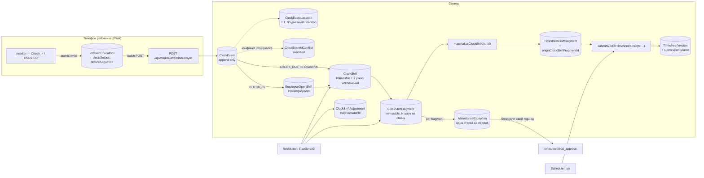
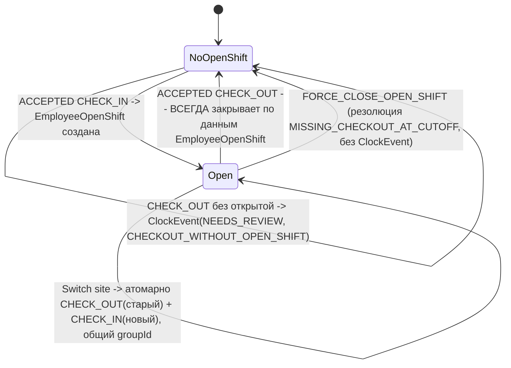
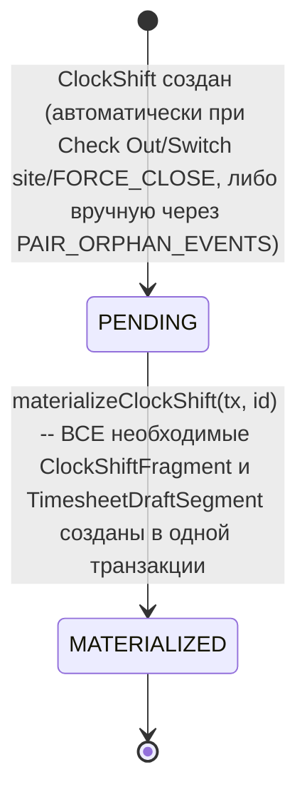
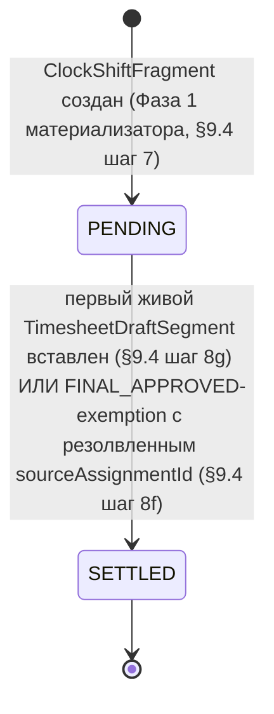

# T7A.1 — Design Checkpoint (REVISION 3 + 3.1 + 3.2 + 3.2.1 + 3.2.2 + 3.2.3 + 3.2.4 + 3.2.5 ADDENDA): Attendance Clock, GPS, Offline-First

Titanor Time · ЭТАП 7A · только проектирование · схема НЕ создана, migration НЕ создана

---

> **Статус: УТВЕРЖДЕНО ВЛАДЕЛЬЦЕМ 2026-08-12.** Revision 3.2.5 архитектурно утверждена владельцем
> как основа для T7A schema foundation. Design checkpoint закрыт этим docs-коммитом; Prisma-схема,
> migration, API и UI по этому документу **всё ещё не созданы** — утверждение архитектуры не есть
> её реализация.
>
> **Зафиксированные решения владельца при утверждении (2026-08-12):**
> 1. Revision 3.2.5 утверждается архитектурно после правок, перечисленных ниже в этом статус-блоке
>    (все применены до утверждения, см. addendum revision 3.2.5 и §17, тест #121).
> 2. **Raw GPS retention** (§18.1): 90 дней принимается как **provisional development default**;
>    значение остаётся изменяемым без переделки основной модели (изолированная `ClockEventLocation`,
>    параметризованный retention-джоб, §2.1 п.4/§4.1); **legal/privacy review и корректная
>    формулировка согласия работника обязательны до production-пилота (T7A.10)** — это единственный
>    пункт, остающийся открытым после утверждения (§18.1), и **не блокирует** schema foundation или
>    T7A.2.
> 3. **Conflict/sequence anomalies** (было §18.2): отдельная сложная страница для первого пилота не
>    нужна; `ADMIN`/`SUPER_ADMIN` должны видеть минимальный список/секцию этих аномалий в
>    операционном обзоре T7A.9 (`ClockEventIdConflict`/`DeviceEventReceipt(REJECTED_TERMINAL)`,
>    `FIFO_LEDGER_INCONSISTENT`-класс `AuditEvent`); `FOREMAN` raw conflict payload не получает
>    (`attendance.conflict.read` не выдаётся `FOREMAN` ни при каких обстоятельствах, без изменений).
>    Решение отражено в §16 (декомпозиция) и `PROJECT_ROADMAP.md`; UI **не реализуется в этом
>    документе** — это решение только сужает будущий T7A.9 slice, не открывает его сейчас.
> 4. **Обязательная правка теста №121** (§17): исправлен ошибочный вывод «старая смена остаётся
>    закрытой на СТАРОМ сайте» на правильный «старая смена остаётся **открытой** на СТАРОМ сайте» —
>    при неуспешном Switch Site старая открытая смена не закрывается (`GROUP_TERMINAL` откатывает
>    `group_sp` целиком, включая уже применённую `CHECK_OUT`-половину, если она успела примениться).
>    Формулировка теперь согласована с тестами #86/#96/#111, которые уже описывали это верно.
> 5. **Точечное выравнивание формулировок тестов №1/№3/№7** (§17, docs-fix 2026-08-12, без изменения
>    архитектуры): тест №1 — формулировка сценария уточнена на «при доступной сети всё время» (это
>    online-путь, не offline); тест №3 — явно указано, что все элементы батча успели получить
>    `outcome=ACCEPTED` до потери HTTP-ответа, и что повторный `ACCEPTED` при replay — исход именно
>    для этого случая, а не общее правило для любого повтора (терминально отклонённые события отвечают
>    `REJECTED` с исходным `rejectionCode`, §9.11 Проход B, тесты #45/#121); тест №7 — прежний
>    хардкод часов заменён ссылкой на настраиваемое поле `CompanyAttendancePolicy.
>    maxShiftDurationHours` (default 16ч), соответствующее уже принятому §18/issue 10 значению.
>
> **Ветка:** `feature/titanor-time-foundation` · **HEAD на момент утверждения:** `5c16507`
> **Не создано и не изменено этим документом:** `prisma/schema.prisma`, migrations, API, UI, seed,
> production.
>
> Документ полностью самодостаточен. Ни одна из revision 3.1/3.2/3.2.1/3.2.2/3.2.3/3.2.4/3.2.5 **не
> переписывает** документ целиком — каждая исправляет точечные остаточные блокеры предыдущего ревью,
> интегрированные прямо в соответствующие параграфы (revision 3.1 помечена `[3.1]`, revision 3.2 —
> `[3.2]`, revision 3.2.1 — `[3.2.1]`, revision 3.2.2 — `[3.2.2]`, revision 3.2.3 — `[3.2.3]`, revision
> 3.2.4 — `[3.2.4]`, revision 3.2.5 — `[3.2.5]`). **`[3.2.5]`** — узкий close-out pass: архитектура
> 3.2.4 НЕ пересматривается, исправлены только 6 точечных остаточных проблем, найденных повторным
> ревью (см. addendum ниже), плюс тест №121 (правка владельца при утверждении, см. выше).

**Точный объём схемы (после 3.2.5)**: **13 новых таблиц** (без изменений с 3.1 — `DeviceEventReceipt`
остаётся 13-й, §2.1 п.13), **7 существующих pre-T7A моделей** получают в сумме **9 новых колонок**
(без изменений — ни одна из 3.1–3.2.5 не добавляет колонок на pre-T7A моделях, только constraints,
см. §2.2), плюс **6 новых колонок** на собственных таблицах revision 3 в сумме
(`ClockShift.endAtProvisional`, `WorkerDeviceInstallation.lastProcessedSequence`,
`CompanyAttendancePolicy.maxShiftDurationHours` — revision 3/3.1; `AttendanceException.
relatedClockShiftId` — 3.2; `AttendanceException.overlapEndedAt` — 3.2.2;
`ClockShiftFragment.reportedProjectionState` — 3.2.4, issue 2). **`[3.2.5]`** добавляет **ни одной
новой таблицы, ни одной новой колонки** — только (а) расширяет prerequisite-проверку внутри уже
существующей DB-функции `fn_clock_shift_fragment_immutable()` (issue 4 — не новый триггер, issue 6);
(б) исправляет имя поля в прозе/тестах на уже правильное имя модели `ClockShiftAdjustment.
changedByUserId` (issue 5 — модель не менялась, только описание); (в) добавляет новый
`rejectionCode='SWITCH_SITE_GROUP_INVALID'` — то же самое поле `DeviceEventReceipt.rejectionCode`
(`varchar(64)`, не enum), новое ЗНАЧЕНИЕ, не новая колонка (issue 3). Revision 3.2.3 не добавила ни
одной новой таблицы/колонки — только (а) `ux_attendance_exception_overlap_pair_open` переопределён с
expression-индекса (`LEAST`/`GREATEST`) на обычный индекс над буквальными колонками, канонизация
перенесена на `INSERT` (issue 5); (б) CHECK на `AttendanceException` расширен (`overlapEndedAt IS
NULL` для не-`OVERLAPPING_SHIFT`, `status='OPEN' ⇒ overlapEndedAt IS NULL`, issue 7); (в) `detail`
(уже существующий jsonb) получил документированный ключ `triggeringClockShiftId` для
`OVERLAPPING_SHIFT` — тот же столбец, новое использование, не новая колонка. Revision 3.2.4 добавила
ровно одну новую колонку (`ClockShiftFragment.reportedProjectionState`) и ни одной новой таблицы.
Revision 3.2.1 не добавила ни одной новой таблицы/колонки; revision 3.2.2 добавила ровно одну
(`overlapEndedAt`). Точное перечисление, включая полный, синхронизированный между §16 и финальным
блоком пересчёт composite FK/trigger-биндингов (issue 6) — §2, §16, финал.

## Revision 3.2.5 ADDENDUM — компактная таблица «problem → exact fix»

| # | Проблема (revision 3.2.4) | Точное исправление (revision 3.2.5) | Где интегрировано |
|---|---|---|---|
| 1 | §9.11 Проход B: точный повтор (совпадающий `payloadHash`) ВСЕГДА возвращал `DUPLICATE_ACK`, независимо от исходного `receipt.outcome` — критично для `REJECTED_TERMINAL`: switch-site группа была отклонена (`SWITCH_SITE_GROUP_FAILED`), HTTP-ответ потерялся, клиент повторяет — сервер отвечает `DUPLICATE_ACK`, клиент может решить, что switch принят, хотя БД оставила старую смену открытой | Replay воспроизводит ИСХОДНЫЙ `receipt.outcome`: `ACCEPTED` → `DUPLICATE_ACK` с исходным `ClockEvent.processingState`; `REJECTED_TERMINAL` → `REJECTED` с исходным `rejectionCode` (**не** `DUPLICATE_ACK`); никогда не меняет ранее принятое terminal-решение; никакой новой мутации | §9.11, тест #45 (исправлен), #121 |
| 2 | §6 заявляла, что обе половины группы всегда одновременно `PENDING`/`ACKED`/`FAILED_TERMINAL`, но response-handler применял результат «на каждый `clientEventId`» отдельно — краш между применением двух половин мог оставить одну `ACKED`, другую `PENDING` | `applyGroupResponse(groupId, results[])` — результаты ОБЕИХ половин применяются ОДНОЙ IndexedDB-транзакцией; смешанный/неполный ответ — ambiguous, ни одна половина не трогается; краш между обновлением половин невозможен (одна транзакция) | §6, тест #122 |
| 3 | Любая неправильная group-структура классифицировалась единым `RETRYABLE`/`SWITCH_SITE_GROUP_INCOMPLETE` — навсегда блокировала FIFO, даже когда данные, УЖЕ присутствующие в батче, детерминированно противоречат структуре (не «просто нет данных») | Разделено: `SWITCH_SITE_GROUP_INCOMPLETE` — только когда позиция N+1 отсутствует в батче (недостаточно данных, `BREAK`, ждём); `SWITCH_SITE_GROUP_INVALID` — детерминированно повреждённый протокол (первым пришёл grouped `CHECK_IN`; N+1 присутствует с неверным `operationType`/`groupId`); `DeviceEventReceipt(REJECTED_TERMINAL)` пишется, `high-water` продвигается на точное число терминализированных half, FIFO **продолжается** | §9.11, §7, §2.1 (`rejectionCode`), тесты #123–125 |
| 4 | DB-триггер `fn_clock_shift_fragment_immutable()` запрещал только `SETTLED→PENDING`, но НЕ проверял prerequisite для `PENDING→SETTLED` — прямой SQL мог поставить `SETTLED` преждевременно, после чего materialization gate доверял бы ложному состоянию | При `PENDING→SETTLED` триггер теперь проверяет: `sourceAssignmentId IS NOT NULL` **и** (существует настоящий `TimesheetDraftSegment` в правильном `timesheet`/дате **или** `Timesheet.status=FINAL_APPROVED`) — любой другой переход отклоняется | §2.1, §4.1, тесты #126–128 |
| 5 | Addendum/§15/тест #119 использовали `actorUserId` для `ClockShiftAdjustment` — модель определяет `changedByUserId` (сама модель, §2.1 п.8, была названа верно с 3.1 — ошибка только в прозе 3.2.4) | Исправлено везде на `changedByUserId`; `SYSTEM_USER_ID` остаётся только актором авто-resolution `AuditEvent` (параметр `resolveOverlapTransition`), не автором человеческой корректировки | §15, тест #119 (исправлен) |
| 6 | §16 сохраняла stale «12 таблиц / 7 триггеров / 3 composite FK» — противоречило финальному блоку; финальный блок сам ошибочно называл расширение существующей функции «новым триггером» в 3.2.4 | §16 синхронизирован с финальным блоком: 13 таблиц, 9+6 additive-колонок, ~~**15**~~ composite FK (полный пересчёт по §2.1/§2.2 — **это был первоначальный ошибочный подсчёт revision 3.2.5, сам пропустивший `ClockEvent.workAreaId` composite FK из собственного §2.1 п.3; superseded owner correction 2026-08-12, окончательное реализованное значение — 16, см. «Правка владельца — composite FK arithmetic» в финальном блоке**), **14** `CREATE TRIGGER`-биндингов (стабильно с 3.1) с явным различением от расширений тел существующих функций | §16, финал |
| — | — | 8 новых тестов (#121–128) + 6 исправленных формулировкой/исходом (#45, #70, #87, #102, #104, #119) | §17 |

## Revision 3.2.4 ADDENDUM — компактная таблица «problem → exact fix»

| # | Проблема (revision 3.2.3) | Точное исправление (revision 3.2.4) | Где интегрировано |
|---|---|---|---|
| 1 | §9.11 «Область действия»: если в текущем batch-attempt присутствует только ОДНА половина `groupId`'d события, она обрабатывается как обычное самостоятельное событие своего типа — если это была `CHECK_OUT`-половина, старый объект реально закрывался ДО получения `CHECK_IN`-половины (потерянным/отложенным batch'ем) — end-to-end атомарность switch-site всё ещё нарушена | Событие с non-null `groupId` **НИКОГДА** не обрабатывается одиночным путём: либо образует валидную пару (соседние `deviceSequence`, общий `groupId`, `CHECK_OUT`→`CHECK_IN`) и получает групповую обработку (`group_sp`, без изменений), либо весь ПРОХОД A останавливается на этом событии — `SWITCH_SITE_GROUP_INCOMPLETE` (тот же примитив, что `SEQUENCE_GAP`): нет `ClockEvent`, нет `DeviceEventReceipt`, `high-water` не продвигается. Единая fail-closed семантика для ЛЮБОЙ формы «группа неполна/неправильна» (нет пары / неверный порядок / несовпадающий `groupId`/`deviceSequence`). Клиент (§6): обе половины — одна IndexedDB-транзакция; `batch-builder` никогда не режет группу границей batch; retry всегда отправляет всю ещё не подтверждённую группу | §6, §7, §9.3, §9.11, тесты #109–114 |
| 2 | `effectiveReportedRanges` решала raw-fallback ПО `ClockShift.materializationState` целиком — неверно для многопериодной смены: фрагмент A уже `SETTLED` (`FINAL_APPROVED`-exempt), фрагмент B ещё `PENDING` (`STALE_ASSIGNMENT`) — `ClockShift.materializationState` остаётся `PENDING` целиком из-за B, и раньше это ошибочно давало raw fallback и для A | Новая колонка `ClockShiftFragment.reportedProjectionState` (`PENDING`\|`SETTLED`, one-way DB-триггер) — решение per-fragment, не per-shift; `effectiveReportedRanges` и MATERIALIZED-гейт (§9.4 шаг 9, §4.1) теперь читают её напрямую — гейт заметно проще; `REASON_EDIT`-eligibility (§9.1a, §11) тоже переведена на per-fragment | §2.1, §3, §4.1, §9.1a, §9.4, §11, тест #115 |
| 3 | `overlapCandidates` полагался на недоказанное допущение (72ч padded raw-window) — ни `patchWorkerTimesheetDay`, ни correction-flow, ни DB `CHECK` не ограничивают, насколько reported-правка может увести диапазон от raw | Padding убран; `overlapCandidates` — полный скан всех `ClockShift` работника + пакетная загрузка `effectiveReportedRanges` (без N+1) + authoritative `overlapExists`; существующие `OPEN`/`DISMISSED` пары включены в тот же helper; §10.2/§15 теперь буквально вызывают общий helper, не дублируют собственный `UNION`-запрос; вызывающие вычисляют `afterOverlaps` явно (`overlapExists`), не предполагают `true` безусловно | §9.1a, §9.2, §9.4, §10.2, §15, тест #104 (исправлен), #116 |
| 4 | `affectedShiftIds` (§10.2 шаг 6) строился как «X из шага 2, changeType EDITED/RESTORED/REMOVED» — структурно не мог включать `REMOVED` (он заводится шагом 3 именно потому, что X ОТСУТСТВУЕТ среди входящих `segments[]`, то есть никогда не элемент «шага 2») — удалённый clock-origin сегмент никогда резолвил связанный `OPEN` overlap. Та же ошибка в `correction.approve` — `affectedShiftIds` только из НОВЫХ `CorrectionDraftSegment`, без before-origins | `affectedFragmentIds := beforeOriginFragmentIds ∪ afterOriginFragmentIds` — REMOVED теперь всегда входит через объединение, не через шаг 2; та же схема для `correction.approve` (before = текущая `WorkSegment`-версия, after = замораживаемые `CorrectionDraftSegment`); `correction.approve` дополнительно пишет `ClockShiftAdjustment(EDITED/REMOVED/RESTORED_TO_RECORDED)` с реальным `changedByUserId`/`reason`, как и worker `PATCH`; провенанс копируется при открытии correction draft (тот же паттерн, что `reinitializeDraftFromVersion`) и валидируется при его `PATCH` | §10.2, §15, тесты #117–120 |
| 5 | Тесты #70/#87/#102/#104 всё ещё описывали superseded-механизмы 3.2.2/3.2.3 (expression-index/targetless `ON CONFLICT`, `materializationState`-based fallback, 72ч padding как ограничение, не оптимизация) | Формулировки приведены к текущему (3.2.4) дизайну: canonical columns + explicit conflict target; `reportedProjectionState`; полный скан без padding — сценарии/результаты тестов не изменились, изменилось только описание МЕХАНИЗМА | §17 |
| — | — | 12 новых тестов (#109–120) + 4 исправленных формулировкой (#70, #87, #102, #104) | §17 |

## Revision 3.2.3 ADDENDUM — компактная таблица «problem → exact fix»

| # | Проблема (revision 3.2.2) | Точное исправление (revision 3.2.3) | Где интегрировано |
|---|---|---|---|
| 1 | `runPreflight` относил `DOUBLE_CHECK_IN`/`CHECKOUT_WITHOUT_OPEN_SHIFT` к `preflight.terminal` — `REJECTED_TERMINAL` **без** `ClockEvent`, противоречило принятому §9.1/§9.2 поведению (raw-факт обязан сохраняться, `AttendanceException` заводится, receipt — `ACCEPTED`) | Явная классификационная матрица (`ACCEPTED_NORMAL`/`ACCEPTED_NEEDS_REVIEW`/`REJECTED_TERMINAL_WITHOUT_CLOCK_EVENT`/`RETRYABLE`); проверка наличия `EmployeeOpenShift` перенесена из `preflight` внутрь `applyBusinessEffects`, где она и должна была быть; `runPreflight` сужен до действительно решаемого без мутации (schema/ownership/GPS/`VERIFIED_OUTSIDE`-на-`CHECK_IN`) | §9.11, §7 |
| 2 | «Атомарность каждой половины switch-site по отдельности» (3.2.2) — `CHECK_OUT` мог сохраниться, а `CHECK_IN` потеряться, оставляя работника нигде не отмеченным; тест #86 закреплял это как правильное поведение | Групповая обработка: обе половины, если соседние в одном batch-attempt, делят один `group_sp` — вместе фиксируются, вместе откатываются; `high-water` продвигается на обе `deviceSequence` атомарно; `GROUP_TERMINAL` даёт детерминированный `REJECTED`/`SWITCH_SITE_GROUP_FAILED` для ОБЕИХ; CHECK_IN-half видит уже спроецированное (post-CHECK_OUT) состояние по построению (программный порядок внутри `group_sp`) | §9.3, §9.11, §7, тест #86 (исправлен), #95–98 |
| 3 | `effectiveReportedRanges` при пустой authoritative-проекции ВСЕГДА откатывалась к raw-диапазону фрагмента — реинтродуцировала удалённое/`FINAL_APPROVED`-exempted время как ложный overlap | Fallback обусловлен `ClockShift.materializationState`: `PENDING` (фрагмент ещё ожидает первую projection) — provisional raw fallback легитимен; `MATERIALIZED` (гейт уже пропустил смену) — пустая проекция авторитетна, пустой вклад, без fallback | §9.1a, тест #102 |
| 4 | `beforeOverlaps`/`afterOverlaps` для кандидата, который сам тоже редактируется той же транзакцией, читали его диапазоны ПОСЛЕ мутации для ОБЕИХ сторон сравнения — асимметрия "before(A) vs after(B)" | `candidateBeforeRanges` берётся из уже существующего `beforeRangesByShift`, если кандидат сам входит в `affectedShiftIds`; `processedPairs` гарантирует ровно одну обработку canonical-пары | §10.2 шаг 6, §15 п.7, тест #103 |
| 5 | Expression-индекс `LEAST`/`GREATEST` + **targetless** `ON CONFLICT DO NOTHING` — проглатывает конфликт по ЛЮБОМУ constraint'у таблицы, не только по overlap-паре | Канонизация на `INSERT` (`clockShiftId:=LEAST`, `relatedClockShiftId:=GREATEST`); обычный partial unique; explicit `ON CONFLICT (clockShiftId, relatedClockShiftId) WHERE ... DO NOTHING`; «кто вызвал» — в `detail.triggeringClockShiftId`, не в порядке колонок | §2.1, §9.1a, §8.3, §11, тест #108 |
| 6 | Кандидаты overlap в §9.2 отбирались ТОЛЬКО по raw `recordedStartAt`/`recordedEndAt` — не correctness-safe при reported-правке, уводящей диапазон от raw; `w.versionId` — несуществующее поле (реальное имя — `timesheetVersionId`, `prisma/schema.prisma`) | Общий `overlapCandidates(X)` — padded (72ч) raw-window pre-filter + authoritative `overlapExists`-подтверждение, используется §9.2/§9.4/§10.2/§15; `w.versionId` исправлено на `w.timesheetVersionId` везде | §9.1a, §9.2, тест #90 (исправлен), #104 |
| 7 | Автопереход `OPEN→RESOLVED` не устанавливал `resolvedAt`; DB `CHECK` не запрещал `status='OPEN' AND overlapEndedAt IS NOT NULL` | `resolvedAt=now()` добавлен в `UPDATE`; `CHECK (status != 'OPEN' OR overlapEndedAt IS NULL)`; ветка `DISMISSED`+physically-ended явно НЕ трогает `resolvedAt`/`resolvedByUserId`/`resolutionNote` человека | §2.1, §9.1a, тест #105–107 |
| — | — | 14 новых тестов (#95–108) + 2 исправленных (#86, #90) | §17 |

## Revision 3.2.2 ADDENDUM — компактная таблица «problem → exact fix»

| # | Проблема (revision 3.2.1) | Точное исправление (revision 3.2.2) | Где интегрировано |
|---|---|---|---|
| 1 | §9.11: `processNormally(event)` выполнялся внутри `event_sp`, затем **безусловный** `ROLLBACK TO SAVEPOINT` — уничтожал `EmployeeOpenShift`/`ClockShift`/`ClockEventLocation`/`AttendanceException`/материализацию/`AuditEvent` даже на успешном (`ACCEPTED`) пути; повторная вставка одного `ClockEvent`+`DeviceEventReceipt` не восстанавливала бизнес-состояние | `ClockEvent` вставляется ПЕРВЫМ контролируемым write (`ON CONFLICT(id) DO NOTHING`); все бизнес-эффекты выполняются в том же savepoint; `RELEASE` (не `ROLLBACK`) на успешном пути и на PK-конфликте с чужим событием; `ROLLBACK TO SAVEPOINT` только на ожидаемой terminal business-ошибке, обнаруженной после insert; неожиданная ошибка пробрасывается, откатывая всю outer-транзакцию попытки; после исчерпания retry — `HTTP 503 INGESTION_RETRY_EXHAUSTED`, не `500` | §9.11 (переписан) |
| 2 | Partial unique `(clockShiftId, relatedClockShiftId) WHERE status='OPEN'` — упорядоченный индекс; конкурентные `resolveOverlapTransition(A,B)`/`(B,A)` создавали ДВЕ одновременные `OPEN`-строки одной логической пары | `ux_attendance_exception_overlap_pair_open` — expression index на `(LEAST(clockShiftId,relatedClockShiftId), GREATEST(...))`; `canonicalPair`-lookup в `resolveOverlapTransition`; targetless `ON CONFLICT DO NOTHING`; семантика «кто есть кто» для `REASON_EDIT` больше не выводится из позиции колонок — динамическая проверка `materializationState` | §2.1, §9.1a, §11, §8.3 (Инвариант 3 таблица) |
| 3.1 | `latestRow.status IN ('OPEN','DISMISSED')` считался одним и тем же occurrence навсегда — реинтродукция после `DISMISS` не создавала новую `OPEN` | `overlapEndedAt` колонка — фиксирует момент физического окончания occurrence независимо от `status`; `(false,true)` создаёт новую строку только если `latestRow` отсутствует/`RESOLVED`/`DISMISSED`-с-`overlapEndedAt` | §2.1, §9.1a |
| 3.2 | `effectiveReportedRange` — одна огибающая `[MIN,MAX)` по всем сегментам смены — ложный overlap в промежутках без заявленной работы | `effectiveReportedRanges` — МНОЖЕСТВО half-open диапазонов, по одному на фрагмент/сегмент, `overlapExists` проверяет попарное пересечение множеств | §9.1a |
| 3.3 | Объединялись сегменты из ЛЮБОЙ версии/незамороженного correction draft — старая исправленная `WorkSegment`-версия могла навсегда сохранять ложный overlap | Ровно одна authoritative проекция на фрагмент: live `TimesheetDraftSegment` (DRAFT/RETURNED) либо `WorkSegment` строго по `currentVersionId` (SUBMITTED+); `CorrectionDraftSegment` не authoritative до approval | §9.1a |
| 3.4 | Переход выводился из одного `latestRow.status` — не различал «before» и «after» | Явные `beforeOverlaps`/`afterOverlaps`, вычисляемые КАЖДЫМ call site (snapshot до мутации в §10.2/§15 п.7; литерал `false` для материализатора/Check Out) | §9.1a, §9.2, §9.4, §10.2, §15 |
| 4 | Live-segment EXISTS-проверка gate'а сверяла только голую FK-колонку `originClockShiftFragmentId = f.id`, не проверяя, что сегмент лежит в правильном `TimesheetDraft`/на правильную дату | `JOIN TimesheetDraft d ON d.id=s.draftId ... AND d.timesheetId=f.timesheetId AND s.date=f.date` — синхронизировано между сервисным `UPDATE` и DB-триггером | §4.1, §9.4 шаг 9 |
| — | — | 14 новых тестов (#81–94) | §17 |

## Revision 3.2.1 ADDENDUM — компактная таблица «problem → exact fix»

| # | Проблема (revision 3.2) | Точное исправление (revision 3.2.1) | Где интегрировано |
|---|---|---|---|
| 1 | Materialization gate: топ-уровневый `AND t.status <> 'FINAL_APPROVED'` гасил (short-circuit'ил) проверку `sourceAssignmentId IS NULL` для `FINAL_APPROVED`-фрагментов — такой фрагмент с `sourceAssignmentId=NULL` НЕ блокировал материализацию (ошибочно разрешал); `NOT EXISTS` над пустым набором фрагментов тривиально проходил (нуль фрагментов — «MATERIALIZED») | `sourceAssignmentId IS NULL` вынесен в безусловную топ-уровневую ветку `OR` (не гасится статусом); `EXISTS`-guard на отсутствие фрагментов вообще; идентичная формула продублирована как DB-level enforcement — расширение `BEFORE UPDATE` триггера `fn_clock_shift_immutable()` на переходе `PENDING→MATERIALIZED`, не обходимо прямым SQL/багом сервисного кода | §4.1, §9.4 шаг 9 |
| 2 | §9.11 утверждал одну транзакцию на весь batch И «`ROLLBACK` текущего события» при `FIFO_LEDGER_INCONSISTENT`, сохраняя при этом предыдущие события батча и `AuditEvent` — невозможно без `SAVEPOINT`, определения которого не было | Явная двухпроходная `SAVEPOINT`-модель: Проход A — строго последовательное продвижение `current` с `SAVEPOINT` на событие, останов на первом `SEQUENCE_GAP`; Проход B — независимая резолюция уже пройденных номеров (`DUPLICATE_ACK`/`DEVICE_SEQUENCE_REUSED`/`FIFO_LEDGER_INCONSISTENT`), каждый в своём `SAVEPOINT`, никогда не откатывает уже `RELEASE`'нутую работу Прохода A; `FIFO_LEDGER_INCONSISTENT` пишет только контролируемый `AuditEvent`, НЕ откатывает outer-транзакцию; `COMMIT` outer-транзакции сохраняет всё | §9.11 (переписан) |
| 3 | Pair-unique действовал «навсегда» — переустановленное после auto-resolve пересечение не могло получить новую `OPEN`-строку; материализованная смена переставала перепроверяться | `UNIQUE(clockShiftId, relatedClockShiftId) WHERE type='OVERLAPPING_SHIFT' AND status='OPEN'` — блокирует только одновременные открытые дубли; исторические `RESOLVED`/`DISMISSED` сохраняются; общая функция `resolveOverlapTransition` (новый §9.1a) вызывается из ВСЕХ путей, меняющих reported-интервалы (worker `PATCH`/`REASON_EDIT`, materializer, **и `correction.approve`** — новый §15 п.7) | §2.1, §9.1a (новый), §9.2, §9.4, §10.2, §15 |
| 4 | §8.3 утверждал полное покрытие «конфликтующий `INSERT` уже сериализован локом-предком» без исключений — ложно для глобального, без scoping-ключа `ClockEvent.id` PK: два батча разных `employeeId`/`deviceInstallationId` не разделяют общий лок-предок, теоретически возможен настоящий `deadlock` (`40P01`) | Явное, не молчаливое исключение: Инвариант 3 не распространяется на `ClockEvent.id` PK; выбран вариант (A) — bounded retry (до 3 попыток, экспоненциальный backoff) всей ingestion-транзакции на `40P01`/`40001` с тем же `clientEventId`/`payloadHash`; плюс `INSERT ... ON CONFLICT (id) DO NOTHING RETURNING id` на самой вставке `ClockEvent` для non-deadlock подслучая (проигранная гонка без ожидания) | §8.3, §9.11 |
| — | — | 10 новых тестов (#71–80) | §17 |

## Revision 3.2 ADDENDUM — компактная таблица «problem → exact fix»

| # | Проблема (revision 3.1) | Точное исправление (revision 3.2) | Где интегрировано |
|---|---|---|---|
| 1 | Gate-формула `materializationState='MATERIALIZED'` исключала `sourceAssignmentId IS NULL` из блокирующего условия — мог материализоваться `ClockShift` с неразрешённым `STALE_ASSIGNMENT` | Исправленная формула: блокирует при `sourceAssignmentId IS NULL` ИЛИ отсутствии live-сегмента, для любого не-`FINAL_APPROVED` фрагмента, независимо от причины (включая новый precheck `DAY_TYPE_CONFLICT`) | §9.4, шаг 8g/9 |
| 2 | Ветка «generation mismatch / not due» вставляла `AutoSubmissionAttempt` для непроверенной `fresh.systemReopenGeneration` — могла навсегда «занять» слот будущей генерации до её реального cutoff | Ветки (e)/(f) — `COMMIT` без единой вставки; `AutoSubmissionAttempt` пишется только в ветках (g)/(h)/(i), где генерация подтверждена под локом как текущая и (не)due | §9.6 |
| 3 | `MISSING_CHECKOUT_AT_CUTOFF` создавался для любой открытой смены независимо от её реальной связи с периодом | Half-open проверка `openedAt < periodEndExclusive(P)` — смена, открывшаяся уже после конца периода P, не блокирует P | §9.6 |
| 4 | `OVERLAPPING_SHIFT` не имел identity конкретной пары — `DISMISSED`/`RESOLVED` по одной смене в целом ошибочно разрешал бы ЛЮБОЕ будущее пересечение | `AttendanceException.relatedClockShiftId` + partial `UNIQUE(clockShiftId, relatedClockShiftId)` — решение только по конкретной паре; матрица §11 очищена от внутреннего противоречия (`ACKNOWLEDGE_AS_VALID` больше нигде не упоминается для этого типа) | §2.1, §9.2, §9.4, §10.2, §11 |
| 5 | Границы фрагментов/периодов не были явно half-open; `CHECKOUT_CHRONOLOGY_ANOMALY` clamp `+1 minute` мог перенести provisional-конец через границу периода | Явные half-open `[start, end)` везде; `periodEndExclusive(P)`; fragment-planning — цикл с доказанной невозможностью нулевой длины; clamp `+1 microsecond` | §9.2, §9.4 |
| 6 | `[3.1]`-recovery «receipt не найдена → доиграть как current-1» могла повторно обработать уже завершённый номер, тихо ослабляя ledger | Fail-closed: `FIFO_LEDGER_INCONSISTENT`, никаких мутаций, `AuditEvent` без координат/payload, восстановление — отдельная админ-процедура. Composite FK `ClockEvent(id,deviceInstallationId,employeeId,deviceSequence)` ← `DeviceEventReceipt` физически исключает расписку с чужим событием | §2.1, §9.11 |
| 7 | Внутренние противоречия: заголовок §2.1 «Двенадцать» при 13 сущностях; хардкод «24 часа» рядом с полем `maxShiftDurationHours=16`; матрица запрещала `ACKNOWLEDGE_AS_VALID`, а проза его же предлагала; §8.3 утверждал «`INSERT` никогда не блокируется» | Заголовок исправлен на «Тринадцать»; единственное упоминание — `16`; матрица и проза синхронизированы (см. #4); добавлен Инвариант 3 §8.3 — ожидание при `INSERT` всегда подразумевается локом-предком, не создаёт нового ребра | §2.1, §8.3, §11 |
| 8 | — | 20 новых тестов (#56–70 плюс исправление теста #52) | §17 |

## Revision 3.1 ADDENDUM — компактная таблица «problem → exact fix»

| # | Проблема (revision 3) | Точное исправление (revision 3.1) | Где интегрировано |
|---|---|---|---|
| 1 | Coverage-триггер `FOR EACH STATEMENT` требует один multi-row `INSERT`, но §9.4 вставлял фрагменты по одному в цикле — первая же частичная вставка отклонялась триггером | Материализатор сначала вычисляет **весь** план фрагментов, затем вставляет **все отсутствующие** одним multi-row `INSERT ... ON CONFLICT DO NOTHING`; повторный проход после `STALE_ASSIGNMENT` читает уже существующие фрагменты и не пытается вставить их снова | §9.4 (переписан) |
| 2 | Не было composite FK, связывающих `ClockShiftFragment`/`ClockShiftAdjustment` с `ClockShift`/`Timesheet`/`WorkArea`/`SiteAssignment`; worker `PATCH` не проверял, что `originClockShiftFragmentId` принадлежит именно этому табелю/дню | 5 новых composite FK (§2.1 п.7/8, §2.2); `PATCH` требует `fragment ∈ previousLive` — тот же самый live-фрагмент этого дня, не произвольный чужой | §2.1, §2.2, §10.2 |
| 3 | `MISSING_CHECKOUT_AT_CUTOFF` резолюция была описана, но нигде не создавалась | Создаётся внутри auto-submit транзакции при обнаружении `EmployeeOpenShift`; dedup `UNIQUE(openedByClockEventId, payrollPeriodId)`; поздний реальный Check Out авто-резолвит | §9.6 (переписан) |
| 4 | `CHECKOUT_CHRONOLOGY_ANOMALY` блокировал материализацию → исключение без `clockShiftFragmentId` → `REASON_EDIT` требует `clockShiftFragmentId` → неразрешимый тупик | `ClockShift.endAtProvisional` — материализация ВСЕГДА проходит с provisional-значением; исключение получает реальный `clockShiftFragmentId`; `REASON_EDIT` правит reported-значение, raw/provisional остаются нетронутыми навсегда | §2.1, §9.2, §11 |
| 5 | `deviceSequence` был чисто диагностическим — два параллельных `sync` одного устройства могли обработать события не по порядку | `WorkerDeviceInstallation.lastProcessedSequence` + `WorkerDeviceInstallation FOR UPDATE`; новая `DeviceEventReceipt` — permanent ledger для каждого номера последовательности, включая terminal-отклонения (не блокирует устройство навсегда) | §2.1 п.13, §9.11 (новый) |
| 6 | `UNIQUE(timesheetId, cutoffAt)` не давал повторно auto-submit'иться после reopen; смена policy теоретически могла столкнуть generations | `UNIQUE(timesheetId, systemReopenGeneration)` — cutoffAt остаётся audit-полем, не identity | §2.1 п.12, §9.6 |
| 7 | Не все объявленные immutable/singleton таблицы имели DB-триггер | Триггеры на `ClockEventLocation` (UPDATE-блок + retention-window DELETE-guard), `AutoSubmissionAttempt` (полный блок), `CompanyAttendancePolicy` (DELETE-блок); `CHECK` на `ClockEventIdConflict` против координат в jsonb; `CHECK`+partial unique на `User` для формы SYSTEM | §4.1 (расширен) |
| 8 | Обычный offline Check Out мог создать `ClockShift`, пересекающийся по времени с уже существующей сменой того же работника — проверка была только в `PAIR_ORPHAN_EVENTS` | Проверка overlap добавлена в обычный путь закрытия (§9.2); новый тип `OVERLAPPING_SHIFT`, не материализуется автоматически до резолюции | §3, §9.2, §11 |
| 9 | Не описано поведение materializer'а при `templateVersionId=NULL`/отсутствующем `TimesheetDraftDay` | `templateVersionId` nullable на `SiteAssignment` уже сегодня → planned snapshot с `NULL`-полями; `TimesheetDraftDay` — find-or-fail (не find-or-create), не перезаписывает `dayType`/`Absence`-данные | §9.4 |
| 10 | Owner defaults не были явно приняты как основа | Приняты: GPS retention 90 дней (provisional, до legal review), debounce 30 минут, `maxShiftDurationHours` = поле `CompanyAttendancePolicy` со стартовым значением 16, conflict/sequence-аномалии видны только `ADMIN`/`SUPER_ADMIN`, timezone заморожена, `FOREMAN` без forced edit в v1 | §2.1 п.11, §18 |

---

## 0. Что изменилось относительно revision 2 (сводка)

| # | Проблема revision 2 | Исправление revision 3 |
|---|---|---|
| 1 | Документ ссылался на «revision 1» вместо полного изложения; заявленное число таблиц (10) не совпадало с фактическим перечнем (11) | Каждый раздел ниже самодостаточен; точный счёт — 12 таблиц, 9 колонок на 7 моделях (см. врезку выше и §2) |
| 2 | `SOLE`/`FIRST_PART`/`SECOND_PART` — некорректная модель: допускала противоречивые комбинации, не масштабировалась дальше двух частей, `ClockShiftAdjustment` не различал часть | Новая immutable `ClockShiftFragment` — общая fragment-модель, `fragmentIndex` не ограничен двумя значениями, `ClockShiftAdjustment` ссылается на `clockShiftFragmentId` (§2.1, §7) |
| 3 | Один `AttendanceException` с одним `payrollPeriodId` не может блокировать два периода одновременно | Отдельная строка `AttendanceException` на каждый затронутый `timesheetId`/`payrollPeriodId`, объединённые общим `clockShiftId` для отображения (§2.1, §9.3) |
| 4 | `UNIQUE(timesheetId, cutoffAt)` навсегда блокировал повторный auto-submit после system reopen; `SKIPPED_NOT_ACTIONABLE` не имел условия создания; catch-and-continue после UNIQUE violation — невалидная Postgres-семантика | `Timesheet` получает `lastReturnedReason`/`systemReopenGeneration`/`systemReopenAt`; cutoff для новой генерации = `systemReopenAt + debounce`; `HUMAN_REVIEW_RETURN` даёт `SKIPPED_NOT_ACTIONABLE`; `INSERT ... ON CONFLICT DO NOTHING RETURNING` вместо catch-and-continue (§9.6) |
| 5 | Заявленный «Employee первым» порядок противоречил собственным же алгоритмам (materializer начинал с `ClockShift`, resolver — с `AttendanceException`) | Единый порядок с доказательством отсутствия циклов между «forward»- и «resolver»-формами транзакций (§8) |
| 6 | Отсутствовали composite FK для `WorkerDeviceInstallation`/`geofenceVersionId`; `clockSkewMs int` мог переполниться; не описан `DEVICE_SEQUENCE_REUSED` | Composite FK добавлены; `clockSkewMs bigint`; `DEVICE_SEQUENCE_REUSED` — тот же conflict-механизм, что `CLIENT_EVENT_ID_REUSED` (§2.1, §4) |
| 7 | `ClockEventIdConflict.conflictingPayload` мог хранить сырые координаты 6 лет, обходя retention `ClockEventLocation` | Payload санитизируется перед записью — `latitude`/`longitude` физически исключены той же функцией, что использует основной ingestion-путь (§2.1, §4) |
| 8 | Не было матрицы «тип исключения → допустимые действия»; `MISSING_CHECKOUT_AT_CUTOFF` мог быть тихо распущен, оставляя открытую смену | Полная матрица (§11); новое действие `FORCE_CLOSE_OPEN_SHIFT` (только `ADMIN`/`SUPER_ADMIN`); `STALE_ASSIGNMENT` запрещает `DISMISS`/`ACKNOWLEDGE` |
| 9 | `REASON_EDIT` вызывал бы существующий `PATCH /api/worker/...` от имени прораба/админа | Отдельный scoped endpoint, жёстко привязанный к origin-фрагменту конкретного `AttendanceException`, с обязательной причиной и реальным актором (§12.4); v1-рекомендация — только `ADMIN`/`SUPER_ADMIN` |
| 10 | Не рассмотрен случай `effectiveAt Check Out <= EmployeeOpenShift.openedAt` — риск отката закрытия из-за `CHECK` | Сервис вычисляет безопасный `recordedEndAt` (реальный либо clamped-placeholder) **до** `INSERT`, поэтому `CHECK` constraint физически никогда не отклоняет запись; закрытие доказуемо не откатывается (§9.2) |
| 11 | Не описан обязательный `TimesheetDraftPlannedShift`-prerequisite для вставки сегмента | Materializer явно находит-либо-создаёт плановую смену перед вставкой сегмента, переиспользуя существующую формулу генерации (§9.4) |
| 12 | SYSTEM-пользователь отличался только по `username`-паттерну — не структурный дискриминатор | `User.userKind: HUMAN \| SYSTEM`, `NOT NULL DEFAULT 'HUMAN'` (§13) |
| 13 | Не все immutable-таблицы имели явный `BEFORE UPDATE OR DELETE`-триггер | Полный набор триггеров для всех пяти immutable/append-only таблиц (§4) |
| 14 | — | Рекомендации владельца приняты как основа revision 3 (period boundary = split, SYSTEM = структурный дискриминатор, GPS retention = 90 дней без шифрования, timezone = заморожена, `PERIOD_BOUNDARY_SPAN` блокирует каждый период, foreman без прямого forced edit в v1, GPS-константы — pilot defaults) — см. §17 |

---

## 1. Архитектура



Ключевые структурные решения:

- Раздельные таблицы для **сырого факта** (`ClockEvent`, append-only, никогда не редактируется), **производного
  закрытого факта** (`ClockShift`, immutable с двумя явно поименованными исключениями), его
  **payroll-проекции** (`ClockShiftFragment`, по одной строке на каждый затронутый расчётный период) и
  **истории правок** (`ClockShiftAdjustment`, полностью immutable).
- Ровно один способ отправить табель — существующий `submitWorkerTimesheetCore`; auto-submit его
  переиспользует, а не дублирует.
- Никакого PostGIS — расстояние считается формулой Haversine в сервисном слое.

---

## 2. Таблицы и изменения моделей

### 2.1 Тринадцать новых сущностей — полные поля **`[3.2]`** (было ошибочно «Двенадцать» — заголовок не совпадал с фактическим перечнем из 13 подразделов, включая `DeviceEventReceipt`, issue 7)

#### 1. `WorkSiteGeofenceVersion` (immutable)

| Поле | Тип | Null | Примечание |
|---|---|---|---|
| `id` | uuid | нет | PK, `gen_random_uuid()` |
| `siteId` | uuid FK → WorkSite | нет | `ON DELETE RESTRICT` |
| `versionNumber` | int | нет | |
| `latitude` | numeric(8,6) | нет | −90.000000…90.000000, **`[2026-08-12 review fix]`** `CHECK (latitude BETWEEN -90 AND 90 AND longitude BETWEEN -180 AND 180)` — ранее было только текстовым примечанием, не DB-guarantee |
| `longitude` | numeric(9,6) | нет | −180.000000…180.000000, см. `latitude` — один составной CHECK на обе колонки |
| `radiusMeters` | int | нет | `CHECK (radiusMeters > 0 AND radiusMeters <= 2000)` |
| `createdByUserId` | uuid FK → User | нет | `ON DELETE RESTRICT` |
| `createdAt` | timestamptz | нет | default `now()` |

Unique: `(siteId, versionNumber)`, **`(siteId, id)`** — вторая нужна как цель composite FK со стороны
`WorkSite` (§2.2). Immutability — §4.1. Retention: постоянно, без исключений.

#### 2. `WorkerDeviceInstallation` (mutable, advisory)

| Поле | Тип | Null | Примечание |
|---|---|---|---|
| `id` | uuid | нет | PK, **client-generated** |
| `employeeId` | uuid FK → Employee | нет | `ON DELETE RESTRICT` |
| `userAgent` | text | да | |
| `platform` | varchar(32) | да | |
| `installedAt` | timestamptz | нет | default `now()` |
| `lastSeenAt` | timestamptz | нет | |
| `revokedAt` | timestamptz | да | |
| `lastProcessedSequence` | bigint | нет | **`[3.1]`** `NOT NULL DEFAULT 0` — high-water mark FIFO-обработки этого устройства, см. §9.11 |
| `createdAt` | timestamptz | нет | |

Unique: `(id, employeeId)` — цель composite FK от `ClockEvent`/`ClockEventIdConflict`/
`DeviceEventReceipt` (§2.2/§4.2) — гарантирует, что устройство, на которое ссылается событие,
действительно принадлежит тому же работнику, что и само событие.

#### 3. `ClockEvent` (immutable, append-only)

| Поле | Тип | Null | Примечание |
|---|---|---|---|
| `id` | uuid | нет | PK, **client-generated** — единственный ключ идемпотентности события |
| `groupId` | uuid | да | связывает пару Check Out + Check In одного `Switch site` |
| `employeeId` | uuid FK → Employee | нет | резолвится из сессии, никогда из тела запроса |
| `deviceInstallationId` | uuid FK → WorkerDeviceInstallation | да | |
| `deviceSequence` | bigint | да | client-assigned монотонный счётчик устройства; `NULL` ⟺ `deviceInstallationId IS NULL` |
| `operationType` | enum `ClockOperationType` | нет | `CHECK_IN` \| `CHECK_OUT` |
| `siteId` | uuid FK → WorkSite | нет | для `CHECK_OUT` при существующей открытой смене — денормализовано **из `EmployeeOpenShift`**, не из тела запроса (§9.2); для `CHECK_IN` и orphan `CHECK_OUT` — из тела запроса |
| `assumedSiteId` | uuid FK → WorkSite | да | что клиент **считал** текущим сайтом на момент `CHECK_OUT`; `NULL` для `CHECK_IN` |
| `workAreaId` | uuid FK → WorkArea | да | `FK (siteId, workAreaId) → WorkArea(siteId, id) MATCH SIMPLE` |
| `sourceAssignmentId` | uuid FK → SiteAssignment | да | резолвится сервером на дату `effectiveAt`; `NULL`, если на момент события нет активного назначения |
| `clientCapturedAt` | timestamptz | нет | часы телефона в момент нажатия |
| `capturedOffline` | boolean | нет | |
| `serverReceivedAt` | timestamptz | нет | default `now()` |
| `effectiveAt` | timestamptz | нет | правило — §5.2 |
| `clockSkewMs` | **bigint** | да | `serverReceivedAt − clientCapturedAt` в мс — `bigint`, не `int`: устройство со сброшенными в 1970 год часами даёт skew, кратно превышающий диапазон 32-битного целого |
| `gpsAccuracyMeters` | numeric(6,1) | да | |
| `geofenceVersionId` | uuid FK → WorkSiteGeofenceVersion | да | |
| `gpsVerification` | enum `GpsVerificationState` | нет | `VERIFIED_INSIDE` \| `VERIFIED_OUTSIDE` \| `NOT_VERIFIED` |
| `gpsUnavailableReason` | enum `GpsUnavailableReason` | да | только при `NOT_VERIFIED` и реальном отсутствии показаний |
| `processingState` | enum `ClockEventProcessingState` | нет | `ACCEPTED` \| `NEEDS_REVIEW` |
| `channel` | enum `SubmissionChannel` | нет | `ONLINE` \| `OFFLINE_SYNC` |
| `payloadHash` | varchar(64) | нет | `SHA-256` канонического тела запроса |
| `requestId` | uuid | нет | |
| `createdAt` | timestamptz | нет | default `now()` |

CHECK: `(deviceInstallationId IS NULL) = (deviceSequence IS NULL)`.

Composite FK (новое): `(deviceInstallationId, employeeId) REFERENCES WorkerDeviceInstallation (id,
employeeId) MATCH SIMPLE` и `(siteId, geofenceVersionId) REFERENCES WorkSiteGeofenceVersion (siteId,
id) MATCH SIMPLE` — физически исключают привязку события к чужому устройству или к геозоне другого
объекта.

Unique: `id` (PK — дедуп по клиентскому UUID); partial `(deviceInstallationId, deviceSequence) WHERE
deviceInstallationId IS NOT NULL` — устройство не может дважды использовать один номер
последовательности. **`[3.2]`** `(id, deviceInstallationId, employeeId, deviceSequence)` (issue 6) —
дополнительный composite unique поверх уже уникального `id` — цель composite FK от
`DeviceEventReceipt` (ниже), делающего физически невозможным для расписки сослаться на `ClockEvent`,
чьи `deviceInstallationId`/`employeeId`/`deviceSequence` не совпадают дословно с тем, что сама
расписка утверждает.

Индексы: `(employeeId, serverReceivedAt)`, `(siteId, serverReceivedAt)`, `(processingState)`,
`(groupId)`, `(deviceInstallationId, deviceSequence)`.

Immutability: §4.1, без исключений.

#### 4. `ClockEventLocation` (immutable до retention-удаления)

| Поле | Тип | Null | Примечание |
|---|---|---|---|
| `clockEventId` | uuid | нет | **PK**, FK → ClockEvent, `ON DELETE CASCADE` |
| `latitude` | numeric(8,6) | нет | **`[2026-08-12 review fix]`** `CHECK (latitude BETWEEN -90 AND 90 AND longitude BETWEEN -180 AND 180)` — same bound as `WorkSiteGeofenceVersion` (§2.1 п.1), the only other table holding raw coordinates (§4.3) |
| `longitude` | numeric(9,6) | нет | see `latitude` — one composite CHECK covers both |
| `createdAt` | timestamptz | нет | default `now()`, используется retention-джобой |

Создаётся в той же транзакции, что и родительский `ClockEvent`, только если координаты реально были
получены (`gpsVerification IN (VERIFIED_INSIDE, VERIFIED_OUTSIDE)` либо `NOT_VERIFIED AND
gpsUnavailableReason=LOW_ACCURACY`). Retention: `DELETE FROM "ClockEventLocation" WHERE "createdAt" <
now() - interval '90 days'` — обычный `DELETE` отдельной таблицы, не противоречит immutability
`ClockEvent`. Это **единственное** место в системе, где хранятся сырые координаты — гарантия,
подробно раскрытая в §4.3.

#### 5. `EmployeeOpenShift` (mutable, ровно 0 или 1 строка на Employee)

| Поле | Тип | Null | Примечание |
|---|---|---|---|
| `employeeId` | uuid FK → Employee | нет | **PK** — сам инвариант «максимум одна открытая смена» |
| `id` | uuid | нет | `UNIQUE`, `gen_random_uuid()` |
| `openedByClockEventId` | uuid FK → ClockEvent | нет | `UNIQUE` |
| `siteId` | uuid FK → WorkSite | нет | |
| `workAreaId` | uuid FK → WorkArea | да | |
| `sourceAssignmentId` | uuid FK → SiteAssignment | да | |
| `openedAt` | timestamptz | нет | = `effectiveAt` открывшего события |
| `updatedAt` | timestamptz | нет | |

Единственная по-настоящему «живая», часто мутируемая строка среди всех новых таблиц. Служит
источником истины для `siteId`/`workAreaId`/`sourceAssignmentId` при закрытии (§9.2).

#### 6. `ClockShift` (immutable с двумя явно поименованными исключениями + опция принудительного закрытия)

| Поле | Тип | Null | Примечание |
|---|---|---|---|
| `id` | uuid | нет | PK, server-generated |
| `employeeId` | uuid FK → Employee | нет | |
| `checkInEventId` | uuid FK → ClockEvent | нет | `UNIQUE` |
| `checkOutEventId` | uuid FK → ClockEvent | **да** | `UNIQUE WHERE checkOutEventId IS NOT NULL` — `NULL` только при принудительном закрытии, см. ниже |
| `siteId` | uuid FK → WorkSite | нет | авторитетный site закрытой смены |
| `workAreaId` | uuid FK → WorkArea | да | |
| `sourceAssignmentId` | uuid FK → SiteAssignment | да | мутируется ровно один раз, `NULL → значение`, только через `CONFIRM_SOURCE_ASSIGNMENT` (§11) |
| `recordedStartAt` | timestamptz | нет | неизменяемо |
| `recordedEndAt` | timestamptz | нет | неизменяемо после установки — либо реальный `effectiveAt` закрывающего события, либо clamped-placeholder при хронологической аномалии (§9.2), либо значение, указанное при `FORCE_CLOSE_OPEN_SHIFT` |
| `endAtProvisional` | boolean | нет | **`[3.1]`** `NOT NULL DEFAULT false` — структурный признак: `true` ⟺ `recordedEndAt` — clamped-placeholder (§9.2), не реальное показание устройства. Устанавливается один раз при `INSERT`, неизменяем после — **не** выводится из наличия/статуса `AttendanceException` (issue 4: исключение может стать `RESOLVED`, факт provisional-происхождения не меняется никогда) |
| `forceClosedByUserId` | uuid FK → User | да | заполнено ⟺ `checkOutEventId IS NULL` |
| `forceClosedReason` | text | да | заполнено ⟺ `checkOutEventId IS NULL` |
| `forceClosedAt` | timestamptz | да | заполнено ⟺ `checkOutEventId IS NULL` |
| `materializationState` | enum `ClockShiftMaterializationState` | нет | `PENDING` \| `MATERIALIZED` |
| `createdAt` | timestamptz | нет | |

CHECK: `recordedEndAt > recordedStartAt`; CHECK: `(checkOutEventId IS NOT NULL AND
forceClosedByUserId IS NULL AND forceClosedReason IS NULL AND forceClosedAt IS NULL) OR
(checkOutEventId IS NULL AND forceClosedByUserId IS NOT NULL AND forceClosedReason IS NOT NULL AND
forceClosedAt IS NOT NULL)` — ровно один из двух механизмов закрытия применяется, никогда оба и
никогда ни один.

`checkOutEventId IS NULL` — единственный случай, когда смена закрыта **без** реального
device-события: результат резолюции `FORCE_CLOSE_OPEN_SHIFT` (§11) для `MISSING_CHECKOUT_AT_CUTOFF`,
когда `EmployeeOpenShift` всё ещё висит и ADMIN явно вводит время окончания с причиной. `ClockEvent`
при этом не создаётся и не подделывается — таблица сырых фактов остаётся полностью честной.

Unique: **`(id, employeeId)`** — **`[3.1]`** цель composite FK от `ClockShiftFragment` (§2.1 п.7,
§2.2).

Immutability — узкий контракт, §4.1 (расширен `[3.1]` — `endAtProvisional` теперь входит в список
неизменяемых полей).

#### 7. `ClockShiftFragment` (immutable) — общая fragment-модель вместо `SOLE`/`FIRST_PART`/`SECOND_PART`

| Поле | Тип | Null | Примечание |
|---|---|---|---|
| `id` | uuid | нет | PK, server-generated |
| `clockShiftId` | uuid FK → ClockShift | нет | |
| `employeeId` | uuid | **нет** | денормализовано из `ClockShift.employeeId` — цель composite FK ниже |
| `fragmentIndex` | int | нет | 0-based, по возрастанию хронологического порядка внутри смены; **не ограничен двумя значениями** |
| `payrollPeriodId` | uuid FK → PayrollPeriod | нет | период, которому принадлежит этот фрагмент |
| `timesheetId` | uuid FK → Timesheet | нет | табель этого работника в этом периоде |
| `date` | date | нет | календарная дата (Europe/Helsinki) начала фрагмента |
| `recordedStartAt` | timestamptz | нет | |
| `recordedEndAt` | timestamptz | нет | |
| `siteId` | uuid FK → WorkSite | нет | |
| `workAreaId` | uuid FK → WorkArea | да | |
| `sourceAssignmentId` | uuid FK → SiteAssignment | да | резолвится **независимо для каждого фрагмента** по его собственной календарной дате — единственное мутируемое поле, тот же узкий контракт `NULL→значение`, что у `ClockShift` |
| `reportedProjectionState` | enum `ClockShiftFragmentProjectionState` | нет | **`[3.2.4]`** (issue 2) `NOT NULL DEFAULT 'PENDING'` — `PENDING` \| `SETTLED`. Переход **только** `PENDING→SETTLED`, никогда обратно, **и `[3.2.5]` (issue 4) только при выполненном prerequisite** — DB-триггер (§4.1) проверяет ОБА направления: запрещает `SETTLED→PENDING`, и разрешает `PENDING→SETTLED` только если `sourceAssignmentId IS NOT NULL` **и** (существует настоящий `TimesheetDraftSegment` этого фрагмента в правильном `timesheet`/дате **или** `Timesheet.status=FINAL_APPROVED`) — прямой SQL не может преждевременно поставить `SETTLED` без реального prerequisite. Устанавливается сервисным кодом ровно в двух местах §9.4 (шаг 8f — `FINAL_APPROVED`-exemption; шаг 8g — успешный `INSERT TimesheetDraftSegment`) — тот же predicate, теперь дополнительно гарантированный БД. Заменяет ошибочное использование `ClockShift.materializationState` **всей смены** как per-fragment fallback-флага в `effectiveReportedRanges` (§9.1a) — многопериодная смена может иметь один `SETTLED`-фрагмент (например, `FINAL_APPROVED`-exempt) и один `PENDING` (например, `STALE_ASSIGNMENT`) одновременно, пока сама `ClockShift.materializationState` остаётся `PENDING` целиком из-за второго; см. также REASON_EDIT-eligibility §11, теперь тоже per-fragment |
| `createdAt` | timestamptz | нет | |

Unique: **`(clockShiftId, fragmentIndex)`** — центральный constraint модели; **`(id, employeeId)`** —
цель composite FK от `TimesheetDraftSegment`/`WorkSegment`/`CorrectionDraftSegment` (§2.2);
**`[3.1]` `(id, clockShiftId, employeeId)`** — цель composite FK от `ClockShiftAdjustment` (ниже).

CHECK: `recordedEndAt > recordedStartAt`.

**`[3.1]` Composite FK (issue 2, structural provenance):**

```text
(clockShiftId, employeeId) REFERENCES ClockShift (id, employeeId) MATCH SIMPLE
  -- фрагмент физически обязан принадлежать тому же работнику, что и родительская смена.
(timesheetId, employeeId, payrollPeriodId) REFERENCES Timesheet (id, employeeId, periodId) MATCH SIMPLE
  -- требует нового UNIQUE (id, employeeId, periodId) на Timesheet, см. §2.2 — фрагмент физически
  -- не может ссылаться на табель, чей employeeId/periodId не совпадают согласованно.
(siteId, workAreaId) REFERENCES WorkArea (siteId, id) MATCH SIMPLE
  -- тот же паттерн, что везде в проекте.
(sourceAssignmentId, employeeId, siteId) REFERENCES SiteAssignment (id, employeeId, siteId) MATCH SIMPLE
  -- та же дисциплина, что WorkSegment/TimesheetDraftSegment; MATCH SIMPLE не проверяет при NULL
  -- (фрагмент с ещё не резолвленным назначением, STALE_ASSIGNMENT).
```

**Coverage-инвариант (не выразим одним `CHECK` — требует сравнения между строками одной смены).**
Обеспечивается `STATEMENT`-level триггером `trg_clock_shift_fragment_coverage_check`:

```sql
CREATE OR REPLACE FUNCTION fn_clock_shift_fragment_coverage_check() RETURNS trigger AS $$
DECLARE
  v_shift RECORD;
  v_touched_shift_ids uuid[];
BEGIN
  SELECT array_agg(DISTINCT "clockShiftId") INTO v_touched_shift_ids FROM new_rows;

  FOR v_shift IN
    SELECT cs.id, cs."recordedStartAt", cs."recordedEndAt"
    FROM "ClockShift" cs
    WHERE cs.id = ANY(v_touched_shift_ids)
  LOOP
    -- индексы фрагментов этой смены обязаны быть плотным диапазоном 0..N-1
    PERFORM 1
    FROM (
      SELECT "fragmentIndex", "recordedStartAt", "recordedEndAt",
             lag("recordedEndAt") OVER (ORDER BY "fragmentIndex")   AS prev_end,
             row_number() OVER (ORDER BY "fragmentIndex") - 1        AS expected_index
      FROM "ClockShiftFragment"
      WHERE "clockShiftId" = v_shift.id
    ) f
    WHERE f."fragmentIndex" != f.expected_index
       OR (f.prev_end IS NOT NULL AND f.prev_end != f."recordedStartAt")
    LIMIT 1;
    IF FOUND THEN
      RAISE EXCEPTION 'clock_shift_fragment_coverage_gap_or_overlap: %', v_shift.id USING ERRCODE = 'P0001';
    END IF;

    -- первый фрагмент обязан начинаться ровно с recordedStartAt смены,
    -- последний — заканчиваться ровно на recordedEndAt смены
    PERFORM 1
    FROM "ClockShiftFragment"
    WHERE "clockShiftId" = v_shift.id AND "fragmentIndex" = 0
      AND "recordedStartAt" != v_shift."recordedStartAt";
    IF FOUND THEN
      RAISE EXCEPTION 'clock_shift_fragment_coverage_start_mismatch: %', v_shift.id USING ERRCODE = 'P0001';
    END IF;

    PERFORM 1
    FROM "ClockShiftFragment"
    WHERE "clockShiftId" = v_shift.id
      AND "fragmentIndex" = (SELECT max("fragmentIndex") FROM "ClockShiftFragment" WHERE "clockShiftId" = v_shift.id)
      AND "recordedEndAt" != v_shift."recordedEndAt";
    IF FOUND THEN
      RAISE EXCEPTION 'clock_shift_fragment_coverage_end_mismatch: %', v_shift.id USING ERRCODE = 'P0001';
    END IF;
  END LOOP;
  RETURN NULL;
END;
$$ LANGUAGE plpgsql;

CREATE TRIGGER trg_clock_shift_fragment_coverage_check
  AFTER INSERT ON "ClockShiftFragment"
  REFERENCING NEW TABLE AS new_rows
  FOR EACH STATEMENT
  EXECUTE FUNCTION fn_clock_shift_fragment_coverage_check();
```

`FOR EACH STATEMENT` + transition table (`REFERENCING NEW TABLE`) — все фрагменты одной смены,
вставляемые одной командой `INSERT ... VALUES (...), (...), ...` внутри одной транзакции
материализации, проверяются вместе, после того как все они уже физически вставлены; частичная
вставка (упавшая на середине) откатывает транзакцию целиком через обычный механизм ошибок — триггер
здесь не нужно замедлять до `DEFERRABLE`, поскольку материализатор всегда вставляет все фрагменты
смены одним `INSERT`-statement, а не по одному отдельными командами.

**Доказательство инвариантов (по требованию задачи):**

- **`SOLE` и split не могут сосуществовать.** Отдельного enum-состояния «SOLE» не существует вовсе —
  смена, целиком помещающаяся в один период, материализуется как **один** фрагмент с
  `fragmentIndex=0`, структурно неотличимый по форме от первого фрагмента расщеплённой смены. Само
  понятие «SOLE vs split» упразднено: есть только «сколько фрагментов у этой смены», число `1..N`.
- **Часть не дублируется.** `UNIQUE(clockShiftId, fragmentIndex)` — на уровне БД невозможно вставить
  два фрагмента с одинаковым индексом одной смены.
- **Resubmit может заморозить одно происхождение в нескольких `TimesheetVersion`.**
  `WorkSegment.originClockShiftFragmentId` **не** уникален (в отличие от `TimesheetDraftSegment`,
  §2.2) — несколько замороженных версий (обычный resubmit после late sync, либо
  `source=CORRECTION`) могут независимо ссылаться на один и тот же фрагмент как на исторический
  источник.
- **Correction сохраняет происхождение.** `CorrectionDraftSegment.originClockShiftFragmentId` — та же
  FK, что и на `TimesheetDraftSegment`/`WorkSegment`.
- **Поддержка более двух периодов.** `fragmentIndex` не имеет верхней границы в схеме — механизм
  общий для `N` фрагментов. Практическая граница задаётся не схемой, а поведенческим ограничением:
  `CompanyAttendancePolicy.maxShiftDurationHours` (**`[3.2]`** default `16`, не `24` — единственное
  актуальное значение, см. §2.1 п.11) — смена длиннее порога при закрытии получает
  `AttendanceException(EXCESSIVE_SHIFT_DURATION)` (новый тип, §11), но **всё равно закрывается и
  фрагментируется** по фактическим границам периодов, сколько бы их ни оказалось — ограничение
  информационное (сигнал «это подозрительно длинная смена, вероятно, забытый Check Out и заявленный
  задним числом Check In»), не структурный потолок на число фрагментов.

Immutability — §4.1, тот же узкий контракт (одно разрешённое поле-исключение), что `ClockShift`.

#### 8. `ClockShiftAdjustment` (truly immutable, append-only)

| Поле | Тип | Null | Примечание |
|---|---|---|---|
| `id` | uuid | нет | PK |
| `clockShiftFragmentId` | uuid FK → ClockShiftFragment | нет | история правки привязана к **фрагменту**, не к смене целиком — редактирование первой части не путается со второй |
| `clockShiftId` | uuid | **нет** | денормализовано из `ClockShiftFragment.clockShiftId` — удобство запроса «вся история этой смены по всем фрагментам» без дополнительного join |
| `employeeId` | uuid | **нет** | денормализовано — цель composite FK ниже |
| `changeType` | enum `ClockShiftAdjustmentType` | нет | `EDITED` \| `REMOVED` \| `RESTORED_TO_RECORDED` |
| `changedByUserId` | uuid FK → User | нет | работник (self-edit) либо `ADMIN`/`SUPER_ADMIN` (scoped exception-edit, §12.4) |
| `beforeStartAt`, `afterStartAt` | timestamptz | да | `afterX IS NULL` ⟺ `changeType='REMOVED'` |
| `beforeEndAt`, `afterEndAt` | timestamptz | да | то же правило |
| `beforeSiteId`, `afterSiteId` | uuid | да | то же правило |
| `beforeWorkAreaId`, `afterWorkAreaId` | uuid | да | может быть `NULL` независимо от `changeType` |
| `beforeSourceAssignmentId`, `afterSourceAssignmentId` | uuid | да | |
| `reason` | text | **нет** | обязателен всегда |
| `changedAt` | timestamptz | нет | default `now()` |
| `requestId` | uuid | нет | |

CHECK: `(changeType = 'REMOVED' AND afterStartAt IS NULL AND afterEndAt IS NULL AND afterSiteId IS
NULL AND afterSourceAssignmentId IS NULL) OR (changeType IN ('EDITED','RESTORED_TO_RECORDED') AND
afterStartAt IS NOT NULL AND afterEndAt IS NOT NULL AND afterSiteId IS NOT NULL)`.

Composite FK: `(afterSourceAssignmentId, employeeId, afterSiteId) REFERENCES SiteAssignment (id,
employeeId, siteId) MATCH SIMPLE` — проверяется только для `EDITED`/`RESTORED_TO_RECORDED`.
**`[3.1]`** `(clockShiftFragmentId, clockShiftId, employeeId) REFERENCES ClockShiftFragment (id,
clockShiftId, employeeId) MATCH SIMPLE` — физически исключает рассинхронизацию денормализованных
`clockShiftId`/`employeeId` этой строки с реальными значениями фрагмента, на который она ссылается
(issue 2 — без этого FK ничто не мешало вставить строку с корректным `clockShiftFragmentId`, но
подменённым `employeeId`).

Immutability — §4.1, без исключений (полный запрет `UPDATE`/`DELETE`).

#### 9. `AttendanceException` (mutable)

| Поле | Тип | Null | Примечание |
|---|---|---|---|
| `id` | uuid | нет | PK |
| `type` | enum `AttendanceExceptionType` | нет | см. §3 |
| `employeeId` | uuid FK → Employee | нет | |
| `timesheetId` | uuid FK → Timesheet | да | денормализовано при создании; `NULL` только в редком крайнем случае, когда на дату события ещё нет ни периода, ни табеля |
| `payrollPeriodId` | uuid FK → PayrollPeriod | да | денормализовано вместе с `timesheetId` — **одна строка исключения = ровно один период**; смена, затрагивающая несколько периодов, получает несколько строк, объединённых `clockShiftId` (§9.3) |
| `occurredAt` | timestamptz | **нет** | снимок `effectiveAt`/`recordedStartAt` соответствующего факта — стабилен независимо от судьбы `EmployeeOpenShift` |
| `siteId` | uuid FK → WorkSite | да | |
| `clockEventId` | uuid FK → ClockEvent | да | immutable-таблица, ссылка не протухает |
| `clockShiftId` | uuid FK → ClockShift | да | immutable-таблица (два узких исключения), ссылка не протухает. **`[3.2.3]`** (issue 5) для `type='OVERLAPPING_SHIFT'` — **всегда** `LEAST(A,B)` канонической неупорядоченной пары (§9.1a); позиция колонки НЕ несёт «кто новый/кто триггер» — это в `detail.triggeringClockShiftId`, см. ниже |
| `clockShiftFragmentId` | uuid FK → ClockShiftFragment | да | конкретный фрагмент, если исключение относится к нему (типично для `PERIOD_BOUNDARY_SPAN`/`LATE_SYNC_AFTER_SUBMIT`/`STALE_ASSIGNMENT` на уровне фрагмента) |
| `relatedClockShiftId` | uuid FK → ClockShift | да | **`[3.2]`** (issue 4) — заполнено **только** для `type='OVERLAPPING_SHIFT'`. **`[3.2.3]`** (issue 5) — **всегда** `GREATEST(A,B)` той же канонической пары. Обязателен и `!= clockShiftId` для этого типа (CHECK ниже); `NULL` для всех остальных типов |
| `status` | enum `AttendanceExceptionStatus` | нет | `OPEN` \| `RESOLVED` \| `DISMISSED` |
| `detail` | jsonb | да | `{ distanceMeters, accuracyMeters, thresholdMeters }` и т.п. — **никогда** координаты. **`[3.2.3]`** (issue 5) для `type='OVERLAPPING_SHIFT'` дополнительно содержит `{ triggeringClockShiftId: uuid }` — какая из двух смен пары физически вызвала создание ЭТОЙ строки (новая смена при Check Out, отредактированная смена при `PATCH`/`correction.approve`, смена под текущим проходом материализатора) — audit/UI-удобство, отделённое от identity пары; **не** используется ни одним constraint'ом и не участвует в вычислении переходов (§9.1a) |
| `resolvedByUserId` | uuid FK → User | да | |
| `resolvedAt` | timestamptz | да | |
| `resolutionNote` | text | да | |
| `overlapEndedAt` | timestamptz | да | **`[3.2.2]`** (issue 3.1) — заполняется **только** для `type='OVERLAPPING_SHIFT'`: момент, когда пересечение физически перестало существовать по данным `effectiveReportedRanges` (§9.1a), независимо от `status`. `NULL` — occurrence всё ещё физически продолжается (даже если `status=DISMISSED`); заполнено — occurrence закончился (для `OPEN` заполняется в момент перехода в `RESOLVED`; для `DISMISSED` может заполниться уже ПОСЛЕ dismiss, без смены статуса, см. §9.1a). Отличает «этот конкретный occurrence разрешён навсегда» от «человек его dismissed, но физически он не заканчивался» — второе не должно тихо поглощать возвращение того же пересечения позже. `NULL` для всех остальных `type` |
| `createdAt` | timestamptz | нет | |

Индексы: `(siteId, status)`, `(employeeId, status)`, `(type, status)`, **`(payrollPeriodId, status)`**
— прямой путь для precondition `timesheet.final_approve` (§12.2): `WHERE payrollPeriodId=? AND
status='OPEN'`, без join.

**`[3.1]`** Partial unique: **`ux_attendance_exception_missing_checkout_dedup` — `(clockEventId,
payrollPeriodId) WHERE type='MISSING_CHECKOUT_AT_CUTOFF'`** (issue 3) — не более одной такой строки
на пару (открывший `Check In`, период) — дедуп между повторными тиками auto-submit и между
несколькими периодами, через которые дотянулась одна и та же незакрытая смена (§9.6).

**`[3.2.3]`** Partial unique: **`ux_attendance_exception_overlap_pair_open` — обычный (НЕ expression)
индекс на `(clockShiftId, relatedClockShiftId) WHERE type='OVERLAPPING_SHIFT' AND status='OPEN'`**
(issue 5, заменяет expression-индекс `LEAST`/`GREATEST` из 3.2.2). **Разбор исправления**: 3.2.2
вводила expression-индекс и **targetless** `ON CONFLICT DO NOTHING` для обхода несовпадения
`INSERT`-порядка колонок с порядком expression'а — ревью верно указало, что targetless `DO NOTHING`
проглатывает конфликт по **любому** unique/PK constraint'у таблицы, включая любой будущий, добавленный
независимо от этой логики — слишком широкая, неявная гарантия. Исправление проще и безопаснее: сам
`INSERT` **всегда** физически пишет `clockShiftId := LEAST(A,B)`, `relatedClockShiftId := GREATEST(A,B)`
(канонизация происходит **на входе в `INSERT`**, не в индексе) — тогда обычный, не-expression partial
unique на буквальных колонках работает напрямую, и `INSERT ... ON CONFLICT (clockShiftId,
relatedClockShiftId) WHERE type='OVERLAPPING_SHIFT' AND status='OPEN' DO NOTHING` — **explicit
conflict target**, соответствующий ТОЧНО этому индексу и никакому другому (§9.1a). Не более **одной
одновременно открытой** строки на неупорядоченную пару, но **исторические** `RESOLVED`/`DISMISSED`
строки той же пары свободно накапливаются (constraint их не видит вовсе) — пара может пройти через
несколько независимых occurrence-циклов (`OPEN → RESOLVED → [возврат] → OPEN → DISMISSED →
[физически закончился, overlapEndedAt] → [возврат] → OPEN → ...`), каждый со своей строкой.
Несколько ОДНОВРЕМЕННЫХ пересечений одной новой смены с несколькими существующими по-прежнему дают
несколько независимых строк, каждая ссылается на свою пару. **`[3.2.3]`** Расширенный CHECK (issue
7): `(type != 'OVERLAPPING_SHIFT' AND relatedClockShiftId IS NULL AND overlapEndedAt IS NULL) OR
(type = 'OVERLAPPING_SHIFT' AND relatedClockShiftId IS NOT NULL AND relatedClockShiftId !=
clockShiftId)`, **плюс отдельный** `CHECK (status != 'OPEN' OR overlapEndedAt IS NULL)` — открытый
occurrence физически не может уже иметь дату завершения; остальной status/resolved*-контракт (общий
для всех типов исключений, не специфичный для `OVERLAPPING_SHIFT`) не тронут. Полный алгоритм
разрешения occurrence-истории (canonical-at-insert пара, `effectiveReportedRanges`-множество,
before/after-переход) — §9.1a (issue 3, issue 5), вызывается из §9.2/§9.4/§10.2/`correction.approve`
(§15 п.7).

#### 10. `ClockEventIdConflict` (append-only, санитизированный)

| Поле | Тип | Null | Примечание |
|---|---|---|---|
| `id` | uuid | нет | PK, server-generated |
| `conflictType` | enum `ClockEventConflictType` | нет | `CLIENT_EVENT_ID_REUSED` \| `DEVICE_SEQUENCE_REUSED` |
| `clientEventId` | uuid | нет | переиспользованный id |
| `employeeId` | uuid FK → Employee | нет | |
| `deviceInstallationId` | uuid FK → WorkerDeviceInstallation | да | |
| `sanitizedConflictingPayload` | jsonb | нет | тело отклонённого события **без** `latitude`/`longitude` — см. §4.3, гарантия обеспечена общей функцией санитизации, разделяемой с основным ingestion-путём |
| `conflictingPayloadHash` | varchar(64) | нет | хеш **исходного** (несанитизированного) payload — для сверки, что клиент прислал именно то же самое, без хранения самих координат |
| `requestId` | uuid | нет | |
| `createdAt` | timestamptz | нет | default `now()` |

Composite FK: `(deviceInstallationId, employeeId) REFERENCES WorkerDeviceInstallation (id,
employeeId) MATCH SIMPLE`.

Индексы: `(clientEventId)`, `(employeeId, createdAt)`.

#### 11. `CompanyAttendancePolicy` (mutable, singleton)

| Поле | Тип | Null | Примечание |
|---|---|---|---|
| `id` | uuid | нет | PK |
| `singleton` | boolean | нет | `NOT NULL DEFAULT true`, `UNIQUE`, `CHECK (singleton = true)` — вместе допускают ровно одну строку, значение которой всегда `true` |
| `timezone` | varchar(64) | нет | `NOT NULL DEFAULT 'Europe/Helsinki'`, `CHECK (timezone = 'Europe/Helsinki')` — заморожено намеренно, §17.4 |
| `cutoffDaysAfterPeriodEnd` | int | нет | default `0` |
| `cutoffTime` | time | нет | default `'23:59:00'` |
| `systemReopenDebounceMinutes` | int | нет | default `30`, см. §9.6 |
| `maxShiftDurationHours` | int | нет | **`[3.1]`** `NOT NULL DEFAULT 16` (issue 10 — стартовый дефолт, не 24; см. §18) — порог **только для** `AttendanceException(EXCESSIVE_SHIFT_DURATION)`; Check Out никогда не блокируется этим значением, см. §9.2 |
| `updatedByUserId` | uuid FK → User | да | |
| `updatedAt` | timestamptz | нет | |
| `createdAt` | timestamptz | нет | |

**Seed**: первая миграция обязана вставить ровно одну строку с дефолтами выше (DML seed в той же
миграции, что создаёт таблицу).

#### 12. `AutoSubmissionAttempt` (append-only)

| Поле | Тип | Null | Примечание |
|---|---|---|---|
| `id` | uuid | нет | PK |
| `timesheetId` | uuid FK → Timesheet | нет | |
| `cutoffAt` | timestamptz | нет | правило вычисления — §9.6 |
| `systemReopenGeneration` | int | нет | **новое** — снимок `Timesheet.systemReopenGeneration` на момент попытки, денормализовано для аудита/запроса |
| `result` | enum `AutoSubmissionResult` | нет | `SUBMITTED_CLEAN` \| `SUBMITTED_WITH_EXCEPTIONS` \| `SKIPPED_ALREADY_SUBMITTED` \| `SKIPPED_NOT_ACTIONABLE` |
| `resultingVersionId` | uuid FK → TimesheetVersion | да | только для двух `SUBMITTED_*` |
| `createdAt` | timestamptz | нет | |

**`[3.1]`** Unique: **`(timesheetId, systemReopenGeneration)`** — заменяет `(timesheetId, cutoffAt)`
из первоначального наброска (issue 6). `cutoffAt` остаётся обычной колонкой (audit/scheduling
timestamp — «когда фактически сработала эта попытка»), но **не** участвует в identity попытки.
`generation=0` — обычный cutoff периода, ещё без единого reopen; каждый факт `SYSTEM_LATE_SYNC_REOPEN`
атомарно увеличивает `Timesheet.systemReopenGeneration` (§2.2, п.7), давая новую identity для
следующей попытки. Смена `CompanyAttendancePolicy` (например, `systemReopenDebounceMinutes`) не может
столкнуть две генерации — они различаются не временем, а счётчиком. Полный алгоритм — §9.6.

#### 13. `DeviceEventReceipt` (immutable, append-only) — **`[3.1]`**, новая (issue 5)

Назначение: постоянный ledger «что случилось с номером последовательности N устройства D» —
единственный источник истины для FIFO-обработки одного устройства, включая terminal-отклонения,
которые не создают `ClockEvent`, но обязаны продвигать `lastProcessedSequence`, чтобы одно плохое
событие не блокировало устройство навсегда.

| Поле | Тип | Null | Примечание |
|---|---|---|---|
| `id` | uuid | нет | PK, server-generated |
| `deviceInstallationId` | uuid FK → WorkerDeviceInstallation | нет | |
| `employeeId` | uuid | **нет** | денормализовано — цель composite FK ниже |
| `deviceSequence` | bigint | нет | |
| `clientEventId` | uuid | нет | что прислал клиент, даже если отклонено |
| `outcome` | enum `DeviceEventReceiptOutcome` | нет | `ACCEPTED` \| `REJECTED_TERMINAL` |
| `clockEventId` | uuid FK → ClockEvent | да | заполнено ⟺ `outcome=ACCEPTED` |
| `rejectionCode` | varchar(64) | да | заполнено ⟺ `outcome=REJECTED_TERMINAL` — `VALIDATION_ERROR` \| `CLIENT_EVENT_ID_REUSED` \| `DEVICE_SEQUENCE_REUSED` \| `OUTSIDE_GEOFENCE` \| `SWITCH_SITE_GROUP_FAILED` (issue 2, §9.11) \| **`[3.2.5]`** `SWITCH_SITE_GROUP_INVALID` (issue 3, §9.11) |
| `payloadHash` | varchar(64) | нет | |
| `createdAt` | timestamptz | нет | default `now()` |

CHECK: `(outcome = 'ACCEPTED' AND clockEventId IS NOT NULL AND rejectionCode IS NULL) OR (outcome =
'REJECTED_TERMINAL' AND clockEventId IS NULL AND rejectionCode IS NOT NULL)`.

Unique: **`(deviceInstallationId, deviceSequence)`** — центральный constraint, каждый номер
последовательности устройства получает ровно одну расписку, независимо от исхода. Composite FK:
`(deviceInstallationId, employeeId) REFERENCES WorkerDeviceInstallation (id, employeeId) MATCH
SIMPLE` — тот же паттерн, что `ClockEvent`. **`[3.2]`** `(clockEventId, deviceInstallationId,
employeeId, deviceSequence) REFERENCES ClockEvent (id, deviceInstallationId, employeeId,
deviceSequence) MATCH SIMPLE` (issue 6) — при `outcome=ACCEPTED` (`clockEventId`/`deviceSequence`
оба `NOT NULL`) физически гарантирует, что расписка ссылается на `ClockEvent`, действительно
принадлежащий тому же устройству/работнику/номеру последовательности, что заявляет сама расписка —
расписка не может сослаться на событие другого устройства/работника/sequence. При
`outcome=REJECTED_TERMINAL` (`clockEventId IS NULL`) `MATCH SIMPLE` не проверяет constraint вовсе —
ровно то поведение, которого требует issue 6.

Immutability: полный запрет `UPDATE`/`DELETE` (§4.1) — это не diagnostic-таблица «для галочки», а
единственный механизм, гарантирующий, что повторный запрос **того же** `deviceSequence` детерминированно
получает **тот же** ответ, каким бы он ни был при первой обработке. Retention — тот же класс, что
`ClockEvent` (payroll-relevant диагностика).

### 2.2 Изменения существующих моделей — точный список (7 моделей, 9 колонок)

| # | Модель | Новая колонка | Тип | Default/Null | Назначение |
|---|---|---|---|---|---|
| 1 | `WorkSite` | `currentGeofenceVersionId` | uuid? | nullable | текущая геозона |
| 2 | `TimesheetVersion` | `submissionSource` | `SubmissionSource` | `NOT NULL DEFAULT MANUAL` | `MANUAL`/`AUTO` |
| 3 | `TimesheetDraftSegment` | `originClockShiftFragmentId` | uuid? | nullable, `UNIQUE` | заменяет пару `originClockShiftId`+`originClockShiftPart` из более ранних набросков — один сегмент ссылается максимум на один фрагмент |
| 4 | `WorkSegment` | `originClockShiftFragmentId` | uuid? | nullable, **без** `UNIQUE` (несколько версий могут заморозить один фрагмент) | |
| 5 | `CorrectionDraftSegment` | `originClockShiftFragmentId` | uuid? | nullable | |
| 6 | `Timesheet` | `lastReturnedReason` | `TimesheetReturnReason?` | nullable | `HUMAN_REVIEW_RETURN` \| `SYSTEM_LATE_SYNC_REOPEN` — §9.6 |
| 7 | `Timesheet` | `systemReopenGeneration` | int | `NOT NULL DEFAULT 0` | счётчик, инкрементируется на каждый **факт** system-reopen |
| 8 | `Timesheet` | `systemReopenAt` | timestamptz? | nullable | момент последнего system-reopen, используется для debounce |
| 9 | `User` | `userKind` | `UserKind` | `NOT NULL DEFAULT HUMAN` | структурный дискриминатор SYSTEM-актора, §13 |

Composite FK (не новая колонка, изменение constraint'а на уже добавленной в п.1 колонке):

```sql
ALTER TABLE "WorkSite"
  ADD CONSTRAINT "fk_work_site_current_geofence_belongs_to_site"
  FOREIGN KEY ("id", "currentGeofenceVersionId")
  REFERENCES "WorkSiteGeofenceVersion" ("siteId", "id")
  MATCH SIMPLE;
```

Composite FK для новых колонок п.3–5:

```text
TimesheetDraftSegment: (originClockShiftFragmentId, employeeId)
  REFERENCES ClockShiftFragment (id, employeeId) MATCH SIMPLE
WorkSegment / CorrectionDraftSegment: та же форма
```

**`[3.1]` Дополнительные constraints на уже перечисленных существующих моделях (issue 2, issue 7) —
не новые колонки, только constraints поверх колонок, добавленных revision 3:**

```sql
-- Timesheet: новый composite unique (issue 2) — существующие (employeeId, periodId) и (id, employeeId)
-- НЕ заменяются, это третий, более широкий unique поверх тех же данных, цель composite FK от
-- ClockShiftFragment (§2.1, п.7).
ALTER TABLE "Timesheet" ADD CONSTRAINT "Timesheet_id_employeeId_periodId_key"
  UNIQUE ("id", "employeeId", "periodId");

-- User: форма SYSTEM-пользователя гарантирована на уровне БД, не только seed-конвенцией (issue 7).
-- **`[2026-08-12 review fix — SYSTEM identity race]`**: исходный предикат ограничивал только форму
-- SYSTEM-ветки и ничего не говорил про зарезервированный username `system.scheduler` сам по себе —
-- HUMAN мог свободно занять любой case-вариант (`User.username` — обычный UNIQUE, регистрозависимый,
-- поэтому `System.Scheduler` не конфликтует с `system.scheduler`). Preflight-проверка (§13) выполняется
-- только один раз, до T7A DDL — она не видит HUMAN-строку, вставленную ПОСЛЕ её выполнения, ни в
-- случае коллизии до commit миграции (тогда сам этот ALTER TABLE отклонит миграцию из-за уже
-- нарушающей CHECK строки), ни после (тогда единственная защита от case-variant HUMAN — этот CHECK,
-- не preflight и не UNIQUE(username)). Новый предикат резервирует `system.scheduler`
-- регистронезависимо только за SYSTEM-строкой: ни один HUMAN не может занять любой case-вариант;
-- SYSTEM обязан иметь точный (нижний регистр) username, попытка переименовать SYSTEM отклоняется тем
-- же CHECK; SYSTEM-форма (employeeId/passwordHash/status) не изменилась. Один и тот же CHECK
-- constraint, число CHECK не меняется.
ALTER TABLE "User" ADD CONSTRAINT "ck_user_system_shape"
  CHECK (
    ("userKind" = 'HUMAN' AND lower("username") <> 'system.scheduler')
    OR
    ("userKind" = 'SYSTEM' AND "username" = 'system.scheduler' AND "employeeId" IS NULL AND "passwordHash" IS NULL AND "status" = 'DEACTIVATED')
  );

-- User: не более одного SYSTEM-пользователя когда-либо (issue 7) — partial unique index на
-- константном выражении, тот же приём, что singleton CompanyAttendancePolicy, без лишней колонки.
CREATE UNIQUE INDEX "ux_user_single_system" ON "User" ((true)) WHERE "userKind" = 'SYSTEM';
```

**Не тронуты**: `TimesheetDraft`, `TimesheetDraftDay`, `TimesheetReviewScope`,
`TimesheetReviewProposal`, `SiteAssignment`, `Employee` — ни одна колонка (за исключением новых
constraints выше, добавленных поверх уже существующих колонок `Timesheet.id/employeeId/periodId` и
`User.userKind` — сами колонки не меняются).

---

## 3. Enum и state machines

```text
ClockOperationType          := CHECK_IN | CHECK_OUT
GpsVerificationState        := VERIFIED_INSIDE | VERIFIED_OUTSIDE | NOT_VERIFIED
GpsUnavailableReason        := PERMISSION_DENIED | TIMEOUT | POSITION_UNAVAILABLE | LOW_ACCURACY
ClockEventProcessingState   := ACCEPTED | NEEDS_REVIEW
SubmissionChannel           := ONLINE | OFFLINE_SYNC
ClockShiftMaterializationState := PENDING | MATERIALIZED
ClockShiftFragmentProjectionState := PENDING | SETTLED                            -- [3.2.4], §2.1 п.7
ClockShiftAdjustmentType    := EDITED | REMOVED | RESTORED_TO_RECORDED
ClockEventConflictType      := CLIENT_EVENT_ID_REUSED | DEVICE_SEQUENCE_REUSED
DeviceEventReceiptOutcome   := ACCEPTED | REJECTED_TERMINAL                        -- [3.1], §2.1 п.13
UserKind                    := HUMAN | SYSTEM
TimesheetReturnReason       := HUMAN_REVIEW_RETURN | SYSTEM_LATE_SYNC_REOPEN

AttendanceExceptionType :=
    GPS_NOT_VERIFIED | OUTSIDE_GEOFENCE_CHECKOUT | SITE_MISMATCH_CHECKOUT
  | DOUBLE_CHECK_IN | CHECKOUT_WITHOUT_OPEN_SHIFT
  | STALE_ASSIGNMENT | GEOFENCE_VERSION_MISMATCH
  | LATE_SYNC_AFTER_SUBMIT | MISSING_CHECKOUT_AT_CUTOFF
  | EXCESSIVE_CLOCK_SKEW | CHECKOUT_CHRONOLOGY_ANOMALY
  | EXCESSIVE_SHIFT_DURATION | PERIOD_BOUNDARY_SPAN
  | OVERLAPPING_SHIFT                                                              -- [3.1], issue 8

AttendanceExceptionStatus   := OPEN | RESOLVED | DISMISSED

AttendanceExceptionResolutionAction :=
    DISMISS | ACKNOWLEDGE_AS_VALID | PAIR_ORPHAN_EVENTS
  | CONFIRM_SOURCE_ASSIGNMENT | REASON_EDIT | FORCE_CLOSE_OPEN_SHIFT

SubmissionSource             := MANUAL | AUTO
AutoSubmissionResult         := SUBMITTED_CLEAN | SUBMITTED_WITH_EXCEPTIONS
                               | SKIPPED_ALREADY_SUBMITTED | SKIPPED_NOT_ACTIONABLE
```

Четыре оси намеренно не смешаны: **сырой факт с телефона** (`ClockEvent.operationType`/
`gpsVerification`/`channel`) — **серверное производное решение** (`ClockEvent.processingState`,
`ClockShift.materializationState`, `AttendanceException.type/status`) — **review-статус существующей
системы** (`Timesheet.status`, `TimesheetReviewScope.status`, не тронуты этим документом ни в одном
enum) — **UI-label** (например, «auto-submitted with exceptions» — всегда производится на лету из
`submissionSource=AUTO AND EXISTS OPEN AttendanceException`, никогда не хранится как значение).

### `EmployeeOpenShift` / `ClockShift` — жизненный цикл



### `ClockShift.materializationState`



`MATERIALIZED` устанавливается **только после** того, как для смены созданы **все** её фрагменты
(`ClockShiftFragment`, один или несколько) и для каждого — соответствующий `TimesheetDraftSegment` (в
периодах, где это применимо — не для `FINAL_APPROVED`-периодов, куда сегмент не пишется вовсе, см.
§9.5). Частичная материализация невозможна: вставка фрагментов и переход `materializationState`
происходят одной транзакцией (§9.4).

### `ClockShiftFragment.reportedProjectionState` — **`[3.2.4]`** per-fragment, независимо от смены целиком



Каждый фрагмент одной многопериодной `ClockShift` проходит этот переход **независимо** от соседних
фрагментов той же смены — `ClockShift.materializationState` (выше) остаётся `PENDING` **целиком**, пока
хотя бы один фрагмент не `SETTLED`, но отдельный уже-`SETTLED` фрагмент корректно не участвует в
raw-fallback `effectiveReportedRanges` (§9.1a) независимо от того, что смена в целом ещё не
`MATERIALIZED` из-за другого, соседнего фрагмента. Удаление живого сегмента позже (`§10.2`
`ClockShiftAdjustment(REMOVED)`), `return`/`reopen`, новая `TimesheetVersion` — ничего из этого не
трогает `ClockShiftFragment`-строки вовсе, значит не может откатить `SETTLED` назад в `PENDING`
(инвариант дополнительно гарантирован DB-триггером, §4.1 — переход разрешён только вперёд).

### `AttendanceException.status`

```text
OPEN --(DISMISS)--> DISMISSED
OPEN --(ACKNOWLEDGE_AS_VALID)--> RESOLVED
OPEN --(PAIR_ORPHAN_EVENTS, успех)--> RESOLVED (обе стороны, если их две)
OPEN --(CONFIRM_SOURCE_ASSIGNMENT)--> RESOLVED
OPEN --(REASON_EDIT)--> RESOLVED
OPEN --(FORCE_CLOSE_OPEN_SHIFT)--> RESOLVED
OPEN --(resubmit заморозил фрагмент в Vn+1 / correction.approve)--> RESOLVED, автоматически, системой
   -- единственный переход, не запускаемый явным человеческим действием — см. §11, LATE_SYNC_AFTER_SUBMIT
```

`RESOLVED`/`DISMISSED` терминальны — повторное действие над уже не-`OPEN` исключением отклоняется
`409 EXCEPTION_ALREADY_RESOLVED`.

### `Timesheet.lastReturnedReason` / `systemReopenGeneration` — не отдельная state machine, а
модификатор существующего перехода `→ RETURNED`

```text
DRAFT/SUBMITTED/FOREMAN_APPROVED --(human scope.return / admin override)--> RETURNED
    lastReturnedReason := HUMAN_REVIEW_RETURN
    systemReopenGeneration -- не меняется

SUBMITTED/FOREMAN_APPROVED --(system reopen, первый late-fragment этой версии)--> RETURNED
    lastReturnedReason := SYSTEM_LATE_SYNC_REOPEN
    systemReopenGeneration := systemReopenGeneration + 1
    systemReopenAt := now()
```

`Timesheet.status` как таковой не получает нового значения — используется существующий `RETURNED`;
`lastReturnedReason` — единственный новый способ различить «кто вернул» без изменения самого статуса.

---

## 4. Constraints, immutability-триггеры, deletion, retention — полный контракт

### 4.1 Immutability-триггеры для всех пяти immutable/append-only таблиц

Ни один триггер ниже не полагается на «в сервисе нет UPDATE endpoint» — каждый физически отклоняет
операцию на уровне БД.

**`ClockEvent`** — полный запрет, без исключений:

```sql
CREATE OR REPLACE FUNCTION fn_clock_event_immutable() RETURNS trigger AS $$
BEGIN
  RAISE EXCEPTION 'clock_event_immutable' USING ERRCODE = 'P0001';
END;
$$ LANGUAGE plpgsql;

CREATE TRIGGER trg_clock_event_immutable
  BEFORE UPDATE OR DELETE ON "ClockEvent"
  FOR EACH ROW EXECUTE FUNCTION fn_clock_event_immutable();
```

**`WorkSiteGeofenceVersion`** — полный запрет, без исключений (редактирование геозоны создаёт новую
версию, никогда не переписывает старую):

```sql
CREATE OR REPLACE FUNCTION fn_geofence_version_immutable() RETURNS trigger AS $$
BEGIN
  RAISE EXCEPTION 'geofence_version_immutable' USING ERRCODE = 'P0001';
END;
$$ LANGUAGE plpgsql;

CREATE TRIGGER trg_geofence_version_immutable
  BEFORE UPDATE OR DELETE ON "WorkSiteGeofenceVersion"
  FOR EACH ROW EXECUTE FUNCTION fn_geofence_version_immutable();
```

**`ClockEventIdConflict`** — полный запрет, без исключений (чисто forensic-лог):

```sql
CREATE OR REPLACE FUNCTION fn_clock_event_conflict_immutable() RETURNS trigger AS $$
BEGIN
  RAISE EXCEPTION 'clock_event_conflict_immutable' USING ERRCODE = 'P0001';
END;
$$ LANGUAGE plpgsql;

CREATE TRIGGER trg_clock_event_conflict_immutable
  BEFORE UPDATE OR DELETE ON "ClockEventIdConflict"
  FOR EACH ROW EXECUTE FUNCTION fn_clock_event_conflict_immutable();
```

**`ClockShiftAdjustment`** — полный запрет, без исключений:

```sql
CREATE OR REPLACE FUNCTION fn_clock_shift_adjustment_immutable() RETURNS trigger AS $$
BEGIN
  RAISE EXCEPTION 'clock_shift_adjustment_immutable' USING ERRCODE = 'P0001';
END;
$$ LANGUAGE plpgsql;

CREATE TRIGGER trg_clock_shift_adjustment_immutable
  BEFORE UPDATE OR DELETE ON "ClockShiftAdjustment"
  FOR EACH ROW EXECUTE FUNCTION fn_clock_shift_adjustment_immutable();
```

**`ClockShift`** — узкий контракт, ровно два разрешённых перехода. **`[2026-08-12 review fix]`**
`id`/`createdAt` explicitly включены в неизменяемый список — предыдущая редакция функции не
запрещала их UPDATE (реальная лазейка: `id` — PK с `ON UPDATE CASCADE` на всех ссылающихся composite
FK, так что смена `id` каскадно переписала бы FK-значения во всех дочерних строках, тихо нарушая
immutability):

```sql
CREATE OR REPLACE FUNCTION fn_clock_shift_immutable() RETURNS trigger AS $$
BEGIN
  IF OLD."id"               IS DISTINCT FROM NEW."id"
     OR OLD."createdAt"     IS DISTINCT FROM NEW."createdAt"
     OR OLD."recordedStartAt" IS DISTINCT FROM NEW."recordedStartAt"
     OR OLD."recordedEndAt"   IS DISTINCT FROM NEW."recordedEndAt"
     OR OLD."siteId"          IS DISTINCT FROM NEW."siteId"
     OR OLD."workAreaId"      IS DISTINCT FROM NEW."workAreaId"
     OR OLD."checkInEventId"  IS DISTINCT FROM NEW."checkInEventId"
     OR OLD."checkOutEventId" IS DISTINCT FROM NEW."checkOutEventId"
     OR OLD."employeeId"      IS DISTINCT FROM NEW."employeeId"
     OR OLD."forceClosedByUserId" IS DISTINCT FROM NEW."forceClosedByUserId"
     OR OLD."forceClosedReason"   IS DISTINCT FROM NEW."forceClosedReason"
     OR OLD."forceClosedAt"       IS DISTINCT FROM NEW."forceClosedAt"
     OR OLD."endAtProvisional"    IS DISTINCT FROM NEW."endAtProvisional"  -- [3.1]
  THEN
    RAISE EXCEPTION 'clock_shift_immutable_field_changed' USING ERRCODE = 'P0001';
  END IF;
  IF OLD."materializationState" = 'MATERIALIZED' AND NEW."materializationState" = 'PENDING' THEN
    RAISE EXCEPTION 'clock_shift_materialization_state_cannot_revert' USING ERRCODE = 'P0001';
  END IF;

  -- **`[3.2.1]`** (issue 1) DB-level enforcement of the materialization gate — the SAME predicate
  -- as the corrected service-layer UPDATE (§9.4, шаг 9), re-checked here at the moment of the
  -- PENDING -> MATERIALIZED transition itself, so a direct SQL UPDATE or a bug in service code
  -- cannot bypass the invariant. **`[3.2.4]`** (issue 2) значительно проще, чем в 3.2.1–3.2.3:
  -- решение о готовности КАЖДОГО фрагмента (был ли join через TimesheetDraft/timesheetId/date,
  -- FINAL_APPROVED-exemption — вся эта логика теперь уже принята и зафиксирована сервисным кодом
  -- ОДИН раз, в момент перехода PENDING->SETTLED самого фрагмента, §9.4 шаг 8f/8g) — здесь достаточно
  -- прочитать уже вычисленный результат (`reportedProjectionState`), не пересчитывать join заново.
  IF OLD."materializationState" = 'PENDING' AND NEW."materializationState" = 'MATERIALIZED' THEN
    IF NOT EXISTS (SELECT 1 FROM "ClockShiftFragment" f WHERE f."clockShiftId" = NEW.id) THEN
      RAISE EXCEPTION 'clock_shift_not_fully_materialized: no fragments exist' USING ERRCODE = 'P0001';
    END IF;
    IF EXISTS (
      SELECT 1
      FROM "ClockShiftFragment" f
      WHERE f."clockShiftId" = NEW.id
        AND (f."sourceAssignmentId" IS NULL OR f."reportedProjectionState" <> 'SETTLED')
    ) THEN
      RAISE EXCEPTION 'clock_shift_not_fully_materialized: blocking fragment exists' USING ERRCODE = 'P0001';
    END IF;
  END IF;

  IF OLD."sourceAssignmentId" IS NOT NULL AND NEW."sourceAssignmentId" IS DISTINCT FROM OLD."sourceAssignmentId" THEN
    RAISE EXCEPTION 'clock_shift_source_assignment_already_resolved' USING ERRCODE = 'P0001';
  END IF;
  RETURN NEW;
END;
$$ LANGUAGE plpgsql;

CREATE TRIGGER trg_clock_shift_immutable
  BEFORE UPDATE ON "ClockShift"
  FOR EACH ROW EXECUTE FUNCTION fn_clock_shift_immutable();

CREATE OR REPLACE FUNCTION fn_clock_shift_no_delete() RETURNS trigger AS $$
BEGIN
  RAISE EXCEPTION 'clock_shift_no_delete' USING ERRCODE = 'P0001';
END;
$$ LANGUAGE plpgsql;

CREATE TRIGGER trg_clock_shift_no_delete
  BEFORE DELETE ON "ClockShift"
  FOR EACH ROW EXECUTE FUNCTION fn_clock_shift_no_delete();
```

Разрешены **только**: `materializationState: PENDING→MATERIALIZED` (одноразово, вперёд) и
`sourceAssignmentId: NULL→значение` (одноразово). Любая другая мутация — `RAISE EXCEPTION`.

**`ClockShiftFragment`** — тот же узкий контракт, единственные разрешённые поля —
`sourceAssignmentId`/`reportedProjectionState`. **`[2026-08-12 review fix]`** `id`/`createdAt`
explicitly включены в неизменяемый список, та же лазейка и то же исправление, что `ClockShift` выше:

```sql
CREATE OR REPLACE FUNCTION fn_clock_shift_fragment_immutable() RETURNS trigger AS $$
BEGIN
  IF OLD."id"               IS DISTINCT FROM NEW."id"
     OR OLD."createdAt"     IS DISTINCT FROM NEW."createdAt"
     OR OLD."recordedStartAt" IS DISTINCT FROM NEW."recordedStartAt"
     OR OLD."recordedEndAt"   IS DISTINCT FROM NEW."recordedEndAt"
     OR OLD."siteId"          IS DISTINCT FROM NEW."siteId"
     OR OLD."workAreaId"      IS DISTINCT FROM NEW."workAreaId"
     OR OLD."clockShiftId"    IS DISTINCT FROM NEW."clockShiftId"
     OR OLD."fragmentIndex"   IS DISTINCT FROM NEW."fragmentIndex"
     OR OLD."employeeId"      IS DISTINCT FROM NEW."employeeId"
     OR OLD."payrollPeriodId" IS DISTINCT FROM NEW."payrollPeriodId"
     OR OLD."timesheetId"     IS DISTINCT FROM NEW."timesheetId"
     OR OLD."date"            IS DISTINCT FROM NEW."date"
  THEN
    RAISE EXCEPTION 'clock_shift_fragment_immutable_field_changed' USING ERRCODE = 'P0001';
  END IF;
  IF OLD."sourceAssignmentId" IS NOT NULL AND NEW."sourceAssignmentId" IS DISTINCT FROM OLD."sourceAssignmentId" THEN
    RAISE EXCEPTION 'clock_shift_fragment_source_assignment_already_resolved' USING ERRCODE = 'P0001';
  END IF;
  -- **`[3.2.4]`** (issue 2) `reportedProjectionState`: разрешён только PENDING -> SETTLED, никогда
  -- обратно — удаление живого сегмента позже (§10.2), return/reopen, новая версия НЕ откатывают
  -- settlement, они физически не пишут в эту таблицу вовсе, но эта проверка защищает и от прямого
  -- SQL/бага сервисного кода, тем же паттерном, что materializationState на ClockShift выше.
  IF OLD."reportedProjectionState" = 'SETTLED' AND NEW."reportedProjectionState" = 'PENDING' THEN
    RAISE EXCEPTION 'clock_shift_fragment_projection_state_cannot_revert' USING ERRCODE = 'P0001';
  END IF;
  -- **`[3.2.5]` (issue 4)**: 3.2.4 запрещала только обратный переход, но НЕ проверяла prerequisite
  -- для ПРЯМОГО PENDING->SETTLED — прямой SQL мог поставить SETTLED преждевременно (например, без
  -- реального сегмента и без FINAL_APPROVED-exemption), после чего materialization gate (§9.4 шаг
  -- 9, §4.1 выше) доверял бы этому ложному состоянию и разрешил бы MATERIALIZED для фрагмента без
  -- реальной reported-проекции. Prerequisite теперь проверяется здесь же, тем же predicate, что
  -- §9.4 шаг 8b/8g уже использует для решения "есть ли настоящий live-сегмент":
  IF OLD."reportedProjectionState" = 'PENDING' AND NEW."reportedProjectionState" = 'SETTLED' THEN
    IF NEW."sourceAssignmentId" IS NULL THEN
      RAISE EXCEPTION 'clock_shift_fragment_settled_without_source_assignment' USING ERRCODE = 'P0001';
    END IF;
    IF NOT (
      EXISTS (
        SELECT 1
        FROM "TimesheetDraftSegment" s
        JOIN "TimesheetDraft" d ON d.id = s."draftId"
        WHERE s."originClockShiftFragmentId" = NEW.id
          AND d."timesheetId" = NEW."timesheetId"
          AND s."date" = NEW."date"
      )
      OR EXISTS (
        SELECT 1 FROM "Timesheet" t WHERE t.id = NEW."timesheetId" AND t.status = 'FINAL_APPROVED'
      )
    ) THEN
      RAISE EXCEPTION 'clock_shift_fragment_settled_without_prerequisite' USING ERRCODE = 'P0001';
    END IF;
  END IF;
  RETURN NEW;
END;
$$ LANGUAGE plpgsql;

CREATE TRIGGER trg_clock_shift_fragment_immutable
  BEFORE UPDATE ON "ClockShiftFragment"
  FOR EACH ROW EXECUTE FUNCTION fn_clock_shift_fragment_immutable();

CREATE TRIGGER trg_clock_shift_fragment_no_delete
  BEFORE DELETE ON "ClockShiftFragment"
  FOR EACH ROW EXECUTE FUNCTION fn_clock_shift_no_delete();  -- переиспользует ту же функцию-заглушку
```

**`[3.1]` `DeviceEventReceipt`** (issue 5, §2.1 п.13) — полный запрет, без исключений:

```sql
CREATE TRIGGER trg_device_event_receipt_immutable
  BEFORE UPDATE OR DELETE ON "DeviceEventReceipt"
  FOR EACH ROW EXECUTE FUNCTION fn_clock_event_immutable();  -- переиспользует ту же функцию-заглушку
```

**`[3.1]` `AutoSubmissionAttempt`** (issue 7) — была названа append-only в revision 3, но без
собственного триггера; единственный сегодняшний писатель (`attemptAutoSubmit`) действительно никогда
не вызывает `UPDATE`, но это соглашение сервисного кода, не гарантия БД:

```sql
CREATE TRIGGER trg_auto_submission_attempt_immutable
  BEFORE UPDATE OR DELETE ON "AutoSubmissionAttempt"
  FOR EACH ROW EXECUTE FUNCTION fn_clock_event_immutable();
```

**`[3.1]` `ClockEventLocation`** (issue 7) — `UPDATE` запрещён без исключений (координаты, once
recorded, никогда не корректируются постфактум); `DELETE` разрешён, но **только** после истечения
90-дневного минимума хранения — сама retention-джоба не может удалить строку раньше срока, даже по
ошибке в коде:

```sql
CREATE OR REPLACE FUNCTION fn_clock_event_location_no_update() RETURNS trigger AS $$
BEGIN
  RAISE EXCEPTION 'clock_event_location_no_update' USING ERRCODE = 'P0001';
END;
$$ LANGUAGE plpgsql;

CREATE TRIGGER trg_clock_event_location_no_update
  BEFORE UPDATE ON "ClockEventLocation"
  FOR EACH ROW EXECUTE FUNCTION fn_clock_event_location_no_update();

CREATE OR REPLACE FUNCTION fn_clock_event_location_retention_delete_guard() RETURNS trigger AS $$
BEGIN
  IF OLD."createdAt" >= now() - interval '90 days' THEN
    RAISE EXCEPTION 'clock_event_location_retention_window_not_elapsed' USING ERRCODE = 'P0001';
  END IF;
  RETURN OLD;
END;
$$ LANGUAGE plpgsql;

CREATE TRIGGER trg_clock_event_location_retention_delete_guard
  BEFORE DELETE ON "ClockEventLocation"
  FOR EACH ROW EXECUTE FUNCTION fn_clock_event_location_retention_delete_guard();
```

**`[3.1]` `CompanyAttendancePolicy`** (issue 7) — `UNIQUE(singleton)+CHECK(singleton=true)`
гарантируют **не более одной** строки, но ничего не мешало удалить единственную строку целиком,
оставив таблицу пустой (после чего `attemptAutoSubmit` не может вычислить cutoff вовсе). `UPDATE`
полей (`cutoffTime`, `systemReopenDebounceMinutes`, `maxShiftDurationHours` и т.д.) остаётся разрешён
— это admin-редактируемая политика, не исторический факт:

```sql
CREATE OR REPLACE FUNCTION fn_company_attendance_policy_no_delete() RETURNS trigger AS $$
BEGIN
  RAISE EXCEPTION 'company_attendance_policy_no_delete' USING ERRCODE = 'P0001';
END;
$$ LANGUAGE plpgsql;

CREATE TRIGGER trg_company_attendance_policy_no_delete
  BEFORE DELETE ON "CompanyAttendancePolicy"
  FOR EACH ROW EXECUTE FUNCTION fn_company_attendance_policy_no_delete();
```

**`[3.1]` `ClockEventIdConflict.sanitizedConflictingPayload`** (issue 7) — DB-level гарантия
отсутствия координат в jsonb, не только TypeScript-функция санитизации (§4.3 уже описывает разделяемую
функцию — этот `CHECK` делает то же утверждение проверяемым на уровне БД, defense-in-depth против
любого будущего кода, который мог бы забыть вызвать эту функцию):

```sql
ALTER TABLE "ClockEventIdConflict"
  ADD CONSTRAINT "ck_conflict_payload_no_gps_coordinates"
  CHECK (
    "sanitizedConflictingPayload" #> '{gps,latitude}'  IS NULL AND
    "sanitizedConflictingPayload" #> '{gps,longitude}' IS NULL
  );
```

Путь `#>` возвращает `NULL` как при отсутствии ключа `gps` целиком, так и при отсутствии
`latitude`/`longitude` внутри него — `CHECK` проходит для санитизированного payload и физически
отклонил бы `INSERT`/`UPDATE`, если бы санитизация была пропущена и координаты просочились в jsonb.

### 4.2 Сводная таблица constraints/retention

| Таблица | Immutability | Deletion | Retention |
|---|---|---|---|
| `WorkSiteGeofenceVersion` | `trg_geofence_version_immutable`, без исключений | никогда | навсегда |
| `WorkerDeviceInstallation` | mutable (`revokedAt`, `lastSeenAt`) | никогда физически | навсегда |
| `ClockEvent` | `trg_clock_event_immutable`, без исключений | никогда | 6 лет после финансового года (тот же класс, что `WorkSegment`/`TimesheetVersion`) |
| `ClockEventLocation` | **`[3.1]`** `trg_clock_event_location_no_update` (полный запрет `UPDATE`) + `trg_clock_event_location_retention_delete_guard` (`DELETE` только после 90 дней) | `DELETE` retention-джобой, не раньше 90 дней (гарантировано триггером) | **90 дней** от `createdAt` |
| `EmployeeOpenShift` | mutable | `DELETE` при нормальном закрытии (ожидаемо — факт уже зафиксирован в `ClockEvent`/`ClockShift`) | N/A |
| `ClockShift` | `trg_clock_shift_immutable` (**`[3.1]`** теперь включает `endAtProvisional`) + `trg_clock_shift_no_delete`, 2 узких исключения | никогда | тот же класс, что `ClockEvent` |
| `ClockShiftFragment` | `trg_clock_shift_fragment_immutable` + `trg_clock_shift_fragment_no_delete`, 1 узкое исключение | никогда | тот же класс |
| `ClockShiftAdjustment` | `trg_clock_shift_adjustment_immutable`, без исключений | никогда | тот же класс |
| `AttendanceException` | mutable (`status`/`resolved*`) | никогда физически | тот же класс |
| `ClockEventIdConflict` | `trg_clock_event_conflict_immutable`, без исключений; **`[3.1]`** `CHECK ck_conflict_payload_no_gps_coordinates` | никогда в T7A.1 | тот же класс, переоценить при появлении объёма |
| `DeviceEventReceipt` | **`[3.1]`** `trg_device_event_receipt_immutable`, без исключений | никогда | тот же класс, что `ClockEvent` |
| `CompanyAttendancePolicy` | mutable, singleton; **`[3.1]`** `trg_company_attendance_policy_no_delete` (единственная строка не может исчезнуть) | `DELETE` запрещён триггером (никогда) | N/A |
| `AutoSubmissionAttempt` | **`[3.1]`** `trg_auto_submission_attempt_immutable`, без исключений (было: только соглашение сервисного кода) | никогда | тот же класс |

### 4.3 Гарантия: только `ClockEventLocation` содержит сырые координаты

Три места в системе МОГЛИ бы содержать координаты — явно проверены:

1. **`ClockEvent`** — колонок `latitude`/`longitude` не существует вовсе (только
   `gpsAccuracyMeters`/`gpsVerification`/`geofenceVersionId`/`gpsUnavailableReason`).
2. **`AttendanceException.detail`** (jsonb) — по контракту содержит только `distanceMeters`/
   `accuracyMeters`/`thresholdMeters` — производные числа, не координаты; сервисный код, формирующий
   `detail`, никогда не читает `ClockEventLocation`.
3. **`ClockEventIdConflict.sanitizedConflictingPayload`** — формируется **той же** функцией
   санитизации, что использует основной ingestion-путь при построении структуры для логирования: она
   принимает сырое тело запроса, удаляет ключи `gps.latitude`/`gps.longitude` **до** сериализации в
   jsonb, и возвращает результат. Поскольку это **одна общая функция**, а не два независимо
   поддерживаемых пути, расхождение (кто-то забыл засанитизировать одну из двух записей) структурно
   исключено — изменение правил санитизации меняется в одном месте для обоих потребителей.
   `conflictingPayloadHash` считается от **исходного**, несанитизированного тела — так клиент/оператор
   может подтвердить «да, это тот самый повтор», не имея доступа к самим координатам.

Retention **только** для `ClockEventLocation` (90 дней, `DELETE`) — единственная таблица, которую
нужно чистить с этой точки зрения.

### 4.4 Singleton-паттерн `CompanyAttendancePolicy`

`UNIQUE(singleton) + CHECK(singleton = true)` — комбинация допускает физически ровно одну строку:
`UNIQUE` не позволяет вставить вторую строку с `singleton=true` (конфликт с уже существующей), а
`CHECK` не позволяет вставить строку с `singleton=false` вовсе. Обязательный DML-seed — §2.1, п.11.

---

## 5. GPS/geofence — полный алгоритм

### 5.1 Параметры

| Параметр | Значение |
|---|---|
| `latitude` | `numeric(8,6)` |
| `longitude` | `numeric(9,6)` |
| `radiusMeters` | `int`, `1..2000`, pilot default при создании объекта — **150 м** |
| `accuracyMeters` | `numeric(6,1)`, из `GeolocationPosition.coords.accuracy` |
| `MAX_ACCEPTABLE_ACCURACY_METERS` | **75 м** — pilot default, константа уровня кода |
| Формула расстояния | Haversine, в TypeScript сервисного слоя — без PostGIS |
| Условие «внутри» | `distanceMeters <= radiusMeters + accuracyMeters` (буфер точности — сомнение в пользу работника) |

### 5.2 Точный алгоритм оценки одного GPS-показания

```text
1. GPS не получен (permission denied / timeout / position unavailable)
     -> NOT_VERIFIED, gpsUnavailableReason = соответствующая причина, координаты отсутствуют,
        ClockEventLocation не создаётся.
2. GPS получен, accuracyMeters > MAX_ACCEPTABLE_ACCURACY_METERS (75)
     -> NOT_VERIFIED, gpsUnavailableReason = LOW_ACCURACY, координаты ЕСТЬ,
        ClockEventLocation создаётся (точка получена, просто недостаточно точна).
3. GPS получен, точность приемлема, у объекта нет currentGeofenceVersionId (геозона не настроена)
     -> NOT_VERIFIED, gpsUnavailableReason = NULL (не ошибка устройства — отличимо от (1)/(2) тем,
        что geofenceVersionId остаётся NULL, а не тем, что gpsUnavailableReason непуст),
        ClockEventLocation создаётся.
4. Иначе: distance := Haversine(показание, центр geofenceVersion);
   effectiveRadius := radiusMeters + accuracyMeters;
   distance <= effectiveRadius -> VERIFIED_INSIDE; иначе -> VERIFIED_OUTSIDE.
   ClockEventLocation создаётся в обоих случаях.
```

### 5.3 Check In

- **Онлайн-канал**: `VERIFIED_OUTSIDE` -> запрос отклоняется **до записи** (`403 OUTSIDE_GEOFENCE`),
  `ClockEvent` не создаётся вовсе. `VERIFIED_INSIDE` -> создаётся нормально. `NOT_VERIFIED` (любая
  причина, включая отсутствие геозоны) -> создаётся, `GPS_NOT_VERIFIED`-исключение для прораба/админа.
- **Offline-sync канал**: **никогда** не блокируется постфактум. Кешированная на телефоне геозона
  разрешила Check In локально, а актуальная серверная геозона при синхронизации даёт
  `VERIFIED_OUTSIDE` -> событие всё равно принимается (`processingState=NEEDS_REVIEW`,
  `AttendanceException(GEOFENCE_VERSION_MISMATCH)`), потому что работник уже фактически работал,
  считая себя отмеченным.

### 5.4 Check Out

Check Out **никогда** не блокируется по GPS ни при каком `gpsVerification` — блокировка означала бы
бесконечно открытую смену. `VERIFIED_OUTSIDE`/`NOT_VERIFIED` при Check Out закрывают смену нормально и
создают соответствующий `AttendanceException` **после** закрытия (полная транзакция закрытия — §9.2).

### 5.5 Время и доверие offline-событию — полное правило `effectiveAt`

| Поле | Источник | Доверие |
|---|---|---|
| `clientCapturedAt` | часы телефона в момент нажатия | недоверенное само по себе |
| `serverReceivedAt` | `now()` сервера при вставке строки | всегда доверено, якорь |
| `effectiveAt` | вычисляется по правилу ниже | то, что реально идёт в payroll |
| `clockSkewMs` (`bigint`) | `serverReceivedAt - clientCapturedAt` | диагностика |

```text
1. clientCapturedAt позже serverReceivedAt БОЛЕЕ ЧЕМ НА 2 минуты (малое опережение часов — обычное,
   безвредное дело, не флагуется вовсе)
     -> effectiveAt = serverReceivedAt, AttendanceException(EXCESSIVE_CLOCK_SKEW).
   clientCapturedAt позже serverReceivedAt НЕ БОЛЕЕ ЧЕМ НА 2 минуты
     -> считается нормальным малым опережением, обрабатывается по правилам (2)/(3) ниже как обычно
        (то есть будущее в пределах 2 минут НЕ создаёт исключение и НЕ подменяется отдельно — это тот
        же путь, что и любое другое допустимое отклонение).
2. channel = ONLINE и |clockSkewMs| <= 5 минут (включая случай из строки выше)
     -> effectiveAt = clientCapturedAt.
3. channel = ONLINE и |clockSkewMs| > 5 минут (за вычетом уже обработанного случая небольшого
   будущего из строки 1)
     -> effectiveAt = serverReceivedAt, AttendanceException(EXCESSIVE_CLOCK_SKEW).
4. channel = OFFLINE_SYNC (capturedOffline=true) и clientCapturedAt не раньше serverReceivedAt минус
   7 дней (и не более чем на 2 минуты в будущем относительно serverReceivedAt, см. правило 1)
     -> effectiveAt = clientCapturedAt (backdating ожидаем — устройство могло быть offline всю
        смену/выходные).
5. channel = OFFLINE_SYNC и clientCapturedAt раньше порога в (4)
     -> похоже на сброшенные часы устройства -> effectiveAt = serverReceivedAt,
        AttendanceException(EXCESSIVE_CLOCK_SKEW).
```

Событие в любом «плохом» случае **всё равно создаётся** (`ACCEPTED`, если больше ничего не
нарушено — подмена времени не делает событие конфликтным само по себе), но исключение заводится для
видимости.

### 5.6 Sync после деактивации / завершения назначения

`User.status=DEACTIVATED` уже отзывает все `UserSession` — сессия недействительна раньше, чем запрос
дойдёт до `ClockEvent`-логики. `User.status=OFFBOARDING` сохраняет сессии (как и сегодня): если
`effectiveAt`-дата события позже `Employment.endDate`, `sourceAssignmentId` не резолвится
(`STALE_ASSIGNMENT`), событие всё равно создаётся, материализация ждёт явного решения `ADMIN`.

Переход через полночь: одна `ClockShift` материализуется в один или несколько `ClockShiftFragment` в
зависимости от того, пересекает ли она границу расчётного периода (§9.4/§9.5) — обычный переход
внутри одного периода даёт ровно один фрагмент, `crossesMidnight` на итоговом `WorkSegment`
вычисляется на `submit` тем же способом, что и для любого ручного сегмента сегодня.

---

## 6. IndexedDB outbox — клиентский протокол

```text
DB:    titanor-time-outbox
version: 1
stores:
  clockOutbox      (keyPath: clientEventId)
    indexes: by-state(state), by-nextAttemptAt(nextAttemptAt)
  localClockState  (keyPath: "singleton", ровно одна строка — текущее "где я сейчас")
  deviceState      (keyPath: "singleton", ровно одна строка — deviceInstallationId + nextDeviceSequence)
```

### Запись `clockOutbox`

```jsonc
{
  "clientEventId": "uuid",          // = будущий ClockEvent.id
  "deviceSequence": 42,             // монотонный счётчик из deviceState, инкрементируется атомарно
                                     // в ТОЙ ЖЕ IndexedDB-транзакции, что запись в clockOutbox
  "groupId": "uuid | null",
  "operationType": "CHECK_IN | CHECK_OUT",
  "siteId": "uuid",
  "assumedSiteId": "uuid | null",   // только для CHECK_OUT; заполняется тем, что клиент СЧИТАЕТ
                                     // текущим открытым сайтом (из localClockState)
  "workAreaId": "uuid | null",
  "clientCapturedAt": "ISO-8601",
  "capturedOffline": true,
  "gps": { "latitude": 0, "longitude": 0, "accuracyMeters": 0 } | null,
  "gpsUnavailableReason": "PERMISSION_DENIED | TIMEOUT | POSITION_UNAVAILABLE | LOW_ACCURACY | null",
  "cachedGeofenceVersionId": "uuid | null",
  "deviceInstallationId": "uuid",
  "payloadVersion": 1,
  "payloadHash": "sha256 канонического тела",
  "state": "PENDING | SENDING | ACKED | FAILED_TERMINAL",
  "retryCount": 0,
  "nextAttemptAt": "ISO-8601",
  "lastErrorCode": "string | null",
  "createdAt": "ISO-8601",
  "ackedAt": "ISO-8601 | null"
}
```

### Поток

```text
нажатие Check In/Out
  -> одна IndexedDB readwrite-транзакция над (clockOutbox, localClockState, deviceState):
       1) deviceState.nextDeviceSequence++ -> deviceSequence для новой записи
       2) записать clockOutbox (state=PENDING)
       3) обновить localClockState (working/not working) -- ТОЛЬКО для UI, не источник истины
  -> UI сразу: "Saved on device -- waiting for sync" (offline) либо "Working" (online, до ACK)
  -> фоновый sync-воркер выбирает PENDING по nextAttemptAt (возрастание)
  -> POST /api/worker/attendance/sync (батч, элементы в порядке deviceSequence)
  -> обработка response.results[] -- **`[3.2.5]`** (issue 2) для записи с `groupId IS NULL`
     (обычное, негруппированное событие) — та же логика, что раньше, одна IndexedDB-транзакция НА
     ЭТУ ОДНУ запись:
       -> на этот clientEventId -- ACK/DUPLICATE_ACK/REJECTED
       -> ACK/DUPLICATE_ACK -> state=ACKED, запись удаляется (или переносится в короткий "recently
          synced" буфер)
       -> сетевая ошибка -> retryCount++, nextAttemptAt = экспоненциальный backoff (5с -> 30с -> 2мин
          -> 10мин, потолок)
       -> REJECTED с кодом, который повтор не устранит (VALIDATION_ERROR malformed) -> FAILED_TERMINAL,
          НЕ удаляется, показывается пользователю
     для записей с `groupId IS NOT NULL` (switch-site) -- см. «Switch site (offline)» ниже, атомарное
     применение ОБЕИХ половин группы ОДНОЙ транзакцией, не "на каждый clientEventId" отдельно.
```

Оба шага (запись в outbox + обновление локального состояния + инкремент счётчика устройства) — одна
IndexedDB-транзакция: падение приложения между «сохранили в очередь» и «обновили счётчик/статус на
экране» невозможно по конструкции.

### Switch site (offline) — атомарная пара, **`[3.2.4]`** (issue 1)

`Switch site` — единственное клиентское действие, порождающее ДВА `clockOutbox` события сразу
(`CHECK_OUT` старого сайта + `CHECK_IN` нового), которые сервер обязан видеть как одну неразделимую
группу (§9.11). Обычный поток выше (один клик — одна запись) недостаточен: если бы обе половины
писались ДВУМЯ отдельными IndexedDB-транзакциями, крэш между ними оставил бы в outbox только одну —
ровно та дырка, которую §9.11 закрывает на сервере, но которую дешевле и надёжнее не допустить вовсе
на клиенте:

```text
нажатие "Switch site" (новый siteId, offline)
  -> ОДНА IndexedDB readwrite-транзакция над (clockOutbox, localClockState, deviceState):
       1) groupId := crypto.randomUUID()
       2) deviceState.nextDeviceSequence += 2 -> N (для CHECK_OUT), N+1 (для CHECK_IN) -- один
          атомарный инкремент на 2 в ЭТОЙ ЖЕ транзакции, не два отдельных +1 (иначе конкурентная
          запись из другой вкладки, §6 "Две вкладки", теоретически могла бы вклиниться между ними и
          забрать промежуточный номер — инкремент на 2 одной операцией это структурно исключает).
       3) записать clockOutbox(operationType=CHECK_OUT, deviceSequence=N, groupId,
          siteId=<старый, из localClockState>, assumedSiteId=<то же>, state=PENDING)
       4) записать clockOutbox(operationType=CHECK_IN, deviceSequence=N+1, groupId,
          siteId=<новый>, state=PENDING)
       5) обновить localClockState -> working на новом сайте (UI-only)
  -> UI сразу: "Switched to <новый сайт> -- waiting for sync" (offline) либо "Switched" (online, до ACK)
  -> дальше — тот же фоновый sync-воркер/batch-builder/retry-цикл, что и для одиночных событий, с
     двумя дополнительными инвариантами (ниже).
```

**Crash-safety (issue 1, требование "crash не может оставить в outbox только одну половину").**
Шаги 1–5 — одна IndexedDB-транзакция: падение приложения в любой точке между ними откатывает ВСЮ
транзакцию (стандартная гарантия IndexedDB, тот же принцип, что уже документирован выше для обычного
Check In/Out) — после перезапуска `clockOutbox` содержит **либо обе** записи группы, **либо ни одной**
(тест #109, §17).

**Batch-builder не режет группу границей batch (issue 1).** Сегодняшний batch-builder берёт ВСЕ
`PENDING`-записи одного `deviceInstallationId`, отсортированные по `deviceSequence`, без ограничения
размера — группа целиком помещается в один batch тривиально. Если в будущем вводится верхний предел
размера batch'а (например, для очень долгого offline-периода с сотнями накопленных событий) —
единственное новое правило: точки разреза допускаются **только** между независимыми единицами (одно
самостоятельное событие, либо целая пара `groupId`), никогда **внутри** пары — `deviceSequence` двух
половин группы всегда соседние (`N`/`N+1`) по построению (шаг 2 выше), поэтому "не резать внутри пары"
эквивалентно "не резать между `deviceSequence=N` и `deviceSequence=N+1`, если `events[N].groupId ===
events[N+1].groupId`" — простая, локальная проверка при построении чанка (тест #110, §17).

**Retry всегда отправляет всю ещё не подтверждённую группу (issue 1).** Сервер (§9.11) либо принимает
ОБЕ половины вместе (`ACCEPTED`/`DUPLICATE_ACK` для обеих), либо отклоняет ОБЕ вместе
(`SWITCH_SITE_GROUP_FAILED`/`SWITCH_SITE_GROUP_INVALID` для обеих — issue 3), либо не принимает
решения ни по одной (`SWITCH_SITE_GROUP_INCOMPLETE`, §9.11/§7) — но **`[3.2.5]`** (issue 2) это
серверная гарантия, а не клиентская: response-handler описанного выше «Потока» применяет результат
«на каждый `clientEventId`» **только** для негруппированных записей. Для `groupId`'d записей это
недостаточно — общий handler, применяющий результаты по одной записи за раз, мог бы обновить
`clockOutbox`-запись `CHECK_OUT`-половины на `ACKED` в одном вызове, затем упасть (краш приложения,
закрытая вкладка) ДО того, как обработает результат `CHECK_IN`-половины — оставляя одну половину
`ACKED`/удалённой, а другую всё ещё `PENDING`, хотя обе относятся к уже полностью решённой на сервере
группе. Исправление — атомарное применение ответа группы:

```text
applyGroupResponse(groupId, results[]):   -- **`[3.2.5]`** (issue 2)
  expectedClientEventIds := SELECT clientEventId FROM clockOutbox WHERE groupId = groupId
    -- ровно два, если обе половины ещё в outbox (см. §6 «атомарная пара» выше).
  matchingResults := results[] WHERE r.clientEventId IN expectedClientEventIds
  IF matchingResults.length != expectedClientEventIds.length
     OR любые два result в matchingResults имеют РАЗНЫЕ outcome-категории
       (ACCEPTED/DUPLICATE_ACK vs REJECTED vs RETRYABLE):
    -- **`[3.2.5]`** смешанный или неполный ответ для группы — сервер по конструкции §9.11 никогда
    -- не должен произвести такую форму (обе половины ВСЕГДА получают одну и ту же категорию исхода,
    -- либо вовсе не упоминаются в results[], если SWITCH_SITE_GROUP_INCOMPLETE остановил Проход A
    -- до этой группы) — но клиент трактует ЛЮБОЕ нарушение этого инварианта как ambiguous,
    -- defensively: НИ ОДНА половина не удаляется/не помечается, обе остаются как есть.
    RETURN   -- обычный retry-цикл подхватит обе на следующем проходе.

  -- ОДНА IndexedDB readwrite-транзакция над ОБЕИМИ clockOutbox-записями этого groupId (+
  -- localClockState, если применимо) — крэш в любой точке применения ответа откатывает её целиком,
  -- та же гарантия, что уже документирована для СОЗДАНИЯ пары (§6 выше):
  BEGIN IndexedDB readwrite-транзакция:
    CASE категория(matchingResults):
      ACCEPTED/DUPLICATE_ACK (обе):
        обе clockOutbox-записи -> state=ACKED, удаляются (либо в "recently synced" буфер)
      REJECTED (обе — SWITCH_SITE_GROUP_FAILED либо SWITCH_SITE_GROUP_INVALID):
        обе clockOutbox-записи -> state=FAILED_TERMINAL, НЕ удаляются, показываются пользователю
      RETRYABLE (обе — SWITCH_SITE_GROUP_INCOMPLETE):
        обе clockOutbox-записи остаются PENDING -- явный no-op внутри той же транзакции, не
        отдельный код путь (симметрия с двумя ветками выше)
  COMMIT IndexedDB-транзакции
```

Крэш приложения между обновлением двух половин физически невозможен — обновление ОБЕИХ
`clockOutbox`-записей происходит в теле **одной** IndexedDB-транзакции; крэш до её коммита откатывает
её целиком (обе записи остаются в исходном состоянии, будут переобработаны при следующем получении
того же ответа/повторном batch), крэш после коммита — обе уже согласованно обновлены (тест #122,
§17).

### Покрытие сценариев

| Сценарий | Поведение |
|---|---|
| Сетевая неопределённость | запись остаётся `PENDING`/`SENDING` до явного ACK; повтор того же `clientEventId` -> сервер видит совпадающий `payloadHash` -> воспроизводит исходный `receipt.outcome` (`DUPLICATE_ACK` если было `ACCEPTED`; **`[3.2.5]`** `REJECTED` с тем же кодом, если было `REJECTED_TERMINAL` — issue 1, §7/§9.11) |
| Restart PWA | `clockOutbox`/`deviceState` durable (IndexedDB); `localClockState` восстанавливает UI мгновенно без сети |
| `online`-событие / resume / ручной retry | немедленный проход по `PENDING` |
| Background Sync API | дополнительный, не единственный триггер — на iOS Safari не поддерживается вовсе, поэтому online/resume/manual остаются обязательными |
| Две вкладки | общий IndexedDB того же origin; `BroadcastChannel` уведомляет вторую вкладку — чисто UX, не защита; реальный арбитраж — только сервер |
| Два устройства | независимые `deviceState`/`deviceSequence`; сервер разруливает через `EmployeeOpenShift`+исключения (§9.2, §9.6) |
| **`[3.2.4]`** Switch site — крэш между записью CHECK_OUT и CHECK_IN половин | структурно невозможен — обе пишутся одной IndexedDB-транзакцией (см. выше); после restart `clockOutbox` содержит обе или ни одной |
| **`[3.2.4]`** Switch site — сервер вернул `SWITCH_SITE_GROUP_INCOMPLETE` | обе записи группы остаются `PENDING` (применено ОДНОЙ транзакцией, `applyGroupResponse`); следующий проход sync-воркера отправляет обе снова, без нового клиентского состояния |
| **`[3.2.5]`** Switch site — краш приложения МЕЖДУ обновлением двух `clockOutbox`-записей группы при применении ответа (issue 2) | Структурно невозможен — `applyGroupResponse` обновляет ОБЕ записи одной IndexedDB-транзакцией; после restart обе в состоянии ДО применения (если краш до коммита) либо обе в согласованном новом состоянии (если после) — никогда одна `ACKED`, другая `PENDING` |
| **`[3.2.5]`** Switch site — смешанный/неполный HTTP-ответ для группы (например, сервер вернул результат только для одной половины, либо с разными категориями исхода) (issue 2) | Трактуется как ambiguous — `applyGroupResponse` не трогает ни одну запись группы; обе остаются как есть, обычный retry-цикл повторяет обе |

`localStorage` нигде не используется как durable-хранилище очереди.

---

## 7. Batch sync — контракт API

`POST /api/worker/attendance/sync`

- Permission: `attendance.clock.sync.own`
- `Idempotency-Key` — опционален (кеширует весь HTTP-ответ на точный повтор запроса), не обязателен
  для корректности: дедуп на уровне каждого события уже гарантирован `ClockEvent.id` +
  `(deviceInstallationId, deviceSequence)`.

```jsonc
// Request
{
  "deviceInstallationId": "uuid",
  "events": [
    {
      "clientEventId": "uuid",
      "deviceSequence": 42,
      "groupId": "uuid | null",
      "operationType": "CHECK_IN | CHECK_OUT",
      "siteId": "uuid",
      "assumedSiteId": "uuid | null",
      "workAreaId": "uuid | null",
      "clientCapturedAt": "ISO-8601",
      "capturedOffline": true,
      "cachedGeofenceVersionId": "uuid | null",
      "gps": { "latitude": 60.192, "longitude": 24.945, "accuracyMeters": 12.4 } | null,
      "gpsUnavailableReason": "PERMISSION_DENIED | null"
    }
  ]
}

// Response 200 -- всегда 200 на структурно валидный батч; исход каждого события в своей записи
{
  "results": [
    { "clientEventId": "uuid", "outcome": "ACCEPTED",      "processingState": "ACCEPTED" },
    { "clientEventId": "uuid", "outcome": "ACCEPTED",      "processingState": "NEEDS_REVIEW", "exceptionType": "DOUBLE_CHECK_IN" },
    { "clientEventId": "uuid", "outcome": "DUPLICATE_ACK", "processingState": "ACCEPTED" },
    { "clientEventId": "uuid", "outcome": "REJECTED",      "code": "OUTSIDE_GEOFENCE" },
    { "clientEventId": "uuid", "outcome": "REJECTED",      "code": "CLIENT_EVENT_ID_REUSED" },
    { "clientEventId": "uuid", "outcome": "REJECTED",      "code": "DEVICE_SEQUENCE_REUSED" },
    { "clientEventId": "uuid", "outcome": "REJECTED",      "code": "SWITCH_SITE_GROUP_FAILED", "groupId": "uuid" },
    { "clientEventId": "uuid", "outcome": "REJECTED",      "code": "SWITCH_SITE_GROUP_INVALID", "groupId": "uuid" },
    { "clientEventId": "uuid", "outcome": "RETRYABLE",     "code": "SEQUENCE_GAP" },
    { "clientEventId": "uuid", "outcome": "RETRYABLE",     "code": "SWITCH_SITE_GROUP_INCOMPLETE", "groupId": "uuid" }
  ]
}
```

**`[3.2.3]`** Вся `events[]` одного запроса обрабатывается **одной** outer-транзакцией с per-событие
(или per-группа switch-site, issue 2) `SAVEPOINT` — точная модель §9.11, не «своя транзакция на
каждый элемент» (упрощение более раннего наброска, не соответствовавшее уже принятой с revision 3.2.1
SAVEPOINT-модели). `outcome=ACCEPTED` с `processingState=NEEDS_REVIEW`/`exceptionType` — не отказ, а
**сохранённый** raw-факт с заведённым `AttendanceException`, требующей внимания (issue 1, классификация
— §9.11); полный список исходов и их точное соответствие `DeviceEventReceipt.outcome`/
`ClockEvent.processingState` — §9.11, таблица классификации. Сервер обрабатывает массив строго в
порядке присланных элементов; `deviceSequence` используется как диагностика/сортировка при разборе
(§9.6, §11), не как часть логики принятия решения при обычной обработке.

| Кейс | Поведение |
|---|---|
| Тот же `clientEventId` + тот же payload (`payloadHash` совпадает), исходный `receipt.outcome=ACCEPTED` | `DUPLICATE_ACK`, `200` |
| **`[3.2.5]`** Тот же `clientEventId` + тот же payload, исходный `receipt.outcome=REJECTED_TERMINAL` (issue 1) | `REJECTED` с исходным `rejectionCode` — **не** `DUPLICATE_ACK`; replay воспроизводит уже принятое terminal-решение, не превращает его в мнимый успех; §9.11 Проход B |
| Тот же `clientEventId` + другой payload | `INSERT ClockEventIdConflict(CLIENT_EVENT_ID_REUSED)`, `REJECTED / CLIENT_EVENT_ID_REUSED`, исходная строка не трогается |
| Тот же `(deviceInstallationId, deviceSequence)` + другой `clientEventId` | `INSERT ClockEventIdConflict(DEVICE_SEQUENCE_REUSED)`, `REJECTED / DEVICE_SEQUENCE_REUSED` |
| Check Out раньше Check In по `effectiveAt` | §9.2 — закрывается всегда, `CHECKOUT_CHRONOLOGY_ANOMALY` |
| Два устройства, оба шлют Check In офлайн | сериализуется блокировкой `Employee`/`EmployeeOpenShift` (§8); второй -> `ACCEPTED`/`NEEDS_REVIEW`/`DOUBLE_CHECK_IN` (issue 1 — не отказ, raw-факт сохранён) |
| Потерянный HTTP-ответ после успешного (`ACCEPTED`) коммита | клиент повторяет тот же `clientEventId` -> сервер находит существующую строку с совпадающим `payloadHash` -> `DUPLICATE_ACK`, `200` |
| **`[3.2.5]`** Потерянный HTTP-ответ после terminal-отклонения (`REJECTED_TERMINAL`) (issue 1) | клиент повторяет тот же `clientEventId` -> сервер находит существующую строку -> `REJECTED` с тем же `rejectionCode`, `200` — **не** `DUPLICATE_ACK` |
| **`[3.2.3]`** Switch site: обе половины соседними элементами, одна получает terminal-ошибку (issue 2) | `REJECTED`/`SWITCH_SITE_GROUP_FAILED` для **обеих** половин, `groupId` в обоих ответах; §9.11 «Групповая обработка» |
| **`[3.2.4]`→`[3.2.5]`** Switch site: `groupId`'d `CHECK_OUT`, позиция N+1 просто ОТСУТСТВУЕТ в этом batch-attempt (issue 1, уточнено issue 3) | `RETRYABLE`/`SWITCH_SITE_GROUP_INCOMPLETE`; `ClockEvent` не создаётся; `high-water` не продвигается; ПРОХОД A останавливается на этом событии целиком — событие **никогда** обрабатывается как самостоятельное CHECK_OUT/CHECK_IN; §9.11 |
| **`[3.2.5]`** Switch site: `groupId`'d событие структурно повреждено — первым пришёл grouped `CHECK_IN`, либо N+1 явно присутствует, но неверный `operationType`/`groupId`/`deviceSequence` (issue 3) | `REJECTED`/`SWITCH_SITE_GROUP_INVALID` для терминализированных half'ов (1 либо 2, в зависимости от случая); `DeviceEventReceipt(REJECTED_TERMINAL)` пишется для каждой; `high-water` продвигается ровно на их число — ПРОХОД A **продолжается** дальше, не блокируется навсегда; §9.11 «INVALID» |

---

## 8. Единый lock order — определение и доказательство

### 8.1 Canonical order

```text
1. Employee                   (SELECT ... FOR UPDATE)
2. WorkerDeviceInstallation    [3.1] (SELECT ... FOR UPDATE — только когда deviceInstallationId
                               IS NOT NULL; отсутствует в транзакциях без устройства, см. §9.11)
3. EmployeeOpenShift           (implicit lock через PK-based INSERT/UPDATE/DELETE)
4. ClockShift                  (SELECT ... FOR UPDATE, при работе с уже существующей строкой)
5. Timesheet(s)                (SELECT ... FOR UPDATE; при нескольких — по возрастанию Timesheet.id)
6. TimesheetDraft(s)           (SELECT ... FOR UPDATE, тот же порядок id, что и Timesheet)
7. AttendanceException         (SELECT ... FOR UPDATE, при работе с уже существующей строкой)
8. AutoSubmissionAttempt       (INSERT ... ON CONFLICT DO NOTHING — не требует предварительного лока,
                                уникальность обеспечивает сам constraint)
```

**`[3.1]`** Позиция 2 (`WorkerDeviceInstallation`) вставлена issue 5 ради FIFO-обработки одного
устройства (§9.11). Она **никогда** не блокируется resolver-формой транзакций (ни одно из шести
resolution-действий не оперирует конкретным устройством) — только forward-формой (ingestion событий).
Доказательство §8.3 не меняется по существу: новая позиция расширяет цепочку forward-формы на один
шаг, но остаётся строго между `Employee` и `EmployeeOpenShift`, поэтому ни резолвер (никогда её не
трогающий), ни другая forward-транзакция (всегда идущая в том же направлении) не могут создать цикл
через неё — тот же инвариант («любая транзакция блокирует предсуществующие строки по возрастанию
позиции; ни одна транзакция не блокирует `AttendanceException`, не подержав `Employee` первым шагом»)
покрывает и её.

**Примечание к нумерации ниже (§8.2–§8.5)**: там, где текст ссылается на порядковые номера позиций
(«позиция 3» для `ClockShift` и т.д.), эти номера писались до вставки `WorkerDeviceInstallation` и
формально сдвинуты на `+1` (новая нумерация: `ClockShift`=4, `Timesheet`=5, `TimesheetDraft`=6,
`AttendanceException`=7, `AutoSubmissionAttempt`=8). Сам аргумент — «кто кого может ждать» — ссылается
на сущности по имени, не по числу, и не меняется; числа ниже читать со сдвигом `+1` относительно
исходного текста.

Все транзакции, **создающие/вставляющие** строку какой-либо сущности (а не блокирующие уже
существующую), не участвуют в порядке для этой сущности вовсе — `INSERT` новой строки не может
конфликтовать с чужим локом на ЭТУ ЖЕ строку, поскольку строки ещё не существует.

### 8.2 Два "формы" транзакций и почему цикл невозможен

Все транзакции T7A делятся на две формы:

**Forward-форма** (materializer, check-out, switch-site, submit/auto-submit, late-sync reopen) —
последовательно продвигается **вперёд** по canonical order, блокируя предсуществующие строки в
порядке (1)→(2)→(3)→(4)→(5), заканчивая **вставкой новых** строк `AttendanceException`/
`AutoSubmissionAttempt`. **`[3.2]` Уточнение (issue 7)**: «вставка» здесь не означает «никогда не
ждёт» — `INSERT`, нарушающий `UNIQUE`/составной FK, может физически ждать снятия блокировки
конфликтующей строки конкурентной транзакцией (в т.ч. `INSERT ... ON CONFLICT DO NOTHING`, который
не является ошибкой, но всё равно проверяет уникальный индекс и может заблокироваться на этой
проверке). Полный пересмотренный аргумент — в конце §8.3, после разбора пар форм.

**Resolver-форма** (пять из шести resolution-действий: `DISMISS`, `ACKNOWLEDGE_AS_VALID`,
`PAIR_ORPHAN_EVENTS`, `CONFIRM_SOURCE_ASSIGNMENT`, `FORCE_CLOSE_OPEN_SHIFT`; `REASON_EDIT` — отдельно
ниже) — блокирует **ровно одну** предсуществующую строку сверх `Employee`: конкретный
`AttendanceException`, названный в запросе (позиция 6), **затем**, в зависимости от действия, либо
вставляет новые строки (`PAIR_ORPHAN_EVENTS` создаёт новый `ClockShift`+фрагменты), либо блокирует
**ровно одну** дополнительную предсуществующую строку `ClockShift`/`ClockShiftFragment`
(`CONFIRM_SOURCE_ASSIGNMENT`, `FORCE_CLOSE_OPEN_SHIFT` — оба переводят единственное разрешённое поле
через узкий immutability-контракт §4.1), но **никогда** не блокирует более одной предсуществующей
строки из позиций (3)/(4)/(5) в одной транзакции.

**`REASON_EDIT` (resolver-форма с продолжением)** — Employee → `AttendanceException` (позиция 6) →
`Timesheet` (позиция 4) → `TimesheetDraft` (позиция 5) — то есть **после** своей "точки входа"
(`AttendanceException`) он **дополнительно** блокирует Timesheet/Draft — что формально идёт "назад"
относительно позиций 4/5 < 6 в canonical order. Именно эта комбинация и вызвала озабоченность задачи
("resolver начинает с `AttendanceException`"). Разбор ниже показывает, что цикл всё равно невозможен.

### 8.3 Доказательство отсутствия цикла

Deadlock требует **цикла**: транзакция A держит лок на X и ждёт лок на Y, в то время как транзакция B
держит лок на Y и ждёт лок на X. Проверяем все пары форм:

**Forward × Forward** (например, два materializer-прохода на разные `ClockShift`, или materializer +
submit). Обе всегда блокируют предсуществующие строки строго в порядке (1)→(2)→(3)→(4)→(5) — если обе
транзакции когда-либо хотят одну и ту же строку X, они хотят её **в одной и той же относительной
позиции** своей последовательности, поэтому одна просто ждёт снятия лока другой (последовательное
исполнение), без цикла — Y для одной не может быть X для другой в обратном направлении, так как
направление у обеих одно и то же.

**Forward × Resolver (кроме `REASON_EDIT`)**. Resolver держит `Employee`, затем `AttendanceException`
(позиция 6), затем **не более одной** дополнительной предсуществующей строки — `ClockShift` (позиция
3) для `CONFIRM_SOURCE_ASSIGNMENT`/`FORCE_CLOSE_OPEN_SHIFT`. Может ли Forward-транзакция F держать
`ClockShift` (позиция 3, F добрался туда после `Employee`+`EmployeeOpenShift`) и **ждать**
`AttendanceException`, которую держит Resolver R? Нет — F **никогда** не блокирует предсуществующий
`AttendanceException`: F либо не трогает эту таблицу вовсе, либо только **вставляет новую** строку
(после позиции 5). **`[3.2]` (issue 7, уточнение)**: сама по себе вставка новой строки МОЖЕТ ждать —
но только если конкурентная транзакция держит лок на конфликтующий ключ **той же новой строки**
(например, вторая попытка вставить `AttendanceException` с тем же `(clockEventId, payrollPeriodId)`
для `MISSING_CHECKOUT_AT_CUTOFF`, или тот же `(clockShiftId, relatedClockShiftId)` для
`OVERLAPPING_SHIFT`) — а не на существующую, ранее вставленную строку в широком смысле. Такое
ожидание рассматривается отдельно в исправленном заключении §8.3 (после разбора всех пар) — коротко:
эта ситуация всегда уже сериализована локом на общего предка (`Timesheet`/`ClockShift`), взятым
раньше в этой же транзакции, и не создаёт нового ребра в графе ожидания сверх уже учтённых. С этой
поправкой: F не может ждать `AttendanceException`, которую держит R, ни через блокировку
предсуществующей строки (F её не блокирует), ни через конфликт при вставке (единственный ключ,
который мог бы конфликтовать, уже сериализован локом-предком, см. ниже). Значит F не может ждать то,
что держит R. Обратно: может ли R (держит `AttendanceException`, хочет
`ClockShift`) ждать F, который держит `ClockShift` и не отпустит его, пока не получит что-то, что
держит R? F не нуждается ни в чём, что R держит (R держит только `Employee`+`AttendanceException`,
ни то ни другое F не блокирует — F либо не трогает `Employee` данного работника вообще при работе с
чужим `ClockShift`... впрочем `Employee` тот же самый работник в обоих случаях, но `Employee`-лок F
берёт **первым**, до `ClockShift` — если F уже держит `Employee` этого работника, R, пытаясь взять тот
же `Employee` первым шагом, просто ждёт F целиком, ещё не дойдя до `AttendanceException` вовсе — то
есть R **физически не может держать** `AttendanceException` этого работника, ожидая при этом
`ClockShift`, которым владеет F того же работника, потому что R не смог бы пройти дальше шага
`Employee FOR UPDATE`, если F уже там). Единственный сценарий, где R держит `AttendanceException`, но
**не** держит `Employee` того же работника — невозможен по построению (Employee — первый шаг R).
Цикла нет.

**`REASON_EDIT` × Forward (materializer)**. `REASON_EDIT` держит `Employee` →
`AttendanceException` → `Timesheet` → `TimesheetDraft`. Materializer (forward) держит `Employee` →
`ClockShift` → `Timesheet` → `TimesheetDraft`. Оба, если доходят до `Timesheet`/`TimesheetDraft` **того
же** табеля, блокируют их **в одном и том же относительном порядке между собой** (`Timesheet` перед
`TimesheetDraft` — у обоих форм одинаково), и оба уже держат `Employee` этого же работника раньше
(значит один из двух вообще не сможет продвинуться дальше `Employee`, пока не отпустит первый) —
никакой пары (X держит A ждёт B / Y держит B ждёт A) не возникает, поскольку `Employee`-лок уже
сериализует их на самом первом шаге. Единственная тонкость: `REASON_EDIT` держит
`AttendanceException`, которую materializer никогда не блокирует (только вставляет новые) — значит
даже если бы `Employee`-лок почему-то не сериализовал их (гипотетически), materializer всё равно
никогда бы не стал ждать `AttendanceException`, которую держит `REASON_EDIT`. Цикла нет.

**Итоговый инвариант, делающий доказательство устойчивым к добавлению новых типов транзакций в
будущем**: *любая транзакция, которая блокирует более одной предсуществующей строки из разных позиций
canonical order, обязана делать это строго в порядке возрастания позиции; и ни одна транзакция никогда
не блокирует предсуществующий `AttendanceException`, не подержав перед этим `Employee`-лок того же
работника первым шагом.* Оба условия выполнены во всех транзакциях этого документа — новая
транзакция, соблюдающая эти два условия, не может создать цикл ни с одной уже описанной здесь.

**`[3.2]` Исправленный аргумент про ожидание при `INSERT` (issue 7) — третий необходимый инвариант.**
Ревью revision 3.1 верно указало: утверждение «вставка новой строки никогда не блокируется» неточно —
`INSERT`, конфликтующий по `UNIQUE`/composite FK (в т.ч. под `ON CONFLICT DO NOTHING`, который не
является ошибкой, но всё равно физически проверяет индекс и может ждать снятия блокировки
конкурирующей незакоммиченной строки), может ожидать. Корректное, более строгое утверждение:

> **Инвариант 3**: для каждого `UNIQUE`/composite-FK constraint'а, введённого в этом документе, ключ
> конфликта всегда является подмножеством того, что уже сериализовано `FOR UPDATE`-локом на
> предка-таблицу этой же транзакции, взятым **раньше** самого `INSERT`.

Проверка по каждому такому constraint'у:

| Constraint | Ключ конфликта | Уже сериализован локом |
|---|---|---|
| `ClockShiftFragment(clockShiftId, fragmentIndex)` | `clockShiftId` | `ClockShift FOR UPDATE` (позиция 3), взят до `INSERT` фрагментов (§9.4, Фаза 1) |
| `AutoSubmissionAttempt(timesheetId, systemReopenGeneration)` | `timesheetId` | `Timesheet FOR UPDATE` (позиция 4), взят до `INSERT` попытки (§9.6) |
| `AttendanceException` `ux_..._missing_checkout_dedup(clockEventId, payrollPeriodId)` | `clockEventId` принадлежит уже заблокированному `employeeId` | `Employee FOR UPDATE` (позиция 1) — конкурирующая вставка того же `clockEventId` требует того же `employeeId`, следовательно того же `Employee`-лока |
| **`[3.2.3]`** `AttendanceException` `ux_attendance_exception_overlap_pair_open(clockShiftId, relatedClockShiftId)` — обычный, не expression-индекс (issue 5: колонки физически хранят `LEAST`/`GREATEST` уже на входе в `INSERT`, §9.1a) | оба члена пары принадлежат одному и тому же `employeeId` (запрос-кандидатов §9.2/§9.4/§10.2/§15 всегда scoped `WHERE employeeId=?`, §9.1a) | `Employee FOR UPDATE` (позиция 1) — тот же аргумент, что строкой выше: КАЖДАЯ форма транзакции, вызывающая `resolveOverlapTransition` (Check Out, материализатор, `PATCH`, `correction.approve`), берёт `Employee FOR UPDATE` этого работника первым шагом канонического порядка, раньше вставки в `AttendanceException` — конкурирующая вставка по canonical-паре требует того же `employeeId`, следовательно того же `Employee`-лока, независимо от того, в каком порядке (A,B) или (B,A) каждая транзакция передала аргументы функции (колонки после канонизации совпадают в любом случае) |
| `ClockEvent` partial `(deviceInstallationId, deviceSequence)` **`[3.2]`** и составной `(id, deviceInstallationId, employeeId, deviceSequence)` | `deviceInstallationId` | `WorkerDeviceInstallation FOR UPDATE` (позиция 2), взят до `INSERT` события (§9.11) |
| `DeviceEventReceipt(deviceInstallationId, deviceSequence)` | `deviceInstallationId` | то же |
| `TimesheetDraftSegment(originClockShiftFragmentId)` | родительский `clockShiftFragmentId`, а через него `clockShiftId` | `ClockShift`/`TimesheetDraft FOR UPDATE` (позиции 3/5), обе взяты до `INSERT` сегмента |
| `CompanyAttendancePolicy(singleton)`, `User` `ux_user_single_system` | статичный/сеяный, без динамической конкуренции в рантайме T7A | N/A |
| **`[3.2.1]`** `ClockEvent` **первичный ключ** `PRIMARY KEY(id)` (`id` = client-generated UUID) | **весь домен UUID — глобальный, без scoping-ключа** | **НЕТ — см. явную оговорку ниже, таблица сюда неприменима** |

Поскольку для **каждого** constraint'а из таблицы выше, КРОМЕ последней строки, конфликтующий ключ уже
требует лока-предка, взятого раньше в той же транзакции — две транзакции, способные когда-либо
столкнуться на `INSERT` по одному из ЭТИХ constraint'ов, уже обязаны были последовательно (не
параллельно) пройти через один и тот же лок-предок первой. То есть возможное ожидание при `INSERT` по
этим constraint'ам **не создаёт нового ребра** в графе ожидания транзакций — оно логически
подразумевается (является следствием) ребром, уже учтённым Инвариантами 1–2 выше.

**`[3.2.1]` Инвариант 3 НЕ распространяется на глобальный `ClockEvent.id` (issue 4) — явное
исключение, не молчаливое.** Ревью 3.2.1 верно указало: `id` — client-generated UUID PK без
scoping-ключа ни к `employeeId`, ни к `deviceInstallationId`. Две транзакции разных
работников/устройств не разделяют **никакой** общий предок-лок из canonical order (1)–(6) — у каждой
свой `Employee` (позиция 1) и свой `WorkerDeviceInstallation` (позиция 2). Если оба батча содержат
взаимно, перекрёстно повторённый `clientEventId` (A вставляет `id=u1` затем ждёт `id=u2`; B вставляет
`id=u2` затем ждёт `id=u1`), возможен настоящий цикл ожидания на самом PK-индексе — Инвариант 3 здесь
**не применим**, и доказательство §8.3 в остальной части документа **не покрывает** этот случай.
Безопасность обеспечивается не доказательством отсутствия цикла (цикл теоретически возможен), а
**обнаружением и восстановлением**: PostgreSQL сам детектирует такой цикл (`SQLSTATE 40P01`,
`deadlock_detected`) и принудительно откатывает одну из двух транзакций; §9.11 оборачивает **всю**
ingestion-транзакцию в bounded retry (до 3 попыток, экспоненциальный backoff) именно на этот и на
соседний случай `40001` (`serialization_failure`); дополнительно `INSERT ClockEvent ... ON CONFLICT
(id) DO NOTHING RETURNING id` в §9.11 обрабатывает более частый, не-deadlock подслучай той же
глобальной коллизии — "проиграла" гонку без ожидания вообще, конфликт уже закоммичен другой
транзакцией — без ретрая, через `ClockEventIdConflict`/`CLIENT_EVENT_ID_REUSED`. Доказательство
отсутствия циклов для локов на предсуществующие строки (§8.2–§8.3 целиком) поэтому распространяется на
ожидание при `INSERT` для **всех перечисленных в таблице constraint'ов, кроме `ClockEvent.id`**, для
которого гарантия — retry+`ON CONFLICT`, а не отсутствие цикла в принципе (тест #76, §17).

### 8.4 Materializer — двухфазный паттерн (read-only scan + per-candidate transaction)

```text
Фаза 1 (read-only, без локов): SELECT id FROM "ClockShift" WHERE materializationState='PENDING'
  AND sourceAssignmentId IS NOT NULL — просто список кандидатов, дешёвое чтение, ничего не блокирует.

Фаза 2 (на каждого кандидата — ОТДЕЛЬНАЯ транзакция):
  1. employeeId уже известен из фазы 1 (колонка ClockShift.employeeId).
  2. Employee FOR UPDATE.
  3. ClockShift FOR UPDATE + перечитать materializationState -- если уже MATERIALIZED (кто-то другой,
     например PAIR_ORPHAN_EVENTS или другой параллельный проход, успел раньше) -- COMMIT без изменений,
     истинный no-op.
  4. Timesheet(s) FOR UPDATE, по возрастанию id, если фрагментов несколько (несколько периодов).
  5. TimesheetDraft(s) FOR UPDATE, тот же порядок.
  6. Вставка фрагментов + сегментов (§9.4/§9.5) + AttendanceException при необходимости.
  7. UPDATE ClockShift SET materializationState='MATERIALIZED'.
  8. COMMIT.
```

### 8.5 Exception resolver — паттерн

```text
Read-only: exceptionId из запроса -> employeeId (дешёвое чтение, без лока).
Транзакция:
  1. Employee FOR UPDATE.
  2. AttendanceException FOR UPDATE, перечитать status -- если уже не OPEN -> 409
     EXCEPTION_ALREADY_RESOLVED, COMMIT без изменений.
  3. В зависимости от action -- см. §9.6-§9.9 и матрицу §11 -- дальнейшие локи строго в
     возрастающем порядке canonical order относительно уже пройденной позиции 6
     (для REASON_EDIT это означает временный "откат" к позициям 4/5, доказанный безопасным в §8.3;
     для остальных действий -- не более одной дополнительной строки позиции 3).
  4. COMMIT.
```

---

## 9. Транзакции — полные алгоритмы

### 9.1a Общая функция `resolveOverlapTransition` — occurrence-модель `OVERLAPPING_SHIFT`, **`[3.2.3]`** канонизация на записи, authoritative-empty без raw fallback, общий helper кандидатов (issue 3, issue 5, issue 6, issue 7)

Используется идентично из §9.2 (Check Out, обнаружение новой смены), §9.4 (материализатор, повторная
проверка), §10.2 (worker `PATCH`/scoped `REASON_EDIT`, после reported-правки) и `correction.approve`
(§15, touch-point) — единая точка принятия решения, не дублируется по месту вызова.

**Канонический ключ неупорядоченной пары — канонизация на `INSERT`, не в индексе (issue 5).**
Разные call site'ы передают смены в `resolveOverlapTransition(tx, A, B)` в разном, содержательно
осмысленном порядке (§9.2 — «новую» смену первой, §9.4 — «смену текущего прохода», §10.2 —
«отредактированную»). Revision 3.2.2 решала это expression-индексом `LEAST`/`GREATEST` поверх
колонок, хранящих пару в порядке вызывающего, и **targetless** `ON CONFLICT DO NOTHING` — ревью верно
указало, что targetless `DO NOTHING` проглатывает конфликт по **любому** unique/PK constraint'у
таблицы, не только по этому, включая гипотетические будущие. **`[3.2.3]`** исправление проще:
канонизация происходит **на входе в `INSERT`**, физически, а не в определении индекса:

```text
canonicalPair(A, B) := (LEAST(A, B), GREATEST(A, B))   -- по стандартному btree-сравнению uuid.
```

`clockShiftId`/`relatedClockShiftId` **всегда** физически хранят `(LEAST(A,B), GREATEST(A,B))` этой
конкретной пары — не порядок, в котором аргументы пришли в функцию. Обычный (не-expression) partial
unique — `ux_attendance_exception_overlap_pair_open (clockShiftId, relatedClockShiftId) WHERE
type='OVERLAPPING_SHIFT' AND status='OPEN'` (§2.1 п.9) — работает напрямую над буквальными значениями
колонок; `INSERT` использует **explicit conflict target**, `ON CONFLICT (clockShiftId,
relatedClockShiftId) WHERE type='OVERLAPPING_SHIFT' AND status='OPEN' DO NOTHING`, соответствующий
ТОЧНО этому индексу — конфликт по любому другому constraint'у таблицы (например,
`ux_attendance_exception_missing_checkout_dedup`) этим `ON CONFLICT` не перехватывается вовсе и
корректно проваливается как настоящая ошибка (что и требуется — такой конфликт здесь никогда не
должен возникать, и explicit target гарантирует, что он не будет молча проглочен, если всё же
возникнет из-за будущего бага).

**Кто есть кто — вынесено в `detail`, не в порядок колонок (issue 5).** Раз `clockShiftId`/
`relatedClockShiftId` теперь всегда canonical (`LEAST`/`GREATEST`), они физически не могут кодировать
«какая смена новая» или «кто вызвал создание строки». Это и не нужно для корректности (блокировка
материализации симметрична для обеих сторон пары — см. `blocked`/`overlapBlocking` в §9.2 шаг k /
§9.4 шаг 0, оба проверяют присутствие смены в любой из двух колонок), но полезно для audit/UI — при
`INSERT` дополнительно пишется `detail := jsonb_build_object('triggeringClockShiftId', <A или B, та,
что физически вызвала эту резолюцию из конкретного call site'а>)` (§2.1 п.9) — чисто информационное
поле, не участвует ни в одном constraint'е и не читается функцией резолюции. Для решения, которая из
пары смен доступна `REASON_EDIT` (§11), используется **динамическая** проверка, независимая и от
позиции колонок, и от `detail`. **`[3.2.4]`** (issue 2) проверка теперь **per-fragment**, не
per-shift: `REASON_EDIT` привязан к конкретному `clockShiftFragmentId` (§12.4) — доступен, если ЭТОТ
фрагмент имеет `reportedProjectionState='SETTLED'` (значит физически есть либо live-сегмент, либо
`FINAL_APPROVED`-exemption — есть что редактировать), независимо от `ClockShift.materializationState`
смены целиком (многопериодная смена может иметь один уже `SETTLED` фрагмент и один всё ещё `PENDING` —
`REASON_EDIT` на `SETTLED`-фрагменте доступен уже сейчас, не дожидаясь, пока ВСЯ смена станет
`MATERIALIZED`). Если фрагмент `PENDING` — недоступно, `409 ACTION_NOT_APPLICABLE` (§11); если у пары
доступен хотя бы один `SETTLED`-фрагмент с одной из двух сторон — действие доступно на нём.

**`effectiveReportedRanges(X)`** — **`[3.2.2]`** (issue 3.2/3.3) множество (не одна огибающая
`[MIN,MAX)`) half-open диапазонов, по одному на каждый фрагмент смены X, взятых из **ровно одной**
authoritative reported-проекции на фрагмент — никогда объединение нескольких версий. **`[3.2.3]`**
(issue 3) исправлен fallback: authoritative-пустая проекция (сегмент **удалён** правкой/correction'ом,
либо fragment `FINAL_APPROVED`-exempted и никогда не получал сегмент) — это **осознанный** результат,
не «ещё не готово», и не должна возвращаться к raw-диапазону. **`[3.2.4]`** (issue 2) решение
пересмотрено ещё раз: 3.2.3 обусловливала fallback `X.materializationState` **всей** `ClockShift` —
неверно для многопериодной смены, где один фрагмент уже `SETTLED` (например, `FINAL_APPROVED`-exempt),
а другой всё ещё `PENDING` (например, `STALE_ASSIGNMENT`) — `X.materializationState` в этом случае
остаётся `PENDING` **целиком** (блокирует по ЛЮБОМУ незавершённому фрагменту, §9.4 шаг 9), из-за чего
3.2.3 ошибочно применяла raw fallback **и к уже `SETTLED`-фрагменту A**, реинтродуцируя его удалённое/
exempted время. Решение теперь принимается **по каждому фрагменту отдельно**, через его собственный
`reportedProjectionState` (§2.1 п.7), не через состояние смены целиком:

```text
effectiveReportedRanges(X):
  fragments := ClockShiftFragment WHERE clockShiftId = X.id
  IF fragments пусто:
    RETURN { [X.recordedStartAt, X.recordedEndAt) }   -- (issue 3.3) единственный случай
      -- shift-уровневого raw fallback: смена ещё вообще не материализована (ни один фрагмент не
      -- создан) — гейт §9.4 шаг 9 в принципе не мог бы её пропустить, значит materializationState
      -- этой смены гарантированно PENDING.

  ranges := {}
  FOR EACH fragment IN fragments:
    timesheet := Timesheet WHERE id = fragment.timesheetId
    segments := CASE timesheet.status:
      'DRAFT', 'RETURNED':
        -- только ЖИВОЙ TimesheetDraft этого timesheetId — не versions:
        SELECT [s.startAt, s.endAt) FROM TimesheetDraftSegment s
          JOIN TimesheetDraft d ON d.id = s.draftId
          WHERE s.originClockShiftFragmentId = fragment.id AND d.timesheetId = fragment.timesheetId
      'SUBMITTED', 'FOREMAN_APPROVED', 'FINAL_APPROVED':
        -- **`[3.2.3]` (issue 6)** РОВНО currentVersionId, поле называется timesheetVersionId в
        -- реальной схеме (prisma/schema.prisma, WorkSegment) — не versionId:
        SELECT [w.startAt, w.endAt) FROM WorkSegment w
          WHERE w.originClockShiftFragmentId = fragment.id
            AND w.timesheetVersionId = timesheet.currentVersionId
      -- CorrectionDraftSegment (ещё не approved) НИКОГДА сюда не входит — не authoritative, пока
      -- не заморожен approve'ом в WorkSegment(source=CORRECTION) (issue 3.3).
    IF segments непусто:
      ranges += segments
    ELIF fragment.reportedProjectionState = 'PENDING':
      -- **`[3.2.4]` (issue 2)**: решение — про ЭТОТ фрагмент, не про X целиком. Фрагмент ещё
      -- ОЖИДАЕТ первую projection — Фаза 2 материализатора (§9.4) для НЕГО ещё не выполнилась либо
      -- структурно заблокирована (STALE_ASSIGNMENT/DAY_TYPE_CONFLICT precheck, тест #57) — provisional
      -- raw fallback НА УРОВНЕ ЭТОГО ФРАГМЕНТА легитимен: время реально заявлено (raw-факт есть),
      -- просто ещё не спроецировано. Соседний фрагмент ТОЙ ЖЕ смены может быть уже `SETTLED` (ветка
      -- ниже) одновременно — оба случая проверяются независимо, per-fragment, `X.materializationState`
      -- здесь не читается вовсе.
      ranges += { [fragment.recordedStartAt, fragment.recordedEndAt) }
    ELSE:
      -- **`[3.2.4]` (issue 2)**: fragment.reportedProjectionState = 'SETTLED' — переход §9.4 шаг
      -- 8f/8g УЖЕ произошёл для ЭТОГО конкретного фрагмента (независимо от того, `MATERIALIZED` ли
      -- смена ЦЕЛИКОМ — другой её фрагмент может всё ещё блокировать переход, ветка выше), а
      -- authoritative-проекция для него пуста. По инварианту перехода (§9.4 шаг 8f/8g: SETTLED
      -- устанавливается ровно тогда, когда live-сегмент существовал В МОМЕНТ перехода, либо fragment
      -- был FINAL_APPROVED-exempted) — единственные два объяснения: (а) сегмент СУЩЕСТВОВАЛ, затем
      -- был осознанно удалён (ClockShiftAdjustment(REMOVED), §10.2 шаг 3, либо аналог в
      -- correction-flow); (б) сегмент НИКОГДА не создавался умышленно (FINAL_APPROVED-exemption) и
      -- появится только через approved correction (issue 3 (3.2.3) требование «late raw fact после
      -- FINAL_APPROVED не становится reported до утверждённой correction»). В ОБОИХ случаях
      -- отсутствие — authoritative, не "ещё не готово" — НИЧЕГО не добавляется в ranges, пустой вклад
      -- этого фрагмента, а не raw fallback.
      pass
  RETURN ranges

overlapExists(A, B):
  RETURN EXISTS rangeA IN effectiveReportedRanges(A), rangeB IN effectiveReportedRanges(B)
    WHERE tstzrange(rangeA, '[)') && tstzrange(rangeB, '[)')   -- half-open, issue 5 (3.1, revision
      -- 3.2) наследуется
```

**`overlapCandidates(X)`** — **`[3.2.3]`** (issue 6) общий helper выбора кандидатов, используемый
всеми четырьмя call site'ами (§9.2, §9.4 шаг 0, §10.2 шаг 6, §15 п.7). **`[3.2.4]`** (issue 3)
переписан: 3.2.3 предполагала, что `effectiveReportedRanges(Y)` не может уйти от raw-диапазона `Y`
дальше ±72ч ("reported-правка сохраняет `ClockShiftFragment.date`, не сдвигает диапазон на другую
календарную дату") — это утверждение **не подтверждено кодом**: `patchWorkerTimesheetDay` (§10.2)
проверяет только `startAt < endAt` и пересечения, не то, что `startAt`/`endAt` лежат в пределах
`date`/24ч/72ч; тот же пробел в correction-flow; ни один DB `CHECK` такого окна не навязывает.
Небезопасно использовать недоказанное temporal-допущение как correctness-critical prefilter — раздвинутый
дальше 72ч reported-интервал мог бы пропустить реального кандидата. **Correctness-first для v1**:
полный скан всех смен работника, без temporal-предположений; оптимизация (денормализованные bounds,
GiST-индекс, либо строгий DB-enforced лимит на редактирование) — отдельная будущая задача (§16), не
correctness-предположение сегодня:

```text
overlapCandidates(X):
  -- X: {employeeId, id (может быть NULL/отсутствовать в БД — ещё не вставленная смена, §9.2 f2),
  --     recordedStartAt, recordedEndAt} — те же поля, что effectiveReportedRanges уже читает через
  --     свою ветку "fragments пусто" (см. выше) для синтетического, ещё не вставленного X.

  candidateShiftIds := SELECT id FROM "ClockShift"
    WHERE "employeeId" = X.employeeId AND id IS DISTINCT FROM X.id
    -- **[3.2.4]**: НИКАКОГО temporal-фильтра по raw-диапазону — все смены работника, без исключения.

  xRanges := effectiveReportedRanges(X)   -- один раз, переиспользуется ниже для каждого candidate.

  candidateRangesById := effectiveReportedRangesBatch(candidateShiftIds)   -- **[3.2.4]** (issue 3,
    -- "без N+1"): ОДИН запрос ClockShiftFragment WHERE clockShiftId IN (candidateShiftIds), затем
    -- ОДИН-ДВА запроса живых сегментов (TimesheetDraftSegment для фрагментов DRAFT/RETURNED-табелей,
    -- WorkSegment WHERE timesheetVersionId=currentVersionId для SUBMITTED+) над ВСЕМИ затронутыми
    -- фрагментами сразу — группировка по clockShiftId в памяти, не по одному отдельному SELECT на
    -- смену. Тот же batch-паттерн, что уже используется в проекте для избежания N+1 (см. существующие
    -- list-эндпоинты). Возвращает map clockShiftId -> effectiveReportedRanges(тот же результат, что
    -- вызов effectiveReportedRanges(candidate) по отдельности дал бы — вычисление идентично, батч
    -- меняет только СТОИМОСТЬ, не РЕЗУЛЬТАТ).

  overlapping := { Y IN candidateShiftIds :
    EXISTS r1 IN xRanges, r2 IN candidateRangesById[Y] WHERE tstzrange(r1,'[)') && tstzrange(r2,'[)') }
    -- эквивалентно overlapExists(X, Y) для каждого Y, но переиспользует уже загруженные/кэшированные
    -- диапазоны, не пересчитывает effectiveReportedRanges заново на каждую пару.

  existingPairShiftIds := X.id IS NULL ? {} : (
    SELECT DISTINCT (CASE WHEN "clockShiftId" = X.id THEN "relatedClockShiftId" ELSE "clockShiftId" END)
    FROM "AttendanceException"
    WHERE type = 'OVERLAPPING_SHIFT' AND status IN ('OPEN', 'DISMISSED')
      AND ("clockShiftId" = X.id OR "relatedClockShiftId" = X.id)
  )   -- **`[3.2.4]`** (issue 3): существующие пары ОБЯЗАНЫ быть включены независимо от того,
    -- подтверждает ли `overlapping` текущее физическое пересечение — иначе auto-resolve/
    -- `overlapEndedAt` (issue 3.1, §9.1a) никогда не получит шанс сработать для пары, чьё
    -- пересечение уже физически исчезло. Пусто по построению для ещё не вставленной смены (`X.id`
    -- отсутствует — у неё структурно не может быть существующей пары).

  RETURN overlapping ∪ existingPairShiftIds
```

**Важно для вызывающих (issue 3, замена прежнего допущения `afterOverlaps=true` "по построению"):**
поскольку возвращаемое множество теперь — объединение ДВУХ разных по природе источников
(`overlapping`, где authoritative-пересечение уже подтверждено, и `existingPairShiftIds`, где оно
могло уже физически исчезнуть), вызывающий **обязан** вычислять `afterOverlaps := overlapExists(X, Y)`
для каждого возвращённого `Y` явно (та же функция, что уже определена выше — дешёвая, поскольку её
собственные диапазоны для `X` и `Y` уже вычислены/закэшированы `overlapCandidates` на этом же
проходе), а не предполагать `true` для всех. Для ещё не вставленной смены (§9.2, `X.id` отсутствует)
`existingPairShiftIds` пусто по построению — вывод "`afterOverlaps=true` для каждого возвращённого
кандидата" остаётся верным как следствие, не как отдельное предположение (см. §9.2 шаг f2/i ниже).
Для уже существующей смены (§9.4 шаг 0, §10.2 шаг 6, §15 п.7) — оба источника возможны, `afterOverlaps`
вычисляется индивидуально через `overlapExists`.

**Транзакция** — **`[3.2.2]`** (issue 3.4) явные `beforeOverlaps`/`afterOverlaps`, не выводится из
одного только `latestRow.status`; **`[3.2.3]`** (issue 7) полный набор resolved-полей на автопереходе:

```text
resolveOverlapTransition(tx, A, B, actorUserId, beforeOverlaps, afterOverlaps, triggeringClockShiftId):
  -- Вызывающий обязан передать beforeOverlaps/afterOverlaps, вычисленные им самим (см. §9.2/§9.4/
  -- §10.2/§15 ниже), и triggeringClockShiftId (issue 5, аудит — см. выше) — A/B МОГУТ прийти в
  -- любом порядке, функция сама канонизирует.
  (lo, hi) := canonicalPair(A, B)
  latestRow := SELECT * FROM AttendanceException
    WHERE type='OVERLAPPING_SHIFT' AND clockShiftId = lo AND relatedClockShiftId = hi
    ORDER BY createdAt DESC LIMIT 1   -- буквальное сравнение, без LEAST/GREATEST в запросе -- колонки
      -- уже canonical по построению (issue 5) для ЛЮБОЙ строки этой пары, откуда бы она ни пришла.

  CASE (beforeOverlaps, afterOverlaps):

    (false, true):   -- пересечение только что появилось (реальная правка), либо материализатор/
                      -- Check Out используют beforeOverlaps=false безусловно (см. call sites ниже).
      IF latestRow IS NULL
         OR latestRow.status = 'RESOLVED'
         OR (latestRow.status = 'DISMISSED' AND latestRow.overlapEndedAt IS NOT NULL):
        -- genuinely новый occurrence — пары раньше не было, либо предыдущий occurrence РЕАЛЬНО
        -- физически завершился (resolved, либо dismissed-и-затем-физически-исчез), а теперь
        -- пересечение возникло заново — issue 3.1, не путать с "dismissed, но overlap ни разу не
        -- переставал существовать".
        INSERT INTO "AttendanceException" (type, clockShiftId, relatedClockShiftId, status,
          overlapEndedAt, detail, ...)
        VALUES ('OVERLAPPING_SHIFT', lo, hi, 'OPEN', NULL,
          jsonb_build_object('triggeringClockShiftId', triggeringClockShiftId), ...)
        ON CONFLICT (clockShiftId, relatedClockShiftId)
          WHERE type='OVERLAPPING_SHIFT' AND status='OPEN' DO NOTHING   -- explicit target, issue 5
      ELSE:
        -- latestRow.status='OPEN', либо 'DISMISSED' с overlapEndedAt IS NULL (dismissed occurrence
        -- никогда физически не прекращался) — уже учтено, идемпотентный no-op.
        no-op

    (true, false):   -- пересечение только что закончилось (реальная правка убрала перекрытие).
      IF latestRow IS NOT NULL AND latestRow.status = 'OPEN':
        UPDATE latestRow SET status='RESOLVED', overlapEndedAt=now(), resolvedAt=now(),
          resolvedByUserId=actorUserId,
          resolutionNote='resolved automatically — reported edit removed the overlap'
          -- **`[3.2.3]` (issue 7)**: resolvedAt=now() — пропущенное в 3.2.2 поле; вместе с
          -- resolvedByUserId/resolutionNote/status/overlapEndedAt — единый, полностью заполненный
          -- resolved-shape, тот же контракт, что у человеческого DISMISS/резолюции.
      ELIF latestRow IS NOT NULL AND latestRow.status='DISMISSED' AND latestRow.overlapEndedAt IS NULL:
        -- **`[3.2.2]` (issue 3.1)**: DISMISSED, но occurrence физически завершился именно сейчас —
        -- статус остаётся DISMISSED (решение человека — исторический факт, не переписывается
        -- постфактум в RESOLVED), но помечаем момент физического завершения, чтобы БУДУЩЕЕ
        -- возвращение того же пересечения (false,true) корректно создало НОВУЮ OPEN-строку, а не
        -- было бы молча поглощено веткой "DISMISSED — ничего не делать" выше.
        UPDATE latestRow SET overlapEndedAt = now()
          -- **`[3.2.3]` (issue 7)**: resolvedAt/resolvedByUserId/resolutionNote человека — НЕ
          -- трогаются здесь вовсе (не входят в SET) — они остаются тем, что человек реально указал
          -- при DISMISS, исторически неизменны.
      ELSE:
        no-op   -- уже RESOLVED ранее, либо никогда не было активного occurrence — нечего закрывать.

    (true, true):
      no-op   -- продолжающийся occurrence, каким бы ни был его статус — DISMISSED остаётся
        -- DISMISSED (overlapEndedAt остаётся NULL — он и не должен ещё быть проставлен), OPEN
        -- остаётся OPEN. Идемпотентно по построению — повторный тик без реальной правки диапазонов
        -- всегда попадает именно сюда.

    (false, false):
      no-op   -- никогда не пересекались, пересекать нечего.
```

**Разбор соответствия требованиям (issue 3.4)**: переход определяется ИСКЛЮЧИТЕЛЬНО парой
`(beforeOverlaps, afterOverlaps)` — четыре ветки `CASE` соответствуют ровно четырём требуемым
комбинациям; `latestRow` используется только **внутри** веток `(false,true)`/`(true,false)` для
выбора конкретного действия над конкретной строкой (создать / no-op / резолвить / проставить
`overlapEndedAt`), не для определения самого перехода. «Materializer/новый Check Out, где before
отсутствует, используют `beforeOverlaps=false`» — см. §9.2 шаг i / §9.4 шаг 0 ниже, где оба call
site'а буквально передают литерал `false`.

### 9.1 Online Check In

```text
1. Employee FOR UPDATE.
2. Оценить GPS (§5.2) против currentGeofenceVersionId сайта.
   VERIFIED_OUTSIDE -> ROLLBACK без вставки, 403 OUTSIDE_GEOFENCE. ClockEvent не создаётся.
3. SELECT EmployeeOpenShift WHERE employeeId FOR UPDATE.
4. Строка существует (уже открыта смена):
     -> INSERT ClockEvent(CHECK_IN, processingState=NEEDS_REVIEW), payloadHash/deviceSequence как
        обычно; INSERT ClockEventLocation, если координаты были; EmployeeOpenShift НЕ трогается.
     -> INSERT AttendanceException(DOUBLE_CHECK_IN, employeeId, timesheetId/payrollPeriodId --
        резолвятся по календарной дате effectiveAt, occurredAt=effectiveAt, clockEventId=<новый>,
        status=OPEN).
     -> AuditEvent(CLOCK_CHECK_IN_REJECTED_DOUBLE) -- без координат.
     -> COMMIT.
5. Строки нет:
     -> INSERT ClockEvent(CHECK_IN, processingState=ACCEPTED).
     -> INSERT ClockEventLocation, если координаты были.
     -> INSERT EmployeeOpenShift(employeeId, openedByClockEventId=<новый>, siteId, workAreaId,
        sourceAssignmentId, openedAt=effectiveAt).
     -> gpsVerification = NOT_VERIFIED -> AttendanceException(GPS_NOT_VERIFIED, status=OPEN).
     -> sourceAssignmentId IS NULL (нет активного назначения) -> AttendanceException(STALE_ASSIGNMENT,
        clockEventId=<новый>, clockShiftId=NULL, status=OPEN).
     -> AuditEvent(CLOCK_CHECK_IN) -- без координат.
     -> COMMIT.
```

### 9.2 Online Check Out — с хронологической защитой

```text
1. Employee FOR UPDATE.
2. SELECT EmployeeOpenShift WHERE employeeId FOR UPDATE.
3. НЕТ строки (orphan):
     -> INSERT ClockEvent(CHECK_OUT, siteId=<assumedSiteId запроса -- единственный доступный
        источник>, assumedSiteId=<то же>, processingState=NEEDS_REVIEW).
     -> INSERT ClockEventLocation, если координаты были.
     -> INSERT AttendanceException(CHECKOUT_WITHOUT_OPEN_SHIFT, occurredAt=effectiveAt,
        clockEventId=<новый>, status=OPEN).
     -> COMMIT. EmployeeOpenShift по-прежнему не существует.
4. ЕСТЬ строка (обычный путь закрытия -- ВСЕГДА закрывает, независимо от GPS/site):
     a. siteId := EmployeeOpenShift.siteId               -- АВТОРИТЕТНО
        workAreaId := EmployeeOpenShift.workAreaId
        sourceAssignmentId := EmployeeOpenShift.sourceAssignmentId
        openedAt := EmployeeOpenShift.openedAt
     b. Оценить GPS (§5.2) ПРОТИВ geofence сайта из (a).
     c. Вычислить effectiveAt закрывающего события (§5.5).
     d. Хронологическая проверка **`[3.2]` (issue 5 — микросекундный, не минутный clamp)**:
          proposedEnd := effectiveAt
          IF proposedEnd <= openedAt:
            recordedEndAtForShift := openedAt + interval '1 microsecond'   -- **`[3.2]`** минимальный
              -- безопасный clamp на уровне точности timestamptz(6) — единственная цель:
              -- удовлетворить CHECK(recordedEndAt > recordedStartAt) БЕЗ попытки угадать реальную
              -- продолжительность. `+1 minute` (первоначальный набросок) мог перенести provisional
              -- конец через границу расчётного периода, если openedAt приходился на последнюю
              -- минуту периода — создавая двусмысленный provisional split. `+1 microsecond`
              -- физически не может пересечь границу периода ни при каком openedAt, поскольку период
              -- всегда длиннее одной микросекунды: clamped recordedEndAtForShift остаётся строго
              -- внутри того же периода, что и openedAt, гарантированно (доказательство — §9.4,
              -- Фаза 1, разбор граничного случая).
            chronologyAnomaly := true
          ELSE:
            recordedEndAtForShift := proposedEnd
            chronologyAnomaly := false
     e. INSERT ClockEvent(CHECK_OUT, siteId=<из (a)>, assumedSiteId=<из тела запроса>,
        workAreaId/sourceAssignmentId=<из (a)>, effectiveAt=<c, НЕ clamped -- сырой факт остаётся
        честным даже если аномален>, processingState=ACCEPTED -- ВСЕГДА ACCEPTED на этом шаге).
     f. INSERT ClockEventLocation, если координаты были.
     f2. **`[3.2.3]` (issue 6 — кандидаты через общий `overlapCandidates`, не raw-range SQL),
        **`[3.2.4]`** (issue 3 — без temporal padding)** `candidates := overlapCandidates(X)` (§9.1a),
        где `X.employeeId` — работник, а `X.recordedStartAt/recordedEndAt := openedAt,
        recordedEndAtForShift` (новый `ClockShift` ещё не вставлен на этом шаге и `X.id` отсутствует,
        но `employeeId`/раскрытый raw-диапазон уже известны — `overlapCandidates`/
        `effectiveReportedRanges` не требуют существующей строки, см. §9.1a). **Разбор исправления
        (issue 6, уточнено issue 3)**: 3.2.2 фильтровала кандидатов ТОЛЬКО по `recordedStartAt`/
        `recordedEndAt` существующих смен — не correctness-safe: reported-правка могла увести
        authoritative-диапазон существующей смены за пределы её raw-диапазона. 3.2.3 заменила это на
        padded (72ч) raw-window pre-filter — тоже недоказанное допущение (issue 3, §9.1a). 3.2.4:
        `overlapCandidates` теперь — полный скан работника без temporal-предположений, решение —
        всегда через `overlapExists` (authoritative). Решение по каждому кандидату — на шаге i ниже,
        через `resolveOverlapTransition` с `beforeOverlaps=false` (новая смена физически не
        существовала до этой транзакции — до-состояния не может быть по определению) и
        `afterOverlaps=true` (следствие, не допущение — `X.id` отсутствует ⟹
        `existingPairShiftIds` пусто по построению ⟹ `candidates` состоит исключительно из
        подтверждённых `overlapExists`-совпадений, §9.1a «Важно для вызывающих»).
     g. INSERT ClockShift(checkInEventId=EmployeeOpenShift.openedByClockEventId,
        checkOutEventId=<новый>, siteId/workAreaId/sourceAssignmentId=<из (a)>,
        recordedStartAt=openedAt, recordedEndAt=recordedEndAtForShift,
        endAtProvisional=chronologyAnomaly, materializationState=PENDING).
        -- CHECK(recordedEndAt > recordedStartAt) удовлетворён гарантированно шагом (d) ДО этой
        -- вставки -- см. доказательство ниже.
     h. DELETE EmployeeOpenShift WHERE employeeId.
     i. Далее, ПОСЛЕ (a)-(h) -- уже закрыто, независимые проверки:
          assumedSiteId IS NOT NULL AND assumedSiteId != siteId(a)
              -> AttendanceException(SITE_MISMATCH_CHECKOUT, status=OPEN)
          gpsVerification = VERIFIED_OUTSIDE
              -> AttendanceException(OUTSIDE_GEOFENCE_CHECKOUT, status=OPEN)
          gpsVerification = NOT_VERIFIED
              -> AttendanceException(GPS_NOT_VERIFIED, status=OPEN)
          chronologyAnomaly = true
              -> AttendanceException(CHECKOUT_CHRONOLOGY_ANOMALY, status=OPEN, clockShiftId=<новый>,
                 -- clockShiftFragmentId заполняется ПОСЛЕ шага k (issue 4 -- материализация теперь
                 -- проходит и для provisional-смены, фрагмент реально существует к этому моменту)
                 detail={claimedEffectiveAt: <c>, openedAt, clampedTo: recordedEndAtForShift})
          **`[3.2.3]`** FOR EACH candidateShiftId IN candidates (issue 3/5/6, §9.1a):
              -> resolveOverlapTransition(tx, <новый ClockShift>, candidateShiftId, actorUserId=
                 SYSTEM_USER_ID, beforeOverlaps=false, afterOverlaps=true,
                 triggeringClockShiftId=<новый ClockShift>) — новый `ClockShift` уже вставлен (шаг g);
                 `afterOverlaps=true` по построению — `candidateShiftId` попал в список кандидатов
                 ИМЕННО потому, что `overlapCandidates` (f2) уже подтвердил пересечение через
                 `overlapExists` (authoritative), а `existingPairShiftIds` пусто по построению для
                 ещё-не-вставленной смены (§9.1a); функция сама решает OPEN/no-op по
                 occurrence-истории пары через canonical-at-insert identity, не по позиционному
                 сравнению.
          recordedEndAtForShift - openedAt > policy.maxShiftDurationHours (§2.1 п.11, default 16
          часов)
              -> AttendanceException(EXCESSIVE_SHIFT_DURATION, status=OPEN)
     j. AuditEvent(CLOCK_CHECK_OUT) -- без координат.
     k. **`[3.2.2]`** `overlapBlocking := EXISTS 1 FROM "AttendanceException" WHERE
        type='OVERLAPPING_SHIFT' AND status='OPEN' AND (clockShiftId=<новый ClockShift> OR
        relatedClockShiftId=<новый ClockShift>)` — **прямой запрос** по любой из двух колонок
        (issue 2: не зависит от позиционной ориентации, не привязан к `candidates` этой
        конкретной транзакции — ловит и `OPEN`-строки, чья пара могла быть создана другим call site'ом
        с противоположной ориентацией аргументов), вычисляется после шага i (все переходы уже
        применены). Материализация (§9.4) вызывается ИНЛАЙН, здесь же, в этой же транзакции, продолжая
        canonical order (`ClockShift` уже у нас в руках -> `Timesheet(s)` -> `Draft(s)`) -- **всегда**,
        если `sourceAssignmentId IS NOT NULL` И `overlapBlocking=false`, **вне зависимости от
        `chronologyAnomaly`**: provisional-смена материализуется нормально, с provisional-значением
        `recordedEndAt` в качестве отправной точки фрагмента -- у `CHECKOUT_CHRONOLOGY_ANOMALY` есть
        реальный `clockShiftFragmentId`, `REASON_EDIT` применим (§11). При `overlapBlocking=true`
        либо отсутствии `sourceAssignmentId` -- материализация НЕ запускается, `ClockShift` остаётся
        `PENDING`, ждёт резолюции `OVERLAPPING_SHIFT`/`STALE_ASSIGNMENT` (§11); повторная проверка
        при каждом проходе материализатора — §9.4, шаг 0 (тот же `resolveOverlapTransition`).
        После материализации, если `chronologyAnomaly=true` -- `AttendanceException(
        CHECKOUT_CHRONOLOGY_ANOMALY)` из шага (i) обновляется тем же `UPDATE`, что и создание, одной
        транзакцией: `clockShiftFragmentId := <фрагмент, только что созданный материализацией>`.
     l. COMMIT.
```

**Доказательство: закрытие никогда не откатывается constraint'ом.** Шаг (d) вычисляет
`recordedEndAtForShift` таким образом, что `recordedEndAtForShift > openedAt` гарантировано **в обеих
ветках** условия (`proposedEnd > openedAt` — тривиально; `proposedEnd <= openedAt` — `openedAt + 1
microsecond > openedAt` тривиально) **до** того, как формируется `INSERT ClockShift` на шаге (g). Поскольку
значение, переданное в `INSERT`, уже гарантированно удовлетворяет `CHECK(recordedEndAt >
recordedStartAt)` по построению, сам `CHECK` физически никогда не отклоняет этот `INSERT` на этом пути
кода — он остаётся defense-in-depth против гипотетического обхода сервисного слоя, не активным
барьером в штатной работе. Поскольку `INSERT ClockShift` (шаг g) никогда не отклоняется, `DELETE
EmployeeOpenShift` (шаг h) в той же транзакции тоже никогда не откатывается по этой причине —
закрытие гарантированно завершается для любой хронологии входных данных.

### 9.3 Switch site

**Область действия.** Ниже — форма для **online** (интерактивного, `deviceInstallationId IS NULL`
либо синхронного) вызова: один HTTP-запрос, один хендлер, обе половины — часть одной и той же,
никогда не прерываемой функции, атомарность тривиальна (один `COMMIT`/`ROLLBACK` целиком, без
дополнительного `SAVEPOINT`). Для **offline** switch-site, доставленного через batch sync (§7) как
два элемента `events[]` с общим `groupId`, атомарность достигается через **групповую** обработку
§9.11 (issue 2) — общий `group_sp`, тот же исход «обе половины вместе или обе откатываются», но
устроенный через `SAVEPOINT`, а не через единственность HTTP-запроса; см. §9.11 «Групповая
обработка» — использует те же шаги (a)-(k)/(2)-(5) ниже как определение бизнес-эффектов каждой
половины, вызываемое `applyBusinessEffects`, просто внутри `group_sp`, а не внутри всей HTTP-транзакции целиком.
**`[3.2.4]`** (issue 1) Если обе половины offline-группы недоступны СОСЕДНИМИ элементами одного
batch-attempt (клиентский протокол §6 гарантирует это в норме, но сервер не доверяет клиенту) — ни
одна половина НЕ обрабатывается как самостоятельное событие; весь FIFO-проход этого устройства
останавливается (`SWITCH_SITE_GROUP_INCOMPLETE`, §9.11) до появления полной пары — end-to-end
атомарность offline-пути обеспечена тем же образом, что online (обе половины либо применяются
вместе, либо ни одна не применяется вовсе, никогда «наполовину»).

```text
1. Employee FOR UPDATE.
2. SELECT EmployeeOpenShift WHERE employeeId FOR UPDATE -- должна существовать и быть на "старом"
   siteId, иначе 409 NO_OPEN_SHIFT_TO_SWITCH.
3. Выполнить шаги 9.2(a)-9.2(k) для CHECK_OUT старого сайта, с groupId=G (общий для обеих половин).
4. Выполнить шаги 9.1(2)-9.1(5) для CHECK_IN нового сайта, с тем же groupId=G -- INSERT новой
   EmployeeOpenShift для нового сайта. Это безопасно как СВЕЖИЙ INSERT (не переиспользование
   заблокированной ранее в этой же транзакции строки), см. §8.3. **`[3.2.3]`** (issue 1) шаг 9.1(4)
   («уже есть EmployeeOpenShift») здесь структурно недостижим для СТАРОГО сайта — он уже удалён
   шагом 3 — а для другого, третьего параллельного открытия того же работника обрабатывается как
   обычный `ACCEPTED_NEEDS_REVIEW`/`DOUBLE_CHECK_IN`, не как отказ.
5. COMMIT -- обе половины коммитятся вместе или откатываются вместе (тривиально: один HTTP-запрос,
   одна транзакция, без промежуточного возврата клиенту).
```

### 9.4 Материализация (`materializeClockShift`) — **`[3.1]` переписан** (issue 1, issue 9): единый
multi-row `INSERT` фрагментов + идемпотентный повтор + честный `TimesheetDraftPlannedShift`/
`TimesheetDraftDay`-prerequisite

Вызывается инлайн из 9.2(k)/9.3(4) либо из периодического catch-up прохода (§8.4).

**`[3.1]` Почему потребовался переход на batch-вставку (issue 1).** Coverage-триггер
`fn_clock_shift_fragment_coverage_check` — `FOR EACH STATEMENT`, проверяет **полное** покрытие
диапазона смены сразу после того, как **все** строки текущего `INSERT`-statement уже физически
вставлены. Если вставлять фрагменты по одному в цикле (как в исходном наброске), первая же вставка
триггерит проверку над **неполным** множеством строк (например, фрагмент 0 уже есть, фрагмент 1 ещё
нет) — `recordedEndAt` последнего по индексу фрагмента не совпадёт с `ClockShift.recordedEndAt`,
триггер отклонит `INSERT`. Поэтому весь план фрагментов вычисляется **до** первой записи, и все
**отсутствующие** фрагменты вставляются **одной** multi-row командой.

```text
Дано: ClockShift уже заблокирован (FOR UPDATE), materializationState=PENDING, sourceAssignmentId IS
NOT NULL (иначе материализация не запускается целиком -- STALE_ASSIGNMENT ждёт резолюции; это
проверка на sourceAssignmentId ВСЕЙ смены, отдельные фрагменты могут дополнительно не резолвиться
даже когда общий resolved, см. шаг 4).

0. **`[3.2.3]` (issue 3/5/6) Overlap re-check — через общую `resolveOverlapTransition` (§9.1a), не
   отдельный ad-hoc `ON CONFLICT`.**
     candidates := overlapCandidates(эта смена) (§9.1a) -- тот же общий helper, что §9.2/§10.2/§15 —
       **`[3.2.4]`** (issue 3) полный скан без temporal-padding + authoritative подтверждение,
       включает и подтверждённые пересечения, и существующие OPEN/DISMISSED пары этой смены.
     FOR each candidateShiftId IN candidates:
       -- `beforeOverlaps=false` безусловно (issue 3.4: у периодического материализаторного прохода
       -- нет естественного "before" — это не реакция на конкретную правку, а defensive re-check
       -- текущего состояния); `afterOverlaps := overlapExists(эта смена, candidateShiftId)` —
       -- **`[3.2.4]`** (issue 3) вычислено явно, не предположено `true` безусловно: `candidates`
       -- теперь объединение подтверждённых пересечений И существующих OPEN/DISMISSED пар, которые
       -- могли уже физически разойтись (`afterOverlaps=false` для них) — материализатор, в отличие
       -- от §9.2, оперирует УЖЕ существующей сменой, для которой `existingPairShiftIds` не
       -- гарантированно пусто (см. §9.1a).
       resolveOverlapTransition(tx, <эта смена>, candidateShiftId, actorUserId=SYSTEM_USER_ID,
         beforeOverlaps=false, afterOverlaps=overlapExists(<эта смена>, candidateShiftId),
         triggeringClockShiftId=<эта смена>)
     blocked := EXISTS 1 FROM "AttendanceException" WHERE type='OVERLAPPING_SHIFT' AND
       status='OPEN' AND (clockShiftId=<эта смена> OR relatedClockShiftId=<эта смена>) -- **прямой**
       запрос по любой из двух колонок (issue 2: не зависит от ориентации, видит и пары, созданные
       ДРУГИМ call site'ом в противоположном порядке аргументов), не ограничен списком
       `candidates` этого конкретного прохода.
   blocked = true -> материализация НЕ запускается на этом проходе (Фаза 1/2 пропускаются целиком).
   blocked = false -> переход к Фазе 1 как обычно. Появление НОВОЙ, ранее не встречавшейся
     `conflictingShiftId` на повторном проходе создаёт СВОЮ собственную `OPEN`-строку (§9.1a, ветка
     `(false,true)` с `latestRow IS NULL`) и блокирует, даже если ВСЕ остальные пары этой смены уже
     `DISMISSED`/`RESOLVED` — предыдущее решение по паре A↔B никогда не разрешает новую, отдельную
     пару A↔C. Пара, чей overlap **вернулся** после ранее реального `RESOLVED`, либо после
     `DISMISSED`-occurrence, физически завершившегося (`overlapEndedAt IS NOT NULL`) — тоже получает
     новую `OPEN`-строку (§9.1a, ветка `(false,true)`), снова блокируя материализацию до нового
     решения — устраняет потерю reintroduced-overlap, включая случай `DISMISSED` (issue 3.1). При
     этом материализатор сам **не может** резолвить `OPEN`-строку, чей overlap физически исчез
     (`beforeOverlaps` здесь всегда `false`, ветка `(true,false)` никогда не достигается этим call
     site'ом) — резолюция всегда идёт только через реальную reported-правку (§10.2/`correction.
     approve`), что и требуется: материализатор — defensive gate, не орган принятия решений.

ФАЗА 1 -- план и batch-вставка отсутствующих фрагментов (без сегментов, ещё)

1. checkInPeriod  := PayrollPeriod, содержащий календарную дату recordedStartAt (Europe/Helsinki).
   checkOutPeriod := PayrollPeriod, содержащий календарную дату recordedEndAt (Europe/Helsinki).

2. **`[3.2]` (issue 5) Построить ПОЛНЫЙ план разверткой половинно-открытого интервала
   `[recordedStartAt, recordedEndAt)` — без специальных случаев для границы:**

   ```text
   periodEndExclusive(P) := UTC-момент начала календарного дня, СЛЕДУЮЩЕГО за P.endDate, в
     Europe/Helsinki ("полночь сразу после последнего дня периода").
   план := []
   cursor := recordedStartAt
   i := 0
   WHILE cursor < recordedEndAt:
     currentPeriod := PayrollPeriod, содержащий cursor по условию половинно-открытого членства
       [periodStartAt, periodEndExclusive(currentPeriod)).
     segmentEnd := MIN(recordedEndAt, periodEndExclusive(currentPeriod))
     -- segmentEnd > cursor ГАРАНТИРОВАНО: recordedEndAt > cursor (условие цикла), а
     -- periodEndExclusive(currentPeriod) > cursor по определению членства currentPeriod (раз период
     -- содержит cursor в своём половинно-открытом интервале, его исключающий конец строго позже
     -- cursor). Ни один фрагмент нулевой длины не может возникнуть этим построением — доказано
     -- самой конструкцией цикла, не отдельной postfactum-проверкой.
     план.append( (i, currentPeriod, cursor, segmentEnd) )
     cursor := segmentEnd
     i := i + 1
   N := len(план)
   ```

   **Граничный случай, ради которого введено это построение (issue 5): Check Out ровно на
   `periodEndExclusive(P)`.** `recordedEndAt == periodEndExclusive(P)` — цикл добавляет ровно один
   фрагмент `(0, P, recordedStartAt, periodEndExclusive(P))`; после этого `cursor == recordedEndAt`,
   условие цикла `cursor < recordedEndAt` ложно, цикл завершается немедленно — **фрагмент для
   следующего периода не создаётся вовсе**, не просто «не создаётся нулевой длины», а не создаётся
   как понятие: следующая итерация цикла попросту не начинается.

3. Если ЛЮБОЙ календарный день диапазона [recordedStartAt, recordedEndAt) не покрыт НИ ОДНИМ
   PayrollPeriod, либо покрывающий период не имеет actionable Timesheet для employeeId:
     -> materializationState остаётся PENDING.
     -> AttendanceException(PERIOD_BOUNDARY_SPAN если периодов >= 2 и пропуск между ними, иначе
        STALE_ASSIGNMENT если единственный период просто не существует), status=OPEN,
        clockShiftId=<эта смена>.
     -> Транзакция не пишет ни одного ClockShiftFragment/TimesheetDraftSegment -- коммитится только
        исключение.

4. Иначе: заблокировать Timesheet(Pi)/TimesheetDraft(Pi) **всех** вовлечённых периодов, в
   возрастающем порядке Timesheet.id (canonical order, позиции 5/6 после сдвига §8):
     FOR each Pi in план, sorted by Timesheet(Pi).id ASC:
       Timesheet(Pi) FOR UPDATE.
       TimesheetDraft(Pi) FOR UPDATE.

5. existingFragments := SELECT fragmentIndex FROM ClockShiftFragment WHERE clockShiftId = ? -- под
   уже удерживаемой блокировкой ClockShift (позиция 4), безопасное чтение.
   missingIndices := {0..N-1} \ existingFragments.

6. missingIndices пуст -- ФАЗА 1 пропущена целиком, все фрагменты уже существуют (повторный проход
   после STALE_ASSIGNMENT/предыдущей частичной обработки, issue 1) -- переход к ФАЗЕ 2.

7. missingIndices непуст -- для каждого i in missingIndices резолвить fragmentSourceAssignmentId
   (SiteAssignment по employeeId+siteId+workAreaId+календарной дате начала этого сегмента,
   независимо для каждого) -- затем ОДНИМ multi-row INSERT (Prisma `createMany` либо raw
   multi-VALUES) вставить ВСЕ отсутствующие ClockShiftFragment разом:

     INSERT INTO "ClockShiftFragment"
       (id, clockShiftId, employeeId, fragmentIndex, payrollPeriodId, timesheetId, date,
        recordedStartAt, recordedEndAt, siteId, workAreaId, sourceAssignmentId, createdAt)
     VALUES (...), (...), ...      -- по одной строке VALUES на каждый i in missingIndices
     ON CONFLICT (clockShiftId, fragmentIndex) DO NOTHING;
       -- ON CONFLICT здесь defense-in-depth против конкурентного второго прохода материализатора над
       -- тем же ClockShift (структурно маловероятно -- ClockShift уже заблокирован FOR UPDATE этой
       -- транзакцией, -- но безопасно на случай гонки до захвата этого лока).

     -- coverage-триггер срабатывает РОВНО ОДИН РАЗ после этого statement, видит ПОЛНОЕ множество
     -- строк (старые + только что вставленные) для этого clockShiftId -- проверка проходит, потому
     -- что план (шаг 2) по построению покрывает диапазон без пропусков.

     fragmentSourceAssignmentId IS NULL для какого-либо i -> тот же фрагмент всё равно вставляется
     (coverage требует полного покрытия строк независимо от готовности к сегменту), но помечается для
     ФАЗЫ 2 как "нужен CONFIRM_SOURCE_ASSIGNMENT" -> AttendanceException(STALE_ASSIGNMENT,
     clockShiftFragmentId=<этот фрагмент>, payrollPeriodId=Pi.id, timesheetId, status=OPEN).

ФАЗА 2 -- для каждого фрагмента (существовавшего до ФАЗЫ 1 или только что вставленного) -- сегмент

8. FOR each fragment (все N штук, из БД -- после ФАЗЫ 1 все точно существуют):
     a. fragment.sourceAssignmentId IS NULL -> пропустить (ждёт CONFIRM_SOURCE_ASSIGNMENT,
        исключение уже заведено на шаге 7 либо более ранним проходом).
     b. alreadyHasLiveSegment := SELECT 1 FROM TimesheetDraftSegment WHERE
        originClockShiftFragmentId = fragment.id -- **`[3.1]`** (issue 1) `UNIQUE` на этой колонке
        делает эту проверку однозначной; НАЙДЕНО -> пропустить, no-op (сегмент уже существует --
        нормальный случай повторного прохода, либо копия, оставленная
        `reinitializeDraftFromVersion` после return/reopen, см. §15 п.3).
     c. **`[3.1]` (issue 9) `TimesheetDraftPlannedShift`-prerequisite -- find-or-create, учитывая
        nullable `templateVersionId`:**
          existingPlannedShift := SELECT TimesheetDraftPlannedShift WHERE (draftId, date,
            sourceAssignmentId) = (TimesheetDraft(fragment.payrollPeriodId).id, fragment.date,
            fragment.sourceAssignmentId).
          NOT FOUND:
            assignment := SELECT SiteAssignment WHERE id = fragment.sourceAssignmentId;
            assignment.templateVersionId IS NULL (назначение без шаблона -- легитимное существующее
              состояние SiteAssignment уже сегодня) ИЛИ соответствующий
              WorkScheduleTemplateVersionDay для этой даты не найден:
                plannedStartAt := NULL; plannedEndAt := NULL; plannedBreakMinutes := 0;
                templateVersionDayId := NULL;
                -- корректный, не ошибочный planned snapshot -- та же формула, что уже применяет
                -- существующий period.create для назначения без шаблона; НЕ StaleAssignment, не
                -- повод для исключения.
            ИНАЧЕ:
                резолюция templateDay -> plannedStartAt/plannedEndAt/plannedBreakMinutes, как в
                revision 3 (использует существующую формулу period.create, вынесенную в общую
                функцию, см. §15 п.5).
            INSERT TimesheetDraftPlannedShift(...) ON CONFLICT (draftId, date, sourceAssignmentId)
              DO NOTHING -- идемпотентно.
     d. **`[3.1]` (issue 9) `TimesheetDraftDay` -- find-or-FAIL, не find-or-create:**
          TimesheetDraftDay := SELECT WHERE (draftId, date) = (TimesheetDraft(fragment.
            payrollPeriodId).id, fragment.date).
          НЕ НАЙДЕНА -> материализатор НЕ создаёт эту строку сам (создание `TimesheetDraftDay`
            принадлежит исключительно существующим `period.create`/`assignment.create` -- у них есть
            контекст absence-overlay/dayType, которого материализатор не имеет и не должен
            изобретать, см. `03_DATA_MODEL_ERD.md` §4.2 "Единый стабильный lock..."). Это структурная
            ошибка вне обычного потока -> AttendanceException(STALE_ASSIGNMENT, detail={reason:
            'missing_timesheet_draft_day'}) для ручного разбора ADMIN, сегмент для этого фрагмента не
            вставляется на этом проходе.
          НАЙДЕНА -> используется как есть; материализатор НИКОГДА не пишет в её `dayType`/
            `confirmedZero`/`sourceAbsenceId` -- вставка сегмента не пересекается с absence-данными
            дня, они принадлежат другому потоку (`absence.approve`, `03_...` §4.2) и не читаются/не
            трогаются здесь вовсе.
     e. Определить статус целевого Timesheet(этого периода) -- если требуется late-sync reopen,
        выполнить §9.5 ПЕРЕД следующим шагом (reopen -- часть той же транзакции).
     f. Timesheet(этого периода).status = FINAL_APPROVED -> сегмент НЕ вставляется (§9.5, ветка
        FINAL_APPROVED); фрагмент остаётся без live-сегмента до correction-flow -- **`[3.2.4]`**
        (issue 2) `UPDATE ClockShiftFragment SET reportedProjectionState='SETTLED' WHERE id =
        fragment.id` — этой же транзакцией, тот же принцип "settled без сегмента", что раньше
        учитывался только на шаге 9 неявно через join с `Timesheet.status`; теперь явный,
        per-fragment флаг, который `effectiveReportedRanges` (§9.1a) читает напрямую.
     g. **`[3.2]` (issue 1) Precheck day-state перед `INSERT`, не после сбоя constraint'а:**
          currentDayState := SELECT dayType, confirmedZero FROM TimesheetDraftDay WHERE id =
            <строка из шага d>.
          currentDayState.dayType != 'WORK' OR currentDayState.confirmedZero = true ->
            AttendanceException(STALE_ASSIGNMENT, clockShiftFragmentId=fragment.id, payrollPeriodId,
            timesheetId, status=OPEN, detail={reason: 'DAY_TYPE_CONFLICT', currentDayType:
            currentDayState.dayType}) — сегмент для этого фрагмента НЕ вставляется на этом проходе
            (тот же принцип, что и везде в проекте: сервисный precheck дублирует существующий
            day-state DB-триггер (`03_DATA_MODEL_ERD.md` §4.6), чтобы не открывать `INSERT`,
            заведомо обречённый на отказ constraint'ом, и не откатывать из-за этого всю
            транзакцию материализации).
          Иначе: INSERT TimesheetDraftSegment(draftDayId, draftId, date, startAt=fragment.
            recordedStartAt, endAt=fragment.recordedEndAt, siteId, workAreaId,
            sourceAssignmentId=fragment.sourceAssignmentId, originClockShiftFragmentId=fragment.id)
            — FK на TimesheetDraftPlannedShift удовлетворён шагом (c). contentRevision(draft) += 1.
            **`[3.2.4]`** (issue 2) `UPDATE ClockShiftFragment SET reportedProjectionState='SETTLED'
            WHERE id = fragment.id` — той же транзакцией, сразу после успешного `INSERT` сегмента
            (первый живой сегмент этого фрагмента когда-либо — переход одноразовый, §4.1).
            Если у этого fragment был OPEN AttendanceException(CHECKOUT_CHRONOLOGY_ANOMALY) без
            clockShiftFragmentId (создан на 9.2 шаге i до вызова материализации) -- заполнить его
            `clockShiftFragmentId := fragment.id` этим же `UPDATE`.

9. **`[3.2.1]` (issue 1) Gate для materializationState — повторно исправленная формула.** Формула
   revision 3.2 сама содержала остаточную ошибку: `t.status != 'FINAL_APPROVED' AND (sourceAssignmentId
   IS NULL OR сегмент отсутствует)` — верхнеуровневый `AND` с `t.status != 'FINAL_APPROVED'` означал,
   что при `t.status = 'FINAL_APPROVED'` **всё** условие (включая проверку `sourceAssignmentId IS
   NULL`) сразу становилось `FALSE`, независимо от реального значения `sourceAssignmentId` —
   `FINAL_APPROVED`-фрагмент с нерезолвленным `sourceAssignmentId` **не блокировал** переход, хотя
   обязан был. Отдельно: при полном отсутствии строк `ClockShiftFragment` для смены `NOT EXISTS`
   над пустым множеством тривиально истинен — переход тоже не блокировался. Дважды исправленная
   формула (действовала до 3.2.4):

   ```sql
   -- ИСТОРИЯ (3.2.1, для контекста — замени́на ниже, 3.2.4):
   UPDATE "ClockShift" cs
   SET "materializationState" = 'MATERIALIZED'
   WHERE cs.id = :clockShiftId
     AND cs."materializationState" = 'PENDING'
     AND EXISTS (
       SELECT 1 FROM "ClockShiftFragment" f
       WHERE f."clockShiftId" = cs.id
     )
     AND NOT EXISTS (
       SELECT 1
       FROM "ClockShiftFragment" f
       JOIN "Timesheet" t ON t.id = f."timesheetId"
       WHERE f."clockShiftId" = cs.id
         AND (
           f."sourceAssignmentId" IS NULL
           OR (
             t.status <> 'FINAL_APPROVED'
             AND NOT EXISTS (
               SELECT 1
               FROM "TimesheetDraftSegment" s
               JOIN "TimesheetDraft" d ON d.id = s."draftId"
               WHERE s."originClockShiftFragmentId" = f.id
                 AND d."timesheetId" = f."timesheetId"
                 AND s."date" = f."date"
             )
           )
         )
     );
   ```

   **`[3.2.2]` (issue 4) Уточнение provenance живого сегмента — join через `TimesheetDraft`, не
   голая FK-колонка.** `TimesheetDraftSegment.originClockShiftFragmentId` уже `UNIQUE` (§2.2 п.3) —
   значит физически не может ссылаться на fragment ИЗ ДВУХ разных живых сегментов одновременно, но
   сам по себе `UNIQUE` не проверяет, что сегмент лежит в ПРАВИЛЬНОМ `TimesheetDraft`/на правильную
   `date` — гипотетический баг сервисного кода (например, копирование сегмента между днями при
   `reinitializeDraftFromVersion`, §15 п.6) теоретически мог бы оставить `originClockShiftFragmentId`
   указывающим на fragment из ДРУГОГО табеля/дня, но с тем же `id`, случайно удовлетворяя голый
   `EXISTS (... WHERE s.originClockShiftFragmentId = f.id)`. Добавленный `JOIN "TimesheetDraft" d ON
   d.id = s."draftId"` и условия `d.timesheetId = f.timesheetId AND s.date = f.date` требовали, чтобы
   найденный сегмент принадлежал именно тому табелю и именно той календарной дате, что и сам
   фрагмент (тест #94, §17) — **`[3.2.4]`** (issue 2) эта проверка не удалена, а перенесена: теперь она
   выполняется **один раз**, в момент самого перехода фрагмента `PENDING→SETTLED` (§9.4 шаг 8g,
   единственное место, вставляющее живой сегмент) — а не пересчитывается заново при каждой проверке
   гейта. Дальше гейт просто читает уже принятое решение через `reportedProjectionState`, не
   join-запрос.

   **`[3.2.4]` (issue 2) Значительно проще формула — читает уже принятое per-fragment решение:**

   ```sql
   UPDATE "ClockShift" cs
   SET "materializationState" = 'MATERIALIZED'
   WHERE cs.id = :clockShiftId
     AND cs."materializationState" = 'PENDING'
     AND EXISTS (
       SELECT 1 FROM "ClockShiftFragment" f
       WHERE f."clockShiftId" = cs.id
     )
     AND NOT EXISTS (
       SELECT 1
       FROM "ClockShiftFragment" f
       WHERE f."clockShiftId" = cs.id
         AND (f."sourceAssignmentId" IS NULL OR f."reportedProjectionState" <> 'SETTLED')
     );
   ```

   **Разбор**: `sourceAssignmentId IS NULL` остаётся отдельной, явной веткой `OR` — хотя по
   построению `reportedProjectionState` не может стать `SETTLED` раньше, чем `sourceAssignmentId`
   резолвится (§9.4 шаг 8a короткое замыкание до 8f/8g, см. §2.1 п.7), явная проверка оставлена как
   defense-in-depth, тот же принцип, что и остальные избыточные явные проверки в этом документе.
   `reportedProjectionState <> 'SETTLED'` покрывает и «сегмент никогда не вставлялся» (`PENDING`), и
   «фрагмент ждёт FINAL_APPROVED-exemption, которая ещё не применена» — оба случая физически
   означают «эта строка ещё не прошла через §9.4 шаг 8f/8g». Формула проверена против тех же
   четырёх обязательных случаев (тесты #71–74, §17 — таблица ниже теперь через новое поле):

   | Случай | `sourceAssignmentId` | `reportedProjectionState` | Проход `UPDATE`? |
   |---|---|---|---|
   | Нет ни одного `ClockShiftFragment` | — | — | Нет (`EXISTS` ложен) |
   | `FINAL_APPROVED` + `sourceAssignmentId=NULL` | `NULL` | `PENDING` (шаг 8a короткое замыкание — 8f никогда не достигается) | Нет |
   | `FINAL_APPROVED` + assignment есть + сегмента нет, шаг 8f ЕЩЁ не применился | не `NULL` | `PENDING` | Нет |
   | `FINAL_APPROVED` + assignment есть + шаг 8f применился | не `NULL` | `SETTLED` | Да |
   | не-`FINAL_APPROVED` + assignment есть + сегмент вставлен (шаг 8g) | не `NULL` | `SETTLED` | Да |

   **`[3.2.1]` DB-level enforcement (issue 1, требование задачи), обновлено `[3.2.4]`.** Тот же
   упрощённый предикат продублирован в `BEFORE UPDATE`-триггере `fn_clock_shift_immutable()` (§4.1) —
   при переходе `PENDING → MATERIALIZED` триггер сам проверяет `EXISTS`-условие и блокирующий
   `NOT EXISTS`, `RAISE EXCEPTION 'clock_shift_not_fully_materialized: ...'` при нарушении. Прямой
   `UPDATE` в обход сервисного слоя или ошибка в формуле сервисного кода физически не могут
   установить `MATERIALIZED` для не полностью готовой смены — инвариант гарантирован БД, не только
   корректностью написанного выше SQL.

   Блокирующее условие остаётся агностичным к **причине** отсутствия сегмента — блокирует одинаково
   при отсутствующем `TimesheetDraftDay` (шаг 8d), `DAY_TYPE_CONFLICT` (шаг 8g выше) и любой другой
   будущей причине, по которой `INSERT TimesheetDraftSegment` не выполнился — все они одинаково
   оставляют `reportedProjectionState='PENDING'`.

   Переход в `MATERIALIZED` происходит **только если для КАЖДОГО фрагмента верно**: `sourceAssignmentId
   IS NOT NULL` **И** `reportedProjectionState='SETTLED'` — логически то же условие, что требовала
   задача («для КАЖДОГО фрагмента `sourceAssignmentId IS NOT NULL`; затем либо live segment, либо
   `FINAL_APPROVED`»), но выраженное через уже принятое per-fragment решение, не пересчитанное на
   каждой проверке. **Состояние «часть фрагментов создана, а покрытие неполное» после commit
   невозможно вовсе** — coverage-триггер (Фаза 1, шаг 7) физически не даёт закоммититься неполному
   множеству строк `ClockShiftFragment`; данный gate защищает только переход `materializationState`,
   не существование строк фрагментов — это два разных, независимо доказанных инварианта.

10. Периодов >= 2 (реальное расщепление) -- AttendanceException(PERIOD_BOUNDARY_SPAN) заводится
    ОТДЕЛЬНОЙ строкой на КАЖДЫЙ Pi (см. §9.10).

11. COMMIT.
```

### 9.5 Late sync — полная status-matrix, с учётом нескольких фрагментов/периодов

Формат — Entity/Precondition/Transition, как в `README.md` §9.

Матрица применяется **на уровне каждого отдельного фрагмента и его целевого `Timesheet(Pi)`** —
смена с несколькими фрагментами может одновременно попасть в разные ветки для разных периодов.

| `Timesheet(Pi).status` в момент шага 9.4(g) для фрагмента i | Действие |
|---|---|
| `DRAFT` | Обычная вставка сегмента (9.4h/i) — draft уже редактируем. |
| `RETURNED` | Обычная вставка — draft уже редактируем (человеком либо предыдущим system-reopen того же табеля). |
| `SUBMITTED` / `FOREMAN_APPROVED` | **System reopen** (ниже), затем обычная вставка. |
| `FINAL_APPROVED` | **Не reopen** (ниже), сегмент не вставляется. |

#### System reopen

```text
Precondition: Timesheet(Pi).status IN (SUBMITTED, FOREMAN_APPROVED).
Entity: Timesheet, TimesheetDraft (реинициализация), AttendanceException, AuditEvent.
НЕ участвуют: TimesheetVersion (Vn этого периода), TimesheetReviewScope версии Vn -- ни одна строка
ни одной из этих двух таблиц не создаётся и не изменяется.

1. TimesheetDraft(Pi) уже заблокирован (шаг 9.4.4b).
2. Timesheet(Pi).status -> RETURNED.
   Timesheet(Pi).currentVersionId НЕ меняется -- остаётся Vn.
   Timesheet(Pi).lastReturnedReason := SYSTEM_LATE_SYNC_REOPEN.
   Timesheet(Pi).systemReopenGeneration := systemReopenGeneration + 1.
   Timesheet(Pi).systemReopenAt := now().
3. IF TimesheetDraft(Pi).basedOnVersionId != Timesheet(Pi).currentVersionId:
     reinitializeDraftFromVersion(tx, draftId, employeeId, currentVersionId) -- СУЩЕСТВУЮЩАЯ функция,
     без изменений.
   ELSE (реопен для этого табеля уже случился ранее для другого фрагмента той же версии):
     шаг 3 пропускается -- идемпотентно.
4. AuditEvent(TIMESHEET_SYSTEM_REOPENED, actorUserId=<SYSTEM-пользователь, §13>,
   entityType=TIMESHEET, entityId=Timesheet(Pi).id, beforeValue={status: было}, afterValue={status:
   'RETURNED', reason:'late_clock_sync', clockShiftFragmentId}) -- ТОЛЬКО если статус реально
   поменялся этим вызовом (не при повторном идемпотентном пропуске).
5. AttendanceException(LATE_SYNC_AFTER_SUBMIT, employeeId, timesheetId=Timesheet(Pi).id,
   payrollPeriodId=Pi.id, clockShiftFragmentId=<этот фрагмент>, occurredAt=recordedStartAt фрагмента,
   status=OPEN) -- ВСЕГДА создаётся, для КАЖДОГО late-фрагмента независимо от того, был ли уже
   reopen этого табеля.
```

**Разрешение `LATE_SYNC_AFTER_SUBMIT`.** Не через один из шести resolution-действий напрямую (§11) --
разрешается **структурно**, в момент, когда фрагмент реально попадает в новую замороженную версию:
`submitWorkerTimesheetCore` (и manual, и auto — единая точка, §9.6), непосредственно перед
`COMMIT`, сканирует `AttendanceException WHERE timesheetId=? AND type='LATE_SYNC_AFTER_SUBMIT' AND
status='OPEN'`, и для каждой, чей `clockShiftFragmentId` оказался среди только что замороженных
`WorkSegment.originClockShiftFragmentId` новой версии — `status -> RESOLVED, resolvedByUserId=SYSTEM,
resolutionNote='resolved by resubmission (Vn+1)'`. Для `FINAL_APPROVED`-случая та же логика выполняется
внутри `correction.approve` (существующий flow) при заморозке `CORRECTION`-версии.

**«Почему возвращено» для системного reopen.** `returnReasons[]` (`TimesheetReviewScope.status=
RETURNED`) остаётся пустым — ни один scope `Vn` не менялся. Отдельная UI-поверхность (декомпозиция
§15) читает `AttendanceException(type=LATE_SYNC_AFTER_SUBMIT, status=OPEN)` этого `timesheetId`.

**Повторный late sync до resubmit.** Второй late-фрагмент того же `timesheetId`, пришедший до
пересборки: `Timesheet(Pi).status` уже `RETURNED` -> reopen пропущен (шаг 3 идемпотентен), но шаг 5
всё равно создаёт свою строку `AttendanceException` для ЭТОГО фрагмента — независимо от первого.

**Несколько late-фрагментов разных объектов.** Каждый материализуется в свой `TimesheetDraftSegment`
соответствующего объекта того же draft; каждый получает свою `AttendanceException`. При resubmit
`contentHash` пересчитывается независимо по каждому объекту (существующий алгоритм) — затронутые
объекты становятся `PENDING`, нетронутые — carry-forward `APPROVED`.

#### `FINAL_APPROVED` — явно не reopen

```text
Precondition: Timesheet(Pi).status = FINAL_APPROVED.
1. TimesheetDraftSegment НЕ создаётся -- TimesheetDraft для FINAL_APPROVED табеля не актуальная
   поверхность правки.
2. AttendanceException(LATE_SYNC_AFTER_SUBMIT, detail={timesheetStatus:'FINAL_APPROVED'},
   payrollPeriodId=Pi.id, timesheetId=Timesheet(Pi).id, clockShiftFragmentId=<этот фрагмент>,
   status=OPEN).
3. AuditEvent(TIMESHEET_SYSTEM_REOPEN_SKIPPED_FINAL_APPROVED).
4. ADMIN вручную инициирует correction.request -> correction.draft.edit (СУЩЕСТВУЮЩИЙ flow, без
   изменений) -> при редактировании дня в CorrectionDraft может сослаться на этот фрагмент
   (recordedStart/End как подсказка UI) -> материализация в CorrectionDraftSegment(
   originClockShiftFragmentId=...) выполняется ЭТИМ действием -- НЕ автоматическим материализатором.
5. correction.approve, замораживая source=CORRECTION версию, содержащую WorkSegment с этим
   originClockShiftFragmentId -- разрешает LATE_SYNC_AFTER_SUBMIT исключение той же логикой, что и
   обычный resubmit (см. выше).
```

### 9.6 Auto-submit — атомарная реализация без catch-and-continue, **`[3.1]` identity по generation, не по timestamp** (issue 6, issue 3)

**Единая точка входа для отправки табеля.** Существующая функция разбита на:

```text
submitWorkerTimesheetCore(tx, employeeId, timesheetId, actorUserId, requestId, submissionSource)
  -- тело существующего submitWorkerTimesheet без изменений, кроме:
  --   (а) использует переданный tx вместо открытия своей транзакции,
  --   (б) параметр submissionSource пишется в TimesheetVersion.submissionSource,
  --   (в) финальный шаг перед возвратом -- сканирование и разрешение LATE_SYNC_AFTER_SUBMIT
  --       исключений (§9.5), затронутых новой версией.
  -- НЕ берёт локов сама -- ожидает, что вызывающий уже держит Timesheet/TimesheetDraft FOR UPDATE.
```

**Ручной путь** (тонкая обёртка):

```text
submitWorkerTimesheet(employeeId, timesheetId, actorUserId, requestId):
  BEGIN
    Employee FOR UPDATE
    Timesheet FOR UPDATE
    fresh := перечитать status/employeeId ПОД локом
    fresh.employeeId != employeeId -> ROLLBACK, 403 FORBIDDEN
    fresh.status NOT IN (DRAFT, RETURNED) -> ROLLBACK, 409 INVALID_STATE_TRANSITION
    TimesheetDraft FOR UPDATE
    version := submitWorkerTimesheetCore(tx, employeeId, timesheetId, actorUserId, requestId, MANUAL)
  COMMIT
```

**`[3.1]` Идентичность попытки — `systemReopenGeneration`, не `cutoffAt` (issue 6).**
`AutoSubmissionAttempt.UNIQUE(timesheetId, systemReopenGeneration)` — `cutoffAt` остаётся обычной
колонкой (когда фактически сработала попытка, для audit/UI), но не входит в уникальность. Это
устраняет обе проблемы revision 3: смена `CompanyAttendancePolicy` (например,
`systemReopenDebounceMinutes`) не может столкнуть две генерации, поскольку они идентифицируются
счётчиком, не производным от политики значением; а `UNIQUE(timesheetId, cutoffAt)` больше не мешает
повторному auto-submit после reopen — новая генерация имеет новый номер, старое `cutoffAt`
(generation 0) никогда не переиспользуется.

**Кандидат scan — `[3.1]` (issue 6) `HUMAN_REVIEW_RETURN`-табели исключены из самого запроса, не
просто пропускаются после чтения:**

```sql
SELECT id, "employeeId", status, "lastReturnedReason", "systemReopenGeneration", "systemReopenAt"
FROM "Timesheet"
WHERE status = 'DRAFT'
   OR (status = 'RETURNED' AND "lastReturnedReason" = 'SYSTEM_LATE_SYNC_REOPEN');
```

`RETURNED` + `HUMAN_REVIEW_RETURN` физически не попадает в результат этого запроса — планировщик не
открывает по нему транзакцию вовсе на большинстве тиков (см. ниже про единственный случай, когда
`SKIPPED_NOT_ACTIONABLE` всё же создаётся).

**Планировщик (per-timesheet-candidate из запроса выше, каждый тик):**

```text
1. candidateGeneration := timesheet.systemReopenGeneration -- из дешёвого, незаблокированного чтения
   (тот же результат, что дал запрос-кандидатов выше).
2. dueAt := (timesheet.status = 'DRAFT')
              ? period(timesheet).endDate + policy.cutoffDaysAfterPeriodEnd @ policy.cutoffTime, в
                policy.timezone
              : timesheet.systemReopenAt + policy.systemReopenDebounceMinutes.
3. now() < dueAt -> пропустить, не due ещё, транзакция не открывается.
4. existing := SELECT AutoSubmissionAttempt WHERE (timesheetId, systemReopenGeneration=
   candidateGeneration) -- дёшево, без лока.
5. existing найден -> пропустить (истинный no-op).
6. existing не найден -> BEGIN:
     a. Employee FOR UPDATE (через employeeId табеля).
     b. SELECT EmployeeOpenShift WHERE employeeId FOR UPDATE (позиция 3 canonical order, ПЕРЕД
        Timesheet — ниже используется только в ветке (h), но лок берётся здесь, до Timesheet, ради
        canonical order).
     c. Timesheet FOR UPDATE.
     d. fresh := перечитать ВСЁ (status, lastReturnedReason, systemReopenGeneration, systemReopenAt)
        ПОД локом.
     e. **`[3.2]` (issue 2) `fresh.systemReopenGeneration != candidateGeneration`** (ещё один reopen
        случился между шагами 1 и 6c — `candidateGeneration` устарела):
          -> `COMMIT` **БЕЗ единой вставки** в `AutoSubmissionAttempt`. Ни для `candidateGeneration`
          (устарела, никогда больше не будет проверяться заново — генерация монотонно растёт, смысла
          писать под неё нет), ни тем более для `fresh.systemReopenGeneration` (эта транзакция НЕ
          проверяла, наступил ли due-момент именно для НЕЁ — писать `SKIPPED_*` под неё означало бы
          **зарезервировать** её `UNIQUE(timesheetId, systemReopenGeneration)`-слот заранее, до того
          как кто-либо реально проверил её due-статус, и когда та генерация реально станет due —
          `existing`-проверка (шаг 4) найдёт эту преждевременную запись и НАВСЕГДА пропустит
          настоящую отправку — ровно тот баг, который эта версия исправляет).
     f. **`[3.2]` (issue 2) `fresh.systemReopenGeneration == candidateGeneration` И** `now() <`
        пересчитанного `dueAt` для `fresh` (подтверждено под локом: ещё не наступило):
          -> `COMMIT` **БЕЗ единой вставки** — по той же причине: у ЭТОЙ (корректно совпадающей)
          генерации ещё не настал её момент, преждевременная запись `SKIPPED_*` заблокировала бы её
          собственную будущую due-проверку тем же образом.
     g. `fresh.systemReopenGeneration == candidateGeneration` И `fresh.status NOT IN (DRAFT,
        RETURNED)` (уже отправлен — ручной submit либо другой воркер планировщика успел раньше) —
        **подтверждено под локом**, безопасно писать:
          attempt := INSERT INTO AutoSubmissionAttempt (timesheetId,
            systemReopenGeneration=fresh.systemReopenGeneration, cutoffAt=dueAt,
            result=SKIPPED_ALREADY_SUBMITTED) ON CONFLICT (timesheetId, systemReopenGeneration) DO
            NOTHING RETURNING *;
          COMMIT.
     h. `fresh.systemReopenGeneration == candidateGeneration` И `fresh.status=RETURNED` И
        `fresh.lastReturnedReason=HUMAN_REVIEW_RETURN` (**`[3.2]`** редкая stale-read гонка: между
        дешёвым чтением кандидата и захватом лока человек успел вернуть табель вручную) —
        подтверждено под локом:
          attempt := INSERT INTO AutoSubmissionAttempt (timesheetId,
            systemReopenGeneration=fresh.systemReopenGeneration, cutoffAt=dueAt,
            result=SKIPPED_NOT_ACTIONABLE) ON CONFLICT (timesheetId, systemReopenGeneration) DO
            NOTHING RETURNING *;
          COMMIT.
     i. ИНАЧЕ (`fresh.systemReopenGeneration == candidateGeneration`, `now() >= dueAt`, `fresh.status
        IN (DRAFT, RETURNED)` и не `HUMAN_REVIEW_RETURN` — **всё подтверждено под тем же локом**,
        реальная отправка):
          **`[3.2]` (issue 3) MISSING_CHECKOUT_AT_CUTOFF — только если открытая смена реально
          относится к ЭТОМУ периоду:**
          periodEndExclusive := конец календарного дня period(timesheetId).endDate в
            Europe/Helsinki, в UTC (§9.4, тот же расчёт, что для fragment-границ).
          EmployeeOpenShift (из шага b) существует И EmployeeOpenShift.openedAt < periodEndExclusive
            -- **половинно-открытая проверка релевантности (issue 3, issue 5)**: смена, открытая
            ПОСЛЕ того как этот период уже закончился (например, планировщик запоздал, и работник к
            этому моменту уже начал новую смену в СЛЕДУЮЩЕМ периоде), НЕ относится к этому периоду —
            условие ложно, MISSING_CHECKOUT_AT_CUTOFF для ЭТОГО периода не создаётся.
            -> AttendanceException(MISSING_CHECKOUT_AT_CUTOFF, employeeId=fresh.employeeId,
               timesheetId, payrollPeriodId=<период этого timesheetId>,
               clockEventId=EmployeeOpenShift.openedByClockEventId,
               occurredAt=EmployeeOpenShift.openedAt, status=OPEN)
               ON CONFLICT (clockEventId, payrollPeriodId) WHERE type='MISSING_CHECKOUT_AT_CUTOFF'
               DO NOTHING -- партиальный unique-индекс `ux_attendance_exception_missing_checkout_dedup`.
               -- Смена НЕ материализуется здесь -- открытая смена никогда не материализуется (§9.4
               -- работает только с закрытыми ClockShift).
          version := submitWorkerTimesheetCore(tx, fresh.employeeId, timesheetId,
            actorUserId=SYSTEM_USER_ID, requestId, submissionSource=AUTO)
          hasBlocking := EXISTS AttendanceException WHERE employeeId=fresh.employeeId AND
            payrollPeriodId=<период timesheetId> AND status='OPEN'
            -- включая только что созданный MISSING_CHECKOUT_AT_CUTOFF, если применимо.
          result := hasBlocking ? SUBMITTED_WITH_EXCEPTIONS : SUBMITTED_CLEAN
          attempt := INSERT INTO AutoSubmissionAttempt (timesheetId,
            systemReopenGeneration=fresh.systemReopenGeneration, cutoffAt=dueAt, result,
            resultingVersionId=version.id)
            ON CONFLICT (timesheetId, systemReopenGeneration) DO NOTHING RETURNING *;
          -- структурно недостижим при правильной locking-дисциплине (Timesheet FOR UPDATE уже
          -- сериализовал конкурентов на шаге c) -- если всё же пуст, ROLLBACK всей транзакции
          -- (включая version), залогировать как внутреннюю ошибку, не восстанавливаться тихо.
          COMMIT (EmployeeOpenShift-исключение + version + attempt + смена статуса -- одной
          транзакцией).
```

**`[3.2]` Почему ветки (e)/(f) физически не могут «отравить» будущую генерацию (issue 2).**
`AutoSubmissionAttempt` вставляется **только** в ветках (g)/(h)/(i) — каждая из них явно проверяет
под локом `fresh.systemReopenGeneration == candidateGeneration` **до** вставки. Ветки (e)/(f) —
единственные, где генерация либо устарела, либо ещё не due — обе оканчиваются `COMMIT` без единой
строки в `AutoSubmissionAttempt`. Следовательно: строка `AutoSubmissionAttempt` для конкретной
`(timesheetId, generation)` создаётся исключительно транзакцией, которая **сама, под локом**,
удостоверилась, что именно эта генерация актуальна и (для (g)/(h)) действительно неактуальна для
отправки, либо (для (i)) действительно наступил её момент — никогда заранее, никогда «на всякий
случай».

**Разбор «открытая смена, начавшаяся в предыдущем периоде, всё ещё открытая на cutoff следующего»
(issue 3), с учётом релевантности из шага (i).** Дедуп-ключ `(clockEventId, payrollPeriodId)` —
**пара**, не одно из двух полей; проверка релевантности `openedAt < periodEndExclusive(P)` —
**дополнительное условие создания**, не альтернатива дедупу. Период A: его собственный auto-submit
тик обнаруживает `EmployeeOpenShift` (открытую ещё в period A, `openedAt < periodEndExclusive(A)` —
условие истинно) и создаёт `AttendanceException(MISSING_CHECKOUT_AT_CUTOFF, payrollPeriodId=A)`.
Если смена **всё ещё** открыта к моменту cutoff периода B — auto-submit периода B **независимо**
обнаруживает ту же `EmployeeOpenShift`; поскольку `openedAt` (в периоде A) заведомо раньше
`periodEndExclusive(B)` (периоды идут по возрастанию дат), условие релевантности для B **тоже**
истинно (транзитивно) — создаётся **своя собственная** строка `AttendanceException(
MISSING_CHECKOUT_AT_CUTOFF, payrollPeriodId=B)` — не дубль относительно периода A (разные
`payrollPeriodId` в ключе дедупа), а честная **отдельная** запись для отдельного периода. Обратный
случай — смена **открылась уже ПОСЛЕ** того, как период A закончился (`openedAt >=
periodEndExclusive(A)`, например планировщик обработал cutoff периода A с опозданием, и к этому
моменту работник уже отметился в периоде B) — условие релевантности для A **ложно**: `A` не получает
`MISSING_CHECKOUT_AT_CUTOFF` за смену, которая физически ему не принадлежит; только период B (если и
когда его cutoff наступит) может получить исключение за эту смену. Обе легитимные строки различимы по
`payrollPeriodId`, но связаны общим `clockEventId` — UI показывает их как «один и тот же дальний
хвост».

**Автоматическое разрешение при позднем реальном Check Out (issue 3).** §9.2, шаг (h) (`DELETE
EmployeeOpenShift`) **`[3.1]`** дополнен: та же транзакция, сразу после удаления `EmployeeOpenShift`,
выполняет `UPDATE AttendanceException SET status='RESOLVED', resolvedByUserId=SYSTEM_USER_ID,
resolutionNote='resolved by real check-out arriving late' WHERE type='MISSING_CHECKOUT_AT_CUTOFF' AND
clockEventId = EmployeeOpenShift.openedByClockEventId AND status='OPEN'` — разрешает **все**
period-scoped строки этого дальнего хвоста одним запросом, без участия человека.

**Postgres-семантика.** Ни в одном месте алгоритма нет `try { INSERT } catch (UniqueViolation) {
продолжить эту же транзакцию }` — единственный примитив для обработки конфликта уникальности —
`INSERT ... ON CONFLICT (...) DO NOTHING RETURNING *`, который **не** является ошибкой в PostgreSQL:
конфликтующая вставка просто не вставляет строку и возвращает пустой результат, транзакция остаётся в
нормальном (не aborted) состоянии, дальнейшие команды (включая `COMMIT`) выполняются штатно.

**`SKIPPED_NOT_ACTIONABLE` — точное условие создания, `[3.2]` уточнено (issue 2, issue 6).** С
исключением `HUMAN_REVIEW_RETURN`-табелей из самого запроса кандидатов (см. выше), этот результат
возникает **только** в ветке (h) — редкой stale-read гонке: кандидат читался как `DRAFT`/
`SYSTEM_LATE_SYNC_REOPEN` дешёвым чтением, но к моменту захвата лока успел стать
`HUMAN_REVIEW_RETURN` **для той же самой генерации** (человек вернул табель в этот узкий промежуток)
— не «на каждом тике», а исключительно при таком совпадении по времени, и **только** когда
`fresh.systemReopenGeneration == candidateGeneration` (иначе — ветка (e), вообще без вставки).
`SKIPPED_ALREADY_SUBMITTED` — ветка (g) — когда статус уже `SUBMITTED`/`FOREMAN_APPROVED`/
`FINAL_APPROVED` для ТОЙ ЖЕ подтверждённой генерации (кто-то успел раньше — ручной submit либо другая
транзакция планировщика). Ни один из двух результатов никогда не пишется для генерации, которую эта
транзакция не подтвердила как текущую и не оценивала на due-статус (ветки (e)/(f) — истинный no-op,
без записи).

**Grace/debounce — почему пачка late-событий не создаёт версию на каждое.** `systemReopenAt`
фиксируется **один раз**, на факте самого первого перехода `→ RETURNED` этой генерации (§9.5, шаг 2 —
"ТОЛЬКО если статус реально поменялся"). Все последующие late-фрагменты, приходящие **до** истечения
`policy.systemReopenDebounceMinutes` (default 30 минут), находят `Timesheet.status` уже `RETURNED` той
же генерации — реопен для них идемпотентно пропускается (§9.5, шаг 3, ветка ELSE), они просто
материализуются в уже открытый draft. Планировщик же вычисляет `freshWindow = systemReopenAt +
debounceMinutes` — **единый** момент для всей этой генерации, независимо от того, сколько
late-фрагментов в неё попало за это время. Auto-submit для этой генерации сработает **один раз**, в
момент истечения debounce-окна, зафиксировав в одной новой версии **все** фрагменты, накопленные за
это окно.

### 9.7 `CONFIRM_SOURCE_ASSIGNMENT` — работает и до, и после создания `ClockShift`

```text
Read-only: exceptionId -> employeeId.
BEGIN:
  1. Employee FOR UPDATE.
  2. AttendanceException FOR UPDATE, перечитать status -- не OPEN -> 409, COMMIT без изменений.
  3. exception.type != STALE_ASSIGNMENT -> 409 ACTION_NOT_APPLICABLE (см. матрицу §11).
  4. Определить цель по заполненности FK на исключении (ровно одна из трёх, взаимоисключающе):
     a. clockShiftFragmentId IS NOT NULL -> цель = этот ClockShiftFragment.
     b. clockShiftId IS NOT NULL (и fragmentId IS NULL) -> цель = этот ClockShift.
     c. clockEventId IS NOT NULL (и оба выше IS NULL) -- смена ещё открыта на момент создания
        исключения:
          liveOpenShift := SELECT EmployeeOpenShift WHERE employeeId AND openedByClockEventId =
            exception.clockEventId FOR UPDATE.
          НАЙДЕНА -> цель = эта EmployeeOpenShift (смена всё ещё открыта).
          НЕ НАЙДЕНА -> смена с тех пор закрылась; найти ClockShift WHERE checkInEventId =
            exception.clockEventId FOR UPDATE -> цель = этот ClockShift (graceful fallback --
            строка EmployeeOpenShift намеренно не хранится как долгоживущая ссылка, см. §2.1).
  5. Резолвер прислал chosenAssignmentId -- сервер проверяет: SiteAssignment(chosenAssignmentId).
     employeeId == exception.employeeId, .siteId == siteId цели, диапазон [validFrom,
     COALESCE(validTo,'infinity')] покрывает календарную дату цели -- иначе 400 VALIDATION_ERROR.
  6. Цель = ClockShiftFragment или ClockShift -> UPDATE ... SET sourceAssignmentId = chosenAssignmentId
     -- единственный разрешённый переход по триггеру §4.1, идемпотентность гарантирована самим
     триггером (WHERE sourceAssignmentId IS NULL уже в semantics триггера -- повторный вызов над уже
     резолвленной целью -> RAISE EXCEPTION -> сервисный слой ловит ДО похода в БД: если
     target.sourceAssignmentId уже не NULL к моменту step 5 (перечитано под локом target) -> 409
     ALREADY_RESOLVED, не пытается UPDATE вовсе.
     Цель = EmployeeOpenShift -> UPDATE EmployeeOpenShift SET sourceAssignmentId = chosenAssignmentId
     (обычная mutable-таблица, без immutability-триггера).
  7. AttendanceException.status -> RESOLVED, resolvedByUserId, resolvedAt, resolutionNote.
  8. AuditEvent(CLOCK_SHIFT_ASSIGNMENT_RESOLVED).
  9. Если цель была ClockShift/ClockShiftFragment (не EmployeeOpenShift) -- материализация (§9.4)
     теперь может успешно пройти для затронутого фрагмента; она НЕ запускается инлайн здесь (эта
     транзакция уже держит только Employee+AttendanceException+ClockShift[Fragment], добавление
     Timesheet/Draft усложнило бы блокировки без необходимости) -- следующий периодический проход
     материализатора (§8.4) подхватит её естественным образом, поскольку materializationState
     остаётся PENDING до полного покрытия всех фрагментов.
COMMIT.
```

### 9.8 `PAIR_ORPHAN_EVENTS` — полная валидация

```text
Запрос резолвера называет ДВА существующих clientEventId (checkInEventId, checkOutEventId) --
обычно подсказанных UI по deviceSequence/близости по времени, но выбор всегда явное действие
человека.

Read-only (до транзакции, для быстрого отказа без локов):
  a. Оба ClockEvent существуют? Нет -> 404.
  b. checkInEvent.operationType = CHECK_IN AND checkOutEvent.operationType = CHECK_OUT? Иначе ->
     400 VALIDATION_ERROR (нельзя спарить два CHECK_IN, например).
  c. checkInEvent.employeeId == checkOutEvent.employeeId? Иначе -> 400 VALIDATION_ERROR (нельзя
     спарить события разных работников).
  d. checkOutEvent.effectiveAt > checkInEvent.effectiveAt? Иначе -> 400 VALIDATION_ERROR
     (хронологический clamp §9.2 применяется только к АВТОМАТИЧЕСКОМУ закрытию через
     EmployeeOpenShift -- ручная пара с нарушенной хронологией отклоняется целиком, резолвер обязан
     выбрать правильную пару, не полагаясь на автоматический clamp).
  e. Scope: caller -- FOREMAN? Оба checkInEvent.siteId И checkOutEvent.siteId должны входить в его
     ForemanAssignment -- иначе 403 FORBIDDEN (задача явно требует: "FOREMAN имеет scope для ВСЕХ
     затронутых sites, иначе только ADMIN" -- если сайты разные и хотя бы один вне его назначений,
     действие недоступно FOREMAN вовсе, только ADMIN/SUPER_ADMIN).

BEGIN:
  1. Employee FOR UPDATE (employeeId из checkInEvent/checkOutEvent).
  2. AttendanceException FOR UPDATE (та, что резолвится этим действием -- обычно
     CHECKOUT_WITHOUT_OPEN_SHIFT со стороны checkOutEvent и/или DOUBLE_CHECK_IN со стороны
     checkInEvent, если обе существуют) -- перечитать status=OPEN под локом.
  3. Оба события ещё НЕ использованы: SELECT 1 FROM "ClockShift" WHERE checkInEventId =
     checkInEvent.id OR checkOutEventId = checkInEvent.id OR checkInEventId = checkOutEvent.id OR
     checkOutEventId = checkOutEvent.id -- НАЙДЕНО -> 409 EVENT_ALREADY_PAIRED (дублирует то, что и
     так гарантирует UNIQUE на checkInEventId/checkOutEventId ClockShift, но проверяется явно ДО
     INSERT для внятного кода ошибки, а не голого constraint violation).
  4. Отсутствие недопустимого overlap с существующими ClockShift этого employeeId: SELECT 1 FROM
     "ClockShift" WHERE employeeId = ? AND tstzrange("recordedStartAt","recordedEndAt") &&
     tstzrange(checkInEvent.effectiveAt, checkOutEvent.effectiveAt) -- НАЙДЕНО -> 409
     PAIRED_SHIFT_OVERLAP (новая пара пересекалась бы по времени с уже существующей закрытой сменой
     того же работника -- отклоняется, резолвер должен выбрать другую пару либо сначала разобраться
     с конфликтующей сменой).
  5. INSERT ClockShift(checkInEventId, checkOutEventId, siteId=checkInEvent.siteId,
     workAreaId=checkInEvent.workAreaId, sourceAssignmentId=checkInEvent.sourceAssignmentId,
     recordedStartAt=checkInEvent.effectiveAt, recordedEndAt=checkOutEvent.effectiveAt,
     materializationState=PENDING).
  6. AttendanceException(и) из шага 2, а также любая ВТОРАЯ (если и checkInEvent, и checkOutEvent
     каждый породили свою собственную OPEN-запись) -> status=RESOLVED, resolvedByUserId,
     clockShiftId=<новый> проставляется на обеих.
  7. AuditEvent(ATTENDANCE_EXCEPTION_PAIRED).
COMMIT.

Raw ClockEvent НИ РАЗУ не изменяется на всём протяжении -- шаги 1-7 только читают checkInEvent/
checkOutEvent и создают НОВУЮ строку ClockShift, ссылающуюся на них.
```

### 9.9 `FORCE_CLOSE_OPEN_SHIFT` — ADMIN/SUPER_ADMIN только

```text
Read-only: exceptionId -> employeeId. exception.type должен быть MISSING_CHECKOUT_AT_CUTOFF, иначе
409 ACTION_NOT_APPLICABLE (см. матрицу §11).

BEGIN:
  1. Employee FOR UPDATE.
  2. AttendanceException FOR UPDATE, status=OPEN? Иначе 409.
  3. SELECT EmployeeOpenShift WHERE employeeId FOR UPDATE.
     НЕ НАЙДЕНА -- смена с тех пор закрылась реальным Check Out:
       -> DISMISS допустим вместо FORCE_CLOSE в этом случае (см. матрицу §11) -- если резолвер всё
          же вызвал именно FORCE_CLOSE_OPEN_SHIFT над уже закрытой сменой -> 409
          OPEN_SHIFT_ALREADY_CLOSED, ничего не меняется, резолверу предлагается DISMISS вместо этого.
     НАЙДЕНА -- продолжаем:
  4. Резолвер прислал explicitEndAt + reason (оба обязательны). explicitEndAt > EmployeeOpenShift.
     openedAt? Иначе 400 VALIDATION_ERROR (даже принудительное закрытие не может нарушать базовую
     хронологию -- в отличие от автоматического пути §9.2, здесь нет "clamp", просто отказ: человек
     обязан ввести правдоподобное значение).
  5. INSERT ClockShift(checkInEventId=EmployeeOpenShift.openedByClockEventId, checkOutEventId=NULL,
     siteId/workAreaId/sourceAssignmentId=<из EmployeeOpenShift>,
     recordedStartAt=EmployeeOpenShift.openedAt, recordedEndAt=explicitEndAt,
     forceClosedByUserId=actorUserId, forceClosedReason=reason, forceClosedAt=now(),
     materializationState=PENDING).
  6. DELETE EmployeeOpenShift WHERE employeeId.
  7. AttendanceException.status -> RESOLVED, resolvedByUserId, resolutionNote=reason.
  8. AuditEvent(CLOCK_SHIFT_FORCE_CLOSED) -- без координат, содержит forceClosedReason.
  9. Материализация (§9.4) НЕ запускается инлайн здесь (та же причина, что §9.7, шаг 9) --
     подхватывается следующим проходом материализатора.
COMMIT.
```

Ни один `ClockEvent` не создаётся этим действием — таблица сырых device-фактов остаётся честной:
запись о том, что реального Check Out от устройства не было, а время проставлено административно,
хранится **только** на `ClockShift.forceClosed*`, никогда не маскируется под обычное событие.

### 9.10 Почему один `AttendanceException` с одним `payrollPeriodId` не может блокировать два периода

Прямое следствие дизайна §2.1/§9.4, шаг 6: смена, материализующаяся в `N` фрагментов (`N >= 2` для
пересечения границы периода), создаёт **`N` независимых строк** `AttendanceException(type=
PERIOD_BOUNDARY_SPAN)`, каждая — со своим `payrollPeriodId`/`timesheetId`/`clockShiftFragmentId`, все
объединённые общим `clockShiftId` (для отображения «это части одной смены» в UI). `timesheet.
final_approve` периода `Pi` выполняет запрос `WHERE payrollPeriodId = Pi.id AND status = 'OPEN'` —
находит **только свою** строку, не зависящую от того, разрешена ли ещё строка соседнего периода.
Аналогично для `LATE_SYNC_AFTER_SUBMIT` — по одной строке на каждый затронутый период/табель.

### 9.11 Реальный FIFO для одного устройства — **`[3.2.3]` корректная классификация исходов + групповая атомарность switch-site** (issue 1, issue 2)

Применяется одинаково к online check-in/check-out (§9.1/§9.2, когда `deviceInstallationId IS NOT
NULL`) и к batch sync (§7) — единая точка входа обработки события устройства.

**`[3.2.1]` Почему потребовалась явная SAVEPOINT-модель (issue 2, revision 3.2.1).** Revision 3.2
утверждала: «весь батч — одна транзакция», но при этом описывала «`ROLLBACK` текущего события» при
`FIFO_LEDGER_INCONSISTENT`, оставляя уже обработанные более ранние события того же батча и
`AuditEvent` в силе. Без `SAVEPOINT` голый `ROLLBACK` откатывает **всю** транзакцию целиком —
уничтожая всё, что было сделано раньше в том же батче. Ниже — точная, исполнимая модель.

**`[3.2.1]` Почему потребовался bounded retry (issue 4, revision 3.2.1).** `ClockEvent.id` —
client-generated UUID, **глобальный** PK, не имеющий scoping-ключа ни к `Employee`, ни к
`WorkerDeviceInstallation`. Два батча **разных** работников/устройств, не разделяющих ни один общий
лок, теоретически могут прислать перекрёстно повторённые `clientEventId` в противоположном порядке —
Инвариант 3 (§8.3) на этот случай не распространяется. Реальный `DEADLOCK` в этом случае возможен и
обнаруживается самим PostgreSQL (`SQLSTATE 40P01`).

**`[3.2.2]` Почему потребовалась ещё одна правка — revision 3.2.1 теряла бизнес-эффекты ACCEPTED-
событий (issue 1, revision 3.2.2).** Формулировка 3.2.1 предписывала: выполнить
`processNormally(event)` **внутри** `event_sp`, затем **ВСЕГДА** `ROLLBACK TO SAVEPOINT event_sp` —
вне зависимости от исхода. Исправление 3.2.2 переставило местами порядок операций: `ClockEvent`
вставляется **первым контролируемым write**, а `ROLLBACK TO SAVEPOINT` применяется только на
действительно terminal-путях.

**`[3.2.3]` Почему потребовалась ещё одна правка — неверная классификация «конфликт состояния»
(issue 1, revision 3.2.3).** Формулировка 3.2.2 отнесла «наличие `EmployeeOpenShift` при `CHECK_IN`»
(`DOUBLE_CHECK_IN`) к `preflight.terminal` — терминальному отказу **без** `ClockEvent`. Это
противоречит уже принятой семантике §9.1/§9.2: `DOUBLE_CHECK_IN` и `CHECKOUT_WITHOUT_OPEN_SHIFT` —
не отказы, а **ожидаемые аномалии посещаемости**, требующие расследования — raw-факт (что работник
физически нажал кнопку) обязан быть сохранён (`ClockEvent(processingState=NEEDS_REVIEW)`),
`EmployeeOpenShift` не трогается, заводится `AttendanceException`, и расписка — `ACCEPTED`, не
`REJECTED_TERMINAL`. `Terminal без ClockEvent` — узкий список действительно отклонённых операций
(malformed payload, нарушение ownership/identity, `CLIENT_EVENT_ID_REUSED`, запрещённый Check In вне
geofence — §9.1 шаг 2), не общий контейнер для «что-то не как обычно».

**`[3.2.3]` Классификация исходов события — явная матрица (issue 1).** Batch sync (эта секция) и
online endpoints (§9.1/§9.2) обязаны использовать ОДНУ доменную семантику — таблица ниже единственный
источник истины для обоих путей:

| Категория | `DeviceEventReceipt.outcome` | `ClockEvent.processingState` | `ClockEvent` создаётся? | Примеры |
|---|---|---|---|---|
| `ACCEPTED_NORMAL` | `ACCEPTED` | `ACCEPTED` | да | обычный Check In (нет открытой смены); обычный Check Out (есть открытая смена) — GPS/site-аномалии Check Out'а **не** меняют `processingState`, они отдельные `OPEN AttendanceException` поверх `ACCEPTED`-события (§9.2 шаг i) |
| `ACCEPTED_NEEDS_REVIEW` | `ACCEPTED` | `NEEDS_REVIEW` | да | `DOUBLE_CHECK_IN` (§9.1 шаг 4); `CHECKOUT_WITHOUT_OPEN_SHIFT` (§9.2 шаг 3) — **`[3.2.3]`** ровно эти два случая, единственные, где `processingState=NEEDS_REVIEW` вообще присваивается |
| `REJECTED_TERMINAL_WITHOUT_CLOCK_EVENT` | `REJECTED_TERMINAL` | — | **нет** | malformed payload (`VALIDATION_ERROR`); устройство не принадлежит `employeeId` батча (ownership/identity, §14); `CLIENT_EVENT_ID_REUSED` (PK-конфликт `id` с чужим событием); `OUTSIDE_GEOFENCE` на **Check In** (§9.1 шаг 2 — geofence запрещает Check In целиком, единственный GPS-случай, отклоняющий БЕЗ `ClockEvent`); `SWITCH_SITE_GROUP_FAILED` для **обеих** половин группы, детектированной ВАЛИДНОЙ, но провалившейся при бизнес-эффектах (issue 2, см. ниже); **`[3.2.5]`** `SWITCH_SITE_GROUP_INVALID` (issue 3) для структурно повреждённой группы (нет `group_sp` — не пройдены даже preflight/`INSERT`, детектируется на форме события до мутации), одной или обеих half — см. §9.11 «INVALID» |
| `RETRYABLE`/`UNEXPECTED` | нет receipt в этой попытке | — | нет (в этой попытке) | `SEQUENCE_GAP`; `FIFO_LEDGER_INCONSISTENT`; **`[3.2.4]`** `SWITCH_SITE_GROUP_INCOMPLETE` (issue 1 — событие с non-null `groupId`, чья пара недоступна/неверна в этом batch-attempt, см. §9.11 «Групповая детекция» ниже); исчерпание bounded retry на `40P01`/`40001` (`HTTP 503 INGESTION_RETRY_EXHAUSTED`); неожиданная внутренняя ошибка (`HTTP 500`, весь batch-attempt откатывается) |

`runPreflight(event)` **`[3.2.3]`** сужен ровно до того, что действительно решаемо БЕЗ мутации И БЕЗ
знания текущего состояния `EmployeeOpenShift`: schema validation; ownership/identity (устройство
принадлежит `employeeId` батча, §14); `payloadHash`; GPS/geofence **чистая** оценка (§5.2, функция
от показания и уже загруженной geofence-версии); и **единственное** оставшееся business-terminal
правило — `gpsVerification=VERIFIED_OUTSIDE AND operationType=CHECK_IN` (§9.1 шаг 2). Наличие/
отсутствие `EmployeeOpenShift` **по построению исключено** из `runPreflight` — эта проверка теперь
происходит **внутри** `applyBusinessEffects`, как обычное ветвление бизнес-логики (§9.1 шаг 4/§9.2
шаг 3), результатом которой является `ACCEPTED_NEEDS_REVIEW`, а не отказ.

**`[3.2.3]` Почему потребовалось восстановить групповую атомарность switch-site (issue 2).**
Revision 3.2.2 заявляла «атомарность каждой половины по отдельности» — сознательное ослабление §9.3,
которое обещает: CHECK_OUT старого объекта и CHECK_IN нового либо фиксируются вместе, либо обе
половины откатываются. Ослабление создавало ровно тот сценарий, которого switch-site обязан избегать:
CHECK_OUT (старый сайт закрыт) сохраняется, а CHECK_IN (новый сайт открыт) проваливается и теряется
— работник физически на новом объекте, а система считает его нигде не работающим. Исправление ниже
вводит **групповую** обработку: когда обе половины присутствуют соседними элементами одного batch-
attempt со строго последовательными `deviceSequence`, они делят **один** `SAVEPOINT` — группа либо
применяется целиком, либо откатывается целиком, с детерминированным terminal-исходом для **обеих**
последовательностей (иначе FIFO застрял бы, ожидая номер, для которого никогда не будет расписки).

**`[3.2.4]` Почему «Область действия» 3.2.3 всё ещё нарушала end-to-end атомарность (issue 1).**
3.2.3 разрешала: если в текущем batch-attempt присутствует только ОДНА половина группы, она
обрабатывается как обычное самостоятельное событие своего типа (§9.1/§9.2) — рассуждение было «группа
физически ещё не началась». Это неверно: если клиент (по любой причине — старый баг, гонка
batch-builder'а, потерянный шанс отправить обе половины одним batch) прислал ТОЛЬКО `CHECK_OUT`-половину
отдельным HTTP-запросом, «одиночная обработка» **реально закрывала старый объект**, прежде чем
`CHECK_IN`-половина вообще была получена — ровно тот сценарий (работник физически на новом объекте,
система считает его нигде не работающим), от которого групповая обработка выше должна защищать. Fail-
closed правило замещает «область действия»: **событие с non-null `groupId` НИКОГДА не обрабатывается
одиночным путём** — оно либо образует валидную пару (см. детекцию ниже) и получает групповую обработку,
либо весь ПРОХОД A останавливается на этом событии (тот же примитив, что уже применяется для
`SEQUENCE_GAP`) с исходом `SWITCH_SITE_GROUP_INCOMPLETE`: `ClockEvent` не создаётся, `DeviceEventReceipt`
не создаётся, `high-water` не продвигается — ни для этого события, ни для чего-либо после него в этом
проходе. Правило покрывает равномерно ВСЕ формы «группа неполна/неправильна» одним и тем же
fail-closed исходом, без необходимости различать их отдельными кодами (задача явно требует «точную
fail-closed семантику без частичного switch», не разные семантики для разных причин):

- `CHECK_OUT`-половина есть, `CHECK_IN`-половины НЕТ в этом batch-attempt вовсе (обычный случай — вторая
  половина ещё не синхронизирована устройством, либо не попала в этот конкретный batch).
- `CHECK_OUT`-половина есть, следующий элемент существует, но не образует валидную пару (другой
  `groupId`, непоследовательный `deviceSequence`, не `CHECK_IN`).
- Событие само — `CHECK_IN` с non-null `groupId`, оказавшееся в позиции «первого» элемента (структурно
  невозможно под исправленным клиентским протоколом §6, но защита не молчаливая — “пришла только
  вторая половина” из требования задачи).

**Клиентская гарантия (§6), делающая эти случаи редкими, но НЕ единственная защита.** Исправленный
клиентский протокол (§6 ниже) не даёт ни одному из этих случаев возникнуть в НОРМАЛЬНОЙ работе —
обе половины создаются одной IndexedDB-транзакцией и `batch-builder` никогда не режет группу границей
batch. Серверное правило выше остаётся fail-closed **независимо** от клиента — сервер не доверяет
клиенту соблюдение протокола, тот же принцип defense-in-depth, что и везде в этом документе.

```text
Дано: батч events[] от одного deviceInstallationId (для online-события -- батч из одного элемента).

attemptIngestionTransaction(batch, maxAttempts=3):
  attempt := 0
  LOOP:
    attempt := attempt + 1
    TRY:
      BEGIN (outer transaction, целиком для всего батча)
        Employee FOR UPDATE.
        WorkerDeviceInstallation FOR UPDATE (позиция 2 canonical order, §8.1).
        current := WorkerDeviceInstallation.lastProcessedSequence (читается ПОД локом).

        newEvents   := events[] WHERE deviceSequence > current, отсортированы по возрастанию.
        staleEvents := events[] WHERE deviceSequence <= current.

        -- ПРОХОД A — строго последовательное продвижение current; единственное место, где
        -- "остановить batch" означает прекращение ДАЛЬНЕЙШЕГО продвижения. Курсор по newEvents может
        -- продвинуться на 1 (обычное событие) либо на 2 (группа switch-site, issue 2) за проход:
        cursor := первый элемент newEvents
        WHILE cursor существует:
          event := cursor; nextEvent := следующий элемент ПОСЛЕ cursor (если есть)
          IF event.deviceSequence != current + 1:
            BREAK ИЗ ПРОХОДА A   -- SEQUENCE_GAP для этого и всех последующих newEvents, ничего не
              -- мутировали, откатывать нечего.

          -- **`[3.2.3]` (issue 2)**: детекция ГРУППЫ switch-site -- обе половины СОСЕДНИЕ элементы
          -- этого batch-attempt, строго последовательные deviceSequence, правильный порядок.
          -- **`[3.2.5]` (issue 3)**: 3.2.4 относила ЛЮБОЕ отклонение от валидной формы к единому
          -- SWITCH_SITE_GROUP_INCOMPLETE, включая случаи, где данные, УЖЕ присутствующие в батче,
          -- детерминированно противоречат структуре группы (не просто "второй половины пока нет") --
          -- в таких случаях бесконечная блокировка FIFO неверна: решение уже принимаемо СЕЙЧАС.
          -- Различение ниже:
          IF event.groupId IS NOT NULL:
            IF event.operationType != 'CHECK_OUT':
              -- **`[3.2.5]` (issue 3)**: non-null groupId, но событие САМО не может быть первой
              -- половиной ни при каком nextEvent (первым пришёл grouped CHECK_IN) --
              -- детерминированно невалидно независимо от того, что дальше в батче:
              <<INVALID: ТОЛЬКО event -- см. блок ниже>>
              current := current + 1
              WorkerDeviceInstallation.lastProcessedSequence := current
              cursor := nextEvent   -- следующий элемент получает СВОЮ независимую оценку —
                -- повреждённость event не распространяется на него.
              CONTINUE
            ELIF nextEvent НЕ существует:
              -- **`[3.2.5]` (issue 3)**: позиция N+1 просто ОТСУТСТВУЕТ в этом батче -- недостаточно
              -- данных для terminal-решения, не противоречие. Единственный случай истинного
              -- SWITCH_SITE_GROUP_INCOMPLETE:
              BREAK ИЗ ПРОХОДА A   -- SWITCH_SITE_GROUP_INCOMPLETE для event и всех последующих
                -- newEvents (тот же примитив, что SEQUENCE_GAP выше) -- ничего не мутировали, high-
                -- water НЕ продвинут.
            ELIF nextEvent.groupId = event.groupId:
              IF nextEvent.deviceSequence = event.deviceSequence + 1
                 AND nextEvent.operationType = 'CHECK_IN':
                <<ГРУППОВАЯ ОБРАБОТКА -- см. блок ниже>>
                cursor := элемент ПОСЛЕ nextEvent   -- продвигаем курсор на ДВА элемента
                CONTINUE
              ELSE:
                -- **`[3.2.5]` (issue 3)**: nextEvent ЯВНО заявляет membership в ТОЙ ЖЕ группе
                -- (совпадающий groupId), но нарушает форму -- неверный operationType (bullet 2
                -- задачи) либо непоследовательный deviceSequence при совпадающем groupId (bullet 3)
                -- -- обе явно присутствующие половины детерминированно противоречат структуре
                -- (bullet 4) -- terminal для ОБЕИХ:
                <<INVALID: event И nextEvent -- см. блок ниже>>
                current := current + 2
                WorkerDeviceInstallation.lastProcessedSequence := current
                cursor := элемент ПОСЛЕ nextEvent
                CONTINUE
            ELIF nextEvent.deviceSequence = event.deviceSequence + 1:
              -- **`[3.2.5]` (issue 3)**: позиция N+1 ЯВНО присутствует, но принадлежит ДРУГОЙ группе
              -- (или вовсе не групповое событие) -- две явно присутствующие сущности противоречат
              -- структуре (bullet 4) -- terminal ТОЛЬКО для event; nextEvent ни в чём не виновен --
              -- оценивается независимо на следующей итерации (может быть обычным событием ЛИБО
              -- первой половиной СВОЕЙ СОБСТВЕННОЙ, отдельной группы):
              <<INVALID: ТОЛЬКО event -- см. блок ниже>>
              current := current + 1
              WorkerDeviceInstallation.lastProcessedSequence := current
              cursor := nextEvent
              CONTINUE
            ELSE:
              -- nextEvent существует, но НЕ на позиции N+1 (пропуск) И не делится groupId с event --
              -- позиция N+1 просто отсутствует в этом батче (как и случай "nextEvent не существует"
              -- выше) -- недостаточно данных, не противоречие:
              BREAK ИЗ ПРОХОДА A   -- SWITCH_SITE_GROUP_INCOMPLETE, тот же принцип, что выше.

          <<ОДИНОЧНАЯ ОБРАБОТКА -- см. блок ниже>>   -- event.groupId IS NULL -- обычное,
            -- негруппированное событие; groupId'd событие СЮДА никогда не попадает (issue 1, 3.2.4).
          cursor := nextEvent   -- продвигаем курсор на ОДИН элемент
```

**INVALID** (структурно повреждённая группа — **`[3.2.5]`** issue 3, детерминированно, без
`group_sp`/`SAVEPOINT`: ни для `event`, ни для (если применимо) `nextEvent` ещё не было предпринято
ни одной попытки `INSERT`, поэтому нечего откатывать — терминальные расписки пишутся напрямую):

```text
INVALID(halves):   -- halves := [event] либо [event, nextEvent], в зависимости от ветки выше
  FOR each h IN halves:
    INSERT DeviceEventReceipt(deviceInstallationId, employeeId, deviceSequence=h.deviceSequence,
      clientEventId=h.clientEventId, outcome=REJECTED_TERMINAL,
      rejectionCode='SWITCH_SITE_GROUP_INVALID', clockEventId=NULL, payloadHash=h.payloadHash)
  INSERT AuditEvent(eventType='SWITCH_SITE_GROUP_INVALID', entityType='CLOCK_EVENT_GROUP',
    entityId=event.groupId, actorUserId=NULL, requestId,
    beforeValue={invalidHalves: [h.deviceSequence FOR h IN halves]}, afterValue=NULL) --
    санитизировано, без координат/raw payload, тот же принцип, что FIFO_LEDGER_INCONSISTENT/
    SWITCH_SITE_GROUP_FAILED.
  -- high-water продвигается ВЫЗЫВАЮЩИМ кодом (см. ветки выше) -- ровно на len(halves) (1 либо 2) --
  -- "high-water продвигается безопасно на точное число терминализированных sequence", как того
  -- требует задача: если invalidated только event (nextEvent независим и невиновен) — на 1; если
  -- invalidated обе явно противоречащие половины — на 2. Никогда больше числа halves, которые этот
  -- вызов реально терминализировал.
```

**Разбор: почему `INVALID` не блокирует FIFO навсегда (issue 3, требование задачи).** В отличие от
`SWITCH_SITE_GROUP_INCOMPLETE` (который `BREAK`'ает ВЕСЬ Проход A, поскольку решение принципиально
отложено до появления новых данных), каждая ветка `INVALID` выше **продвигает** `current` (на 1 или 2)
и **устанавливает** `cursor` на элемент ПОСЛЕ терминализированных half'ов, затем `CONTINUE` —
следующая итерация `WHILE`-цикла обрабатывает следующий элемент как совершенно свежий, независимый
`event` своей собственной оценкой (может оказаться обычным событием, началом НОВОЙ валидной группы,
либо ещё одним structurally-invalid событием — в последнем случае процесс просто повторяется). FIFO
физически не может застрять на повреждённом событии, потому что `INVALID`-ветки — единственные среди
group-related веток, не содержащие `BREAK`.

**Одиночная обработка** (обычное, **негруппированное** (`groupId IS NULL`) событие — CHECK_OUT/CHECK_IN
switch-site с non-null `groupId` сюда никогда не попадает, issue 1, см. выше):

```text
          SAVEPOINT event_sp
          -- current+1 -- по построению НИКОГДА не структурная аномалия -- только ACCEPTED либо
          -- обычное REJECTED_TERMINAL:

          -- Фаза A — preflight, БЕЗ мутаций БД (**`[3.2.3]`** сужен, см. матрицу выше — issue 1):
          preflight := runPreflight(event)
          IF preflight.terminal (REJECTED_TERMINAL_WITHOUT_CLOCK_EVENT — узкий список, см. матрицу):
            ROLLBACK TO SAVEPOINT event_sp   -- ничего не мутировали, безопасный no-op.
            INSERT DeviceEventReceipt(..., outcome=REJECTED_TERMINAL,
              rejectionCode=preflight.code, clockEventId=NULL, payloadHash)
            current := current + 1
            WorkerDeviceInstallation.lastProcessedSequence := current
            RELEASE SAVEPOINT event_sp
            CONTINUE к следующему event

          -- Фаза B — ClockEvent как ПЕРВЫЙ контролируемый write:
          INSERT ClockEvent(..., id=event.clientEventId, ...)
            ON CONFLICT (id) DO NOTHING RETURNING id   -- глобальный PK может теоретически
            -- конфликтовать с событием ДРУГОГО employeeId/deviceInstallationId (issue 4).
          insertedRow := результат INSERT.

          IF insertedRow НЕ найдена (PK занят ЧУЖИМ событием):
            INSERT ClockEventIdConflict(conflictType=CLIENT_EVENT_ID_REUSED, ...санитизированный
              payload) -- forensic-запись, тот же механизм, что §7.
            INSERT DeviceEventReceipt(..., outcome=REJECTED_TERMINAL,
              rejectionCode='CLIENT_EVENT_ID_REUSED', clockEventId=NULL, payloadHash)
            current := current + 1
            WorkerDeviceInstallation.lastProcessedSequence := current
            RELEASE SAVEPOINT event_sp
            CONTINUE к следующему event

          -- ClockEvent реально вставлен -- теперь ВСЕ обычные бизнес-эффекты, внутри ТОГО ЖЕ
          -- savepoint'а, включая классификацию `ACCEPTED_NORMAL` vs `ACCEPTED_NEEDS_REVIEW` (issue
          -- 1 — эта развилка ТЕПЕРЬ здесь, не в preflight):
          TRY:
            businessOutcome := applyBusinessEffects(insertedRow, event, preflight)
              -- ClockEventLocation (если координаты были); EmployeeOpenShift INSERT/DELETE (включая
              -- ветвление DOUBLE_CHECK_IN/CHECKOUT_WITHOUT_OPEN_SHIFT → ACCEPTED_NEEDS_REVIEW, §9.1
              -- шаг 4/§9.2 шаг 3); ClockShift (Check Out, §9.2); overlap-резолюция (§9.1a);
              -- AttendanceException, где применимо; инлайн-материализация (§9.4); AuditEvent.
            CASE businessOutcome:
              SUCCESS (ACCEPTED_NORMAL или ACCEPTED_NEEDS_REVIEW — ОБА пишут receipt outcome=ACCEPTED,
                различаются только ClockEvent.processingState, см. матрицу):
                INSERT DeviceEventReceipt(deviceInstallationId, employeeId,
                  deviceSequence=event.deviceSequence, clientEventId=event.clientEventId,
                  outcome=ACCEPTED, clockEventId=insertedRow.id, payloadHash)
                current := current + 1
                WorkerDeviceInstallation.lastProcessedSequence := current
                RELEASE SAVEPOINT event_sp   -- НЕ ROLLBACK -- ClockEvent И все бизнес-эффекты выше
                  -- переживают эту точку, сливаясь в открытую outer-транзакцию.
              EXPECTED_TERMINAL (ожидаемая бизнес-ошибка, определимая только ПОСЛЕ того, как
                ClockEvent реально существует — конкретное, заранее известное нарушение constraint'а
                внутри одного из вложенных INSERT'ов, перехваченное явно, с точным rejectionCode):
                ROLLBACK TO SAVEPOINT event_sp   -- удаляет ClockEvent И все частичные эффекты.
                INSERT DeviceEventReceipt(..., outcome=REJECTED_TERMINAL,
                  rejectionCode=<точный код businessOutcome>, clockEventId=NULL, payloadHash)
                current := current + 1
                WorkerDeviceInstallation.lastProcessedSequence := current
                RELEASE SAVEPOINT event_sp
          CATCH неожиданная внутренняя ошибка (НЕ ожидаемая бизнес-ошибка):
            -- НЕ превращать в terminal receipt. Пробросить наружу -- вся outer-транзакция
            -- откатывается ЦЕЛИКОМ (см. Доказательство 2 ниже).
            RAISE
```

**Групповая обработка** (обе половины switch-site, issue 2):

```text
          SAVEPOINT group_sp
          preflightOut := runPreflight(event)       -- CHECK_OUT-половина, универсальные проверки.
          preflightIn  := runPreflight(nextEvent)    -- CHECK_IN-половина, универсальные проверки —
            -- **безопасно вычислить ДО мутации**: GPS/geofence-оценка и ownership/identity не
            -- зависят от состояния EmployeeOpenShift, а единственная business-terminal ветка
            -- preflight'а (VERIFIED_OUTSIDE на CHECK_IN) тоже не зависит.
          IF preflightOut.terminal OR preflightIn.terminal:
            GOTO GROUP_TERMINAL(failedHalf = preflightOut.terminal ? 'CHECK_OUT' : 'CHECK_IN',
              code = preflightOut.terminal ? preflightOut.code : preflightIn.code)

          INSERT ClockEvent(..., id=event.clientEventId, ...) ON CONFLICT (id) DO NOTHING
            RETURNING id
          insertedOut := результат.
          IF insertedOut НЕ найдена:
            GOTO GROUP_TERMINAL(failedHalf='CHECK_OUT', code='CLIENT_EVENT_ID_REUSED',
              writeConflictRecord=true)

          outBusinessOutcome := applyBusinessEffects(insertedOut, event, preflightOut)
            -- §9.2 a-k полностью: DELETE EmployeeOpenShift старого сайта, INSERT ClockShift,
            -- overlap-резолюция, инлайн-материализация, AuditEvent — ВСЁ внутри group_sp, ничего не
            -- RELEASE'нуто отдельно от CHECK_IN-половины.
          IF outBusinessOutcome == EXPECTED_TERMINAL:
            GOTO GROUP_TERMINAL(failedHalf='CHECK_OUT', code=<точный код outBusinessOutcome>)

          INSERT ClockEvent(..., id=nextEvent.clientEventId, ...) ON CONFLICT (id) DO NOTHING
            RETURNING id
          insertedIn := результат.
          IF insertedIn НЕ найдена:
            GOTO GROUP_TERMINAL(failedHalf='CHECK_IN', code='CLIENT_EVENT_ID_REUSED',
              writeConflictRecord=true)

          -- **`[3.2.3]` (issue 2, "projected state")**: applyBusinessEffects CHECK_IN-половины
          -- выполняется ПОСЛЕ applyBusinessEffects CHECK_OUT-половины, в программном порядке, внутри
          -- ТОЙ ЖЕ незакоммиченной транзакции -- проверка «есть ли уже открытая смена» (§9.1 шаг 4)
          -- ЧИТАЕТ УЖЕ СПРОЕЦИРОВАННОЕ состояние: старая EmployeeOpenShift физически удалена строкой
          -- выше -- НЕ воспринимается как DOUBLE_CHECK_IN. Это следствие простого порядка исполнения,
          -- не отдельной симуляции состояния.
          inBusinessOutcome := applyBusinessEffects(insertedIn, nextEvent, preflightIn)
          IF inBusinessOutcome == EXPECTED_TERMINAL:
            GOTO GROUP_TERMINAL(failedHalf='CHECK_IN', code=<точный код inBusinessOutcome>)
              -- откатывает И CHECK_IN, И уже применённую CHECK_OUT-половину -- ОДИН ROLLBACK TO
              -- SAVEPOINT group_sp убирает оба -- старая смена НЕ закрыта, новая НЕ открыта.

          -- ОБЕ половины успешны:
          INSERT DeviceEventReceipt(deviceSequence=event.deviceSequence, clientEventId=
            event.clientEventId, outcome=ACCEPTED, clockEventId=insertedOut.id, payloadHash=
            event.payloadHash)
          INSERT DeviceEventReceipt(deviceSequence=nextEvent.deviceSequence, clientEventId=
            nextEvent.clientEventId, outcome=ACCEPTED, clockEventId=insertedIn.id, payloadHash=
            nextEvent.payloadHash)
          current := current + 2   -- issue 2: high-water продвигается сразу на ОБЕ sequence.
          WorkerDeviceInstallation.lastProcessedSequence := current
          RELEASE SAVEPOINT group_sp

        CATCH неожиданная внутренняя ошибка (в любой точке группы):
          RAISE   -- та же семантика, что одиночное событие: вся outer-транзакция откатывается
            -- ЦЕЛИКОМ, включая уже применённую (но не RELEASE'нутую отдельно от группы) половину.

        GROUP_TERMINAL(failedHalf, code, writeConflictRecord=false):
          ROLLBACK TO SAVEPOINT group_sp   -- убирает ОБА ClockEvent (какие успели вставиться) И ВСЕ
            -- частичные бизнес-эффекты обеих половин -- единый откат.
          IF writeConflictRecord:
            INSERT ClockEventIdConflict(conflictType=CLIENT_EVENT_ID_REUSED, ...) -- для конкретной
              -- провалившейся половины, тот же механизм, что одиночное событие.
          INSERT AuditEvent(eventType='SWITCH_SITE_GROUP_FAILED', entityType='CLOCK_EVENT_GROUP',
            entityId=event.groupId, actorUserId=NULL, requestId,
            beforeValue={failedHalf, failureCode: code}, afterValue=NULL) -- санитизировано, без
            -- координат/raw payload, тот же принцип, что FIFO_LEDGER_INCONSISTENT.
          INSERT DeviceEventReceipt(deviceSequence=event.deviceSequence, clientEventId=
            event.clientEventId, outcome=REJECTED_TERMINAL, rejectionCode='SWITCH_SITE_GROUP_FAILED',
            clockEventId=NULL, payloadHash=event.payloadHash)
          INSERT DeviceEventReceipt(deviceSequence=nextEvent.deviceSequence, clientEventId=
            nextEvent.clientEventId, outcome=REJECTED_TERMINAL,
            rejectionCode='SWITCH_SITE_GROUP_FAILED', clockEventId=NULL,
            payloadHash=nextEvent.payloadHash)
            -- **`[3.2.3]` (issue 2)**: ОБЕ sequence получают детерминированный terminal group outcome
            -- — ни одна не остаётся в подвешенном состоянии, FIFO не зависает в ожидании номера, для
            -- которого никогда не будет расписки.
          current := current + 2
          WorkerDeviceInstallation.lastProcessedSequence := current
          RELEASE SAVEPOINT group_sp
```

Продолжение того же `attemptIngestionTransaction` (Проход B и обработка ошибок попытки — тот же
уровень вложенности, что `BEGIN (outer transaction ...)` выше, после завершения Прохода A):

```text
        -- ПРОХОД B — независимая резолюция уже пройденных номеров; НЕ продвигает current, "остановка
        -- batch" из требования сюда не относится (см. разбор ниже):
        FOR each event IN staleEvents (порядок между собой не важен):
          SAVEPOINT event_sp
          receipt := SELECT DeviceEventReceipt WHERE (deviceInstallationId, deviceSequence) =
            (deviceInstallationId, event.deviceSequence).
          IF receipt НАЙДЕНА И payloadHash совпадает:
            RELEASE SAVEPOINT event_sp   -- точный повтор, ничего не пишем — но ответ клиенту
              -- **`[3.2.5]` (issue 1)** обязан отражать ИСХОДНЫЙ receipt.outcome, а не всегда
              -- DUPLICATE_ACK. Формулировка 3.2.4 всегда возвращала DUPLICATE_ACK для ЛЮБОГО
              -- найденного receipt с совпадающим payloadHash — критическая ошибка для
              -- REJECTED_TERMINAL: switch-site группа была отклонена (`SWITCH_SITE_GROUP_FAILED`),
              -- HTTP-ответ потерялся, клиент повторяет группу — сервер отвечал DUPLICATE_ACK, клиент
              -- мог решить, что switch принят, хотя БД оставила старую открытую смену НЕТРОНУТОЙ.
              -- Replay НИКОГДА не меняет ранее принятое terminal-решение — только читает и
              -- воспроизводит его:
            IF receipt.outcome = 'ACCEPTED':
              response(event.clientEventId) := { outcome: 'DUPLICATE_ACK',
                processingState: receipt.clockEventId.processingState }   -- исходный
                -- ClockEvent.processingState (ACCEPTED либо NEEDS_REVIEW) — тот же, что был бы в
                -- ответе на оригинальный, успешный attempt.
            ELIF receipt.outcome = 'REJECTED_TERMINAL':
              response(event.clientEventId) := { outcome: 'REJECTED', code: receipt.rejectionCode }
                -- **не** DUPLICATE_ACK. Если rejectionCode='SWITCH_SITE_GROUP_FAILED' либо
                -- 'SWITCH_SITE_GROUP_INVALID' (issue 3, ниже) и groupId был частью исходного события
                -- — `groupId` включается в ответ, как и в оригинальном отклике; поскольку receipt
                -- писался для ОБЕИХ sequence группы одним `GROUP_TERMINAL`/INVALID-путём (issue
                -- 2/3.2.3), повторный запрос обеих half'ов группы находит СВОЙ receipt для каждой из
                -- двух deviceSequence независимо в этом же Проходе B и КАЖДАЯ возвращает
                -- `SWITCH_SITE_GROUP_FAILED` (либо `SWITCH_SITE_GROUP_INVALID`) снова — без какой-либо
                -- специальной "групповой" логики повтора, чисто как следствие того, что receipt уже
                -- был записан индивидуально для каждой sequence при первом (терминальном) проходе
                -- (тест #121, §17).
              -- Никакой новой бизнес-мутации: ClockEvent не создаётся (не создавался и при
              -- оригинальном отказе), lastProcessedSequence не трогается (уже продвинут при
              -- оригинальной обработке).
          ELIF receipt НАЙДЕНА И payloadHash НЕ совпадает:
            INSERT ClockEventIdConflict(conflictType=DEVICE_SEQUENCE_REUSED, ...).
            RELEASE SAVEPOINT event_sp   -- DEVICE_SEQUENCE_REUSED.
          ELSE (receipt НЕ найдена, хотя lastProcessedSequence >= event.deviceSequence —
                **`[3.2]`→`[3.2.1]` (issue 6→issue 2) FIFO_LEDGER_INCONSISTENT**):
            ROLLBACK TO SAVEPOINT event_sp   -- в Проходе B никакая бизнес-мутация для staleEvents не
              -- пытается выполниться вовсе (только чтение расписки) -- откатывать физически нечего,
              -- но тот же единообразный примитив применяется до контролируемой записи ниже.
            INSERT AuditEvent(eventType='FIFO_LEDGER_INCONSISTENT',
              entityType='WORKER_DEVICE_INSTALLATION', entityId=deviceInstallationId,
              actorUserId=NULL, requestId, beforeValue={lastProcessedSequence: current,
              missingReceiptForSequence: event.deviceSequence}, afterValue=NULL) -- контролируемая
              запись ВНЕ отката, коммитится вместе с outer-транзакцией; никогда координат/raw payload.
            -- НЕ создавать ClockEvent/DeviceEventReceipt для этого номера; НЕ изменять
            -- lastProcessedSequence — оба гарантированы отсутствием любых записей в этой ветке.
            -- "Остановить batch" (требование issue 2) означает: Проход B продолжает разбирать
            -- ОСТАЛЬНЫЕ независимые staleEvents (каждый в своём собственном SAVEPOINT, изолированно)
            -- — аномалия ОДНОГО исторического номера не должна маскировать/блокировать разбор
            -- ДРУГИХ, не связанных с ним исторических номеров того же батча; но НИЧЕГО в Проходе B
            -- не может задним числом отменить уже RELEASE'нутую работу Прохода A (см. доказательство
            -- ниже) — именно это и требуется: "результат [нового события] и AuditEvent сохранены".
      COMMIT   -- фиксирует: все RELEASE'нутые/применённые эффекты Прохода A, финальный
        lastProcessedSequence, все результаты Прохода B (точный повтор — ни DUPLICATE_ACK, ни
        **`[3.2.5]`** REJECTED-по-replay (issue 1) не пишут ни одной новой строки, разница только в
        ответе клиенту, воспроизводящем исходный receipt.outcome; DEVICE_SEQUENCE_REUSED пишет
        ClockEventIdConflict; FIFO_LEDGER_INCONSISTENT пишет ровно один AuditEvent на аномальный
        номер) — одной атомарной операцией.
      RETURN результаты по каждому event (ACCEPTED/REJECTED_TERMINAL [включая **`[3.2.5]`**
        SWITCH_SITE_GROUP_INVALID, issue 3 — категориально REJECTED_TERMINAL, свой rejectionCode]/
        SEQUENCE_GAP/SWITCH_SITE_GROUP_INCOMPLETE/FIFO_LEDGER_INCONSISTENT/DUPLICATE_ACK/
        DEVICE_SEQUENCE_REUSED).
        -- **`[3.2.4]`** (issue 1) SWITCH_SITE_GROUP_INCOMPLETE — тот же принцип ответа, что
        -- SEQUENCE_GAP: нет receipt в БД для этой попытки, ответ клиенту синтезируется здесь, на
        -- уровне возврата результата, не читается из таблицы (см. классификационную матрицу выше).

    CATCH PostgresError WHERE sqlstate IN ('40P01', '40001'):  -- deadlock_detected /
                                                                   serialization_failure
      -- outer-транзакция уже полностью и атомарно откачена самим PostgreSQL — партиальных эффектов
      -- нет в принципе, повторять с чистого листа безопасно.
      IF attempt >= maxAttempts (3):
        -- **`[3.2.2]` (issue 1)**: контролируемый retryable ответ, НЕ необработанный 500.
        RETURN HTTP 503 { code: 'INGESTION_RETRY_EXHAUSTED',
          retryAfterMs: 500 }   -- КАЖДЫЙ event батча несёт тот же clientEventId/payloadHash, что и
          -- на предыдущей попытке — идемпотентность §7 делает полный повтор ВСЕГО батча безопасным
          -- в любой более поздний момент; ничего не закоммичено (каждая попытка — своя чистая
          -- транзакция), значит терять при 503 нечего.
      ELSE:
        SLEEP(20ms * 2^(attempt-1) + jitter)   -- экспоненциальный backoff с джиттером
        CONTINUE LOOP -- заново: BEGIN, локи, оба прохода — с нуля, транзакция гарантированно чистая.

    CATCH неожиданная внутренняя ошибка (пробросшая из Фазы B выше, НЕ PostgresError 40P01/40001):
      -- **`[3.2.2]` (issue 1)**: НЕ INGESTION_RETRY_EXHAUSTED (это специфично для deadlock/
      -- serialization) -- обычный необработанный 500, тем же путём, что и любая другая внутренняя
      -- ошибка сервера сегодня. Вся outer-транзакция этой попытки уже откачена целиком (см.
      -- доказательство ниже) -- ничего не закоммичено, клиентский outbox (§6) видит стандартный
      -- сетевой/серверный сбой и применяет свой уже существующий retry/backoff, не новый код пути.
      RAISE
```

**Доказательство 1: `RELEASE`-эффекты Прохода A необратимы отменой более позднего `event_sp`/
`group_sp`.** `SAVEPOINT`/`RELEASE SAVEPOINT`/`ROLLBACK TO SAVEPOINT` в PostgreSQL строго
последовательны и локальны: `ROLLBACK TO SAVEPOINT s` отменяет только то, что произошло **после**
установки `s` в рамках **той же** цепочки, и не затрагивает работу, зафиксированную более ранним, уже
`RELEASE`'нутым savepoint'ом. Внутри Прохода A каждое ОДИНОЧНОЕ событие завершается **ровно одним**
из четырёх путей, **три** из них заканчиваются `RELEASE`: (i) `preflight.terminal` — `ROLLBACK TO`
(нечего было мутировать) → `RELEASE`; (ii) PK-конфликт `id` с чужим событием → `RELEASE`; (iii)
`businessOutcome=SUCCESS` (`ACCEPTED_NORMAL` либо `ACCEPTED_NEEDS_REVIEW`, issue 1) — `ClockEvent` и
ВСЕ бизнес-эффекты остаются → `RELEASE`; (iv) `businessOutcome=EXPECTED_TERMINAL` — `ROLLBACK TO`,
затем контролируемая `DeviceEventReceipt` **после** отката → `RELEASE`. Каждая ГРУППА (issue 2)
завершается **ровно одним** из двух путей, ОБА заканчиваются `RELEASE` **одного, общего**
`group_sp`: успех обеих половин, либо `GROUP_TERMINAL` (внутренний `ROLLBACK TO SAVEPOINT group_sp`,
затем контролируемые записи для ОБЕИХ sequence, **вне** откатившейся части). **`[3.2.5]`** (issue 3)
`INVALID` (1 либо 2 half'а) — третий, самый простой путь: НЕ использует `SAVEPOINT`/`group_sp` вовсе,
поскольку детектируется по форме события ДО какого-либо `INSERT` — прямая запись
`DeviceEventReceipt(REJECTED_TERMINAL, rejectionCode='SWITCH_SITE_GROUP_INVALID')` в открытую outer-
транзакцию, откатывать физически нечего, потому что ничего не пытались сделать. Ни один из путей —
одиночных, групповых, ни INVALID — не завершается голым `ROLLBACK` всей транзакции — **только**
`SEQUENCE_GAP`/`SWITCH_SITE_GROUP_INCOMPLETE` (`BREAK`, до входа в тело события/группы) и
`FIFO_LEDGER_INCONSISTENT` (Проход B) используют `ROLLBACK TO SAVEPOINT`, никогда `ROLLBACK` целиком.
Работа Прохода A физически предшествует Проходу B по конструкции алгоритма — значит ничто в Проходе B
не может задним числом отменить уже `RELEASE`'нутую (либо напрямую записанную, для `INVALID`) работу
Прохода A. Таким образом свойство «событие 11 в
начале batch обработано успешно, включая ВСЕ его бизнес-эффекты; на историческом событии 10
обнаружена FIFO_LEDGER_INCONSISTENT; после `COMMIT` результат 11 (`ClockEvent` + `DeviceEventReceipt`
+ `EmployeeOpenShift`/`ClockShift` + `AuditEvent`) и `AuditEvent` инцидента 10 сохранены; high-water
не уменьшен» доказано конструкцией (тест #75, §17).

**Доказательство 2: неожиданная ошибка не оставляет частичный эффект, только полный откат попытки.**
Внутри одного `attemptIngestionTransaction`-вызова `COMMIT` встречается **ровно один раз** — в самом
конце, после обоих проходов. Любой `RELEASE SAVEPOINT` внутри Прохода A/B (одиночный `event_sp` или
групповой `group_sp`) сливает эффект во **внешнюю, всё ещё не закоммиченную** транзакцию — не в БД
физически. Если обработка (одиночная или групповая) бросает неожиданную ошибку и она пробрасывается
наружу (не перехвачена как `EXPECTED_TERMINAL`), она достигает верхнего `CATCH` и приводит к
завершению попытки без `COMMIT` — вся PostgreSQL-транзакция этого соединения атомарно отбрасывается
сервером при закрытии/следующем `ROLLBACK` (незакоммиченная транзакция не оставляет следов), включая
ВСЕ `RELEASE`'нутые эффекты более ранних событий/групп этого же batch-attempt. Потерь нет: клиент не
получил `200`, его `clockOutbox` не удалил ни одной записи батча — следующий retry безопасно
переобрабатывает весь батч с нуля, идемпотентно (тест #84, §17). Для группы это же доказательство
даёт «unexpected failure между половинами не оставляет частичного switch» (тест #97, §17) — сильнее
локальной групповой гарантии, поскольку откатывается вся попытка целиком, не только группа.

**Switch site (§9.3) через offline batch sync — восстановленная групповая атомарность (issue 2),
теперь end-to-end (issue 1, 3.2.4).** CHECK_OUT-половина и CHECK_IN-половина switch-site, прибывшие
СОСЕДНИМИ элементами одного batch-attempt с последовательными `deviceSequence` и общим `groupId`,
обрабатываются ОДНИМ `group_sp` (см. блок «Групповая обработка» выше) — **обе фиксируются вместе,
либо обе откатываются**, именно та гарантия, которую обещает §9.3, для offline-пути. `high-water`
продвигается на обе `deviceSequence` атомарно вместе с `COMMIT`/`ROLLBACK` группы — ни одна из двух
sequence не может оказаться «наполовину обработанной». Повторная доставка ОБЕИХ половин того же
group'а (потерянный ответ) естественно попадает в Проход B при повторной попытке
(`lastProcessedSequence` уже `>= nextEvent.deviceSequence`) — `DUPLICATE_ACK` для обеих, независимо,
без новой мутации (тест #95, §17). **`[3.2.5]`** (issue 1) Если группа вместо успеха получила
`GROUP_TERMINAL`/`SWITCH_SITE_GROUP_FAILED` (либо, для структурно повреждённой группы,
`SWITCH_SITE_GROUP_INVALID`, issue 3 ниже) и HTTP-ответ **тоже** потерялся — повторная доставка ОБЕИХ
sequence снова попадает в Проход B, но теперь каждая находит СВОЙ `receipt.outcome='REJECTED_TERMINAL'`
и возвращает **тот же** `rejectionCode` (`SWITCH_SITE_GROUP_FAILED`/`SWITCH_SITE_GROUP_INVALID`), НЕ
`DUPLICATE_ACK` — replay никогда не превращает уже принятое terminal-решение в мнимый успех (тест
#121, §17). **`[3.2.4]`** Если пара доступна только ЧАСТИЧНО в конкретном
batch-attempt (например, клиент — по старому багу либо гонке до применения исправленного §6 —
прислал только `CHECK_OUT`-половину) — это уже НЕ обрабатывается как самостоятельное событие
(issue 1, устранённая «дырка» 3.2.3): весь ПРОХОД A останавливается на этом событии,
`SWITCH_SITE_GROUP_INCOMPLETE`, `current` не продвигается, старая `EmployeeOpenShift` НЕ закрывается
(тест #109, §17). Когда вторая половина прибудет отдельным batch-attempt'ом (нормальный клиентский
retry — outbox переотправляет ОБЕ половины группы, §6), тот же `current+1` цикл заново увидит ОБЕ,
теперь СОСЕДНИМИ, и обработает их как валидную группу — «частичный switch» физически невозможен ни в
какой момент наблюдаемого состояния БД.

Ответ клиенту дополняет форму §7 новыми исходами:

```jsonc
{ "clientEventId": "uuid", "outcome": "RETRYABLE", "code": "SEQUENCE_GAP" }
{ "clientEventId": "uuid", "outcome": "RETRYABLE", "code": "SWITCH_SITE_GROUP_INCOMPLETE", "groupId": "uuid" }
{ "clientEventId": "uuid", "outcome": "REJECTED", "code": "SWITCH_SITE_GROUP_FAILED", "groupId": "uuid" }
```

`RETRYABLE`/`SEQUENCE_GAP`/**`[3.2.4]`**`SWITCH_SITE_GROUP_INCOMPLETE` — клиент **не** удаляет эту
запись из `clockOutbox` (§6), не помечает `FAILED_TERMINAL`, просто ждёт обычный retry-цикл
(nextAttemptAt/backoff) — тот же outbox-механизм,
что уже обрабатывает сетевые сбои, без нового клиентского состояния. `HTTP 503
INGESTION_RETRY_EXHAUSTED` (весь батч, не отдельный элемент `results[]`) применяет **тот же**
outbox-механизм — outbox не удаляет ни одно событие батча, обычный backoff-цикл применяется к батчу
целиком (тест #85, §17). **`[3.2.3]`** `REJECTED`/`SWITCH_SITE_GROUP_FAILED` (issue 2) — приходит для
**обеих** половин группы одновременно, `groupId` в ответе позволяет клиенту связать их; клиент
помечает ОБЕ записи `clockOutbox` этого `groupId` как терминально отклонённые (не повторяет
бесконечно — сервер уже принял детерминированное решение) и, при необходимости, инициирует НОВУЮ
попытку switch-site целиком (новые `clientEventId`, тот же или другой сайт). **`[3.2.4]`**
`RETRYABLE`/`SWITCH_SITE_GROUP_INCOMPLETE` (issue 1) — приходит только для той половины/половин,
которые сервер реально увидел в этой попытке (если вторая половина вовсе не попала в batch, для неё
нет ни записи в `results[]`, ни какого-либо решения вообще — outbox не может об этом узнать, но и не
должен: он просто продолжает свой обычный retry-цикл для ОБЕИХ ещё не-`ACKED` записей группы, включая
ту, что сервер только что отклонил как `RETRYABLE`) — тот же принцип, что и `SEQUENCE_GAP`, ничего
специфичного для групп в клиентской обработке не требуется, поскольку §6 уже гарантирует, что обе
половины всегда присутствуют в outbox вместе.

**Два разных устройства** по-прежнему сериализуются исключительно через `EmployeeOpenShift`
(позиция 3 canonical order) — `WorkerDeviceInstallation` каждого из них независима, у каждого своя
`lastProcessedSequence`; конфликт между устройствами (например, `DOUBLE_CHECK_IN`) — не FIFO-вопрос,
разрешается как в §9.1/§9.6/§11 через `AttendanceException`, не через эту секцию.

---

## 10. Recorded vs reported / provenance — полная проверка происхождения

**`[2026-08-13] T7A locking slice B — §10.1–10.3 реализовано.`** `lib/worker-timesheets.ts`'s
`patchWorkerTimesheetDay` принимает оба новых поля, валидирует происхождение строго по
`previousLive` (403 `FORBIDDEN`, без oracle), пишет `ClockShiftAdjustment` в той же транзакции и
вызывает общий §9.1a-хук (`lib/attendance-reported-projection.ts`) после delete/recreate — детали
и тесты см. addendum ниже, §15 пп. 1–2.

### 10.1 Расширение `PATCH /api/worker/timesheets/:timesheetId/days/:date`

Тело запроса расширяется двумя полями сверх существующего контракта (полностью обратно совместимо —
оба поля опциональны, их отсутствие не меняет сегодняшнее поведение для обычных ручных сегментов):

```jsonc
{
  "dayType": "WORK",
  "confirmedZero": false,
  "note": "...",
  "segments": [
    { "startAt": "...", "endAt": "...", "siteId": "...", "workAreaId": null,
      "breaks": [...], "originClockShiftFragmentId": "uuid | omitted-for-manual" }
  ],
  "clockAdjustmentReasons": { "<clockShiftFragmentId>": "причина изменения или удаления" }
}
```

`clockAdjustmentReasons` — верхнеуровневая карта, не поле внутри `segments[]`: причина удаления не
может «лежать на» объекте, которого в новом массиве уже нет.

### 10.2 Серверная обработка (перед существующим delete-all/recreate шагом дня)

```text
1. previousLive := множество (clockShiftFragmentId -> {startAt,endAt,siteId,workAreaId,
   sourceAssignmentId}) для ВСЕХ ныне живых TimesheetDraftSegment этого дня, у которых
   originClockShiftFragmentId IS NOT NULL (читается ДО удаления существующих сегментов дня).

   1b. **`[3.2.2]` (issue 3.4) Снимок "before" — до ЛЮБОЙ мутации этой транзакции.**
       candidateShiftIds0 := DISTINCT ClockShiftFragment(X).clockShiftId FOR X IN
         previousLive.keys() -- смены, которым принадлежат сегодняшние живые сегменты — единственные,
         чей effectiveReportedRanges может измениться этой транзакцией.
       beforeRangesByShift := { s: effectiveReportedRanges(s) FOR s IN candidateShiftIds0 } --
         вычислено ЗДЕСЬ, до шага 5 (delete-all/recreate) — честный снимок состояния ДО правки,
         переиспользуется в шаге 6 (пересчитывать после шага 5 значило бы получить состояние ПОСЛЕ,
         под именем "before" — именно эта путаница создавала риск в §9.1a до issue 3.4).

2. Для каждого входящего segment с originClockShiftFragmentId = X:
   a. **`[3.1]` (issue 2) `X ∈ previousLive.keys()`?** Нет -> 403 FORBIDDEN. Это единственная и
      достаточная проверка владения/происхождения: `previousLive` (шаг 1) — множество фрагментов,
      УЖЕ являющихся live-сегментами ИМЕННО этого дня ИМЕННО этого draft'а на момент запроса.
      `originClockShiftFragmentId`, присланный клиентом, — всегда лишь ЭХО того, что клиент прочитал
      на этом же дне, никогда не свободный выбор; сервер никогда не создаёт НОВУЮ привязку
      `originClockShiftFragmentId` по запросу клиента — только материализатор (§9.4) когда-либо
      делает первую вставку live-сегмента с этим полем. Само членство в `previousLive` уже
      транзитивно доказывает: (i) `ClockShiftFragment(X).employeeId == caller.employeeId` (иначе
      сегмент не мог бы быть в ЕГО черновике — существующая проверка владения draft'ом уже это
      гарантирует), (ii) `fragment.timesheetId == текущий :timesheetId маршрута` (previousLive
      читается из draft'а именно этого timesheetId), (iii) `fragment.date == :date маршрута`
      (previousLive читается из дня именно этой даты). Явные отдельные проверки (i)-(iii) избыточны
      при проверке (a) и не выполняются отдельно — само вычисление `previousLive` уже их
      структурно гарантирует.
   b. X не встречается больше одного раза среди segments[] этого запроса? Иначе -> 400
      VALIDATION_ERROR.
   c. lastKnown := latest ClockShiftAdjustment.after* WHERE clockShiftFragmentId=X, ЕСЛИ есть; иначе
      ClockShiftFragment(X).recordedStartAt/recordedEndAt/siteId/workAreaId/sourceAssignmentId.
   d. lastKnown отличается от входящих start/end/site/workArea (после резолюции workArea ->
      sourceAssignmentId, как для обычного сегмента)?
        Да -> clockAdjustmentReasons[X] обязателен -> 400 VALIDATION_ERROR, если отсутствует
           -> INSERT ClockShiftAdjustment(clockShiftFragmentId=X, changeType = (входящие значения ==
              ClockShiftFragment(X).recorded* дословно) ? RESTORED_TO_RECORDED : EDITED, before*=
              lastKnown, after*=<входящие, включая резолвленный afterSourceAssignmentId>, reason).
        Нет -> без ClockShiftAdjustment (то же значение просто пересохранено).

3. Для каждого X из previousLive, ОТСУТСТВУЮЩЕГО среди входящих segments[]:
   -> clockAdjustmentReasons[X] обязателен -> 400 VALIDATION_ERROR, если отсутствует
   -> INSERT ClockShiftAdjustment(clockShiftFragmentId=X, changeType=REMOVED, before*=<из
      previousLive[X]>, after*=NULL, reason).

4. Сегменты без originClockShiftFragmentId -- путь не изменился вовсе.

5. Существующий шаг delete-all/recreate, плюс запись собранных ClockShiftAdjustment в ТОЙ ЖЕ
   транзакции.

6. **`[3.2.3]` (issue 4) Reported-transition hook по факту правки — симметричный before/after для
   ОБЕИХ сторон каждой пары, каждая canonical-пара обрабатывается РОВНО один раз.** Один `PATCH`
   может редактировать сегменты, принадлежащие НЕСКОЛЬКИМ разным сменам одновременно (день может
   содержать сегменты от разных `ClockShift`, шаг 1b уже собирает `beforeRangesByShift` для ВСЕХ
   таких смен, не для одной) — если смена B **сама тоже** входит в `affectedShiftIds` (т.е.
   редактируется в этой же транзакции), её `beforeRanges` при сравнении с другой сменой A **обязаны**
   браться из ТОГО ЖЕ снимка `beforeRangesByShift`, взятого до шага 5, а не пересчитываться заново
   после мутации — иначе для пары (A,B), где обе стороны редактируются, `beforeOverlaps` тихо
   сравнивал бы «A-до» с «B-после» вместо «A-до» с «B-до» (issue 4 — ровно эта асимметрия была
   ошибкой revision 3.2.2).

   **`[3.2.4]` (issue 4) ИСПРАВЛЕНИЕ источника множества затронутых фрагментов — REMOVED больше не
   теряется.** 3.2.3 итерировала `FOR each X из шага 2, чей changeType был EDITED/RESTORED_TO_RECORDED/
   REMOVED` — структурно неверно: шаг 2 (выше) проходит только **входящие** `segments[]` запроса, а
   `REMOVED` заводится шагом 3 именно **потому**, что `X` **отсутствует** среди входящих `segments[]`
   — значит `REMOVED`-фрагмент никогда не является элементом «шага 2» и этот цикл **никогда** для него
   не запускался. Итог: чистое удаление clock-origin сегмента (без одновременного редактирования
   другого сегмента того же дня) никогда не вызывало `resolveOverlapTransition` для его смены — если
   удалённый сегмент был единственной причиной существующего `OPEN AttendanceException(
   OVERLAPPING_SHIFT)`, это исключение навсегда оставалось `OPEN`, хотя физическое пересечение уже
   исчезло. Исправление — источник множества строится явно из объединения before/after origin-ов, не
   из выхода одного конкретного шага:

     beforeOriginFragmentIds := previousLive.keys()   -- **[3.2.4]** те же фрагменты, для которых
       -- шаг 1b уже вычислил beforeRangesByShift — ничего пересчитывать не нужно, только
       -- переиспользовать по имени.
     afterOriginFragmentIds := { X.originClockShiftFragmentId FOR X IN входящие segments[] этого
       -- запроса, WHERE originClockShiftFragmentId IS NOT NULL }
     affectedFragmentIds := beforeOriginFragmentIds ∪ afterOriginFragmentIds   -- **[3.2.4]** (issue 4):
       -- REMOVED origins (присутствуют в before, отсутствуют в after) теперь ОБЯЗАТЕЛЬНО входят через
       -- объединение — не только через шаг 2, структурно не могущий их произвести.
     affectedShiftIds := DISTINCT { ClockShiftFragment(X).clockShiftId FOR X IN affectedFragmentIds }

     processedPairs := {}   -- canonical (lo,hi) уже обработанных пар в этой транзакции — issue 4
       -- требует обработать каждую пару РОВНО один раз, не дважды (по разу с точки зрения каждой из
       -- двух affected-сторон).
     FOR each affectedShiftId IN affectedShiftIds:
       afterRanges  := effectiveReportedRanges(affectedShiftId)   -- **после** шага 5.
       beforeRanges := beforeRangesByShift[affectedShiftId]       -- снимок из шага 1b, **до** шага 5.
       candidates := overlapCandidates(affectedShiftId)   -- **`[3.2.4]`** (issue 3): теперь буквально
         -- вызывает общий helper §9.1a (полный скан работника без padding + подтверждённые пересечения
         -- + существующие OPEN/DISMISSED пары этой смены) — не дублирует собственный UNION-запрос,
         -- как делала 3.2.3 (сама логика была эквивалентна, теперь физически один код).
       FOR each candidateShiftId IN candidates:
         (lo, hi) := canonicalPair(affectedShiftId, candidateShiftId)
         IF (lo, hi) IN processedPairs: CONTINUE   -- **`[3.2.3]` (issue 4)**: пара уже обработана с
           -- точки зрения ДРУГОЙ своей affected-стороны в этом же цикле — избегаем повторной,
           -- избыточной обработки (идемпотентно и без этой проверки, см. §9.1a, но проверка делает
           -- ровно-один-раз явным требованием, а не случайным следствием).
         processedPairs.add((lo, hi))
         -- **`[3.2.3]` (issue 4)**: если candidateShiftId САМ является affectedShiftId (тоже
         -- редактируется в этой транзакции) — его "before" берём из ТОГО ЖЕ beforeRangesByShift, а
         -- не пересчитываем заново (что дало бы "after" под именем "before"):
         candidateBeforeRanges := candidateShiftId IN beforeRangesByShift.keys()
           ? beforeRangesByShift[candidateShiftId]
           : effectiveReportedRanges(candidateShiftId)   -- НЕ редактируется в этой транзакции —
             -- текущее состояние И ЕСТЬ его "before" (ничего для него не изменилось).
         candidateAfterRanges := effectiveReportedRanges(candidateShiftId)   -- ВСЕГДА текущее
           -- (после шага 5) состояние — корректно для обеих категорий кандидата.
         beforeOverlaps := EXISTS r1 IN beforeRanges, r2 IN candidateBeforeRanges WHERE
           tstzrange(r1,'[)') && tstzrange(r2,'[)')
         afterOverlaps := EXISTS r1 IN afterRanges, r2 IN candidateAfterRanges WHERE
           tstzrange(r1,'[)') && tstzrange(r2,'[)')
         resolveOverlapTransition(tx, affectedShiftId, candidateShiftId, actorUserId=SYSTEM_USER_ID,
           beforeOverlaps, afterOverlaps, triggeringClockShiftId=affectedShiftId)
         -- единая функция §9.1a решает по (before,after): новый OPEN, no-op, auto-RESOLVE, или
         -- проставление overlapEndedAt на DISMISSED — вся логика уже описана один раз в §9.1a.

**`[3.2.2]` (issue 2/3) Тот же hook — не только worker `PATCH`/`REASON_EDIT`.** Любой другой путь,
меняющий reported-интервалы clock-происхождения, обязан вызывать `resolveOverlapTransition` тем же
образом, с тем же симметричным before/after-снимком, взятым **до** своей собственной мутации —
явно перечислено в §15 как touch-point существующего `correction.approve` (issue 3/4): заморозка
`CorrectionDraftSegment` в `WorkSegment(source=CORRECTION)` меняет `effectiveReportedRanges`
затронутых смен точно так же, как обычная правка через `PATCH`, см. §15 п.7 для точного before/after
снимка этого пути (`currentVersionId` до/после переключения, а не `TimesheetDraftSegment` до/после
`PATCH`), включая ту же симметрию для случая нескольких affected-смен одной корректировки.
```

Правка только перерывов (start/end/site/workArea совпадают с `lastKnown`, изменился только состав
`breaks[]`) — не запускает пункты 2(d)/3, причина не требуется, логируется `AuditEvent(
CLOCK_SEGMENT_BREAK_CHANGED, entityId=clockShiftFragmentId)`.

`materializationState` остаётся `MATERIALIZED` навсегда с момента первой материализации фрагмента —
поле отвечает на вопрос «материализатор уже брался за эту смену один раз», не «сейчас существует живой
сегмент». Повторное добавление интервала после удаления — обычная правка (`RESTORED_TO_RECORDED`/
`EDITED`), не повторный проход материализатора.

### 10.3 Locking для `PATCH`

`Employee FOR UPDATE` → `Timesheet FOR UPDATE` → `TimesheetDraft FOR UPDATE` — первым действием
транзакции, до чтения `TimesheetDraftDay` (доработка существующей функции, см. §15.2).

---

## 11. Матрица «тип исключения → допустимые resolution-действия»

Шесть действий: `DISMISS`, `ACKNOWLEDGE_AS_VALID`, `PAIR_ORPHAN_EVENTS`, `CONFIRM_SOURCE_ASSIGNMENT`,
`REASON_EDIT` (§12.4, отдельный scoped endpoint), `FORCE_CLOSE_OPEN_SHIFT` (только `ADMIN`/
`SUPER_ADMIN`, §9.9).

| `exceptionType` | Допустимые действия | Запрещено и почему |
|---|---|---|
| `GPS_NOT_VERIFIED` | `ACKNOWLEDGE_AS_VALID`, `DISMISS` | — |
| `OUTSIDE_GEOFENCE_CHECKOUT` | `ACKNOWLEDGE_AS_VALID`, `DISMISS` | — |
| `SITE_MISMATCH_CHECKOUT` | `ACKNOWLEDGE_AS_VALID`, `DISMISS`, `REASON_EDIT` | — |
| `DOUBLE_CHECK_IN` | `PAIR_ORPHAN_EVENTS`, `DISMISS` | `ACKNOWLEDGE_AS_VALID` бессмысленно — второй `CHECK_IN` либо пара с реальным orphan `CHECK_OUT`, либо дубль-тап; третьего не дано |
| `CHECKOUT_WITHOUT_OPEN_SHIFT` | `PAIR_ORPHAN_EVENTS`, `DISMISS` | то же |
| `STALE_ASSIGNMENT` | **только** `CONFIRM_SOURCE_ASSIGNMENT` | `DISMISS`/`ACKNOWLEDGE_AS_VALID` запрещены явно — оставили бы смену навсегда неспособной материализоваться; сервер отклоняет такую попытку `409 ACTION_NOT_APPLICABLE` |
| `GEOFENCE_VERSION_MISMATCH` | `ACKNOWLEDGE_AS_VALID`, `DISMISS` | — |
| `LATE_SYNC_AFTER_SUBMIT` | *(нет прямого действия человека)* | разрешается только структурно — попаданием фрагмента в `Vn+1` (resubmit) либо в `source=CORRECTION` версию (§9.5) |
| `MISSING_CHECKOUT_AT_CUTOFF` | `FORCE_CLOSE_OPEN_SHIFT` (только `ADMIN`/`SUPER_ADMIN`); `DISMISS` **только если** `EmployeeOpenShift` уже не существует к моменту резолюции | `DISMISS` при всё ещё существующей `EmployeeOpenShift` отклоняется `409 OPEN_SHIFT_STILL_PENDING`. **`[3.1]` (issue 3)**: создаётся автоматически внутри auto-submit транзакции (§9.6), дедуп `(clockEventId, payrollPeriodId)`; поздний реальный Check Out **автоматически** переводит все такие строки этого `clockEventId` в `RESOLVED` (§9.6) — человеческое действие нужно только если смена так и не закрылась сама |
| `EXCESSIVE_CLOCK_SKEW` | `ACKNOWLEDGE_AS_VALID`, `DISMISS`, `REASON_EDIT` | — |
| `CHECKOUT_CHRONOLOGY_ANOMALY` | `REASON_EDIT` (обязательно указать реальный `endAt` для фрагмента), `DISMISS` (обязателен `resolutionNote`, явно фиксирующий согласие с provisional-значением — issue 4) | **`[3.1]`**: `ACKNOWLEDGE_AS_VALID` не предлагается (provisional-значение по определению не «валидно», только принято как есть или исправлено); тупика больше нет — материализация (§9.4) теперь всегда проходит для provisional `ClockShift`, `clockShiftFragmentId` заполнен (§9.2, шаг k), `REASON_EDIT` применим как обычно; после успешной правки исключение авторазрешается той же транзакцией `PATCH`/scoped-edit (§10.2) |
| `EXCESSIVE_SHIFT_DURATION` | `ACKNOWLEDGE_AS_VALID`, `DISMISS`, `REASON_EDIT` | Порог — `CompanyAttendancePolicy.maxShiftDurationHours` (`[3.1]`, default 16, не хардкод 24) |
| `PERIOD_BOUNDARY_SPAN` | `ACKNOWLEDGE_AS_VALID`, `DISMISS` — per-period, каждая строка своего периода независимо | — |
| **`[3.2.4]` `OVERLAPPING_SHIFT`** (issue 3/5, per-fragment issue 2) | `DISMISS` — разрешает **только эту конкретную пару** (canonical identity, §9.1a; см. ниже); `REASON_EDIT`, но **только на том конкретном `clockShiftFragmentId`, чей `reportedProjectionState='SETTLED'`** на момент запроса — динамическая, **per-fragment** проверка (issue 2 — не per-shift `materializationState`), не позиционная (`clockShiftId`/`relatedClockShiftId` теперь **всегда** физически `LEAST`/`GREATEST` этой пары, §9.1a; «кто вызвал создание строки» — отдельно, в `detail.triggeringClockShiftId`, чисто аудит) | `ACKNOWLEDGE_AS_VALID` **нигде** не предлагается для этого типа, ни в матрице, ни в прозе ниже — два одновременных «я работал» для одного человека не может быть одновременно принято как факт ни для какой пары. `REASON_EDIT` на фрагменте, чей `reportedProjectionState='PENDING'`, недоступен — у него нет живого сегмента для правки; если **любой** фрагмент любой из двух смен пары уже `SETTLED`, действие доступно на нём — не обязательно ждать, пока `MATERIALIZED` станет вся смена целиком (многопериодный случай, issue 2) |

**`[3.2.2]` Как `OVERLAPPING_SHIFT` реально разрешается — по конкретной паре, не по флагу (issue
2/3).** Смена, чей `materializationState='PENDING'` из-за этой пары, **не** материализуется, пока
остаётся хотя бы одна пара без собственного решения (`overlapBlocking`/`blocked`, прямой запрос по
любой из двух колонок — §9.2 шаг k, §9.4 шаг 0) — у неё нет фрагментов, `REASON_EDIT` для НЕЁ
структурно неприменим. Разрешение всегда идёт одним из двух путей, оба применяются **к конкретной,
canonical-идентифицированной паре** (§9.1a — `LEAST`/`GREATEST`, не зависит от порядка, в котором
пара была создана):

- **`DISMISS`** конкретной строки пары X↔Y — разрешает **только** эту пару; если у X есть ещё
  пересечения (например, с Z), они остаются заблокированными до собственного решения каждой. При
  следующем проходе материализатора (§9.4, шаг 0) пересечение X↔Y, если оно физически сохраняется,
  больше не входит в `blocked` (поскольку для этой пары уже есть `DISMISSED`-строка с
  `overlapEndedAt IS NULL`) — но если появится **новая** пара X↔W (смена W создана/изменена уже
  после решения по X↔Y), она получает **свою собственную**, новую `OPEN`-строку и снова блокирует —
  предыдущее `DISMISS` пары X↔Y решение W никак не затрагивает. Если X↔Y физически перестаёт
  пересекаться, пока строка `DISMISSED` — `overlapEndedAt` проставляется автоматически (§9.1a,
  ветка `(true,false)`, issue 3.1), не меняя `status`; последующее возвращение того же пересечения
  корректно создаёт новую `OPEN`-строку, а не тихо считается «тем же» dismissed-occurrence.
- **`REASON_EDIT` на `SETTLED`-фрагменте одной из смен пары** (см. динамическое per-fragment правило
  выше, issue 2) — резолвер сужает её отчётные (reported) границы через её собственный
  `AttendanceException`/`REASON_EDIT`
  либо обычный worker `PATCH` (§10.2). Эта же транзакция, применив правку, вычисляет реальные
  `beforeOverlaps`/`afterOverlaps` (§10.2 шаг 1b/6) и вызывает `resolveOverlapTransition` для каждой
  потенциально затронутой пары: если пересечение по reported-границам физически исчезло — строка
  переводится в `RESOLVED` этой же транзакцией (`resolvedByUserId=SYSTEM`), автоматически, без
  отдельного `DISMISS`/`ACKNOWLEDGE`. Точный механизм — §10.2, шаги 1b/6.

Сервер проверяет применимость действия к `exception.type` **до** входа в транзакцию (дешёвая
read-only проверка) — несовпадение → `409 ACTION_NOT_APPLICABLE`, тело ответа перечисляет допустимые
действия для этого типа (та же матрица, отдаваемая клиенту).

---

## 12. Permissions и API outline

### 12.1 Permission-строки

**`[2026-08-13] T7A.2 — реализовано.`** `attendance.geofence.read`/`.update` (первые две строки
таблицы ниже) — семена в `prisma/migrations/20260813000000_seed_attendance_geofence_permissions`,
только `ADMIN`/`SUPER_ADMIN` (проверено прямым SQL-запросом `RolePermission`/`Permission`/`Role` на
одноразовом PostgreSQL 16 — ровно 4 строки, `FOREMAN`/`WORKER` отсутствуют). Все остальные
permission-строки в этой таблице (`attendance.clock.*`, `attendance.exception.*`,
`attendance.gps.read.raw`, `attendance.conflict.read`, `attendance.policy.*`,
`timesheet.draft.edit.exception`) остаются нереализованными — они принадлежат Check In/Check
Out/exception review/policy-слайсам, не этому.

| Permission | Держатели | Область |
|---|---|---|
| `attendance.geofence.read` | `ADMIN`, `SUPER_ADMIN` | |
| `attendance.geofence.update` | `ADMIN`, `SUPER_ADMIN` | создаёт новую `WorkSiteGeofenceVersion` |
| `attendance.clock.read.own` | `WORKER` | bootstrap/context, clock-state, today/week |
| `attendance.clock.checkin.own` | `WORKER` | |
| `attendance.clock.checkout.own` | `WORKER` | |
| `attendance.clock.switch_site.own` | `WORKER` | |
| `attendance.clock.sync.own` | `WORKER` | batch offline endpoint |
| `attendance.exception.read.assigned` | `FOREMAN` | только свои объекты, без raw координат |
| `attendance.exception.read.all` | `ADMIN`, `SUPER_ADMIN` | |
| `attendance.exception.resolve.assigned` | `FOREMAN` | только `DISMISS`/`ACKNOWLEDGE_AS_VALID`/`PAIR_ORPHAN_EVENTS` своих объектов — см. v1-рекомендацию §12.4 |
| `attendance.exception.resolve.all` | `ADMIN`, `SUPER_ADMIN` | все шесть действий, включая `CONFIRM_SOURCE_ASSIGNMENT`/`FORCE_CLOSE_OPEN_SHIFT` |
| `attendance.gps.read.raw` | `ADMIN`, `SUPER_ADMIN` | доступ к `ClockEventLocation` |
| `attendance.conflict.read` | `ADMIN`, `SUPER_ADMIN` | чтение `ClockEventIdConflict` |
| `attendance.policy.read` / `.update` | `ADMIN`, `SUPER_ADMIN` | `CompanyAttendancePolicy` |
| `timesheet.draft.edit.exception` | **v1-рекомендация: только `ADMIN`, `SUPER_ADMIN`** (не `FOREMAN`) | см. §12.4 — жёстко ограничено origin-фрагментом конкретного `AttendanceException` |

### 12.2 Endpoints — Worker

```text
GET  /api/worker/attendance/context        -- bootstrap: назначения+геозоны для offline-кеша,
                                               upsert WorkerDeviceInstallation
GET  /api/worker/attendance/clock-state    -- есть ли открытая смена, где
POST /api/worker/attendance/check-in
POST /api/worker/attendance/check-out
POST /api/worker/attendance/switch-site
POST /api/worker/attendance/sync           -- offline batch, §7
GET  /api/worker/attendance/today
GET  /api/worker/attendance/week
```

### 12.3 Endpoints — Foreman / Admin

```text
GET  /api/foreman/attendance/working-now       -- свои объекты
GET  /api/foreman/attendance/exceptions        -- свои объекты, без raw координат
POST /api/foreman/attendance/exceptions/:id/resolve
     body: { action: "DISMISS"|"ACKNOWLEDGE_AS_VALID"|"PAIR_ORPHAN_EVENTS", ...action-specific,
             resolutionNote? }
     -- CONFIRM_SOURCE_ASSIGNMENT/FORCE_CLOSE_OPEN_SHIFT здесь ОТСУТСТВУЮТ для FOREMAN, v1-default.

GET/POST /api/admin/attendance/exceptions/:id/resolve
     body: { action: любое из шести, ...action-specific }

GET  /api/admin/sites/:siteId/geofence-versions   -- [2026-08-13] реализовано (T7A.2), lib/geofences.ts
POST /api/admin/sites/:siteId/geofence-versions   -- [2026-08-13] реализовано (T7A.2), lib/geofences.ts
GET  /api/admin/attendance/overview
GET  /api/admin/attendance/conflicts           -- attendance.conflict.read
GET/PATCH /api/admin/attendance/policy
```

### 12.4 `REASON_EDIT` — отдельный scoped endpoint (не переиспользует worker-`PATCH`)

**Проблема, которую это решает**: вызывать `PATCH /api/worker/timesheets/:timesheetId/days/:date` от
имени `FOREMAN`/`ADMIN` означало бы либо провязывать в этот роут специальную роль-логику (риск
расползания прав внутри маршрута, изначально спроектированного строго под `timesheet.draft.edit.own` +
`employeeId` сессии), либо давать прорабу/админу неограниченный доступ к произвольной правке чужого
дня. Вместо этого — общее транзакционное ядро + два отдельных, узко привязанных к конкретному
`AttendanceException` маршрута:

```text
applyClockShiftFragmentReasonEdit(tx, actorUserId, employeeId, clockShiftFragmentId, newValues, reason)
  -- общее ядро §10.2, шаг 2(d)/(c), вызывается ЛИБО из worker-PATCH (когда caller.employeeId ==
  -- employeeId владельца фрагмента), ЛИБО из нового scoped endpoint ниже. **`[3.2]`** включает шаг 6
  -- §10.2 (auto-resolve OVERLAPPING_SHIFT по факту reported-правки, issue 4) как часть ядра — оба
  -- вызывающих пути наследуют его одинаково, не дублируя логику.

POST /api/foreman/attendance/exceptions/:exceptionId/edit    -- permission: НЕ выдана в v1 (§12.1)
POST /api/admin/attendance/exceptions/:exceptionId/edit      -- permission: timesheet.draft.edit.exception
  body: { startAt?, endAt?, siteId?, workAreaId?, reason }   -- reason ВСЕГДА обязателен здесь
                                                                (в отличие от worker-пути, где
                                                                обязателен только при реальном
                                                                расхождении со значением lastKnown)
```

Транзакция:

```text
1. Employee FOR UPDATE.
2. AttendanceException FOR UPDATE, status=OPEN? Иначе 409. clockShiftFragmentId IS NULL -> 409
   ACTION_NOT_APPLICABLE (это действие жёстко привязано к origin-фрагменту исключения -- "разрешать
   только origin fragment этого исключения", без исключений). **`[3.1]` (issue 2)**: дополнительно
   проверяется `ClockShiftFragment(exception.clockShiftFragmentId).timesheetId ==
   exception.timesheetId` — defense-in-depth против гипотетической рассинхронизации денормализованных
   полей исключения (по построению всегда верно, поскольку оба поля проставляются одной операцией
   создания исключения, но проверяется явно, а не молча предполагается).
3. Scope: FOREMAN -> exception.siteId в его ForemanAssignment; ADMIN/SUPER_ADMIN -- без ограничения.
4. Timesheet(exception.timesheetId) FOR UPDATE.
5. TimesheetDraft FOR UPDATE.
6. applyClockShiftFragmentReasonEdit(tx, actorUserId=<РЕАЛЬНЫЙ вызывающий, не работник>, employeeId=
   exception.employeeId, clockShiftFragmentId=exception.clockShiftFragmentId, newValues, reason) --
   reason здесь ВСЕГДА пишется в ClockShiftAdjustment.reason, changedByUserId=actorUserId.
7. AttendanceException.status -> RESOLVED, resolvedByUserId=actorUserId.
8. AuditEvent(CLOCK_SHIFT_FRAGMENT_FOREMAN_EDIT либо ..._ADMIN_EDIT).
COMMIT.
```

Право `timesheet.draft.edit.exception` **не** даёт никакого доступа к `PATCH /api/worker/timesheets/*`
ни при каких обстоятельствах — тот маршрут по-прежнему гейтится исключительно
`timesheet.draft.edit.own` против `employeeId` из сессии, без единой строчки special-casing для других
ролей.

**v1-рекомендация (issue 9, принята как основа revision 3)**: `FOREMAN` **не** получает
`timesheet.draft.edit.exception` в первом релизе — прямая правка чужого времени остаётся
исключительно у `ADMIN`/`SUPER_ADMIN`. Прораб, заметивший проблему **до** отправки табеля,
использует `DISMISS`/`ACKNOWLEDGE_AS_VALID`/`PAIR_ORPHAN_EVENTS` (ни одно не изобретает/меняет
время); если время объективно неверно и требует правки — прораб связывается с работником напрямую,
работник правит сам через собственный `PATCH` с собственной причиной. После отправки табеля прораб
пользуется **существующим** механизмом `timesheet.foreman_review`/`scope.return` — тем же, что и
сегодня для любых других расхождений, без единой новой строчки кода. Это сознательно консервативный
v1-выбор — расширение до `FOREMAN` технически тривиально (просто другая permission-грант в
следующей миграции), если операционная практика пилота покажет, что это нужно.

---

## 13. SYSTEM-актор — структурный дискриминатор

`User.userKind: UserKind NOT NULL DEFAULT 'HUMAN'` (§2.2, п.9) — существующие строки получают
безопасный дефолт автоматически через `DEFAULT`-clause самой миграции, без отдельного data-migration
скрипта.

**Seed**: ровно одна строка с `userKind='SYSTEM'`, `username='system.scheduler'` (стабильный,
человекочитаемый lookup-ключ — код резолвит `id` через `SELECT id FROM "User" WHERE
username='system.scheduler'`, не хардкодит UUID-константу — тот же стиль, что существующий проект уже
использует для `Role.name`), `passwordHash=NULL` (навсегда — никакой код никогда его не устанавливает),
`employeeId=NULL`, `status=DEACTIVATED` (семантически честно: «не может войти»), `locale='EN'`
(произвольно, не показывается никому).

**`[2026-08-12 review fix]` Preflight collision guard**: seed-`INSERT` **не** использует
`ON CONFLICT ("username") DO NOTHING` — на pre-T7A базе теоретически уже мог существовать `HUMAN`
с `username='system.scheduler'` (или case-вариантом, например `System.Scheduler`); тихий `DO
NOTHING` в этом случае завершил бы миграцию успешно, но SYSTEM-пользователь не был бы создан вовсе
— инвариант «ровно один SYSTEM» молча нарушен без единого сообщения об ошибке. Вместо этого
migration первым же statement'ом (до какого-либо T7A DDL) выполняет `SELECT ... WHERE
lower(username) = lower('system.scheduler')`: если строка найдена — вся миграция откатывается со
стабильным идентификатором `SYSTEM_SCHEDULER_USERNAME_OCCUPIED` (SQLSTATE `P0001`), ни одна T7A-
таблица/enum/колонка не создаётся, существующий `HUMAN`-пользователь не изменяется. Это делает
failure-path атомарным по построению (guard — буквально первый statement файла, поэтому откатывать
после сбоя нечего), независимо от того, оборачивает ли Prisma весь `migration.sql` в транзакцию.

**`[2026-08-12 review fix — SYSTEM identity race]` Остаточная гонка после preflight, закрытая
предикатом `ck_user_system_shape` (не отдельным guard'ом)**: preflight выполняется один раз и не
видит `HUMAN`-строку, вставленную конкурентно ПОСЛЕ его выполнения — ни точный `username`, ни
case-вариант (`User.username` — обычный регистрозависимый `UNIQUE`, `System.Scheduler` физически не
конфликтует с `system.scheduler`). Закрывает это не preflight, а сам `ck_user_system_shape`,
предикат которого (§2.2) резервирует `system.scheduler` регистронезависимо только за SYSTEM-строкой:
`("userKind"='HUMAN' AND lower(username)<>'system.scheduler') OR ("userKind"='SYSTEM' AND
username='system.scheduler' AND ...)`. Если конкурентный case-variant `HUMAN` успел закоммититься до
того, как `ALTER TABLE "User" ADD CONSTRAINT "ck_user_system_shape"` выполняется в этой же
транзакции — `ALTER TABLE` физически отклоняет миграцию (существующая строка уже нарушает новый
CHECK), явная транзакция откатывает весь T7A DDL, применённый до этой точки. Если конкурентный
`INSERT` происходит уже ПОСЛЕ commit миграции — сам CHECK отклоняет его напрямую. При любом порядке
выполнения ни при каком стечении обстоятельств не может одновременно существовать `HUMAN`-строка с
`lower(username)='system.scheduler'` и `SYSTEM`-строка — constraint делает эти два состояния
взаимоисключающими структурно, не только по соглашению seed-кода.

**Требования, обеспеченные структурно**:

| Требование | Механизм |
|---|---|
| SYSTEM нельзя активировать | `status=DEACTIVATED` — тот же guard, что уже блокирует вход любому `DEACTIVATED` пользователю; `ActivationToken`/`UserActivationToken` выпуск дополнительно проверяет `userKind='HUMAN'`, отклоняет `409 SYSTEM_USER_NOT_ELIGIBLE` |
| SYSTEM нельзя логинить | `POST /api/auth/login` дополнительно проверяет `userKind='HUMAN'` — defense-in-depth поверх уже отклоняющего `DEACTIVATED`-статуса, структурная гарантия независимо от будущих изменений вокруг `status` |
| SYSTEM нельзя выдать роль/сессию | `role.assign`/сессионные эндпоинты проверяют `userKind='HUMAN'` у целевого пользователя, `409 SYSTEM_USER_NOT_ELIGIBLE` |
| SYSTEM не показывается в `/admin/users` | существующий `GET /api/admin/users`/список получает дополнительный `WHERE userKind='HUMAN'` — небольшая, явная доработка существующего запроса (§15.2) |
| SYSTEM — допустимый FK для `TimesheetVersion.createdByUserId`/`AuditEvent.actorUserId` | тривиально — `userKind` не участвует ни в одном FK-constraint'е, `SYSTEM`-строка `User` ничем не отличается от любой другой с точки зрения ссылочной целостности |

Human-actor-only проверки (например, «reviewer.employeeId != Timesheet.employeeId», запрет
самоподтверждения) не нуждаются в изменении — `SYSTEM`-пользователь никогда не выступает в роли
`reviewer` ни в одном существующем ревью-действии; единственные места, где он выступает актором —
`TimesheetVersion.createdByUserId` (auto-submit) и `AuditEvent.actorUserId` (system reopen,
force-skip-final-approved) — оба уже допускают произвольного `User`, без специальной проверки «это
не работник».

---

## 14. Threat model

| Угроза | Митигация |
|---|---|
| Подмена `employeeId` | сервер всегда резолвит `employeeId` из сессии, никогда из тела запроса |
| Подмена авторитетного `siteId` при Check Out | структурно невозможно — `siteId` для закрытия берётся из `EmployeeOpenShift`, тело запроса используется только как `assumedSiteId` для detection |
| Утечка raw координат | единственная таблица с координатами — `ClockEventLocation`, отдельное право `attendance.gps.read.raw`; гарантия — §4.3 |
| Потеря конфликтующего payload без следа | `ClockEventIdConflict`, санитизированный, доступен через `attendance.conflict.read` |
| Подмена устройства/работника | composite FK `ClockEvent(deviceInstallationId, employeeId) → WorkerDeviceInstallation(id, employeeId)` — структурно невозможно сослаться на чужое устройство |
| Подмена геозоны | composite FK `ClockEvent(siteId, geofenceVersionId) → WorkSiteGeofenceVersion(siteId, id)` |
| CSRF | существующий `X-Requested-With: titanor-time` + `SameSite=Lax`, без изменений |
| Replay HTTP-запроса | `Idempotency-Key` (опционально) + натуральная идемпотентность `ClockEvent.id`/`(deviceInstallationId, deviceSequence)` (обязательно) |
| Изменённый payload при том же `clientEventId`/`deviceSequence` | `ClockEventIdConflict` с точным `conflictType`, исходная строка неприкосновенна |
| Подделка часов устройства | `clockSkewMs`(`bigint`)/`EXCESSIVE_CLOCK_SKEW`, малое будущее (≤2 мин) не флагуется |
| GPS spoofing | явное ограничение — geofence снижает злоупотребления, не криптографическое доказательство присутствия; QR/NFC/BLE/device attestation — вне охвата T7A |
| Foreman/Admin незаметно правит чужие данные | `timesheet.draft.edit.exception` (только `ADMIN`/`SUPER_ADMIN` в v1) всегда проходит через `ClockShiftAdjustment` с обязательной причиной и `changedByUserId` — реальный актор, не подмена работника |
| Резолюция exception подменяет исходные факты | структурно невозможно — ни одно из шести действий не пишет в `ClockEvent`; `PAIR_ORPHAN_EVENTS` только создаёт новый `ClockShift` из уже существующих неизменяемых событий |
| Rate limiting | тот же паттерн, что `POST /api/auth/login`, применяется к `check-in`/`check-out`/`sync` per `actorUserId` |
| Деактивированный аккаунт с несинхронизированными событиями | `DEACTIVATED` → сессии отозваны раньше, чем запрос дойдёт до `ClockEvent`-логики; `OFFBOARDING` → события принимаются, не материализуются позже `Employment.endDate` без явного решения `ADMIN` |
| Role/site isolation | `FOREMAN`-эндпоинты фильтруются по `ForemanAssignment`, тем же паттерном, что уже используют `listReviewScopes`/`foreman-review.ts` |
| SYSTEM-пользователь скомпрометирован/используется не по назначению | не имеет `passwordHash`, не имеет ролей, `status=DEACTIVATED`, `userKind=SYSTEM` — вход невозможен ни при каком известном пути входа в систему |
| Backup/restore | новые таблицы попадают в обычный `pg_dump`/`pg_restore` цикл без изменений процедуры |

---

## 15. Необходимые доработки существующего кода (locking-дисциплина, не новая функциональность)

Без этих трёх точечных правок §8/§9 небезопасны — не потому что revision 3 их не предусматривает, а
потому что T7A впервые вводит конкурентных писателей (materializer, scheduler, resolver) в таблицы,
которые сегодня пишет только один HTTP-хендлер за раз.

**`[2026-08-13] T7A locking slice A — реализовано.`** Пункты **1–6** ниже реализованы и проверены
на одноразовом PostgreSQL 16 (24 обязательных пункта, включая реальные two-connection concurrency
тесты для submit/submit, patch/submit и return/patch). Дополнительно к пункту 4 — **все** реальные
application-level SYSTEM-guard пути закрыты явной проверкой `userKind='HUMAN'`, не только список
`GET /api/admin/users`: `POST /api/auth/login` (независимо от `status`), `POST /api/admin/users/
:userId/activation` и `POST /api/auth/set-account-password` (issuance и redemption обеих сторон
standalone-активации, стабильный код `SYSTEM_USER_NOT_ELIGIBLE`), `scripts/reset-password.ts`
(CLI). Роль/сессия — отдельного HTTP-пути, выдающего произвольному `userId` роль или сессию, в
проекте сегодня нет; оба реальных `UserSession.create` сайта уже транзитивно защищены логином и
redemption-guard'ом выше.

**`[2026-08-13] T7A locking slice B — реализовано.`** Пункты **7–9** ниже (correction provenance/
adjustments/overlap-transition по версии), плюс расширенный §10.1–10.3 worker `PATCH`-провенанс,
реализованы и проверены на новом одноразовом PostgreSQL 16 (111 обязательных проверок, включая
реальные two-connection concurrency тесты для parallel `PATCH`, `PATCH` vs `submit`, конкурентного
`decideCorrection` над одной и той же `CorrectionRequest`, и `resolveOverlapTransition` для одной
пары в противоположной ориентации — все подтверждены прямым запросом к `pg_stat_activity` во время
гонки). Общие §9.1a-хелперы (`effectiveReportedRanges`/`overlapCandidates`/`canonicalPair`/
`resolveOverlapTransition`/`resolveOverlapsForAffectedShifts`) вынесены в новый файл
`lib/attendance-reported-projection.ts`, используемый идентично worker `PATCH` и
`correction.approve` — ни один из двух путей не дублирует overlap-логику самостоятельно. Locking
§15 как единое целое теперь закрыт полностью (пп. 1–9); ничего из geofence API/UI, Check In/Check
Out, worker mobile UI, offline outbox/sync, materializer, scheduler и exception-review endpoints
этими двумя слайсами не затронуто и не реализовано.

1. **`submitWorkerTimesheet`** (`lib/worker-timesheets.ts`) — разбить на
   `submitWorkerTimesheetCore(tx, ...)` (тело без изменений, кроме `submissionSource`-параметра и
   финального шага разрешения `LATE_SYNC_AFTER_SUBMIT`, §9.5) + тонкую обёртку, берущую `Timesheet
   FOR UPDATE` первым действием.
2. **`patchWorkerTimesheetDay`** (`lib/worker-timesheets.ts`) — добавить `Timesheet`+`TimesheetDraft
   FOR UPDATE` первым действием транзакции, до чтения `TimesheetDraftDay` (§10.3).
3. **`returnReviewScope`** (`lib/review-scopes.ts`) — при переходе `Timesheet.status → RETURNED`
   дополнительно установить `Timesheet.lastReturnedReason = HUMAN_REVIEW_RETURN` (иначе поле навсегда
   остаётся `NULL` для человеческих возвратов, и §9.6 не сможет отличить их от системных).
4. **`GET /api/admin/users`** (список) — дополнительный `WHERE userKind='HUMAN'` (§13).
5. **Формула генерации `TimesheetDraftPlannedShift`** (внутри существующего `period.create`) —
   извлечь в переиспользуемую функцию `computePlannedShiftForAssignmentDate(assignment, date)`,
   чтобы материализатор (§9.4, шаг c) вызывал **ту же** логику, а не дублировал её независимо.
6. **`[3.1]` `reinitializeDraftFromVersion`** (`lib/review-scopes.ts`, issue 1) — существующая
   функция копирует поля `WorkSegment` обратно в `TimesheetDraftSegment` явным списком колонок при
   переинициализации draft'а (обычный возврат, §9.5). Список **обязан** включать
   `originClockShiftFragmentId: seg.originClockShiftFragmentId` — без этой правки провенанс
   clock-сегмента тихо теряется при каждом цикле `return`/`reopen` (копия создаётся с `NULL` вместо
   реальной ссылки на фрагмент, хотя `UNIQUE`-констрейнт это не ловит — `NULL` не конфликтует с
   `NULL`), и последующий проход материализатора (§9.4, шаг 8b) не находит live-сегмент для этого
   фрагмента и **ошибочно** попытался бы вставить второй.
7. **`[3.2.3]`→`[3.2.4]` `correction.approve`** (`lib/corrections.ts`, issue 3/4/6) — при заморозке
   `CorrectionDraftSegment` в новый `WorkSegment(source=CORRECTION)` точный before/after снимок,
   симметричный §10.2 шаг 1b/6, но по **версии**, не по дню. **`[3.2.4]` (issue 4) ИСПРАВЛЕНИЕ**:
   3.2.3 строила `affectedShiftIds` **только** из замораживаемых (новых) `CorrectionDraftSegment` —
   та же ошибка, что в §10.2: если корректировка **удаляет** clock-origin сегмент (старая
   `WorkSegment` текущей версии имела `originClockShiftFragmentId`, а соответствующий
   `CorrectionDraftSegment` его не воспроизводит — сегмент реально убран корректировкой), этот
   фрагмент никогда не попадал в `affectedShiftIds`, и связанный `OPEN AttendanceException(
   OVERLAPPING_SHIFT)`, если он существовал, никогда не резолвился. Исправление — те же
   before/after origin-множества, что §10.2, но источники — `WorkSegment` текущей версии (before) и
   замораживаемые `CorrectionDraftSegment` (after):

     beforeOriginFragmentIds := DISTINCT WorkSegment.originClockShiftFragmentId FROM WorkSegment
       WHERE timesheetVersionId = timesheet.currentVersionId (СТАРАЯ версия, до переключения)
         AND originClockShiftFragmentId IS NOT NULL
     afterOriginFragmentIds := DISTINCT CorrectionDraftSegment.originClockShiftFragmentId FOR
       каждый замораживаемый сегмент этого correction.approve, WHERE originClockShiftFragmentId
       IS NOT NULL
     affectedFragmentIds := beforeOriginFragmentIds ∪ afterOriginFragmentIds   -- **[3.2.4]** (issue 4):
       -- REMOVED origins (в before, отсутствуют в after) теперь ОБЯЗАТЕЛЬНО входят — та же
       -- ошибка/то же исправление, что §10.2.
     affectedShiftIds := DISTINCT { ClockShiftFragment(X).clockShiftId FOR X IN affectedFragmentIds }
     beforeRangesByShift := { s: effectiveReportedRanges(s) FOR s IN affectedShiftIds } -- вычислено
       ДО назначения новой `currentVersionId` (§9.1a читает `WorkSegment WHERE timesheetVersionId =
       timesheet.currentVersionId` — **`[3.2.3]` (issue 6)** реальное имя поля в schema.prisma, не
       `versionId` — пока указывает на СТАРУЮ версию, это и есть "before").
     -- ... существующая логика correction.approve назначает НОВУЮ currentVersionId ...
     processedPairs := {}   -- **`[3.2.3]` (issue 4)**, тот же приём, что §10.2 шаг 6 — каждая
       -- canonical-пара обрабатывается ровно один раз, даже если один `correction.approve`
       -- одновременно замораживает сегменты НЕСКОЛЬКИХ смен.
     FOR each affectedShiftId IN affectedShiftIds:
       afterRanges := effectiveReportedRanges(affectedShiftId)  -- currentVersionId уже переключён —
         "after" естественным образом, без дублирования логики §9.1a.
       candidates := overlapCandidates(affectedShiftId)   -- **`[3.2.4]`** (issue 3): буквально общий
         -- helper §9.1a, не собственный UNION-запрос (полный скан без padding + подтверждённые
         -- пересечения + существующие OPEN/DISMISSED пары этой смены).
       FOR each candidateShiftId IN candidates:
         (lo, hi) := canonicalPair(affectedShiftId, candidateShiftId)
         IF (lo, hi) IN processedPairs: CONTINUE
         processedPairs.add((lo, hi))
         -- **`[3.2.3]` (issue 4)**: та же симметрия, что §10.2 шаг 6 — если candidateShiftId САМ
         -- входит в affectedShiftIds (тоже замораживается этим correction.approve), его "before"
         -- берём из ТОГО ЖЕ beforeRangesByShift, не пересчитываем заново:
         candidateBeforeRanges := candidateShiftId IN beforeRangesByShift.keys()
           ? beforeRangesByShift[candidateShiftId] : effectiveReportedRanges(candidateShiftId)
         candidateAfterRanges := effectiveReportedRanges(candidateShiftId)
         beforeOverlaps := EXISTS r1 IN beforeRangesByShift[affectedShiftId], r2 IN
           candidateBeforeRanges WHERE tstzrange(r1,'[)') && tstzrange(r2,'[)')
         afterOverlaps := EXISTS r1 IN afterRanges, r2 IN candidateAfterRanges WHERE
           tstzrange(r1,'[)') && tstzrange(r2,'[)')
         resolveOverlapTransition(tx, affectedShiftId, candidateShiftId, actorUserId=SYSTEM_USER_ID,
           beforeOverlaps, afterOverlaps, triggeringClockShiftId=affectedShiftId)
   Тот же хук (issue 3 требует его «не только для worker PATCH/REASON_EDIT, но и для correction
   approval и любого другого пути, меняющего reported-интервалы»), с before/after, естественным для
   этого пути (переключение `currentVersionId`, не delete-all/recreate дня). **`[3.2.4]` (issue 4)
   дополнительно** — та же аудит-строгость, что §10.2 шаг 2d/3: для каждого `X IN affectedFragmentIds`,
   чей provenance-relevant значения (start/end/site/workArea/sourceAssignmentId) реально изменились
   между before/after (либо `X` вошёл только в `beforeOriginFragmentIds` — чистое удаление) — та же
   транзакцией `INSERT ClockShiftAdjustment(clockShiftFragmentId=X, changeType=EDITED|REMOVED|
   RESTORED_TO_RECORDED, before*, after*, reason=<CorrectionRequest.reason>)`, **`[3.2.5]`** (issue 5
   — правильное имя поля модели, §2.1 п.8: `changedByUserId`, не `actorUserId`) `changedByUserId` =
   `CorrectionRequest.decidedByUserId` (реальный approver, не `SYSTEM_USER_ID` — та мутация overlap-
   транзакции по-прежнему атрибутируется через `resolveOverlapTransition`'s `actorUserId=
   SYSTEM_USER_ID` параметр (это отдельный, авто-резолюционный `AuditEvent`, не
   `ClockShiftAdjustment`), но САМА provenance-мутация — реальному человеку, ровно как worker `PATCH`
   атрибутирует `ClockShiftAdjustment.changedByUserId` реальному worker'у, не `SYSTEM`).
   Раньше `correction.approve` не писал `ClockShiftAdjustment` вовсе — provenance-история
   corrections-пути была неполной по сравнению с worker `PATCH`.
8. **`[3.2.4]` (issue 4) Провенанс при открытии `CorrectionDraft`** (`lib/corrections.ts`,
   создание/открытие `CorrectionDraftSegment` из базового `WorkSegment`) — та же правка, что уже
   сделана для `reinitializeDraftFromVersion` (п.6 выше, `[3.1]`): копирование полей ИЗ `WorkSegment`
   В новый `CorrectionDraftSegment` **обязано** включать `originClockShiftFragmentId:
   baseSegment.originClockShiftFragmentId` явным списком колонок — без этой правки provenance
   теряется уже на этапе открытия correction draft'а, до `approve` (п.7 выше не может обнаружить
   REMOVED origin, если он никогда не попал в draft вовсе, из-за отдельного, более раннего пробела).
9. **`[3.2.4]` (issue 4) Provenance-валидация correction draft `PATCH`** (`lib/corrections.ts`,
   редактирование уже открытого `CorrectionDraftSegment` до `approve`) — та же дисциплина, что
   worker `PATCH` (§10.2 шаг 2a): `originClockShiftFragmentId`, присланный клиентом при правке
   correction draft'а, должен проверяться на членство в множестве фрагментов, уже являющихся live
   (или ранее живыми) сегментами именно этого `timesheetId`/дня — не произвольный `clockShiftFragmentId`
   чужого работника/табеля/даты. Без этой проверки correction draft мог бы подставить происхождение,
   не принадлежащее корректируемому табелю.
10. Ни одна из десяти — не behavior change для сегодняшнего единственного писателя (правки №7–9 —
    новые/скорректированные вызовы внутри уже существующих функций, часть T7A-функциональности, не
    искажение существующего correction-flow).

---

## 16. Декомпозиция будущих задач

| # | Задача | Границы schema/API/UI/test |
|---|---|---|
| 1 | Schema foundation | **`[3.2.5]`** (issue 6) точный объём, синхронизирован с финальным блоком — стале «12 таблиц/7 триггеров/3 composite FK» исправлено: **13** новых таблиц (§2.1); **9** additive-колонок на 7 pre-T7A моделях (§2.2) **+ 6** additive-колонок на собственных таблицах T7A, накопленных 3.1→3.2.4 (`ClockShift.endAtProvisional`, `WorkerDeviceInstallation.lastProcessedSequence`, `CompanyAttendancePolicy.maxShiftDurationHours`, `AttendanceException.relatedClockShiftId`, `AttendanceException.overlapEndedAt`, `ClockShiftFragment.reportedProjectionState`) — 3.2.5 не добавляет колонок; **`[2026-08-12 owner correction]`** **16** composite FK всего, не 15 (см. «Финал — подтверждение» ниже для полного разбора исправления) — **12** на новых таблицах (`ClockEvent`×3, `ClockShiftFragment`×4, `ClockShiftAdjustment`×2, `ClockEventIdConflict`×1, `DeviceEventReceipt`×2; **+4** additive на pre-T7A моделях: `WorkSite`, `TimesheetDraftSegment`, `WorkSegment`, `CorrectionDraftSegment`); **14** отдельных `CREATE TRIGGER`-биндингов (§4.1) — стабильно с revision 3.1, ни один НЕ добавлялся впоследствии; 3.2/3.2.1/3.2.2/3.2.4/3.2.5 расширяли **тела** ДВУХ уже существующих функций (`fn_clock_shift_immutable()`, `fn_clock_shift_fragment_immutable()`), не создавали новых триггеров — расширение функции не считается новым trigger'ом (issue 6); singleton-seed `CompanyAttendancePolicy`, seed `SYSTEM`-пользователя. Тест: миграция на одноразовом PostgreSQL 16, статический+runtime аудит по паттерну `05_RAW_SQL_REGISTER.md`, включая позитивный/негативный тест `fn_clock_shift_fragment_coverage_check` и **`[3.2.5]`** прямой SQL-тест prerequisite для `reportedProjectionState` (issue 4, тесты #126–128). |
| 2 | Locking-доработки существующего кода (§15) | Без новой схемы. Тест: поведение для единственного писателя не изменилось (регрессия существующих тестов submit/patch/return). |
| 3 | Geofence admin — **`[2026-08-13] реализовано (T7A.2).`** | `GET/POST /api/admin/sites/:siteId/geofence-versions` (`lib/geofences.ts`), секция `GeofenceSection` на `/admin/sites/[siteId]`. `attendance.geofence.read`/`.update` — новая additive DML-миграция `20260813000000_seed_attendance_geofence_permissions`, только `ADMIN`/`SUPER_ADMIN`. Проверено на одноразовом PostgreSQL 16, включая реальную two-connection concurrency (одна и та же геозона — последовательные versionNumber; разные объекты не блокируют друг друга) и immutable-триггер (`trg_geofence_version_immutable`, уже существовал с revision 3, только теперь реально упражняется приложением). Check In/Check Out, Haversine/GPS-оценка (§5), worker UI, offline sync, materializer/scheduler, exception review — этим слайсом НЕ реализованы. |
| 4 | Online clock backend | `check-in`/`check-out`/`switch-site`/`clock-state`, §9.1-9.3. Тест: inside/outside/no-geofence, double check-in, checkout-without-open, хронологическая аномалия (§9.2), switch-site атомарность. |
| 5 | Worker mobile UI | `/worker` mobile-first домашняя страница. Тест: Playwright — один тап Check In, таймер, Check Out, меню. |
| 6 | Materialization | `materializeClockShift` (§9.4), включая `TimesheetDraftPlannedShift`-prerequisite и period-boundary split. Тест: идемпотентность повторного прохода, split на границе периода (два `TimesheetDraft` атомарно), coverage-триггер. |
| 7 | Offline outbox/sync | `POST /api/worker/attendance/sync`, IndexedDB (§6), `deviceSequence`. Тест: offline check-in→restart→offline check-out→sync, потерянный ответ+повтор, две вкладки, два устройства, `CLIENT_EVENT_ID_REUSED`/`DEVICE_SEQUENCE_REUSED`. |
| 8 | Exception review | Шесть resolution-действий (§9.7-9.9, §12.4) как отдельные под-шаги. Тест: применимость по матрице §11, scope isolation, `PAIR_ORPHAN_EVENTS` полная валидация. |
| 9 | Операционный обзор (T7A.9, roadmap) | **Владелец, утверждение 2026-08-12**: отдельная сложная страница для conflict/sequence-аномалий в первом пилоте не нужна — вместо неё `ADMIN`/`SUPER_ADMIN` видят **минимальный список/секцию** этих аномалий (`ClockEventIdConflict`, `DeviceEventReceipt(outcome=REJECTED_TERMINAL)`, `FIFO_LEDGER_INCONSISTENT`-класс `AuditEvent`) как часть общего операционного обзора (кто работает сейчас, GPS/sync/missing-checkout exceptions, recorded-vs-reported diff — уже описано в roadmap T7A.9); `FOREMAN` raw conflict payload не получает (`attendance.conflict.read`, §12.1, не выдаётся `FOREMAN`). Это решение закрывает бывший открытый пункт §18.2 — UI **не реализуется этим документом**, только фиксируется его будущий объём. Тест: доступность списка только `ADMIN`/`SUPER_ADMIN`, `403` для `FOREMAN`/`WORKER`, санитизация (никогда координаты/raw payload в списке). |
| 10 | Auto-submit | Scheduler (§9.6), `CompanyAttendancePolicy` admin endpoints. Тест: идемпотентный повторный тик, debounce после late sync, `SKIPPED_NOT_ACTIONABLE` для human-returned табеля, атомарность attempt+version. |
| 11 | Full E2E (T7A.10) | Полный чек-лист §17 ниже, iPhone/Safari + Android, restart/backup/restore. |

---

## 17. Обязательные crash/retry/concurrency тесты для будущей реализации

Список ниже — не «мысленная проверка автора», а конкретные тест-сценарии, которые реализация T7A
обязана пройти (аналог существующего в проекте паттерна «13 сценариев» для corrections/«6 сценариев»
для foreman review из `IMPLEMENTATION_STATUS.md`).

| # | Сценарий | Ожидаемый результат |
|---|---|---|
| 1 | Online Check In → Check Out, при доступной сети всё время | `ClockShift` создан, один фрагмент, `MATERIALIZED` |
| 2 | Offline Check In → force-kill приложения → перезапуск → offline Check Out → sync | `clockOutbox` пережил рестарт, оба события синхронизированы в правильном порядке по `deviceSequence`, `ClockShift` создан ровно один раз |
| 3 | Sync-batch полностью обработан, все элементы получили `outcome=ACCEPTED`, но HTTP-ответ потерян по дороге к клиенту; клиент повторяет тот же батч (тот же `payloadHash` для каждого элемента) | `DUPLICATE_ACK` на все элементы (каждый находит свою уже существующую `DeviceEventReceipt(outcome=ACCEPTED)`), ноль дублей в БД, ни один `ClockEvent` не создаётся повторно. **Это не общее правило для любого replay**: повтор события, ранее отклонённого как `REJECTED_TERMINAL`, возвращает `REJECTED` с исходным `rejectionCode` (не `DUPLICATE_ACK`) — см. §9.11 Проход B и тесты #45/#121 |
| 4 | Два параллельных `POST /sync` для одного `employeeId` с CHECK_IN в обоих (гонка двух устройств) | Ровно одна `EmployeeOpenShift` создана; второй `CHECK_IN` → `NEEDS_REVIEW/DOUBLE_CHECK_IN`, не потерян |
| 5 | Check Out с `assumedSiteId`, отличным от реально открытого сайта | Смена закрывается по реальному сайту; `SITE_MISMATCH_CHECKOUT` заведён, смена не висит |
| 6 | Check Out с `effectiveAt <= EmployeeOpenShift.openedAt` (сломанные часы) | Смена закрывается с clamped `recordedEndAt`; `CHECKOUT_CHRONOLOGY_ANOMALY` заведён; `EmployeeOpenShift` удалена; `ClockShift` создан — транзакция НЕ откатывается constraint'ом |
| 7 | Смена длиннее `CompanyAttendancePolicy.maxShiftDurationHours` (default 16ч) | Закрывается нормально, фрагментируется по фактическим периодам (сколько бы их ни было), `EXCESSIVE_SHIFT_DURATION` заведён |
| 8 | Смена пересекает границу двух периодов | Два `ClockShiftFragment` (`fragmentIndex=0,1`), атомарно два `TimesheetDraftSegment` в двух разных `TimesheetDraft`; `PERIOD_BOUNDARY_SPAN` — по одной строке `AttendanceException` на каждый период |
| 9 | Смена пересекает границы трёх периодов подряд (гипотетически короткие периоды) | Три фрагмента (`fragmentIndex=0,1,2`), три сегмента в трёх `TimesheetDraft`, три независимых исключения |
| 10 | Coverage-триггер: попытка вставить фрагменты с пропуском (`fragmentIndex=0` заканчивается раньше, чем начинается `fragmentIndex=1`) | `INSERT` отклонён `clock_shift_fragment_coverage_gap_or_overlap` |
| 11 | Late sync: фрагмент материализуется, когда `Timesheet.status=SUBMITTED` | Ровно один `AuditEvent(TIMESHEET_SYSTEM_REOPENED)`, `Timesheet.status→RETURNED`, `Vn`/`TimesheetReviewScope` версии `Vn` не изменены (проверка прямым запросом — нет новых/изменённых строк) |
| 12 | Второй late-фрагмент того же табеля до resubmit | Reopen НЕ повторяется (нет второго `AuditEvent(TIMESHEET_SYSTEM_REOPENED)`), но заводится вторая независимая `AttendanceException(LATE_SYNC_AFTER_SUBMIT)` |
| 13 | Late sync после `FINAL_APPROVED` | Никакого `TimesheetDraftSegment`; исключение заведено; `correction.request`→`draft.edit`→`approve` разрешает его |
| 14 | Auto-submit: два конкурентных тика планировщика (симуляция двух воркеров) для одного `timesheetId`/`cutoffAt` | Ровно одна `TimesheetVersion` создана, ровно одна `AutoSubmissionAttempt` строка, вторая транзакция получает `SKIPPED_ALREADY_SUBMITTED` под собственным перечитыванием статуса |
| 15 | Auto-submit гонка с ручным submit (оба почти одновременно) | Ровно одна версия побеждает; проигравшая сторона видит уже изменённый статус под `FOR UPDATE` и корректно останавливается (ручной submit → `409`; auto → `SKIPPED_ALREADY_SUBMITTED`) |
| 16 | Пачка из 5 late-событий, приходящих в течение `systemReopenDebounceMinutes` | Ровно один reopen, ровно один follow-up auto-submit (`Vn+1`), не пять версий |
| 17 | `Timesheet` возвращён человеком (`HUMAN_REVIEW_RETURN`), автосабмит не трогает | `AutoSubmissionAttempt(SKIPPED_NOT_ACTIONABLE)` создаётся при каждом релевантном тике, `Timesheet.status` не меняется без действия работника |
| 18 | `PAIR_ORPHAN_EVENTS` с попыткой переиспользовать уже спаренное событие | `409 EVENT_ALREADY_PAIRED` |
| 19 | `PAIR_ORPHAN_EVENTS`, пересекающийся по времени с существующим `ClockShift` того же работника | `409 PAIRED_SHIFT_OVERLAP` |
| 20 | `CONFIRM_SOURCE_ASSIGNMENT` для смены, которая ещё открыта (`EmployeeOpenShift`) | `EmployeeOpenShift.sourceAssignmentId` обновлён; при последующем Check Out — `ClockShift`/фрагмент наследуют это назначение |
| 21 | `CONFIRM_SOURCE_ASSIGNMENT` повторно над уже резолвленной целью | `409 ALREADY_RESOLVED`, `UPDATE` не выполняется, триггер не срабатывает (проверено сервисным precheck) |
| 22 | `FORCE_CLOSE_OPEN_SHIFT` для смены, которая уже закрылась реальным Check Out до вызова | `409 OPEN_SHIFT_ALREADY_CLOSED` |
| 23 | `MISSING_CHECKOUT_AT_CUTOFF`, попытка `DISMISS` при всё ещё открытой смене | `409 OPEN_SHIFT_STILL_PENDING` |
| 24 | `STALE_ASSIGNMENT`, попытка `DISMISS` | `409 ACTION_NOT_APPLICABLE` |
| 25 | `REASON_EDIT` от `FOREMAN` (v1: право не выдано) | `403 FORBIDDEN` до входа в транзакцию |
| 26 | `REASON_EDIT` от `ADMIN`, попытка изменить сегмент **не** origin-фрагмента исключения | `409 ACTION_NOT_APPLICABLE` |
| 27 | Retention: `ClockEventLocation` старше 90 дней | Строка удалена; родительский `ClockEvent.gpsVerification`/`gpsAccuracyMeters`/`geofenceVersionId` не изменились |
| 28 | Попытка `UPDATE`/`DELETE` напрямую SQL над `ClockEvent`/`WorkSiteGeofenceVersion`/`ClockEventIdConflict`/`ClockShiftAdjustment` | Отклонено триггером во всех четырёх случаях |
| 29 | Попытка `UPDATE` над `ClockShift`/`ClockShiftFragment` любого поля, кроме разрешённого одного | Отклонено триггером |
| 30 | Restart/backup/restore при наличии `PENDING`-смен и `OPEN`-исключений | Данные переживают restart; восстановленная база проходит те же constraint'ы |
| 31 | **`[3.1]`** Смена, пересекающая границу трёх периодов, материализуется впервые (issue 1) | Ровно один multi-row `INSERT` вставляет 3 фрагмента; coverage-триггер проходит; ровно 3 `TimesheetDraftSegment` в трёх `TimesheetDraft` |
| 32 | **`[3.1]`** Тот же `ClockShift`, повторный проход материализатора после `CONFIRM_SOURCE_ASSIGNMENT` на одном из трёх фрагментов (issue 1) | Фаза 1 не вставляет уже существующие фрагменты (`missingIndices` пуст), только Фаза 2 создаёт недостающий сегмент; `UNIQUE(clockShiftId, fragmentIndex)` не нарушается |
| 33 | **`[3.1]`** Worker `PATCH` присылает `originClockShiftFragmentId` фрагмента, принадлежащего **другому** дню того же табеля (issue 2) | `403 FORBIDDEN` — не входит в `previousLive` этого дня |
| 34 | **`[3.1]`** Worker `PATCH` присылает `originClockShiftFragmentId` фрагмента **другого** работника (issue 2) | `403 FORBIDDEN` |
| 35 | **`[3.1]`** Открытая смена существует на cutoff периода A; auto-submit периода A запускается | `AttendanceException(MISSING_CHECKOUT_AT_CUTOFF, payrollPeriodId=A)` создан; `Timesheet(A)` всё равно auto-submit'ится (`SUBMITTED_WITH_EXCEPTIONS`); `final_approve(A)` заблокирован |
| 36 | **`[3.1]`** Та же смена всё ещё открыта на cutoff периода B (issue 3) | Вторая, независимая `AttendanceException(MISSING_CHECKOUT_AT_CUTOFF, payrollPeriodId=B)` создана — не дубль (разный `payrollPeriodId` в ключе дедупа) |
| 37 | **`[3.1]`** Повторный тик auto-submit для уже обработанного (timesheetId, generation) (issue 3, issue 6) | `ON CONFLICT (clockEventId, payrollPeriodId)` не создаёт вторую `MISSING_CHECKOUT_AT_CUTOFF`; `ON CONFLICT (timesheetId, systemReopenGeneration)` не создаёт вторую `AutoSubmissionAttempt` |
| 38 | **`[3.1]`** Реальный Check Out приходит после того, как обе `MISSING_CHECKOUT_AT_CUTOFF` (периодов A и B) уже созданы (issue 3) | Обе строки переходят `RESOLVED` одним `UPDATE` в транзакции закрытия (§9.2/§9.6) |
| 39 | **`[3.1]`** Check Out с `effectiveAt <= openedAt` (хронологическая аномалия) (issue 4) | `ClockShift.endAtProvisional=true`; материализация проходит немедленно; `AttendanceException(CHECKOUT_CHRONOLOGY_ANOMALY)` получает реальный `clockShiftFragmentId` |
| 40 | **`[3.1]`** `REASON_EDIT` на фрагменте с `CHECKOUT_CHRONOLOGY_ANOMALY` (issue 4) | Правка проходит как обычная reason-required правка; исключение автоматически `RESOLVED` той же транзакцией; `ClockShift.recordedEndAt`/`endAtProvisional` не изменились |
| 41 | **`[3.1]`** `DISMISS` того же исключения без `resolutionNote` (issue 4) | `400 VALIDATION_ERROR` — для `CHECKOUT_CHRONOLOGY_ANOMALY` `resolutionNote` обязателен |
| 42 | **`[3.1]`** Проверка после (40): исключение снова становится `OPEN`, если позже пришло ещё одно провизорное закрытие того же `ClockShift` | Не воспроизводимо — `ClockShift` immutable, второй `CHECK_OUT` для той же смены невозможен структурно (нет второй открытой `EmployeeOpenShift` с тем же `openedByClockEventId`) |
| 43 | **`[3.1]`** Два параллельных `POST /sync` одного устройства с `deviceSequence=1` и `deviceSequence=2` в разных запросах, доставленных в обратном сетевом порядке (issue 5) | `WorkerDeviceInstallation FOR UPDATE` сериализует; `deviceSequence=2` обрабатывается первым физически, видит `current=0`, получает `SEQUENCE_GAP` (не терминально); после обработки `deviceSequence=1` следующий retry `deviceSequence=2` проходит нормально |
| 44 | **`[3.1]`** Terminal-отклонение (`VALIDATION_ERROR`) на `deviceSequence=5`, затем приходит `deviceSequence=6` (issue 5) | `lastProcessedSequence` продвинут до 5 несмотря на отклонение; `deviceSequence=6` обрабатывается нормально, не воспринимается как gap |
| 45 | **`[3.1]`→`[3.2.5]` ИСПРАВЛЕН (issue 1 — 3.1–3.2.4 закрепляли неверный исход для этого сценария)** Повтор уже терминально отклонённого `deviceSequence` с тем же payload | `REJECTED` с исходным `rejectionCode` (**не** `DUPLICATE_ACK` — replay читает `receipt.outcome='REJECTED_TERMINAL'` и воспроизводит его, §9.11 Проход B); ни `ClockEvent`, ни новый `DeviceEventReceipt` не создаются; `lastProcessedSequence` не меняется — не повторная попытка обработки, чисто чтение уже принятого решения |
| 46 | **`[3.1]`** Смена `CompanyAttendancePolicy.systemReopenDebounceMinutes` между генерациями reopen одного табеля (issue 6) | Не создаёт коллизию/пропуск `AutoSubmissionAttempt` — identity по `systemReopenGeneration`, не по вычисленному времени |
| 47 | **`[3.1]`** Попытка `UPDATE`/`DELETE` напрямую SQL над `ClockEventLocation` (issue 7) | `UPDATE` отклонён всегда; `DELETE` отклонён, если `createdAt >= now() - 90 дней`; проходит после истечения окна |
| 48 | **`[3.1]`** Попытка `DELETE` единственной строки `CompanyAttendancePolicy` (issue 7) | Отклонено триггером |
| 49 | **`[3.1]`** Попытка вставить `ClockEventIdConflict` с `latitude`/`longitude` внутри `sanitizedConflictingPayload.gps` напрямую SQL (issue 7) | Отклонено `CHECK ck_conflict_payload_no_gps_coordinates` |
| 50 | **`[3.1]`** Попытка создать вторую строку `User(userKind='SYSTEM')` (issue 7) | Отклонено `ux_user_single_system` |
| 51 | **`[3.1]`** Обычный Check Out (без `PAIR_ORPHAN_EVENTS`) создаёт смену, пересекающуюся с уже существующей закрытой сменой того же работника (issue 8) | Смена создаётся и закрывает `EmployeeOpenShift`; `AttendanceException(OVERLAPPING_SHIFT, clockShiftId, relatedClockShiftId)` заведён; сегмент **не** вставляется до резолюции |
| 52 | **`[3.2]`** `DISMISS` пары X↔Y (`OVERLAPPING_SHIFT`), затем повторный проход материализатора при отсутствии других пересечений X (issue 4) | Материализация X проходит, несмотря на технически сохраняющийся overlap X↔Y |
| 53 | **`[3.1]`** Материализация фрагмента, чей `SiteAssignment.templateVersionId IS NULL` (issue 9) | `TimesheetDraftPlannedShift` создан с `plannedStartAt=NULL, plannedEndAt=NULL, plannedBreakMinutes=0` — не `STALE_ASSIGNMENT`, не ошибка |
| 54 | **`[3.1]`** Материализация фрагмента, чей `TimesheetDraftDay` отсутствует (структурная аномалия) (issue 9) | `AttendanceException(STALE_ASSIGNMENT)`, сегмент не создан; материализатор НЕ создаёт `TimesheetDraftDay` сам |
| 55 | **`[3.1]`** Материализация НЕ перезаписывает `dayType`/`sourceAbsenceId` уже существующего `TimesheetDraftDay` (issue 9) | День с `dayType=SICK_LEAVE` (из `Absence`-overlay) остаётся нетронутым; попытка вставить туда `WORK`-сегмент отклоняется существующим `DAY_TYPE_CONFLICT`-механизмом (не новым кодом) |
| 56 | **`[3.2]`** `ClockShift` с фрагментом, чей `sourceAssignmentId IS NULL`, при попытке `UPDATE materializationState='MATERIALIZED'` вручную/через баг (issue 1) | Отклонено `WHERE`-условием gate-формулы §9.4 шаг 9 — `NULL sourceAssignmentId` не позволяет переход, даже если все остальные фрагменты settled |
| 57 | **`[3.2]`** Фрагмент, чей `TimesheetDraftDay` уже имеет `dayType='SICK_LEAVE'` (issue 1) | `AttendanceException(STALE_ASSIGNMENT, detail.reason='DAY_TYPE_CONFLICT')`; сегмент не вставлен; `materializationState` остаётся `PENDING`; ни один DB-constraint не сработал (precheck предотвратил попытку) |
| 58 | **`[3.2]`** Stale scheduler-воркер читает `candidateGeneration=N` дёшево, под локом обнаруживает `fresh.systemReopenGeneration=N+1` (issue 2) | `COMMIT` без единой строки в `AutoSubmissionAttempt`; ни для `N`, ни для `N+1` |
| 59 | **`[3.2]`** Продолжение теста 58: после debounce-окна генерации `N+1` наступает её собственный due-момент | Отдельный, корректный тик планировщика находит `fresh.systemReopenGeneration == candidateGeneration == N+1`, due — `submitWorkerTimesheetCore` реально выполняется, `AutoSubmissionAttempt(N+1, SUBMITTED_*)` создаётся впервые |
| 60 | **`[3.2]`** Тик планировщика для генерации, чей `dueAt` ещё не наступил (подтверждено под локом) (issue 2) | `COMMIT` без вставки в `AutoSubmissionAttempt`; эта же генерация корректно обрабатывается на следующем тике после наступления `dueAt` |
| 61 | **`[3.2]`** `EmployeeOpenShift.openedAt >= periodEndExclusive(A)` (смена открылась после конца периода A) на момент cutoff-тика периода A (issue 3) | `MISSING_CHECKOUT_AT_CUTOFF` для периода A **не создаётся**; `Timesheet(A)` auto-submit'ится без этого исключения (при отсутствии других блокеров — `SUBMITTED_CLEAN`) |
| 62 | **`[3.2]`** Продолжение теста 61: та же смена всё ещё открыта на cutoff периода B | `MISSING_CHECKOUT_AT_CUTOFF(payrollPeriodId=B)` создаётся корректно — `openedAt < periodEndExclusive(B)` истинно |
| 63 | **`[3.2]`** `DISMISS` пары A↔B (`OVERLAPPING_SHIFT`), затем появляется пересечение A↔C (issue 4) | Пара A↔C получает **новую**, независимую `OPEN`-строку; решение по A↔B её не разрешает; материализация A остаётся заблокированной до решения по A↔C |
| 64 | **`[3.2]`** Смена X пересекается одновременно с Y и Z (issue 4) | Две независимые строки `OPEN AttendanceException(OVERLAPPING_SHIFT)` — `(X,Y)` и `(X,Z)`; `DISMISS` только `(X,Y)` не снимает блокировку — материализация X остаётся `PENDING`, пока `(X,Z)` тоже не получит решение |
| 65 | **`[3.2]`** `REASON_EDIT` сужает reported-границы `relatedClockShiftId`, устраняя overlap с `clockShiftId` (issue 4) | Та же транзакция автоматически переводит соответствующую `OVERLAPPING_SHIFT`-строку в `RESOLVED` (§10.2, шаг 6), без отдельного `DISMISS` |
| 66 | **`[3.2]`** Check Out ровно на `periodEndExclusive(P)` (issue 5) | Ровно один фрагмент (`fragmentIndex=0`), целиком внутри `P`; ни одного фрагмента для следующего периода; coverage-триггер проходит |
| 67 | **`[3.2]`** `openedAt = periodEndExclusive(P) - 1 microsecond`, событие Check Out с хронологической аномалией (issue 5) | `recordedEndAtForShift = openedAt + 1 microsecond = periodEndExclusive(P)` — ровно один provisional-фрагмент, целиком внутри `P`; не расщепляется на два периода |
| 68 | **`[3.2]`** `lastProcessedSequence = 10`, `DeviceEventReceipt` для `deviceSequence=10` отсутствует (искусственно смоделированная порча ledger'а) (issue 6) | `ClockEvent`/`DeviceEventReceipt` не создаются; `lastProcessedSequence` не меняется; ответ — стабильная ошибка `FIFO_LEDGER_INCONSISTENT`; создан `AuditEvent` без координат/raw payload |
| 69 | **`[3.2]`** `DeviceEventReceipt(outcome=ACCEPTED)` с `clockEventId`, указывающим на `ClockEvent` **другого** `deviceInstallationId`/`employeeId`/`deviceSequence` (issue 6) | `INSERT` отклонён composite FK `(clockEventId, deviceInstallationId, employeeId, deviceSequence) REFERENCES ClockEvent(...)` |
| 70 | **`[3.2]`→`[3.2.2]`→`[3.2.4]` ИСПРАВЛЕН формулировкой (описание механизма приведено к текущему дизайну, сценарий/результат не изменились)** Два конкурирующих `INSERT AttendanceException(OVERLAPPING_SHIFT)` для одной и той же пары, **в противоположной позиционной ориентации** — `resolveOverlapTransition(A,B)` и `resolveOverlapTransition(B,A)` — (гонка двух транзакций материализации) (issue 4/7, issue 2) | Обе транзакции уже сериализованы `Employee FOR UPDATE` (Инвариант 3, §8.3) — обе физически пишут `clockShiftId:=LEAST(A,B)`, `relatedClockShiftId:=GREATEST(A,B)` (канонизация на `INSERT`, issue 5, §9.1a/§2.1) — вторая видит существующую строку через **обычный** partial unique и **explicit** `ON CONFLICT (clockShiftId, relatedClockShiftId) WHERE type='OVERLAPPING_SHIFT' AND status='OPEN' DO NOTHING`, не создаёт дубль **независимо от ориентации аргументов**, которую функция передала |
| 71 | **`[3.2.1]`** `ClockShift` с нулём `ClockShiftFragment` (структурная аномалия/баг), прямой SQL `UPDATE materializationState='MATERIALIZED'` (issue 1) | Отклонено триггером `fn_clock_shift_immutable()` (§4.1) — `clock_shift_not_fully_materialized: no fragments exist`; сервисная формула §9.4 шаг 9 тоже никогда не выбрала бы такую смену кандидатом |
| 72 | **`[3.2.1]`** Фрагмент с `Timesheet.status='FINAL_APPROVED'` и `sourceAssignmentId IS NULL`, прямой SQL `UPDATE materializationState='MATERIALIZED'` (issue 1) | Отклонено и триггером (`sourceAssignmentId IS NULL` — безусловная верхнеуровневая ветка `OR`, не гасится статусом `FINAL_APPROVED`), и сервисной формулой §9.4 шаг 9 — фрагмент не входит в число кандидатов |
| 73 | **`[3.2.1]`** Фрагмент с `Timesheet.status='FINAL_APPROVED'`, `sourceAssignmentId` заполнен, у origin-фрагмента нет живого `TimesheetDraftSegment` (issue 1) | `MATERIALIZED` **разрешён** — `FINAL_APPROVED`-исключение из §9.4 шаг 9 применяется только когда `sourceAssignmentId` заполнен; ни триггер, ни сервисная формула не блокируют переход |
| 74 | **`[3.2.1]`** Фрагмент с `Timesheet.status` **не** `FINAL_APPROVED`, `sourceAssignmentId` заполнен, у origin-фрагмента есть живой (не superseded) `TimesheetDraftSegment` (issue 1) | `MATERIALIZED` **разрешён** — базовый случай, обе проверки (триггер и сервисная формула) проходят |
| 75 | **`[3.2.1]`** FIFO-батч: `deviceSequence=11` (Проход A) обрабатывается и коммитится успешно **в начале** обработки; затем в Проходе B на `deviceSequence=10` обнаруживается отсутствующая `DeviceEventReceipt` при `lastProcessedSequence >= 10` (issue 2, доказательство §9.11) | После `COMMIT` outer-транзакции: `ClockEvent`/`DeviceEventReceipt` для `deviceSequence=11` присутствуют, `AuditEvent(FIFO_LEDGER_INCONSISTENT, missingReceiptForSequence=10)` присутствует; `lastProcessedSequence` НЕ уменьшен (остаётся `>= 11`); ни `ClockEvent`, ни `DeviceEventReceipt` для `deviceSequence=10` не созданы |
| 76 | **`[3.2.1]`** Два параллельных batch-запроса от **разных** `employeeId`/`deviceInstallationId`, каждый содержит взаимно, перекрёстно повторённый `clientEventId` (A вставляет `id=u1` затем пытается вставить `id=u2`; B вставляет `id=u2` затем пытается вставить `id=u1`), запущены одновременно (issue 4) | Ни один запрос не завершается неотловленной `500`; ни одна бизнес-мутация не применяется дважды для одного и того же `id`; PostgreSQL детектирует `40P01`, одна транзакция откатывается и повторяется bounded retry с тем же `clientEventId`/`payloadHash` — после чего либо проходит нормально, либо (если другая уже закоммитила `id`) получает управляемый `ClockEventIdConflict`/`CLIENT_EVENT_ID_REUSED`, не ошибку |
| 77 | **`[3.2.1]`** Пара `(clockShiftId=X, relatedClockShiftId=Y)` имеет `OPEN`-строку `OVERLAPPING_SHIFT`; `REASON_EDIT`/`PATCH` сужает effective reported range так, что пересечение исчезает (issue 3) | `resolveOverlapTransition` переводит строку в `RESOLVED`; `UNIQUE(clockShiftId, relatedClockShiftId) WHERE type='OVERLAPPING_SHIFT' AND status='OPEN'` больше не содержит строку для этой пары (частичный индекс не видит `RESOLVED`-строки) |
| 78 | **`[3.2.1]`** Продолжение теста 77: последующая правка того же работника вновь расширяет диапазон X так, что пересечение X↔Y воспроизводится (issue 3) | Создаётся **новая** `OPEN`-строка `AttendanceException(OVERLAPPING_SHIFT, X, Y)`; прежняя `RESOLVED`-строка из теста 77 остаётся в истории без изменений (не переиспользуется, не перезаписывается) |
| 79 | **`[3.2.1]`** Повторный тик материализатора над той же парой X↔Y при отсутствии изменений диапазонов (пересечение как было, так и остаётся) (issue 3) | Не создаёт новую `OPEN`-строку на каждый тик — `resolveOverlapTransition` видит уже существующую `OPEN`-строку той же пары (branch «overlapping→overlapping» — no-op) |
| 80 | **`[3.2.1]`** Approval корректировки (`correction.approve`), замораживающей `CorrectionDraftSegment→WorkSegment`, создаёт новое пересечение с другой сменой того же работника, ранее не пересекавшейся (issue 3) | Тот же `resolveOverlapTransition`-хук (вызываемый из `correction.approve`, §15 пункт 7) создаёт новую `OPEN`-строку `OVERLAPPING_SHIFT` — идентичное поведение обычному `REASON_EDIT`, не отдельная, отдельно поддерживаемая логика |
| 81 | **`[3.2.2]`** Online Check In, `outcome=ACCEPTED` (issue 1) | После `COMMIT`: `ClockEvent` существует; `DeviceEventReceipt(ACCEPTED, clockEventId=<этот ClockEvent>)` существует; `EmployeeOpenShift` для этого работника существует и указывает на этот `ClockEvent`; `AuditEvent(CLOCK_CHECK_IN)` существует — все четыре в ОДНОМ `RELEASE`, не в отдельных запросах поверх пустого бизнес-состояния |
| 82 | **`[3.2.2]`** Online Check Out, `outcome=ACCEPTED`, обычная смена без overlap/аномалий (issue 1) | После `COMMIT`: `ClockEvent`(CHECK_OUT) существует; `DeviceEventReceipt(ACCEPTED)` существует; `ClockShift` существует (`recordedStartAt/recordedEndAt` из открывавшей/закрывающей пары); `EmployeeOpenShift` этого работника **удалена**; при наличии `sourceAssignmentId` — материализация отработала инлайн (`ClockShiftFragment`/`TimesheetDraftSegment` существуют, `materializationState=MATERIALIZED`); `AuditEvent(CLOCK_CHECK_OUT)` существует |
| 83 | **`[3.2.2]`** Ожидаемая terminal business-ошибка обнаружена ПОСЛЕ `INSERT ClockEvent` (например, нарушение constraint'а внутри одного из вложенных `INSERT` бизнес-эффектов, перехваченное с точным `rejectionCode`) (issue 1) | `ClockEvent` из этого события **отсутствует** после `COMMIT` (откачен `ROLLBACK TO SAVEPOINT`); ни один частичный бизнес-эффект (`EmployeeOpenShift`/`ClockShift`/`ClockEventLocation`/`AttendanceException`) не существует; **ровно одна** `DeviceEventReceipt(REJECTED_TERMINAL, rejectionCode=<точный код>, clockEventId=NULL)` существует, записанная ВНЕ откатившейся части; `lastProcessedSequence` продвинут |
| 84 | **`[3.2.2]`** Неожиданная внутренняя ошибка (не 40P01/40001, не ожидаемая бизнес-валидация) возникает при обработке второго события двухэлементного батча, первое уже успешно `RELEASE`'нуто в рамках того же attempt (issue 1) | Вся outer-транзакция этой попытки откатывается целиком: ПОСЛЕ ответа сервера ни `ClockEvent`/`DeviceEventReceipt` первого события, ни второго не существуют в БД; `lastProcessedSequence` не продвинут вовсе (остаётся на значении до батча); клиент получает `500`, `clockOutbox` не удаляет ни одну из двух записей — следующий retry переобрабатывает оба события с нуля |
| 85 | **`[3.2.2]`** Три подряд `40P01`-конфликта на одном и том же батче (симуляция постоянной гонки), четвёртая попытка не предпринимается (issue 1/4) | Ответ — `HTTP 503 { code: 'INGESTION_RETRY_EXHAUSTED' }`, не необработанный `500`; ни `ClockEvent`, ни `DeviceEventReceipt` ни для одного события батча не существуют; `clockOutbox` не удаляет ни одной записи, следующий вызов (ручной либо по backoff-таймеру) использует тот же `clientEventId`/`payloadHash` и обрабатывается идемпотентно |
| 86 | **`[3.2.3]`** ИСПРАВЛЕН (issue 2 — прежняя версия теста закрепляла неверное, неатомарное поведение). Switch site (§9.3/§9.11) offline: CHECK_OUT-половина и CHECK_IN-половина одним батчем, соседние `deviceSequence=N` и `N+1`, общий `groupId`; CHECK_IN-половина получает ожидаемую terminal-ошибку (например, изменившийся geofence нового сайта) | Обе половины обрабатываются ОДНИМ `group_sp` — `ROLLBACK TO SAVEPOINT group_sp` убирает **и** уже применённые эффекты CHECK_OUT-половины (`EmployeeOpenShift` старого сайта НЕ удалена, `ClockShift` НЕ создан), **и** CHECK_IN-половину; работник остаётся с открытой сменой на СТАРОМ сайте, как будто switch не начинался; `DeviceEventReceipt(REJECTED_TERMINAL, rejectionCode='SWITCH_SITE_GROUP_FAILED')` создаётся для **обеих** `deviceSequence` (N и N+1), `lastProcessedSequence` продвинут на обе — FIFO не зависает |
| 87 | **`[3.2.2]`→`[3.2.4]` ИСПРАВЛЕН формулировкой** Две параллельные транзакции вызывают `resolveOverlapTransition` для одной и той же логической пары в противоположной ориентации — `(A,B)` и `(B,A)` — одновременно (issue 2) | В БД после обеих `COMMIT` — **ровно одна** `OPEN`-строка для этой пары: обе транзакции канонизируют `(LEAST(A,B), GREATEST(A,B))` **на входе в `INSERT`** (issue 5, §9.1a) — обычный partial unique + explicit conflict target ловит конфликт независимо от ориентации, вторая транзакция получает `ON CONFLICT (clockShiftId, relatedClockShiftId) WHERE type='OVERLAPPING_SHIFT' AND status='OPEN' DO NOTHING`; история прошлых `RESOLVED`/`DISMISSED` occurrence этой же пары (если были) не изменена и не задвоена |
| 88 | **`[3.2.2]`** Пара X↔Y: `OPEN` → пересечение физически исчезает (авторезолв, `RESOLVED`) → **позже** пересечение возвращается (issue 3.1) | При исчезновении — `status=RESOLVED`, `overlapEndedAt=now()`. При возврате — новая `OPEN`-строка создаётся (ветка `(false,true)`, `latestRow.status='RESOLVED'`), прежняя `RESOLVED`-строка не переиспользуется. Дополнительно: та же проверка для `DISMISSED` — `DISMISS` → overlap физически исчезает (`overlapEndedAt` проставлен, `status` остаётся `DISMISSED`) → overlap возвращается → новая `OPEN`-строка (ветка `(false,true)`, `latestRow.status='DISMISSED' AND overlapEndedAt IS NOT NULL`) |
| 89 | **`[3.2.2]`** Смена X имеет два `ClockShiftFragment`/live-сегмента с непустым временным промежутком между ними (например, неоплачиваемый перерыв, отдельно не покрытый сегментом); смена Y целиком лежит в этом промежутке (issue 3.2) | `effectiveReportedRanges(X)` возвращает ДВА раздельных диапазона, не один огибающий `[MIN,MAX)`; `overlapExists(X,Y)` — `false`, `OPEN`-строка не создаётся (объединяющий envelope ошибочно засчитал бы пересечение, множество диапазонов — нет) |
| 90 | **`[3.2.2]`** `Timesheet.status='SUBMITTED'`, фрагмент смены X пересекался с Y по `WorkSegment` версии `V1`; происходит late-sync/резолюция, создающая `V2` с исправленными (более узкими) границами, `Timesheet.currentVersionId` переключён на `V2` (issue 3.3) | `effectiveReportedRanges(X)` после переключения читает **только** `WorkSegment WHERE timesheetVersionId=currentVersionId(V2)` (**`[3.2.3]`** issue 6 — реальное имя поля) — диапазоны `V1` не участвуют; если по `V2` пересечения с Y больше нет — `resolveOverlapTransition` (вызванный тем же путём, что переключил версию) резолвит существовавшую `OPEN`-строку в `RESOLVED` |
| 91 | **`[3.2.2]`** У смены X есть незамороженный `CorrectionDraftSegment`, чьи границы (будь они уже authoritative) пересекались бы со сменой Y; approval ещё не вызван (issue 3.3) | `effectiveReportedRanges(X)` **не включает** `CorrectionDraftSegment` — используется всё ещё текущая (pre-correction) authoritative проекция; `overlapExists(X,Y)` не отражает ещё не применённую правку; никакой `OPEN`/`RESOLVED`-переход не происходит до `correction.approve` |
| 92 | **`[3.2.2]`** `correction.approve` для теста 91 выполняется, переключает `currentVersionId` на версию, где сегмент X пересекается с Y (issue 3.3/3.4) | `beforeRangesByShift[X]` (снятый ДО переключения версии) не пересекался с Y; `afterRanges` (ПОСЛЕ переключения) пересекается — ветка `(false,true)`, новая `OPEN`-строка `OVERLAPPING_SHIFT(X,Y)` создаётся той же транзакцией `correction.approve` (§15 п.7), тем же хуком, что обычный `PATCH` |
| 93 | **`[3.2.2]`** Смена X редактируется дважды подряд (не параллельно): первая правка вызывает `resolveOverlapTransition(X, Y)`, вторая (другим call site, например материализатором) вызывает `resolveOverlapTransition(Y, X)` — обратная ориентация, для ТОЙ ЖЕ пары, без реального изменения диапазонов между вызовами (issue 2) | Второй вызов находит `latestRow` через canonical `LEAST`/`GREATEST`-lookup независимо от того, что аргументы переставлены — ветка `(true,true)` (пересечение продолжается) — `no-op`, дубль не создаётся, `clockShiftId`/`relatedClockShiftId` существующей строки не переписываются |
| 94 | **`[3.2.2]`** Прямой SQL: `TimesheetDraftSegment` с `originClockShiftFragmentId = f.id`, но принадлежащий **другому** `TimesheetDraft`/дню (искусственно смоделированная аномалия провенанса — например, недоработанный `reinitializeDraftFromVersion`) (issue 4) | Ни gate-формула сервисного `UPDATE` (§9.4 шаг 9), ни DB-триггер `fn_clock_shift_immutable()` (§4.1) **не считают** этот сегмент удовлетворяющим live-segment-проверке — `JOIN TimesheetDraft d ON d.id=s.draftId ... AND d.timesheetId=f.timesheetId AND s.date=f.date` отфильтровывает сегмент из чужого табеля/дня; переход `PENDING→MATERIALIZED` для фрагмента с таким «чужим» сегментом и без НАСТОЯЩЕГО живого сегмента по-прежнему заблокирован |
| 95 | **`[3.2.3]`** Switch site: обе половины успешно применены и закоммичены; HTTP-ответ теряется по дороге к клиенту; клиент повторяет ВЕСЬ `groupId` целиком (тот же `clientEventId`/`payloadHash` для обеих половин) (issue 2) | При повторной попытке `lastProcessedSequence >= nextEvent.deviceSequence` — обе половины попадают в Проход B, независимо получают `DUPLICATE_ACK` по совпадающему `payloadHash`; ни новый `ClockEvent`, ни новый `ClockShift`/`EmployeeOpenShift` не создаются; ровно одна закрытая смена (старый сайт) и ровно одна открытая (новый сайт) в БД |
| 96 | **`[3.2.3]`** Switch site: CHECK_OUT-половина применена (внутри `group_sp`), CHECK_IN-половина получает ожидаемую terminal-ошибку уже ПОСЛЕ `applyBusinessEffects` CHECK_OUT (не на preflight) (issue 2) | `GROUP_TERMINAL` откатывает ОБЕ половины единым `ROLLBACK TO SAVEPOINT group_sp` — `EmployeeOpenShift` старого сайта **не** удалена, `ClockShift` **не** создан, несмотря на то, что `applyBusinessEffects` CHECK_OUT успел выполниться до отказа CHECK_IN — терминальная ошибка второй половины не закрывает старую смену |
| 97 | **`[3.2.3]`** Неожиданная внутренняя ошибка (не `EXPECTED_TERMINAL`) возникает МЕЖДУ применением CHECK_OUT-половины и CHECK_IN-половины внутри `group_sp` (issue 2) | Ошибка пробрасывается (`RAISE`) — вся outer-транзакция batch-attempt'а откатывается целиком (Доказательство 2, §9.11); ни `ClockEvent`/`ClockShift`/`EmployeeOpenShift`-изменения CHECK_OUT-половины, ни что-либо от CHECK_IN не существуют после ответа; `lastProcessedSequence` не продвинут; `clockOutbox` не удаляет ни одной из двух записей |
| 98 | **`[3.2.3]`** Группа switch-site обработана дважды подряд одинаковым содержимым (два идентичных повторных batch-attempt'а с теми же `clientEventId`) (issue 2) | Второй (и любой последующий) attempt целиком попадает в Проход B (issue 95) — не создаётся вторая закрытая смена на старом сайте, не создаётся вторая `EmployeeOpenShift` на новом; ровно одна пара `ClockShift`/`EmployeeOpenShift` в БД после любого числа идентичных повторов |
| 99 | **`[3.2.3]`** `DOUBLE_CHECK_IN` через batch sync (не online-эндпоинт): у работника уже есть `EmployeeOpenShift`, приходит новый `CHECK_IN`-event тем же устройством (issue 1) | `ClockEvent(processingState=NEEDS_REVIEW)` создан; `DeviceEventReceipt(outcome=ACCEPTED)` создан (**не** `REJECTED_TERMINAL`); исходная `EmployeeOpenShift` **не изменена**; `AttendanceException(DOUBLE_CHECK_IN, status=OPEN)` создан; `AuditEvent` записан; `lastProcessedSequence` продвинут как для обычного `ACCEPTED` |
| 100 | **`[3.2.3]`** `CHECKOUT_WITHOUT_OPEN_SHIFT` через batch sync: у работника НЕТ `EmployeeOpenShift`, приходит `CHECK_OUT`-event (issue 1) | `ClockEvent(CHECK_OUT, processingState=NEEDS_REVIEW)` создан; `DeviceEventReceipt(outcome=ACCEPTED)` создан; `AttendanceException(CHECKOUT_WITHOUT_OPEN_SHIFT, status=OPEN)` создан; `EmployeeOpenShift` по-прежнему не существует; идентично поведению online-эндпоинта (§9.2 шаг 3) |
| 101 | **`[3.2.3]`** Событие с malformed payload (структурная валидация не проходит) через batch sync (issue 1, контроль — genuine terminal-without-ClockEvent случай не задет исправлением) | `preflight.terminal=true`, `DeviceEventReceipt(REJECTED_TERMINAL, rejectionCode='VALIDATION_ERROR', clockEventId=NULL)`; `ClockEvent` НЕ создан — категория `REJECTED_TERMINAL_WITHOUT_CLOCK_EVENT` матрицы (§9.11) по-прежнему применяется к действительно отклонённым операциям |
| 102 | **`[3.2.3]`→`[3.2.4]` ИСПРАВЛЕН формулировкой** Живой `TimesheetDraftSegment` фрагмента X вручную удалён работником (`changeType=REMOVED`, §10.2 шаг 3), `ClockShiftFragment(X).reportedProjectionState` уже `SETTLED`; ДО удаления существовала `OPEN AttendanceException(OVERLAPPING_SHIFT, X, Y)` (issue 3, issue 2) | После удаления: `effectiveReportedRanges(X)` для этого фрагмента возвращает **пустой** вклад (НЕ `[fragment.recordedStartAt, fragment.recordedEndAt)]`, поскольку **этот конкретный фрагмент** `reportedProjectionState='SETTLED'` — решение per-fragment, не по `ClockShift.materializationState` целиком, §9.1a); `overlapExists(X,Y)` — `false`; `resolveOverlapTransition` резолвит `OPEN`-строку в `RESOLVED`; raw recorded range фрагмента **не** реинтродуцирует overlap |
| 103 | **`[3.2.3]`** Один `PATCH` дня одновременно редактирует сегменты, принадлежащие ДВУМ разным `ClockShift` (A и B), причём A и B пересекаются друг с другом ДО правки и продолжают пересекаться ПОСЛЕ (issue 4) | `beforeOverlaps` для пары (A,B) вычисляется из `beforeRangesByShift[A]` И `beforeRangesByShift[B]` (снимок ДО шага 5 для ОБЕИХ сторон, не пересчитанное после мутации значение для B); `afterOverlaps` — из актуальных диапазонов ОБЕИХ после шага 5; итог `(true,true)` — `no-op`, существующая строка (если была) не переписывается ошибочно; пара обработана ровно один раз (`processedPairs`), не дважды с противоречащими результатами |
| 104 | **`[3.2.3]`→`[3.2.4]` ИСПРАВЛЕН (issue 3 — 3.2.3 закрепляла недоказанное допущение о 72ч-окне, снятое в 3.2.4)** Смена Y отредактирована (`REASON_EDIT`) так, что её reported-диапазон ушёл **больше чем на 72 часа** от raw `recordedStartAt/recordedEndAt` (например, на 100 часов — вне ЛЮБОГО фиксированного окна); смена X (новый Check Out) физически пересекается с НОВЫМ (сдвинутым) диапазоном Y, но НЕ с raw-диапазоном Y, и находится дальше 72ч от raw-диапазона Y (issue 6, issue 3) | `overlapCandidates(X)` — полный скан всех смен работника без temporal pre-filter (issue 3) — Y входит в `candidateShiftIds` независимо от расстояния до raw-диапазона X; `overlapExists` (authoritative, через пакетно загруженный `effectiveReportedRanges`) подтверждает пересечение по НОВЫМ диапазонам — Y корректно попадает в кандидаты и получает `OPEN AttendanceException(OVERLAPPING_SHIFT, X, Y)`; при старой (3.2.3) padded-window фильтрации Y был бы пропущен, поскольку лежит вне доказанного padding'а |
| 105 | **`[3.2.3]`** Автоматический переход `OPEN → RESOLVED` (`resolveOverlapTransition`, ветка `(true,false)`, `latestRow.status='OPEN'`) (issue 7) | После `UPDATE`: `status='RESOLVED'`, `overlapEndedAt=<now>`, **`resolvedAt=<now>`** (не `NULL` — пропущенное в 3.2.2 поле), `resolvedByUserId=SYSTEM_USER_ID`, `resolutionNote` заполнен — полный resolved-shape, идентичный контракту человеческого `DISMISS` |
| 106 | **`[3.2.3]`** `DISMISS` человеком (реальные `resolvedByUserId`/`resolvedAt`/`resolutionNote` человека записаны), overlap физически прекращается ПОЗЖЕ автоматической правкой (issue 7) | Срабатывает ветка `(true,false)`, `latestRow.status='DISMISSED' AND overlapEndedAt IS NULL` — `UPDATE` устанавливает **только** `overlapEndedAt=now()`; `resolvedByUserId`/`resolvedAt`/`resolutionNote`, изначально записанные человеком при `DISMISS`, остаются **дословно неизменными** — не переписываются `SYSTEM`/новым временем |
| 107 | **`[3.2.3]`** Прямой SQL: `INSERT`/`UPDATE AttendanceException` со `status='OPEN'` и `overlapEndedAt` НЕ `NULL` (issue 7) | Отклонено `CHECK (status != 'OPEN' OR overlapEndedAt IS NULL)` — открытый occurrence физически не может уже иметь дату завершения |
| 108 | **`[3.2.3]`** Прямой SQL: `INSERT AttendanceException(type='OVERLAPPING_SHIFT', ...)` с `clockShiftId`/`relatedClockShiftId`, для которых уже существует `OPEN`-строка той же пары, использующий explicit `ON CONFLICT (clockShiftId, relatedClockShiftId) WHERE type='OVERLAPPING_SHIFT' AND status='OPEN' DO NOTHING` — контрольный тест на НЕ-targetless конфликт (issue 5) | `INSERT` корректно `DO NOTHING` по explicit target; отдельно смоделированное нарушение СОВСЕМ ДРУГОГО constraint'а на этой же таблице (гипотетический будущий unique) в рамках того же `INSERT`-пути **не** проглатывается этим `ON CONFLICT` — проваливается как настоящая ошибка, а не молча игнорируется |
| 109 | **`[3.2.4]`** Клиент: force-kill приложения ПОСЕРЕДИНЕ шагов 1–5 записи Switch site (§6) — например, между записью `clockOutbox(CHECK_OUT)` и `clockOutbox(CHECK_IN)` (issue 1) | После перезапуска PWA `clockOutbox` содержит **либо обе** записи группы (`CHECK_OUT`+`CHECK_IN`, тот же `groupId`), **либо ни одной** — структурно невозможно застать ровно одну: обе записи — часть одной IndexedDB readwrite-транзакции (§6), падение до `commit` транзакции откатывает её целиком |
| 110 | **`[3.2.4]`** Batch-builder собирает chunk из PENDING-очереди устройства с гипотетическим верхним пределом размера, ровно на границе между `deviceSequence=N` (`CHECK_OUT`, `groupId=G`) и `N+1` (`CHECK_IN`, `groupId=G`) (issue 1) | Chunk-граница сдвигается так, чтобы обе половины группы `G` попали в ОДИН chunk (либо обе, либо ни одна — но не одна без другой); следующий chunk, если он существует, начинается СТРОГО после последнего элемента предыдущего, никогда не с середины пары |
| 111 | **`[3.2.4]`** Сервер получил batch, содержащий ТОЛЬКО `CHECK_OUT`-половину switch-site группы (вторая половина ещё не в outbox либо не попала в этот конкретный batch) (issue 1) | `SWITCH_SITE_GROUP_INCOMPLETE`; `ClockEvent` не создан; `DeviceEventReceipt` не создан; `lastProcessedSequence` не продвинут; **старая `EmployeeOpenShift` НЕ закрыта** — работник остаётся отмеченным на старом сайте, как будто switch не начинался |
| 112 | **`[3.2.4]`** Сервер получил batch, содержащий ТОЛЬКО `CHECK_IN`-половину switch-site группы (структурно недостижимо под исправленным §6, но fail-closed проверяется независимо от клиента) (issue 1) | Событие с non-null `groupId` и `operationType=CHECK_IN` в позиции «первого» элемента не образует валидную пару (первый элемент группы обязан быть `CHECK_OUT`) — `SWITCH_SITE_GROUP_INCOMPLETE`; `ClockEvent` не создан; **новая `EmployeeOpenShift` НЕ открыта** |
| 113 | **`[3.2.4]`** `CHECK_OUT`-половина прибывает одним HTTP batch-attempt'ом, `CHECK_IN`-половина — отдельным, более поздним batch-attempt'ом (два разных HTTP-запроса) (issue 1) | Первый batch-attempt: `SWITCH_SITE_GROUP_INCOMPLETE` для `CHECK_OUT`, ничего не применено, `current` не продвинут. Второй batch-attempt (после того как `CHECK_IN` тоже оказался в outbox/сети): FIFO снова видит `current+1 = CHECK_OUT.deviceSequence`, теперь СОСЕДНИЙ с `CHECK_IN` в ТОМ ЖЕ batch — валидная группа, обрабатывается атомарно через `group_sp`; `CHECK_OUT`-половина никогда не применяется отдельно, изолированно от `CHECK_IN` |
| 114 | **`[3.2.4]`** Полная группа (обе половины) отправлена, получает `SWITCH_SITE_GROUP_INCOMPLETE` (искусственно смоделированный incomplete-attempt — например, тестовый обрыв между проверкой группы и `COMMIT`), затем клиент повторяет ВЕСЬ batch с той же группой целиком (issue 1) | Повторный attempt обрабатывает группу как обычную валидную пару (первый attempt не мутировал вообще ничего — ничего не закоммичено) — группа применяется **ровно один раз**; повторный третий/четвёртый identical retry после успеха попадает в Проход B (`DUPLICATE_ACK` для обеих половин, тест #98) — никогда не создаёт вторую закрытую смену или вторую открытую строку |
| 115 | **`[3.2.4]`** Многопериодная `ClockShift` с двумя фрагментами: фрагмент A принадлежит `FINAL_APPROVED`-периоду, `sourceAssignmentId` резолвлен, `reportedProjectionState` уже `SETTLED` без сегмента (exemption); фрагмент B принадлежит другому периоду, `sourceAssignmentId IS NULL` (`STALE_ASSIGNMENT`), `reportedProjectionState` всё ещё `PENDING`; `ClockShift.materializationState` остаётся `PENDING` целиком из-за B (issue 2) | `effectiveReportedRanges(X)` возвращает: для A — **пустой** вклад (не raw fallback, несмотря на то, что `ClockShift.materializationState != MATERIALIZED`); для B — provisional raw fallback `[fragment.recordedStartAt, fragment.recordedEndAt)`. Смена Y, пересекающаяся ТОЛЬКО с raw-диапазоном A (не с B), НЕ получает `OPEN AttendanceException` — A корректно не участвует в reported overlap |
| 116 | **`[3.2.4]`** Raw-диапазоны двух `ClockShift` работника разнесены дальше 72 часов друг от друга; `REASON_EDIT` переносит reported-диапазон одной из них так, что она физически пересекается с НОВЫМ диапазоном другой (issue 3) | `overlapCandidates` — полный скан без temporal-предположений — включает вторую смену в кандидаты независимо от расстояния между raw-диапазонами; `overlapExists` (authoritative) подтверждает пересечение по НОВЫМ (отредактированным) диапазонам; `OPEN AttendanceException(OVERLAPPING_SHIFT)` заводится корректно — недоказанное 72ч-допущение 3.2.3 не пропускает реального кандидата |
| 117 | **`[3.2.4]`** Живой `TimesheetDraftSegment` clock-origin фрагмента X, единственная причина существующей `OPEN AttendanceException(OVERLAPPING_SHIFT, X, Y)`, удалён обычным worker `PATCH` (`changeType=REMOVED`, §10.2 шаг 3), без одновременного редактирования какого-либо ДРУГОГО сегмента этого дня (issue 4) | `affectedFragmentIds` (§10.2 шаг 6) включает X через `beforeOriginFragmentIds` (не только через шаг 2, который для чистого REMOVED пуст) — `resolveOverlapTransition` реально вызывается для пары (X,Y); `effectiveReportedRanges(X)` для этого фрагмента — пустой вклад; `overlapExists(X,Y)` — `false`; `OPEN`-строка автоматически переходит в `RESOLVED` в ТОЙ ЖЕ транзакции `PATCH` |
| 118 | **`[3.2.4]`** `correction.approve` замораживает новую версию, которая НЕ воспроизводит clock-origin сегмент фрагмента X (последний/единственный такой сегмент смены X, ранее вызвавший `OPEN AttendanceException(OVERLAPPING_SHIFT, X, Y)`) — старая `WorkSegment` текущей версии имела `originClockShiftFragmentId=X`, новый `CorrectionDraftSegment`-набор его не содержит (issue 4) | `beforeOriginFragmentIds` (§15 п.7, из старой `WorkSegment`-версии) включает X; `affectedFragmentIds` = before ∪ after включает X, даже когда X отсутствует среди замораживаемых сегментов; `resolveOverlapTransition` вызывается для (X,Y) той же транзакцией `correction.approve`; `OPEN`-строка переходит в `RESOLVED` |
| 119 | **`[3.2.4]`→`[3.2.5]` ИСПРАВЛЕН именем поля (issue 5)** Продолжение теста 118: после `correction.approve` | Удалённый origin (фрагмент X) **отсутствует** среди `WorkSegment` НОВОЙ версии (`timesheetVersionId=currentVersionId` больше не возвращает сегмент с `originClockShiftFragmentId=X`) — но `ClockShiftAdjustment(changeType=REMOVED, clockShiftFragmentId=X, changedByUserId=<реальный CorrectionRequest.decidedByUserId>, reason=<CorrectionRequest.reason>)` создан той же транзакцией и остаётся в истории **навсегда** (append-only, §4.1) — provenance-факт «сегмент был, потом убран корректировкой» не теряется, даже когда сам сегмент больше не существует ни в одной живой проекции |
| 120 | **`[3.2.4]`** Правка (`PATCH`) уже открытого `CorrectionDraftSegment` с `originClockShiftFragmentId`, указывающим на `ClockShiftFragment` **другого** работника/табеля/даты (issue 4, §15 п.9) | Отклонено — та же membership-проверка, что worker `PATCH` (§10.2 шаг 2a), применённая к correction draft: `originClockShiftFragmentId` должен входить в множество фрагментов, уже являющихся (или ранее являвшихся) live-сегментами именно этого `timesheetId`/дня; чужой фрагмент не проходит проверку → `403 FORBIDDEN` |
| 121 | **`[3.2.5]`** Switch site: обе половины группы получают `GROUP_TERMINAL`/`SWITCH_SITE_GROUP_FAILED` (реальная терминальная ошибка внутри `group_sp`); HTTP-ответ теряется по дороге к клиенту; клиент повторяет ВЕСЬ `groupId` целиком (тот же `clientEventId`/`payloadHash` для обеих половин) (issue 1) | Обе половины попадают в Проход B, каждая находит СВОЙ `receipt.outcome='REJECTED_TERMINAL'` с `rejectionCode='SWITCH_SITE_GROUP_FAILED'` — ответ клиенту **та же** `REJECTED`/`SWITCH_SITE_GROUP_FAILED` для обеих, **не** `DUPLICATE_ACK`; ни новый `ClockEvent`, ни новая мутация; старая смена остаётся **открытой** на СТАРОМ сайте (switch не применился ни в первый, ни во второй раз — `GROUP_TERMINAL` откатил `group_sp` целиком, `EmployeeOpenShift` старого сайта никогда не удалялась) — клиент не может ошибочно решить, что switch принят |
| 122 | **`[3.2.5]`** Клиент получает HTTP-ответ на batch с результатами для обеих половин switch-site группы; force-kill приложения МЕЖДУ обновлением `clockOutbox`-записи первой половины и второй внутри `applyGroupResponse` (issue 2) | После перезапуска обе `clockOutbox`-записи группы находятся в состоянии ДО применения ответа (краш до `COMMIT` IndexedDB-транзакции откатывает её целиком) — **никогда** одна `ACKED`/удалена, а другая всё ещё `PENDING`; следующий проход sync-воркера безопасно переприменяет (обычный `DUPLICATE_ACK`-путь на сервере, если событие уже было принято) |
| 123 | **`[3.2.5]`** Batch sync: событие с non-null `groupId` и `operationType=CHECK_IN` оказывается на позиции `current+1` (первым элементом, никакой предшествующий `CHECK_OUT` той же группы не является предыдущим `current`) (issue 3) | `SWITCH_SITE_GROUP_INVALID` — детерминированно невалидно независимо от `nextEvent`; `DeviceEventReceipt(REJECTED_TERMINAL)` создан ТОЛЬКО для этого события; `high-water` продвинут на 1; **следующий** элемент батча (если есть) рассматривается на следующей итерации как совершенно независимый, свежий `event` — FIFO не заблокирован |
| 124 | **`[3.2.5]`** Batch sync: `CHECK_OUT` с `groupId=G` на `current+1`; `nextEvent` присутствует, `deviceSequence=event.deviceSequence+1`, `groupId=G` (та же группа), но `operationType=CHECK_OUT` (не `CHECK_IN` — неверная пара operationType) (issue 3) | `SWITCH_SITE_GROUP_INVALID` для ОБЕИХ half (обе явно заявляют членство в одной, детерминированно повреждённой группе); `DeviceEventReceipt(REJECTED_TERMINAL)` создан для обеих `deviceSequence`; `high-water` продвинут на 2; ПРОХОД A продолжается со следующего элемента после `nextEvent` |
| 125 | **`[3.2.5]`** Batch sync: `CHECK_OUT` с `groupId=G` на `current+1`; `nextEvent` присутствует на позиции `event.deviceSequence+1`, но с `groupId=H` (другая группа) либо `groupId=NULL` (обычное событие) — позиция N+1 явно занята чем-то, структурно не относящимся к G (issue 3) | `SWITCH_SITE_GROUP_INVALID` только для `event` (группа G невосполнима — позиция N+1 навсегда занята); `nextEvent` **не** терминализируется — оценивается на следующей итерации совершенно независимо (может оказаться обычным событием либо первой половиной СВОЕЙ ОТДЕЛЬНОЙ, самостоятельной группы H); `high-water` продвинут ровно на 1 |
| 126 | **`[3.2.5]`** Прямой SQL: `UPDATE "ClockShiftFragment" SET "reportedProjectionState"='SETTLED' WHERE id=X` для фрагмента, у которого НЕТ ни живого `TimesheetDraftSegment`, ни `Timesheet.status=FINAL_APPROVED` (issue 4 — преждевременный `SETTLED`) | Отклонено триггером `fn_clock_shift_fragment_immutable()` — `clock_shift_fragment_settled_without_prerequisite`; строка остаётся `PENDING` |
| 127 | **`[3.2.5]`** Прямой SQL: тот же `UPDATE ... SET reportedProjectionState='SETTLED'` для фрагмента, для которого реально существует `TimesheetDraftSegment` с `originClockShiftFragmentId=X` в правильном `TimesheetDraft`/дате (issue 4 — разрешённый путь (a)) | `UPDATE` проходит — переход `PENDING→SETTLED` разрешён prerequisite'ом |
| 128 | **`[3.2.5]`** Прямой SQL: тот же `UPDATE` для фрагмента, чей `Timesheet.status='FINAL_APPROVED'` и `sourceAssignmentId IS NOT NULL`, но без живого сегмента (issue 4 — разрешённый путь (b), settled-without-segment exemption) | `UPDATE` проходит — `FINAL_APPROVED`-исключение удовлетворяет prerequisite без сегмента |
| — | — | 8 новых тестов (#121–128) + 6 исправленных формулировкой/исходом (#45, #70, #87, #102, #104, #119) | §17 |

---

## 18. Открытые решения владельца — только действительно незакрытые

**`[3.1]`** Следующие пункты **приняты** как основа revision 3.1 (issue 10 — не переоткрываются, вся
реализация выше уже их отражает): период-граница = fragment-модель со split; SYSTEM-актор =
структурный `userKind`-дискриминатор; raw GPS = `ClockEventLocation`, **90 дней как provisional
default** (юридическая формулировка — см. §18.1, единственный пункт, всё ещё требующий финального
«да»); timezone = заморожена на `Europe/Helsinki`; `PERIOD_BOUNDARY_SPAN` блокирует каждый реально
затронутый период отдельно; `FOREMAN` не получает прямого forced-edit в v1;
`systemReopenDebounceMinutes=30` — принято как стартовое значение (`CompanyAttendancePolicy`, admin
может поменять без миграции); `maxShiftDurationHours=16` — принято как стартовое значение (то же
поле, тот же путь изменения); conflict/sequence-аномалии видны только `ADMIN`/`SUPER_ADMIN`, `FOREMAN`
raw conflict payload не видит (`attendance.conflict.read` — не выдаётся `FOREMAN` ни при каких
обстоятельствах); GPS accuracy 75м/radius 150м — pilot defaults.

**Утверждение владельца 2026-08-12** дополнительно закрыло бывший пункт §18.2 (объём UI для
`ClockEventIdConflict`/`DeviceEventReceipt`-аномалий): отдельная сложная страница для первого пилота
не нужна; вместо неё `ADMIN`/`SUPER_ADMIN` видят минимальный список/секцию этих аномалий в
операционном обзоре T7A.9 — зафиксировано как новая задача §16 п.9, `FOREMAN` по-прежнему raw
payload не получает. UI этим документом не реализуется — решение только фиксирует будущий объём.

Ниже — единственное, что всё ещё требует явного «да» владельца, поскольку не техническая деталь, а
юридический выбор, не закрываемый принятием дефолта выше:

### 18.1 Retention raw GPS-координат — 90 дней и вопрос согласия работника

Число дней (90) **принято как provisional development default** (подтверждено повторно при
утверждении 2026-08-12) — схема (§2.1 п.4, `ClockEventLocation`) и триггеры (§4.1) готовы обеспечить
ЛЮБОЕ выбранное число дней без переделки остальной модели: изолированная таблица именно для того,
чтобы retention-политику можно было изменить одним параметром. Сам факт временного хранения точных
координат сотрудника и формулировка согласия на обработку геоданных — вопрос трудового права
Финляндии, требующий **отдельного privacy/legal review и корректной формулировки согласия работника
до production-пилота** (не блокирует schema foundation или T7A.2 — первую миграцию — но обязателен до
реального запуска на живых работниках, T7A.10). Это единственный пункт всего документа, честно
остающийся юридически неподтверждённым после утверждения архитектуры, а не просто техническим
выбором — само по себе архитектурное утверждение не требует и не заменяет этот review.

---

## Финал — подтверждение

**Точный итоговый объём (revision 3 + 3.1 + 3.2 + 3.2.1 + 3.2.2 + 3.2.3 + 3.2.4 + 3.2.5)** — §0/§2,
**`[3.2.5]`** (issue 6) синхронизирован с §16, и заодно исправлена собственная неточность 3.2.4 в
подсчёте триггеров/composite FK ниже (issue 6 применён и к этому блоку, не только к §16): **13 новых
таблиц** (без изменений с 3.1 — `WorkSiteGeofenceVersion`, `WorkerDeviceInstallation`, `ClockEvent`,
`ClockEventLocation`, `EmployeeOpenShift`, `ClockShift`, `ClockShiftFragment`, `ClockShiftAdjustment`,
`AttendanceException`, `ClockEventIdConflict`, `CompanyAttendancePolicy`, `AutoSubmissionAttempt`,
`DeviceEventReceipt`). **7 существующих pre-T7A моделей** получают **9 новых колонок** в сумме, без
изменений количества (`WorkSite`×1, `TimesheetVersion`×1, `TimesheetDraftSegment`×1, `WorkSegment`×1,
`CorrectionDraftSegment`×1, `Timesheet`×3, `User`×1) — ни одна из 3.1–3.2.5 не добавляет колонок на
pre-T7A моделях, только constraints: `Timesheet.UNIQUE(id,employeeId,periodId)`,
`User.CHECK(userKind...)`, `User.ux_user_single_system` (все — 3.1, §2.2), **плюс `[3.2.5]`
prerequisite-CHECK внутри `fn_clock_shift_fragment_immutable()` — не новая колонка/таблица, только
расширение тела уже существующей функции (issue 4)**.

На собственных таблицах revision 3 накопленные добавления 3.1+3.2+3.2.2+3.2.4 (**ни 3.2.1, ни 3.2.3,
ни 3.2.5 новых колонок не добавляли**): **6 новых колонок** (`ClockShift.endAtProvisional`,
`WorkerDeviceInstallation.lastProcessedSequence`, `CompanyAttendancePolicy.maxShiftDurationHours` —
3.1; `AttendanceException.relatedClockShiftId` — 3.2; `AttendanceException.overlapEndedAt` — 3.2.2;
`ClockShiftFragment.reportedProjectionState` — 3.2.4, issue 2, §2.1 п.7). **`[3.2.5]`** (issue 6)
**composite FK — грандтотал по всей схеме, а не по одной ревизии**: 3.2.4 приводила частичный,
несогласованный со стартовой ревизией счёт («6 новых»); 3.2.5 пересчитала как **15**, но
**пропустила один composite FK, уже присутствующий дословно в собственном §2.1 п.3** —
`ClockEvent.workAreaId`, чья строка таблицы полей п.3 explicitly даёт полную составную форму `FK
(siteId, workAreaId) → WorkArea(siteId, id) MATCH SIMPLE`, той же явной формы, что и два другие
composite FK `ClockEvent`, уже включённые в счёт «×2» ниже. **`[2026-08-12, owner correction, docs
close-out, не новая архитектурная ревизия]`**: полный пересчёт по §2.1/§2.2 даёт **16 composite
FK**, не 15 — исправление арифметики документа, реализация (composite FK
`ClockEvent(siteId, workAreaId) → WorkArea(siteId, id)`) физически существовала во всех ревизиях
начиная с 3.1 дословно по тексту §2.1 п.3, счёт лишь не включал её: **12** на новых таблицах
(`ClockEvent`×3 — `WorkerDeviceInstallation`, `WorkSiteGeofenceVersion`, `WorkArea`;
`ClockShiftFragment`×4 — `ClockShift`/`Timesheet`/`WorkArea`/`SiteAssignment`;
`ClockShiftAdjustment`×2 — `SiteAssignment`/`ClockShiftFragment`; `ClockEventIdConflict`×1 —
`WorkerDeviceInstallation`; `DeviceEventReceipt`×2 — `WorkerDeviceInstallation`/`ClockEvent`) **+ 4**
additive на pre-T7A моделях (`WorkSite`, `TimesheetDraftSegment`, `WorkSegment`,
`CorrectionDraftSegment`, §2.2) — все существовали уже к концу 3.1, ни одна не добавлена позже.
Полный per-FK реестр и runtime-верификация всех 16 — `docs/titanor-time/05_RAW_SQL_REGISTER.md`
§11.3. **2 новых partial unique на `AttendanceException`**
(`ux_..._missing_checkout_dedup` — 3.1, **`ux_attendance_exception_overlap_pair_open` — впервые
введён как упорядоченный `ux_..._pair_dedup` в 3.2 без `status='OPEN'`, сужен до `status='OPEN'` в
3.2.1, переопределён как expression index `LEAST`/`GREATEST` в 3.2.2, возвращён к обычному
(не-expression) индексу над буквальными колонками с канонизацией на `INSERT` в 3.2.3 — тот же
логический constraint, четыре последовательных уточнения, не четыре разных constraint'а; 3.2.4/3.2.5
не меняли этот constraint**); **1 новый composite unique**
(`ClockEvent(id,deviceInstallationId,employeeId,deviceSequence)` — 3.2). **`[3.2.5]`** (issue 6) **14
отдельных `CREATE TRIGGER`-биндингов (§4.1) — стабильно с revision 3.1, НИ ОДИН новый триггер не
добавлялся впоследствии**: `ClockEventLocation`×2, `AutoSubmissionAttempt`×1,
`CompanyAttendancePolicy`×1, `ClockEventIdConflict`×1, `ClockEvent`×1, `WorkSiteGeofenceVersion`×1,
`ClockShiftAdjustment`×1, `ClockShift`×2, `ClockShiftFragment`×3 (включая coverage-триггер),
`DeviceEventReceipt`×1 — все 14 существовали уже к концу 3.1. Последующие revision расширяли **тела**
ДВУХ уже существующих функций, не создавая новых триггеров: `fn_clock_shift_immutable()` — 3.2
(список неизменяемых полей), 3.2.1 (gate-ветка), 3.2.2 (join-predicate gate-ветки), 3.2.4
(упрощение той же gate-ветки под `reportedProjectionState`); `fn_clock_shift_fragment_immutable()` —
3.2.4 (one-way guard `SETTLED→PENDING` запрещён), 3.2.5 (issue 4 — prerequisite-проверка для
`PENDING→SETTLED`). 3.2.3 добавила расширенный `CHECK` на `AttendanceException` (issue 7,
`overlapEndedAt IS NULL` для не-`OVERLAPPING_SHIFT`, `status='OPEN' ⇒ overlapEndedAt IS NULL`) — тот
же CHECK, не новый constraint по сути. **Раньше (3.2.4) этот блок ошибочно называл расширение
`fn_clock_shift_fragment_immutable()` «новым триггером» — исправлено (issue 6): расширение функции
не создаёт новую строку `CREATE TRIGGER`, если триггер уже существовал.**

**Что изменилось относительно revision 3.2.4** — компактная таблица в начале документа («Revision
3.2.5 ADDENDUM») + разделы, помеченные `[3.2.5]` по всему тексту: §9.11 (Проход B воспроизводит
исходный `receipt.outcome` при точном повторе — `REJECTED` с тем же `rejectionCode` для
terminal-replay, не всегда `DUPLICATE_ACK`, issue 1; `SWITCH_SITE_GROUP_INVALID` отделён от
`SWITCH_SITE_GROUP_INCOMPLETE` — структурно повреждённая группа терминализируется и продолжает FIFO,
не блокирует его навсегда, issue 3), §6/§7 (атомарное применение group response ОДНОЙ IndexedDB-
транзакцией — `applyGroupResponse`, issue 2; новый `SWITCH_SITE_GROUP_INVALID` в response-контракте,
issue 3), §2.1/§4.1 (DB-триггер `fn_clock_shift_fragment_immutable()` теперь проверяет prerequisite
для `PENDING→SETTLED`, не только направление перехода, issue 4), §15 (`ClockShiftAdjustment.
changedByUserId`, не `actorUserId` — правильное имя поля модели, issue 5), §16 (точный, синхронизированный
с финальным блоком объём схемы; различены таблицы/колонки/composite FK/trigger-биндинги/расширения
функций, issue 6), §17 (тесты #121–128 новые, тесты #45/#70/#87/#102/#104/#119 исправлены
формулировкой/исходом).

**Правки владельца при утверждении (2026-08-12, docs close-out, не новая ревизия архитектуры)**:
тест №121 (§17) — исправлен ошибочный вывод «старая смена остаётся закрытой на СТАРОМ сайте» на
«старая смена остаётся **открытой** на СТАРОМ сайте» (согласовано с тестами #86/#96/#111); §18.2
закрыт решением владельца — минимальный список/секция conflict/sequence-аномалий войдёт в
операционный обзор T7A.9 (новый §16 п.9), отдельная сложная страница для первого пилота не нужна,
`FOREMAN` raw payload не получает; §18.1 (GPS retention legal review) подтверждён как единственный
пункт, остающийся открытым после утверждения — не блокирует schema foundation.

**Правка владельца — composite FK arithmetic (2026-08-12, schema-foundation implementation review,
не новая ревизия архитектуры)**: правильное итоговое число — **16** composite FK, не 15.
Шестнадцатая связь — `ClockEvent(siteId, workAreaId) → WorkArea(siteId, id)` — физически требуется
дословным текстом §2.1 п.3 (составная FK-форма дана там же, где и для двух других composite FK
`ClockEvent`, уже входивших в счёт «×2»), поэтому не подлежит удалению. Ошибочна была итоговая
арифметика 3.2.5 (§16, «Финал»), не сама схема/migration. Владелец подтверждает 16 как окончательное
число — вопрос закрыт, не оставлен будущему review.

**Owner decisions — статус после утверждения 2026-08-12**: §18 сохраняет **только один** пункт —
(18.1) юридическая формулировка 90-дневного retention сырых GPS-координат (privacy/legal review и
согласие работника до production-пилота, не блокирует schema foundation/T7A.2). Бывший (18.2) —
закрыт решением владельца (см. выше, §16 п.9). Все остальные параметры
(`systemReopenDebounceMinutes=30`, `maxShiftDurationHours=16`, GPS accuracy/radius, timezone,
foreman-scope) приняты как стартовые дефолты и не требуют отдельного подтверждения перед T7A.2 — они
редактируемы через `CompanyAttendancePolicy`/permission-seed без новой миграции. Ни одна из
3.2/3.2.1/3.2.2/3.2.3/3.2.4/3.2.5 не добавила и не сняла ни одного пункта из этого списка технически —
только утверждение 2026-08-12 разрешило (18.2) явным решением владельца, не техническим аргументом.

**Подтверждаю**:
- Файлы репозитория `titanor-time-foundation`, помимо этого docs-коммита, ходом design-review **не
  менялись** — весь текст выше редактировался в scratchpad-файле вне репозитория и интегрирован
  точечными правками в уже существующий artifact-файл на всех предыдущих раундах ревью; этот
  документ впервые физически записывается в репозиторий именно этим close-out коммитом
  (`docs/titanor-time/T7A_1_ATTENDANCE_CLOCK_DESIGN.md`), как самостоятельный docs-only коммит.
- `prisma/schema.prisma`, migrations, API, UI, seed, application-код **не созданы и не изменены** —
  утверждение архитектуры есть decision checkpoint, не начало реализации.
- Production (`titanor-time-db-1`, `app`, любые контейнеры) **не затронут**.
- `git status`/`git rev-parse HEAD`/`git rev-parse --abbrev-ref HEAD` в `titanor-time-foundation`
  проверены перед началом и перед завершением этой close-out задачи — branch
  `feature/titanor-time-foundation`, HEAD `5c16507`, working tree чистый до этого docs-коммита.

**Утверждено владельцем 2026-08-12. Design checkpoint T7A.1 закрыт.** Следующий шаг — отдельный
schema foundation slice (§16 п.1) перед geofence admin/online clock backend/UI; T7A.2 создание
Prisma-схемы/migration этим документом не начинается и не разрешается автоматически — требует
отдельной задачи по точному объёму §16 п.1.
